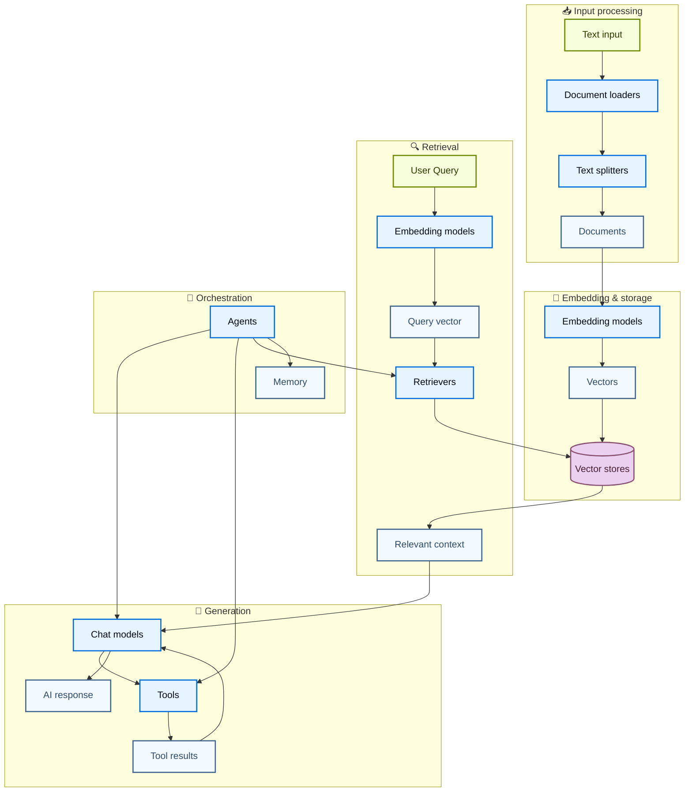
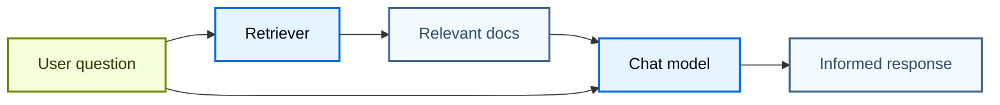
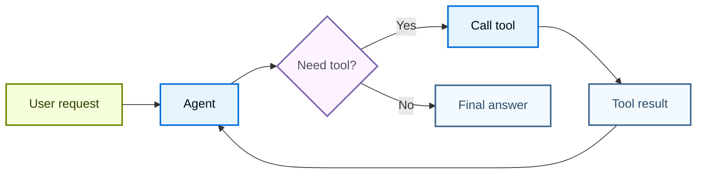
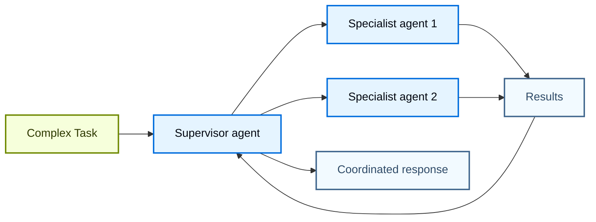

# Kiến trúc component

Sức mạnh của LangChain đến từ cách các component của nó phối hợp với nhau để tạo ra các ứng dụng AI phức tạp. Trang này cung cấp các sơ đồ minh hoạ mối quan hệ giữa các component khác nhau.

## Hệ sinh thái component cốt lõi

Sơ đồ dưới đây cho thấy các component chính của LangChain kết nối với nhau như thế nào để tạo thành các ứng dụng AI hoàn chỉnh:

### Các component kết nối với nhau như thế nào

Mỗi lớp component xây dựng dựa trên các lớp trước đó:

1. **Input processing (xử lý input)** – Chuyển đổi dữ liệu thô thành document có cấu trúc
2. **Embedding & storage (embedding và lưu trữ)** – Chuyển văn bản thành các biểu diễn vector có thể tìm kiếm
3. **Retrieval (truy xuất)** – Tìm thông tin liên quan dựa trên truy vấn của người dùng
4. **Generation (sinh nội dung)** – Dùng AI model để tạo ra phản hồi, có thể kèm tool
5. **Orchestration (điều phối)** – Điều phối toàn bộ thông qua agent và hệ thống memory

## Các nhóm component

LangChain tổ chức các component thành những nhóm chính sau:

| Nhóm                                                                 | Mục đích                    | Component chính                     | Trường hợp sử dụng                                 |
| --------------------------------------------------------------------- | --------------------------- | ------------------------------------ | ---------------------------------------------------- |
| **[Models](https://docs.langchain.com/oss/python/langchain/models)** | Suy luận và sinh nội dung AI | Chat models, LLM, Embedding models  | Sinh văn bản, suy luận, hiểu ngữ nghĩa               |
| **[Tools](https://docs.langchain.com/oss/python/langchain/tools)**   | Khả năng bên ngoài          | API, database, v.v.                 | Tìm kiếm web, truy cập dữ liệu, tính toán            |
| **[Agents](agents.md)**                                               | Điều phối và suy luận       | ReAct agent, tool calling agent     | Workflow phi xác định (nondeterministic), ra quyết định |
| **[Memory](short-term-memory.md)**                                    | Duy trì ngữ cảnh            | Lịch sử message, state tuỳ chỉnh    | Hội thoại, tương tác có trạng thái                   |
| **[Retrievers](https://docs.langchain.com/oss/python/integrations/retrievers)** | Truy cập thông tin | Vector retriever, web retriever     | RAG, tìm kiếm knowledge base                         |
| **[Xử lý document](https://docs.langchain.com/oss/python/integrations/document_loaders)** | Nạp dữ liệu       | Loader, splitter, transformer       | Xử lý PDF, thu thập dữ liệu web (web scraping)       |
| **[Vector Stores](https://docs.langchain.com/oss/python/integrations/vectorstores)** | Tìm kiếm ngữ nghĩa | Chroma, Pinecone, FAISS             | Tìm kiếm tương đồng, lưu trữ embedding               |

## Các pattern phổ biến

### RAG (Retrieval-Augmented Generation)

### Agent kèm tool

### Hệ thống multi-agent

## Tìm hiểu thêm

* [Tạo agent](agents.md)
* [Làm việc với tools](https://docs.langchain.com/oss/python/langchain/tools)
* [Khám phá các integration](https://docs.langchain.com/oss/python/integrations/providers/overview)
