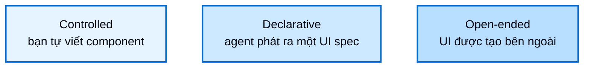

# Tổng quan Generative UI

> Hiểu về phổ generative UI, từ controlled đến declarative đến open-ended

Generative UI là bất kỳ pattern nào mà output của agent trình bày một giao diện người dùng vượt ra ngoài text. Thay vì stream một đoạn văn vào một bong bóng chat, agent điều khiển form, card, dashboard, và các control tương tác. Điều này cho phép UI của bạn truyền tải kết quả theo cách một ứng dụng thật sẽ làm, trong khi agent quyết định hiển thị gì và khi nào.

Generative UI không phải một kỹ thuật đơn lẻ. Nó trải dài trên một phổ (spectrum) được định nghĩa bởi một câu hỏi duy nhất: **ai là tác giả của giao diện?** Ở một đầu, bạn viết mọi component và agent chỉ chọn trong số đó. Ở đầu kia, giao diện được tạo ra hoàn toàn bên ngoài ứng dụng của bạn. Càng đi dọc theo phổ này, bạn càng đánh đổi độ dự đoán được để lấy phạm vi biểu đạt (expressive range) rộng hơn.

## Phổ Generative UI

Phổ này chạy từ kiểm soát hoàn toàn từng pixel cho tới quyền tự chủ hoàn toàn của agent, dùng ba cách tiếp cận chính:

*(Trục: bên trái "Kiểm soát nhiều hơn", bên phải "Tự chủ nhiều hơn")*

Đi từ trái sang phải, độ dự đoán được và chi phí kỹ thuật cho mỗi khả năng đều giảm dần, trong khi phạm vi biểu đạt của agent tăng lên. Accessibility và tính nhất quán về hình ảnh dễ đảm bảo nhất ở bên trái và khó đảm bảo nhất ở bên phải.

### Controlled

Bạn tự viết component, còn agent chọn component nào để render và truyền dữ liệu gì. Cách này cho độ dự đoán được cao nhất và kiểm soát chặt chẽ nhất với branding và accessibility, đổi lại là phải viết một component cho mỗi khả năng bạn muốn expose. Đây là "con ngựa kéo xe" (workhorse) của generative UI, phù hợp cho các bề mặt traffic cao, quan trọng với thương hiệu, nơi layout phải chính xác tuyệt đối, ví dụ như vé máy bay và xác nhận đặt chỗ. Thư viện component của bạn chính là ranh giới: agent chỉ có thể render những gì bạn đã cung cấp. Controlled generative UI bao gồm: component như tool, render tool-call, render state, và reasoning.

Xem chi tiết tại [Controlled generative UI](controlled-generative-ui.md).

### Declarative

Agent phát ra một đặc tả có cấu trúc (structured specification), và frontend soạn (compose) giao diện từ một danh mục (catalog) component bạn đăng ký sẵn từ trước. Danh mục này đóng vai trò như một rào chắn (guardrail) và ranh giới: agent có thể tự do sắp xếp và kết hợp component của bạn, nhưng không thể vượt ra ngoài tập bạn đã duyệt. Đây là nơi phần đuôi dài (long tail) tồn tại. Nó đánh đổi độ hoàn hảo từng pixel để lấy độ rộng bao phủ, phù hợp cho các tương tác phụ, công cụ nội bộ, và dashboard, nơi việc hiển thị được thứ gì đó hữu ích quan trọng hơn việc kiểm soát chính xác tuyệt đối. [Declarative generative UI](declarative-generative-ui.md) bao phủ chủ đề này bằng [json-render](https://json-render.dev); A2UI của Google, được tích hợp qua CopilotKit, cung cấp hình thái tương tự với các biến thể schema động và cố định.

### Open-ended

Agent làm chủ toàn bộ canvas. Giao diện được tạo ra bên ngoài ứng dụng của bạn, ví dụ bởi một MCP server, và được render trong một sandbox. Cách này cho phạm vi biểu đạt rộng nhất và có thể thêm khả năng giao diện mới mà không cần viết code frontend phía bạn, phù hợp cho các trực quan hoá (visualization) đơn lẻ và các câu trả lời đặc thù, nơi một kết quả bất ngờ nhưng đủ tốt còn giá trị hơn một kết quả dự đoán được. Đây cũng là cách tiếp cận thử nghiệm nhất: ít xác định (deterministic) nhất, và khó đảm bảo accessibility, tính nhất quán, và an toàn nhất, vì vậy UI phải được cách ly (isolated). Sandbox và prompt của bạn chính là ranh giới.

Xem chi tiết tại [Open-ended generative UI](open-ended-generative-ui.md).

## Chọn cách tiếp cận

Bắt đầu từ việc bạn cần ràng buộc giao diện đến mức nào:

| Nếu bạn cần...                                                              | Hãy chọn                                                      |
| ---------------------------------------------------------------------------- | -------------------------------------------------------------- |
| Đảm bảo branding, layout, và accessibility cho một tập kết quả đầu ra đã biết | [Controlled](controlled-generative-ui.md)                      |
| Cho phép agent tự soạn layout mới chỉ bằng các component đã được duyệt       | [Declarative](declarative-generative-ui.md)                    |
| Hiển thị các giao diện do bên thứ ba tạo ra mà không cần tự xây dựng chúng    | [Open-ended](open-ended-generative-ui.md)                      |

Sai lầm phổ biến nhất là chọn một cách tiếp cận duy nhất cho toàn bộ sản phẩm. Các ứng dụng thực tế thường kết hợp nhiều cách tiếp cận và ứng với mỗi bề mặt một mục đích riêng: component controlled cho phần lõi traffic cao, quan trọng với thương hiệu; soạn thảo declarative cho phần đuôi dài của các tương tác phụ; và nhúng open-ended cho các khả năng của bên thứ ba. Một phiên làm việc (session) đơn lẻ có thể di chuyển qua cả ba cách tiếp cận này.

Phổ này cũng áp dụng ngoài phạm vi chat. Cùng ba cách tiếp cận đó cũng mô tả giao diện generative trên mobile và trên các bề mặt như Slack hay email, không chỉ trong transcript của chat.

## Khám phá phổ này

**[Controlled](controlled-generative-ui.md)**
Tự viết component; agent chọn component nào để render và dữ liệu nào để truyền vào.

**[Declarative](declarative-generative-ui.md)**
Agent phát ra một spec; frontend soạn giao diện từ một danh mục đã đăng ký.

**[Open-ended](open-ended-generative-ui.md)**
Render UI được tạo ở nơi khác, ví dụ như MCP Apps chạy trong sandbox.
