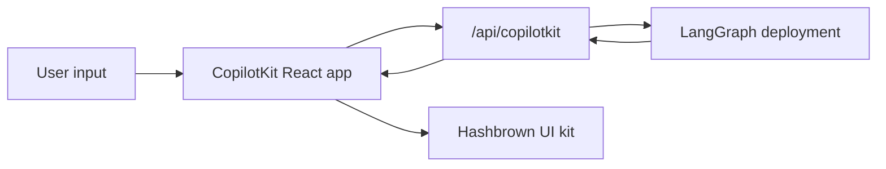

# CopilotKit

> Dùng CopilotKit với LangGraph, Deep Agents, và React, kèm custom endpoint, cầu nối AG-UI cho Python, và generative UI có cấu trúc

[CopilotKit](https://www.copilotkit.ai/) cung cấp một runtime chat React đầy đủ và kết hợp đặc biệt tốt với LangGraph khi bạn muốn agent trả về **payload UI có cấu trúc (structured UI payload)** thay vì chỉ text thuần. Trong pattern này, deployment LangGraph của bạn phục vụ cả graph API lẫn một endpoint CopilotKit tuỳ chỉnh, trong khi frontend parse các assistant message thành component React động.

Ở phía server, package [copilotkit](https://pypi.org/project/copilotkit/) cung cấp [`CopilotKitMiddleware`](https://docs.copilotkit.ai) để một graph LangGraph, một agent LangChain, hoặc một [Deep Agent](https://docs.langchain.com/oss/python/deepagents/overview) có thể nói giao thức truyền tải (wire protocol) [Agent UI (AG-UI)](https://docs.ag-ui.com/), stream tool và message event tới một chat UI, và đọc/ghi phần state dùng chung **CopilotKit**, kèm theo các helper để mount một endpoint HTTP tương thích CopilotKit trước graph của bạn.

Cách tiếp cận này hữu ích khi bạn muốn:

* một runtime chat dựng sẵn thay vì tự nối `stream.messages`
* một endpoint server tuỳ chỉnh có thể thêm hành vi đặc thù theo provider bên cạnh graph đã deploy
* generative UI có cấu trúc, render từ một registry component bị ràng buộc

[CopilotKit for LangGraph](https://docs.copilotkit.ai/langgraph) cũng trình bày [generative UI](https://docs.copilotkit.ai/langgraph/generative-ui), [human in the loop](https://docs.copilotkit.ai/langgraph/human-in-the-loop) (HITL), và [shared state](https://docs.copilotkit.ai/langgraph/shared-state) trên cùng nền middleware và client này.

!!! info "Thông tin"
    Với các API, UI pattern, và cấu hình runtime đặc thù của CopilotKit, xem [tài liệu CopilotKit](https://docs.copilotkit.ai/langgraph). Với hướng dẫn Deep Agent, xem [Deep Agents and CopilotKit](https://docs.copilotkit.ai/langgraph/deep-agents) trong tài liệu CopilotKit.

!!! tip "Xem demo"
    Trang gốc có một demo tương tác trực tiếp cho pattern này. Xem tại: [https://docs.langchain.com/oss/python/langchain/frontend/integrations/copilotkit](https://docs.langchain.com/oss/python/langchain/frontend/integrations/copilotkit)

## Cách hoạt động

Ở mức tổng quan, CopilotKit nằm giữa app React của bạn và deployment LangGraph. Frontend gửi conversation state tới một route tuỳ chỉnh `/api/copilotkit` được mount cạnh graph API, route đó chuyển tiếp request tới LangGraph, và response trả về gồm cả assistant message lẫn bất kỳ payload UI có cấu trúc nào mà component registry của bạn có thể render.

1. **Deploy graph như bình thường** dùng LangSmith hoặc một LangGraph development server.
2. **Mở rộng deployment bằng một HTTP app**, mount một route CopilotKit bên cạnh graph API.
3. **Bọc frontend trong `CopilotKit`** và trỏ nó tới URL runtime tuỳ chỉnh đó.
4. **Đăng ký các component UI động** và parse response của assistant thành các component đó tại thời điểm render.



## Những gì bạn có ở phía server Python

Package [copilotkit](https://pypi.org/project/copilotkit/) và các package liên quan bắc cầu giữa một deployment LangGraph và các client CopilotKit.

| Thành phần                                                                                            | Vai trò                                                                                                                                                                                                                                                                                                                                                                                    |
| ------------------------------------------------------------------------------------------------------ | ------------------------------------------------------------------------------------------------------------------------------------------------------------------------------------------------------------------------------------------------------------------------------------------------------------------------------------------------------------------------------------------- |
| `CopilotKitMiddleware`                                                                                 | Gộp state và request của CopilotKit và AG-UI vào agent của bạn, bao gồm cả [tool call](../overview.md) từ frontend và context. Thêm nó vào danh sách `middleware` cho [create_agent](https://reference.langchain.com/python/langchain/agents/factory/create_agent) hoặc [create_deep_agent](https://reference.langchain.com/python/deepagents/graph/create_deep_agent).                  |
| `CopilotKitState` (subclass)                                                                            | [Custom state](../../short-term-memory.md): kế thừa `CopilotKitState` để key CopilotKit trở thành một phần của graph state.                                                                                                                                                                                                                                                              |
| `LangGraphAGUIAgent`                                                                                    | Đóng gói một graph đã compile cùng tên và mô tả cho runtime.                                                                                                                                                                                                                                                                                                                              |
| `add_langgraph_fastapi_endpoint` (từ [ag-ui-langgraph](https://pypi.org/project/ag-ui-langgraph/))      | Nối một app **FastAPI** để CopilotKit có thể chạy graph của bạn trên cùng tiến trình [LangGraph](https://docs.langchain.com/oss/python/langgraph/overview). Dùng khi bạn thêm một [http app tuỳ chỉnh trong `langgraph.json`](#mo-rong-deployment-langgraph-bang-mot-endpoint-tuy-chinh) thay vì một HTTP server riêng.                                                                  |

`CopilotKitMiddleware` là cùng một middleware dùng cho [create_deep_agent](https://reference.langchain.com/python/deepagents/graph/create_deep_agent) và cho một graph từ [create_agent](https://reference.langchain.com/python/langchain/agents/factory/create_agent) khi bạn thêm nó vào danh sách `middleware`. Với một graph `create_agent` có `CopilotKitState` và cầu nối FastAPI, làm theo [ví dụ `main.py` bằng Python](#mo-rong-deployment-langgraph-bang-mot-endpoint-tuy-chinh) bên dưới. Generative UI có cấu trúc (ví dụ `useAgentContext` và một `output_schema` từ client) cần thêm middleware để ánh xạ Copilot state sang một chiến lược [structured output](../../overview.md#structured-output), như trong ví dụ `src/middleware.py` (có thể mở rộng) ở cùng mục.

Việc mount `app` vào key `http` trong `langgraph.json` tuân theo quy trình [deploy LangGraph hoặc LangSmith](https://docs.langchain.com/oss/python/langgraph/deploy) thông thường, để một tiến trình phục vụ cả graph lẫn cùng app FastAPI đó cho client CopilotKit.

## Cài đặt

Cho endpoint backend:

```bash
uv add copilotkit ag-ui-langgraph fastapi uvicorn
```

Package middleware nằm cạnh stack Deep Agents. Cài nó cùng package [chat model](https://docs.langchain.com/oss/python/integrations/chat) của bạn (ví dụ này dùng OpenAI):

=== "pip"
    ```python
    pip install -U deepagents copilotkit langchain-openai
    ```

=== "uv"
    ```python
    uv add deepagents copilotkit langchain-openai
    ```

Cho app frontend:

```bash
bun add @copilotkit/react-core @copilotkit/react-ui @hashbrownai/core @hashbrownai/react
```

## Dùng CopilotKit với một Deep Agent

Thêm `CopilotKitMiddleware` vào danh sách `middleware` bạn truyền cho [create_deep_agent](https://reference.langchain.com/python/deepagents/graph/create_deep_agent). Middleware này cho phép CopilotKit định tuyến tool call từ frontend và đồng bộ chat state với graph của bạn. Giữ nguyên các [middleware khác bạn đã cấu hình](https://docs.langchain.com/oss/python/deepagents/customization#middleware) trong cùng danh sách đó.

Graph đã compile khi đó đã sẵn sàng để cắm vào một tiến trình nhận biết CopilotKit hoặc AG-UI (ví dụ, [pattern FastAPI bên dưới](#mo-rong-deployment-langgraph-bang-mot-endpoint-tuy-chinh)) hoặc theo một hướng dẫn như [Deep Agents and CopilotKit](https://docs.copilotkit.ai/langgraph/deep-agents) trong tài liệu CopilotKit.

```python
from deepagents import create_deep_agent
from copilotkit import CopilotKitMiddleware
from langgraph.checkpoint.memory import MemorySaver


def get_weather(location: str) -> str:
    """Return a simple weather string for a location."""
    return f"The weather in {location} is sunny."


agent = create_deep_agent(
    model="openai:gpt-5.5",
    tools=[get_weather],
    middleware=[CopilotKitMiddleware()],  # AG-UI, tool ở frontend, và context
    system_prompt="You are a helpful research assistant.",
    checkpointer=MemorySaver(),
)
```

## Mở rộng deployment LangGraph bằng một endpoint tuỳ chỉnh

Ý tưởng cốt lõi là deployment LangGraph không chỉ phục vụ graph. Nó còn có thể load một HTTP app, cho phép bạn mount thêm route bên cạnh chính deployment đó.

Trong `langgraph.json`, trỏ `http.app` tới entrypoint app tuỳ chỉnh của bạn:

```json
{
  "dependencies": ["."],
  "graphs": {
    "copilotkit_shadify": "./main.py:agent"
  },
  "http": {
    "app": "./main.py:app"
  }
}
```

Trong Python, tạo một app `FastAPI` và expose agent LangGraph qua cầu nối AG-UI của CopilotKit:

```python main.py
from typing import Any, TypedDict

from ag_ui_langgraph import add_langgraph_fastapi_endpoint
from copilotkit import CopilotKitMiddleware, CopilotKitState, LangGraphAGUIAgent
from fastapi import FastAPI
from langchain.agents import create_agent

from src.middleware import apply_structured_output_schema, normalize_context


class AgentState(CopilotKitState):
    pass


class AgentContext(TypedDict, total=False):
    output_schema: dict[str, Any]


agent = create_agent(
    model="openai:gpt-5.5",
    middleware=[
        normalize_context,
        CopilotKitMiddleware(),
        apply_structured_output_schema,
    ],
    context_schema=AgentContext,
    state_schema=AgentState,
    system_prompt=(
        "You are a helpful UI assistant. Build visual responses using the "
        "available components."
    ),
)

app = FastAPI()

add_langgraph_fastapi_endpoint(
    app=app,
    agent=LangGraphAGUIAgent(
        name="copilotkit_shadify",
        description="A UI assistant that returns structured component payloads.",
        graph=agent,
    ),
    path="/",
)
```

App tuỳ chỉnh này chính là điểm mở rộng quan trọng: nó mount một runtime nhận biết CopilotKit mà không thay thế deployment LangGraph gốc bên dưới.

Trong Python, phần việc tương ứng diễn ra ở middleware: chuẩn hoá context của CopilotKit và chuyển tiếp `output_schema` từ `useAgentContext(...)` vào cấu hình structured output của model.

```python src/middleware.py
import json
from collections.abc import Mapping

from langchain.agents.middleware import before_agent, wrap_model_call
from langchain.agents.structured_output import ProviderStrategy


@wrap_model_call
async def apply_structured_output_schema(request, handler):
    schema = None
    runtime = getattr(request, "runtime", None)
    runtime_context = getattr(runtime, "context", None)

    if isinstance(runtime_context, Mapping):
        schema = runtime_context.get("output_schema")

    if schema is None and isinstance(getattr(request, "state", None), dict):
        copilot_context = request.state.get("copilotkit", {}).get("context")
        if isinstance(copilot_context, list):
            for item in copilot_context:
                if isinstance(item, dict) and item.get("description") == "output_schema":
                    schema = item.get("value")
                    break

    if isinstance(schema, str):
        try:
            schema = json.loads(schema)
        except json.JSONDecodeError:
            schema = None

    if isinstance(schema, dict):
        request = request.override(
            response_format=ProviderStrategy(schema=schema, strict=True),
        )

    return await handler(request)


@before_agent
def normalize_context(state, runtime):
    copilotkit_state = state.get("copilotkit", {})
    context = copilotkit_state.get("context")

    if isinstance(context, list):
        normalized = [
            item.model_dump() if hasattr(item, "model_dump") else item
            for item in context
        ]
        return {"copilotkit": {**copilotkit_state, "context": normalized}}

    return None
```

Kết quả là một sự phân tách trách nhiệm rõ ràng:

* LangGraph vẫn sở hữu việc thực thi graph và tính bền vững (persistence)
* CopilotKit sở hữu hợp đồng runtime hướng tới chat
* endpoint tuỳ chỉnh của bạn kết dính (glue) cả hai lại trong một deployment duy nhất

Trỏ `runtimeUrl` của CopilotKit vào route mà app FastAPI (hoặc app khác) của bạn expose, chứ không chỉ vào bề mặt REST thô của graph, khi bạn dùng adapter runtime [CopilotKit](https://docs.copilotkit.ai).

Theo tài liệu CopilotKit về [LangGraphHttpAgent](https://docs.copilotkit.ai/langgraph) hoặc `LangGraphAgent` trong **CopilotRuntime** của Node; graph và middleware **Python** vẫn định nghĩa hành vi tool và logic agent.

## Cấu trúc app frontend

Ở frontend, bọc app của bạn trong `CopilotKit` và trỏ nó tới URL runtime tuỳ chỉnh:

```tsx
import { CopilotKit } from "@copilotkit/react-core";
import { CopilotChat, useAgentContext } from "@copilotkit/react-core/v2";
import { s } from "@hashbrownai/core";

import { useChatKit } from "@/components/chat/chat-kit";
import { chatTheme } from "@/lib/chat-theme";

export function App() {
  return (
    <CopilotKit runtimeUrl={import.meta.env.VITE_RUNTIME_URL ?? "/api/copilotkit"}>
      <Page />
    </CopilotKit>
  );
}

function Page() {
  const chatKit = useChatKit();

  useAgentContext({
    description: "output_schema",
    value: s.toJsonSchema(chatKit.schema),
  });

  return <CopilotChat {...chatTheme} />;
}
```

Có hai phần quan trọng ở đây:

* `runtimeUrl="/api/copilotkit"` gửi chat tới route backend tuỳ chỉnh của bạn, thay vì trực tiếp tới LangGraph API thô
* `useAgentContext(...)` gửi UI schema cho agent để model biết nó nên tạo ra định dạng structured output nào

## Đăng ký các component động

Component registry nằm trong `useChatKit()`. Đây là nơi bạn định nghĩa tập component mà agent được phép phát ra, ví dụ card, row, column, chart, code block, và button.

```tsx
import { s } from "@hashbrownai/core";
import { exposeComponent, exposeMarkdown, useUiKit } from "@hashbrownai/react";

import { Button } from "@/components/ui/button";
import { Card } from "@/components/ui/card";
import { CodeBlock } from "@/components/ui/code-block";
import { Row, Column } from "@/components/ui/layout";
import { SimpleChart } from "@/components/ui/simple-chart";

export function useChatKit() {
  return useUiKit({
    components: [
      exposeMarkdown(),
      exposeComponent(Card, {
        name: "card",
        description: "Card to wrap generative UI content.",
        children: "any",
      }),
      exposeComponent(Row, {
        name: "row",
        props: {
          gap: s.string("Tailwind gap size") as never,
        },
        children: "any",
      }),
      exposeComponent(Column, {
        name: "column",
        children: "any",
      }),
      exposeComponent(SimpleChart, {
        name: "chart",
        props: {
          labels: s.array("Category labels", s.string("A label")),
          values: s.array("Numeric values", s.number("A value")),
        },
        children: false,
      }),
      exposeComponent(CodeBlock, {
        name: "code_block",
        props: {
          code: s.streaming.string("The code to display"),
          language: s.string("Programming language") as never,
        },
        children: false,
      }),
      exposeComponent(Button, {
        name: "button",
        children: "text",
      }),
    ],
  });
}
```

Registry này trở thành hợp đồng giữa agent và UI. Model không tự sinh ra JSX tuỳ ý. Nó sinh ra dữ liệu có cấu trúc, dữ liệu này phải validate khớp với các component và props bạn đã expose.

## Render assistant message thành UI động

Khi response của assistant tới, custom message renderer sẽ quyết định cách hiển thị nó. Trong ví dụ này:

* assistant message được parse thành JSON có cấu trúc, đối chiếu với schema của UI kit
* structured output hợp lệ được render thành các component React thật
* user message được render dưới dạng bong bóng chat thông thường

```tsx
import type { AssistantMessage } from "@ag-ui/core";
import type { RenderMessageProps } from "@copilotkit/react-ui";
import { useJsonParser } from "@hashbrownai/react";
import { memo } from "react";

import { useChatKit } from "@/components/chat/chat-kit";
import { Squircle } from "@/components/squircle";

const AssistantMessageRenderer = memo(function AssistantMessageRenderer({
  message,
}: {
  message: AssistantMessage;
}) {
  const kit = useChatKit();
  const { value } = useJsonParser(message.content ?? "", kit.schema);

  if (!value) return null;

  return (
    <div className="group/msg mt-2 flex w-full justify-start">
      <div className="magic-text-output w-full px-1 py-1">{kit.render(value)}</div>
    </div>
  );
});

export function CustomMessageRenderer({ message }: RenderMessageProps) {
  if (message.role === "assistant") {
    return <AssistantMessageRenderer message={message} />;
  }

  return (
    <div className="flex w-full justify-end">
      <Squircle className="w-full max-w-[64ch] px-4 py-3">
        <pre>{typeof message.content === "string" ? message.content : JSON.stringify(message.content, null, 2)}</pre>
      </Squircle>
    </div>
  );
}
```

Pattern renderer này chính là điều làm cho tích hợp cảm giác "tự nhiên":

* CopilotKit xử lý chat state và transport
* custom renderer quyết định cách payload của assistant trở thành UI
* [Hashbrown](https://hashbrown.dev/) biến dữ liệu có cấu trúc đã validate thành các element React cụ thể

## Tài nguyên

* [Deep Agents and CopilotKit](https://docs.copilotkit.ai/langgraph/deep-agents) trong tài liệu CopilotKit, đường dẫn end-to-end với Next.js, dev server, và **Deep Agent**
* [CopilotKit: LangGraph features](https://docs.copilotkit.ai/langgraph), generative UI, HITL, shared state
* [Deploy LangGraph](https://docs.langchain.com/oss/python/langgraph/deploy), production và dev server

## Thực hành tốt nhất

* **Giữ endpoint tuỳ chỉnh gọn nhẹ:** dùng nó để adapt CopilotKit vào deployment graph của bạn, không nhân đôi business logic đã có sẵn trong graph.
* **Gửi schema một cách rõ ràng:** `useAgentContext` nên mô tả hợp đồng UI mỗi khi trang được mount.
* **Đăng ký một tập component bị ràng buộc:** chỉ expose những component và props bạn thực sự muốn model dùng.
* **Coi việc render như một bước parse:** parse nội dung assistant đối chiếu với schema của bạn trước khi render nó.
* **Giữ user message đơn giản:** chỉ assistant message mới cần renderer có cấu trúc; user message có thể giữ nguyên dạng bong bóng chat thông thường.
