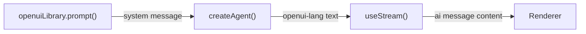
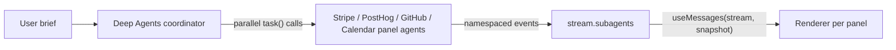

# OpenUI

> Tạo ra các dashboard và báo cáo hoàn chỉnh, có tính tương tác bằng thư viện component OpenUI và openui-lang

[OpenUI](https://github.com/thesysdev/openui) là một thư viện generative UI cho phép một language model tạo ra các UI hoàn chỉnh, có tính tương tác theo một định dạng khai báo (declarative) gọi là **openui-lang**. Thay vì trả về một tin nhắn chat, agent trả về một cây component (component tree) gồm card, biểu đồ, bảng, tab, và form mà `Renderer` sẽ biến thành một UI React thật sự.

Kiểu tích hợp này rất phù hợp với các output giàu dữ liệu như báo cáo, dashboard, và công cụ khám phá dữ liệu, nơi model vừa đóng vai trò nhà phân tích dữ liệu vừa là người thiết kế UI.

## Cách hoạt động

1. **Tạo system prompt:** gọi `openuiLibrary.prompt()` một lần khi khởi động; nó tạo ra một tài liệu tham chiếu openui-lang hoàn chỉnh mà model dùng để viết ra các cây component hợp lệ
2. **Chèn vào tin nhắn đầu tiên:** gửi system prompt như tin nhắn hệ thống mở đầu khi một hội thoại mới bắt đầu
3. **Model viết openui-lang:** model phản hồi bằng một chương trình như `root = Stack([header, kpis, chart])` thay vì văn xuôi
4. **Render bằng `Renderer`:** truyền văn bản đó vào `Renderer` của OpenUI cùng với thư viện component; nó sẽ phân tích (parse) và render cây đó



## Cài đặt

```bash
npm install @langchain/react @openuidev/react-ui @openuidev/react-headless @openuidev/react-lang
```

!!! tip "Mẹo"
    OpenUI yêu cầu React 19+ và [`zustand`](https://www.npmjs.com/package/zustand). Code frontend chỉ dành cho React; backend agent LangGraph có thể viết bằng TypeScript hoặc Python.

## Import style của component

Import các style đóng gói sẵn của OpenUI trong entry point CSS của bạn hoặc trực tiếp trong component gốc:

```css
@import "@openuidev/react-ui/components.css";
@import "@openuidev/react-ui/styles/index.css";
```

## Tạo system prompt

OpenUI cung cấp một hàm `openuiLibrary.prompt()` tạo ra tài liệu tham chiếu openui-lang hoàn chỉnh, bao gồm mọi chữ ký component, quy tắc cú pháp, mẹo streaming, và ví dụ. Gọi nó một lần tại thời điểm module được nạp:

```ts
import { openuiLibrary, openuiPromptOptions } from "@openuidev/react-ui/genui-lib";

// Tạo toàn bộ system prompt openui-lang. Gọi hàm này một lần khi khởi động,
// không phải bên trong một component, để tránh tính toán lại ở mỗi lần render.
const SYSTEM_PROMPT = openuiLibrary.prompt({
  ...openuiPromptOptions,
  preamble:
    "You are a report generator. When asked for a report, produce a detailed, " +
    "data-rich report using openui-lang: executive summary, KPI cards, charts, " +
    "tables, and multiple sections. Your ENTIRE response must be raw openui-lang " +
    "— no code fences, no markdown, no prose.",
});
```

`preamble` ghi đè nhân vật (persona) mặc định. Thêm `additionalRules` để chèn các ràng buộc riêng cho tác vụ:

```ts
const SYSTEM_PROMPT = openuiLibrary.prompt({
  ...openuiPromptOptions,
  preamble: "You are a report generator...",
  additionalRules: [
    ...(openuiPromptOptions.additionalRules ?? []),
    "Always end the report with 3–4 follow-up query buttons using " +
    "Button({ type: 'continue_conversation' }, 'secondary') inside a " +
    "Card([CardHeader('Explore Further'), Buttons([...])], 'sunk').",
  ],
});
```

## Chèn system prompt qua useStream

Gửi system prompt như tin nhắn đầu tiên của mỗi thread mới. Kiểm tra `stream.messages.length === 0` để phát hiện một thread mới và thêm một tin nhắn `system` vào đầu:

```tsx
import { useCallback } from "react";
import { useStream } from "@langchain/react";

const SYSTEM_PROMPT = openuiLibrary.prompt({ ... });

export function App() {
  const stream = useStream({
    apiUrl: import.meta.env.VITE_LANGGRAPH_API_URL ?? "http://localhost:2024",
    assistantId: "openui",
  });

  const handleSubmit = useCallback(
    (text: string) => {
      // Chỉ chèn system prompt vào tin nhắn đầu tiên của một thread mới.
      // Các tin nhắn sau đã có nó trong lịch sử được lưu trữ.
      const isNewThread = stream.messages.length === 0;
      stream.submit({
        messages: [
          ...(isNewThread
            ? [{ type: "system", content: SYSTEM_PROMPT }]
            : []),
          { type: "human", content: text },
        ],
      });
    },
    [stream],
  );

  // ...
}
```

## Render bằng Renderer

Truyền trực tiếp nội dung văn bản của tin nhắn AI vào `Renderer` cùng với `openuiLibrary`:

```tsx
import { Renderer } from "@openuidev/react-lang";
import { openuiLibrary } from "@openuidev/react-ui/genui-lib";
import { AIMessage } from "langchain";

function MessageList({ messages, isLoading }) {
  const lastAiIdx = messages.reduce(
    (acc, msg, i) => (AIMessage.isInstance(msg) ? i : acc),
    -1,
  );

  return messages.map((msg, i) => {
    if (AIMessage.isInstance(msg)) {
      const text = msg.text;
      return (
        <Renderer
          key={msg.id ?? i}
          response={text}
          library={openuiLibrary}
          isStreaming={isLoading && i === lastAiIdx}
        />
      );
    }
    // ... bong bóng tin nhắn của người dùng
  });
}
```

Truyền `isStreaming={true}` trong lúc stream đang diễn ra để Renderer xử lý các tham chiếu chưa được giải quyết (unresolved references) một cách hợp lý khi các định nghĩa lần lượt tới.

## Định dạng openui-lang

Model viết ra một chương trình chứ không phải một đặc tả JSON. Mỗi statement là một phép gán; `root` là điểm vào (entry point). Prompt chính thức dạy model định dạng này, bao gồm cả kỹ thuật hoisting, viết `root` trước tiên để phần khung UI xuất hiện ngay lập tức:

```
root = Stack([header, execSummary, kpis, marketSection])

header    = CardHeader("State of AI in 2025", "Comprehensive Analysis")
execSummary = MarkDownRenderer("## Executive Summary\n\nThe AI market reached...")

kpi1 = Card([CardHeader("$826B", "Global Market"), TextContent("42% YoY", "small")], "sunk")
kpi2 = Card([CardHeader("78%",   "Adoption"),       TextContent("Fortune 500",  "small")], "sunk")
kpis = Stack([kpi1, kpi2], "row", "m", "stretch", "start", true)

col1 = Col("Segment", "string")
col2 = Col("Revenue ($B)", "number")
tbl  = Table([col1, col2], [["Generative AI", 286], ["ML Infra", 198]])
s1   = Series("Revenue", [286, 198, 147])
ch1  = BarChart(["Gen AI", "ML Infra", "Vision"], [s1])
marketSection = Card([CardHeader("Market Breakdown"), tbl, ch1])
```

Khi bật hoisting (được khuyến nghị), dòng `root` được viết trước tiên để cấu trúc trang xuất hiện ngay lập tức và từng phần được lấp đầy dần khi model định nghĩa nó.

## Các tiện ích render tăng dần (progressive rendering)

Kết nối [`useStream`](https://reference.langchain.com/javascript/langchain-react/index/useStream) trực tiếp với `Renderer` khiến kết quả bị render lại ở mỗi token streaming và tạo ra hàng trăm lượt phân tích lại (re-parse) vô ích cho mỗi phản hồi. Điều này khiến các component biểu đồ bị crash khi dữ liệu của chúng chưa tới. Các tiện ích dưới đây giải quyết những vấn đề này:

| Vấn đề                              | Giải pháp                                                                                                             |
| ------------------------------------ | ---------------------------------------------------------------------------------------------------------------------- |
| **Chuỗi ký tự (string) chưa hoàn chỉnh**  | `truncateAtOpenString` / `closeOrTruncateOpenString`: loại bỏ hoặc đóng các chuỗi chưa hoàn chỉnh trước khi phân tích               |
| **Nhiễu loạn giữa các token (mid-token churn)**          | `useStableText`: chỉ cho phép Renderer cập nhật tại các ranh giới statement hoàn chỉnh (`name = Expr(…)`) thay vì ở mỗi token  |
| **Biểu đồ crash do dữ liệu null**  | `chartDataRefsResolved`: xác minh mảng `Series` và nhãn của một biểu đồ đã được định nghĩa trước khi đưa nó vào snapshot |
| **Chưa có `root` / dự phòng** | `buildProgressiveRoot`: tổng hợp một `root = Stack([…])` từ các biến ở cấp cao nhất khi model chưa viết ra một root |
| **Định danh (identifier) dạng snake_case**  | `sanitizeIdentifiers`: parser chỉ chấp nhận camelCase; chuyển đổi mọi tên `snake_case` mà model phát ra            |

Sao chép toàn bộ khối này vào dự án của bạn và truyền `stable` vào `<Renderer>`:

````tsx expandable
import {
  useCallback,
  useEffect,
  useMemo,
  useRef,
  useState,
} from "react";
import {
  type ActionEvent,
  BuiltinActionType,
  Renderer,
} from "@openuidev/react-lang";
import { openuiLibrary } from "@openuidev/react-ui/genui-lib";

/** Loại bỏ mọi markdown code fence mà model có thể đã phát ra. */
function stripCodeFence(text: string): string {
  return text
    .replace(/^```[a-z]*\r?\n?/i, "")
    .replace(/\n?```\s*$/i, "")
    .trim();
}

/**
 * Parser openui-lang chỉ chấp nhận identifier dạng camelCase.
 * Chuyển đổi mọi tên biến snake_case mà model phát ra; nội dung chuỗi không bị đụng tới.
 */
function sanitizeIdentifiers(text: string): string {
  const toCamel = (s: string) =>
    s.replace(/_([a-zA-Z0-9])/g, (_, c: string) => c.toUpperCase());

  const snakeVars: string[] = [];
  for (const m of text.matchAll(/^([a-zA-Z][a-zA-Z0-9]*(?:_[a-zA-Z0-9]+)+)\s*=/gm)) {
    if (!snakeVars.includes(m[1])) snakeVars.push(m[1]);
  }
  if (snakeVars.length === 0) return text;

  let result = "";
  let inStr = false;
  let i = 0;
  while (i < text.length) {
    if (text[i] === "\\" && inStr) { result += text[i] + (text[i + 1] ?? ""); i += 2; continue; }
    if (text[i] === '"') { inStr = !inStr; result += text[i++]; continue; }
    if (!inStr) {
      let replaced = false;
      for (const v of snakeVars) {
        if (text.startsWith(v, i) && !/[a-zA-Z0-9_]/.test(text[i + v.length] ?? "")) {
          result += toCamel(v); i += v.length; replaced = true; break;
        }
      }
      if (!replaced) result += text[i++];
    } else {
      result += text[i++];
    }
  }
  return result;
}

/**
 * Duyệt qua văn bản và theo dõi các chuỗi đang mở. Nếu văn bản kết thúc giữa
 * chừng một chuỗi, cắt bớt về dấu xuống dòng an toàn cuối cùng, điều này ngăn
 * một string literal chưa hoàn chỉnh chiếm mất bất kỳ dòng `root = Stack(…)`
 * nào mà ta tổng hợp sau đó.
 */
function truncateAtOpenString(text: string): string {
  let inStr = false;
  let lastSafeNewline = 0;
  for (let i = 0; i < text.length; i++) {
    const ch = text[i];
    if (ch === "\\" && inStr) { i++; continue; }
    if (ch === '"') { inStr = !inStr; continue; }
    if (ch === "\n" && !inStr) lastSafeNewline = i;
  }
  return inStr ? text.slice(0, lastSafeNewline) : text;
}

/**
 * Tương tự truncateAtOpenString, nhưng tổng hợp thêm một dấu đóng `")` khi
 * dòng chưa hoàn chỉnh là một statement TextContent. Điều này cho phép văn bản
 * render từng token một trong khi mọi dòng chuỗi chưa hoàn chỉnh khác vẫn bị cắt bớt.
 */
function closeOrTruncateOpenString(text: string): string {
  let inStr = false;
  let lastSafeNewline = 0;
  for (let i = 0; i < text.length; i++) {
    const ch = text[i];
    if (ch === "\\" && inStr) { i++; continue; }
    if (ch === '"') { inStr = !inStr; continue; }
    if (ch === "\n" && !inStr) lastSafeNewline = i;
  }
  if (!inStr) return text;

  const safeText = lastSafeNewline > 0 ? text.slice(0, lastSafeNewline) : "";
  const partialLine = text.slice(lastSafeNewline > 0 ? lastSafeNewline + 1 : 0);

  if (/^[a-zA-Z][a-zA-Z0-9]*\s*=\s*TextContent\(/.test(partialLine)) {
    return (lastSafeNewline > 0 ? safeText + "\n" : "") + partialLine + '")';
  }
  return safeText;
}

/** Đếm số dòng tạo thành một phép gán hoàn chỉnh kết thúc bằng `)` hoặc `]`. */
function countCompleteStatements(text: string): number {
  let count = 0;
  for (const line of text.split("\n")) {
    const t = line.trimEnd();
    if ((t.endsWith(")") || t.endsWith("]")) && /^[a-zA-Z]/.test(t)) count++;
  }
  return count;
}

const CHART_TYPES = new Set([
  "BarChart", "LineChart", "AreaChart", "RadarChart",
  "HorizontalBarChart", "PieChart", "RadialChart",
  "SingleStackedBarChart", "ScatterChart",
]);

const OPENUI_KEYWORDS = new Set([
  "true", "false", "null", "grouped", "stacked", "linear", "natural", "step",
  "pie", "donut", "string", "number", "action", "row", "column", "card", "sunk",
  "clear", "info", "warning", "error", "success", "neutral", "danger", "start",
  "end", "center", "between", "around", "evenly", "stretch", "baseline",
  "small", "default", "large", "none", "xs", "s", "m", "l", "xl",
  "horizontal", "vertical",
]);

/**
 * Các component biểu đồ (recharts) bị crash với lỗi `.map() on null` khi prop
 * labels hoặc series của chúng chưa được giải quyết. Trước khi chốt một
 * snapshot ổn định, xác minh rằng mọi biểu đồ trong văn bản đã có đủ các biến
 * dữ liệu được định nghĩa.
 */
function chartDataRefsResolved(text: string): boolean {
  const lines = text.split("\n");
  const complete = new Set<string>();
  for (const line of lines) {
    const t = line.trimEnd();
    const m = t.match(/^([a-zA-Z][a-zA-Z0-9]*)\s*=/);
    if (m && (t.endsWith(")") || t.endsWith("]"))) complete.add(m[1]);
  }
  for (const line of lines) {
    const t = line.trimEnd();
    const m = t.match(/^([a-zA-Z][a-zA-Z0-9]*)\s*=\s*([A-Z][a-zA-Z0-9]*)\(/);
    if (!m || !CHART_TYPES.has(m[2]) || !t.endsWith(")")) continue;
    const rhs = t.slice(t.indexOf("=") + 1).replace(/"(?:[^"\\]|\\.)*"/g, '""');
    for (const [, name] of rhs.matchAll(/\b([a-zA-Z][a-zA-Z0-9]*)\b/g)) {
      if (/^[a-z]/.test(name) && !OPENUI_KEYWORDS.has(name) && !complete.has(name))
        return false;
    }
  }
  return true;
}

/**
 * Nếu model chưa viết ra một `root = Stack(…)`, tổng hợp một root từ các biến
 * ở cấp cao nhất (những biến được định nghĩa nhưng chưa được tham chiếu bên
 * trong bất kỳ biểu thức nào khác). Điều này cho phép render tăng dần ngay cả
 * khi model viết root sau cùng.
 */
function buildProgressiveRoot(text: string): string {
  if (!text) return text;
  const safe = truncateAtOpenString(text);
  if (/^root\s*=/m.test(safe)) return safe;

  const defs: string[] = [];
  const seen = new Set<string>();
  for (const m of safe.matchAll(/^([a-zA-Z_][a-zA-Z0-9_]*)\s*=/gm)) {
    if (!seen.has(m[1])) { defs.push(m[1]); seen.add(m[1]); }
  }
  if (defs.length === 0) return safe;

  const referenced = new Set<string>();
  for (const line of safe.split("\n")) {
    const thisVar = line.match(/^([a-zA-Z_][a-zA-Z0-9_]*)\s*=/)?.[1];
    const stripped = line.replace(/"(?:[^"\\]|\\.)*"/g, '""');
    for (const v of defs) {
      if (v !== thisVar && new RegExp(`\\b${v}\\b`).test(stripped)) referenced.add(v);
    }
  }

  const topLevel = defs.filter((v) => !referenced.has(v));
  const rootVars = topLevel.length > 0 ? topLevel : defs;
  return `${safe.trimEnd()}\nroot = Stack([${rootVars.join(", ")}], "column", "l")`;
}

/**
 * Chỉ cho phép Renderer cập nhật vào những thời điểm khi có ít nhất một
 * statement *hoàn chỉnh* mới xuất hiện. Điều này loại bỏ hàng trăm lượt
 * re-parse vô ích trong lúc streaming.
 *
 * Trường hợp đặc biệt: các dòng TextContent cập nhật từng token một (thông
 * qua closeOrTruncate) để văn bản render dần dần mà không cần chờ toàn bộ
 * dòng hoàn tất.
 */
function useStableText(raw: string, isStreaming: boolean): string {
  const [stable, setStable] = useState<string>("");
  const lastCount = useRef(0);

  useEffect(() => {
    const safe = truncateAtOpenString(raw);         // nghiêm ngặt, chỉ để đếm
    const enhanced = closeOrTruncateOpenString(raw); // hiển thị, đóng TextContent chưa hoàn chỉnh

    if (!isStreaming) { setStable(enhanced); return; }

    const count = countCompleteStatements(safe);
    const newComplete = count > lastCount.current && chartDataRefsResolved(safe);
    const partialTextContent = enhanced !== safe;

    if (newComplete || partialTextContent) {
      if (newComplete) lastCount.current = count;
      setStable(enhanced);
    }
  }, [raw, isStreaming]);

  return stable;
}

function AIMessageView({
  raw,
  isStreaming,
  onSubmit,
}: {
  raw: string;
  isStreaming: boolean;
  onSubmit: (text: string) => void;
}) {
  const stable = useStableText(raw, isStreaming);
  const processed = useMemo(() => buildProgressiveRoot(stable), [stable]);

  const handleAction = useCallback(
    (event: ActionEvent) => {
      if (event.type === BuiltinActionType.ContinueConversation) {
        onSubmit(event.humanFriendlyMessage);
      }
    },
    [onSubmit],
  );

  if (!processed) return null;

  return (
    <Renderer
      response={processed}
      library={openuiLibrary}
      isStreaming={isStreaming}
      onAction={handleAction}
    />
  );
}

export function MessageList({ messages, isLoading, onSubmit }) {
  const lastAiIdx = messages.reduce(
    (acc, msg, i) => (msg.getType() === "ai" ? i : acc),
    -1,
  );

  return messages.map((msg, i) => {
    if (msg.getType() === "human") {
      return (
        <div key={msg.id ?? i} className="flex justify-end">
          <div className="user-bubble">
            {msg.text}
          </div>
        </div>
      );
    }

    if (msg.getType() === "ai") {
      const raw = sanitizeIdentifiers(
        stripCodeFence(msg.text),
      );
      if (!raw) return null;
      return (
        <div key={msg.id ?? i}>
          <AIMessageView
            raw={raw}
            isStreaming={isLoading && i === lastAiIdx}
            onSubmit={onSubmit}
          />
        </div>
      );
    }

    return null;
  });
}
````

## Truy vấn tiếp nối (follow-up)

Component `Button` của OpenUI hỗ trợ kiểu action `continue_conversation`. Khi người dùng bấm vào một nút follow-up, `Renderer` phát ra `onAction` và `AIMessageView` ở trên sẽ gửi nhãn của nút đó như tin nhắn tiếp theo của người dùng, chính xác cùng đường code như khi gõ vào ô input.

Thêm một mục "Explore Further" vào mỗi báo cáo thông qua `additionalRules` trong system prompt:

```
followUp1 = Button("Compare AI leaders 2024 vs 2025", { type: "continue_conversation" }, "secondary")
followUp2 = Button("Global AI investment breakdown",  { type: "continue_conversation" }, "secondary")
followUpBtns = Buttons([followUp1, followUp2], "row")
followUpCard  = Card([CardHeader("Explore Further"), followUpBtns], "sunk")
root = Stack([..., followUpCard])
```

## Xây dựng một dashboard song song với Deep Agents

Luồng ở trên render một chương trình OpenUI vào một bề mặt duy nhất. Với các ứng dụng phong phú hơn, một bộ điều phối [Deep Agents](https://docs.langchain.com/oss/python/deepagents/overview) có thể ủy quyền cho nhiều agent chuyên biệt, mỗi agent stream panel OpenUI riêng của nó một cách đồng thời, tất cả qua một kết nối [`useStream`](https://reference.langchain.com/javascript/langchain-react/index/useStream) duy nhất. [Ví dụ dashboard song song OpenUI](https://github.com/langchain-ai/streaming-cookbook/tree/main/typescript/openui) biến một bản tóm tắt yêu cầu dashboard thành các panel Stripe, PostHog, GitHub, và Calendar stream độc lập, mà không cần graph tuỳ chỉnh hay code phân kênh (demultiplexing) stream.



### Dùng chung một thư viện OpenUI

Dùng cùng một đối tượng thư viện ở phía server (để tạo prompt cho panel) và phía client (như prop `Renderer`) để các component mà model được cho biết luôn khớp với các component mà renderer có thể vẽ ra:

```ts library.ts
import { openuiChatLibrary, openuiChatPromptOptions } from "@openuidev/react-ui";

export const library = openuiChatLibrary;
export const promptOptions = openuiChatPromptOptions;
```

### Định nghĩa bộ điều phối và các agent panel

[`createDeepAgent`](https://reference.langchain.com/javascript/deepagents/agent/createDeepAgent) xây dựng một bộ điều phối mà công việc duy nhất là định tuyến: nó chọn ra các chuyên gia mà một bản tóm tắt yêu cầu cần và phát ra tất cả các lệnh gọi `task()` của chúng trong một tin nhắn duy nhất để các panel chạy đồng thời. Mỗi subagent panel dùng chung một system prompt OpenUI được tạo sẵn và chỉ nhận các tool cho lĩnh vực dữ liệu của riêng nó.

```ts expandable agent.ts
import { createDeepAgent, type SubAgent } from "deepagents";

import { library, promptOptions } from "./library.js";
import { calendarTools, githubTools, posthogTools, stripeTools } from "./tools.js";

// Bộ điều phối chỉ định tuyến, nên một model nhanh có thể xử lý nó; các panel
// tạo ra openui-lang nghiêm ngặt và giữ nguyên model frontier.
const COORDINATOR_MODEL = "openai:gpt-5.4-mini";
const PANEL_MODEL = "openai:gpt-5.5";

// Tạo prompt panel dùng chung một lần khi module được nạp để tiền tố (prefix)
// của model luôn ổn định, phục vụ việc caching prompt của provider.
const PANEL_SYSTEM_PROMPT = library.prompt({
  ...promptOptions,
  preamble:
    "Build one panel of a live executive dashboard. Follow the coordinator's " +
    "task exactly and stay within the data available from your tools.",
  additionalRules: [
    ...(promptOptions.additionalRules ?? []),
    "Use your available data tools before writing the panel.",
    "Return the complete openui-lang program and nothing else.",
    "Emit the `root` statement on the first line so rendering can start immediately.",
  ],
});

const subagents: SubAgent[] = [
  {
    name: "stripe-panel",
    model: PANEL_MODEL,
    description: "Builds the revenue and payments panel from Stripe data.",
    systemPrompt: PANEL_SYSTEM_PROMPT,
    tools: stripeTools,
  },
  // posthog-panel, github-panel, và calendar-panel theo cùng một cấu trúc.
];

const COORDINATOR_PROMPT = `You orchestrate a live executive dashboard.

1. Delegate immediately. Never write openui-lang yourself.
2. Launch all selected specialists in a SINGLE message, one task call per
   panel, so they run concurrently.
3. Give each task a distinct, self-contained description.
4. After the tasks complete, reply with one short plain-text summary.`;

export const dashboard = createDeepAgent({
  model: COORDINATOR_MODEL,
  systemPrompt: COORDINATOR_PROMPT,
  subagents,
});
```

Bộ điều phối không bao giờ tự viết openui-lang. Mỗi agent panel gọi tool của nó, sau đó trả về một chương trình hoàn chỉnh bắt đầu bằng `root` để renderer của nó có thể vẽ trước khi model hoàn tất các statement còn lại.

### Đăng ký graph

Trỏ `langgraph.json` tới bộ điều phối đã export:

```json langgraph.json
{
  "node_version": "22",
  "graphs": {
    "dashboard": "./src/agent.ts:dashboard"
  },
  "env": "../../.env"
}
```

### Khám phá và render các panel trên frontend

Một kết nối `useStream` duy nhất mang cả bộ điều phối lẫn mọi panel. Các panel không được hardcode: mỗi lệnh gọi `task()` song song hiện ra như một snapshot `stream.subagents`. Với mỗi snapshot, tạo phạm vi (scope) cho một phép chiếu (projection) `useMessages(stream, snapshot)` để một panel chỉ nhận tin nhắn của đúng subagent của nó, sau đó đưa chương trình OpenUI của nó vào một `Renderer` biệt lập:

```tsx expandable App.tsx
import { memo } from "react";

import type { SubagentDiscoverySnapshot } from "@langchain/langgraph-sdk/stream";
import { useMessages, useStream } from "@langchain/react";
import { Renderer, type ActionEvent } from "@openuidev/react-lang";

import { library } from "./library";

// Một panel, gắn phạm vi với một subagent. Được memo hoá để các lần render
// lại của khung ứng dụng không bao giờ chạm tới Renderer này; token của
// riêng panel đến qua useMessages.
const Panel = memo(function Panel({
  stream,
  snapshot,
  isStreaming,
  onAction,
}: {
  stream: ReturnType<typeof useStream>;
  snapshot: SubagentDiscoverySnapshot;
  isStreaming: boolean;
  onAction: (event: ActionEvent) => void;
}) {
  const messages = useMessages(stream, snapshot);
  // Chương trình là tin nhắn AI cuối cùng có văn bản bắt đầu bằng `root =`.
  const program = programFromMessages(messages);

  if (program === "") return <PanelSkeleton name={snapshot.name} />;

  return (
    <Renderer
      response={program}
      library={library}
      isStreaming={isStreaming}
      onAction={onAction}
    />
  );
});

export function Dashboard() {
  const stream = useStream({
    assistantId: "dashboard",
    apiUrl: import.meta.env.VITE_LANGGRAPH_API_URL ?? "http://localhost:2024",
  });

  // Khám phá các panel cấp cao nhất từ stream; layout thích ứng theo bất kỳ
  // chuyên gia nào mà bộ điều phối đã ủy quyền.
  const panels = [...stream.subagents.values()].filter(
    (snapshot) => snapshot.parentId === null,
  );

  return (
    <main>
      {panels.map((snapshot) => (
        <Panel
          key={snapshot.id}
          stream={stream}
          snapshot={snapshot}
          isStreaming={snapshot.status === "running" && stream.isLoading}
          onAction={(event) => {
            // Xử lý action continue_conversation và open_url.
          }}
        />
      ))}
    </main>
  );
}
```

Vì SDK giữ các sự kiện token của subagent tách khỏi store gốc và mỗi `Panel` được memo hoá theo danh tính snapshot của nó, token từ một panel không bao giờ khiến panel khác render lại.

## Thực hành tốt nhất

* **Tạo system prompt khi module được nạp:** không phải bên trong một component React; prompt nặng vài kilobyte và chỉ nên được tính toán một lần
* **Chỉ chèn system prompt vào các thread mới:** kiểm tra `stream.messages.length === 0` và bỏ qua việc chèn ở các lượt sau để tránh lặp lại prompt trong lịch sử thread
* **Dùng thứ tự hoisting:** viết `root = Stack([...])` trước tiên; khung UI xuất hiện ngay lập tức và các phần được lấp đầy dần khi model định nghĩa từng phần
* **Chỉ cập nhật khi statement hoàn chỉnh:** tránh render lại Renderer ở mỗi token; chỉ cập nhật khi một statement đầy đủ (`name = ComponentCall(...)`) đã tới
* **Xác minh dữ liệu biểu đồ trước khi render:** các component biểu đồ cần mảng `Series` và nhãn được định nghĩa trước khi chúng được đưa vào snapshot ổn định
* **Giữ tên biến dạng camelCase:** parser openui-lang chỉ chấp nhận identifier camelCase; củng cố điều này trong `additionalRules` của system prompt
* **Ủy quyền các panel trong một tin nhắn:** khi phân phát cho các chuyên gia Deep Agents, phát ra mọi lệnh gọi `task()` trong một tin nhắn điều phối duy nhất để các panel stream đồng thời thay vì lần lượt từng cái
* **Gắn phạm vi từng panel với subagent của nó:** khám phá các panel từ `stream.subagents` và truyền mỗi snapshot vào `useMessages(stream, snapshot)` để một panel chỉ render output của đúng subagent của nó
