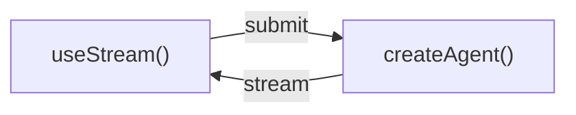

# Tổng quan

> Xây dựng generative UI với streaming thời gian thực từ agent LangChain

Xây dựng frontend phong phú, tương tác cho các agent được tạo bằng `createAgent`. Các pattern này bao trùm mọi thứ từ render message cơ bản đến các workflow nâng cao như phê duyệt human-in-the-loop, gửi theo hàng đợi, rejoin luồng bền vững (durable), và time travel debugging.

Các SDK frontend của LangChain được xây dựng cho **ứng dụng agent**, không chỉ cho chatbot streaming token. Cùng một hook dùng để render message cũng expose thread state bền vững của agent, vòng đời tool-call, interrupt, lịch sử checkpoint, và các giá trị state tuỳ chỉnh, nên UI của bạn có thể trở thành một control plane cho công việc agent chạy lâu dài.

!!! note "Ghi chú"
    Các pattern này dùng gói SDK frontend v1. Nếu bạn đang dùng phiên bản cũ hơn, xem hướng dẫn migration cho [React](https://github.com/langchain-ai/langgraphjs/blob/main/libs/sdk-react/docs/v1-migration.md), [Vue](https://github.com/langchain-ai/langgraphjs/blob/main/libs/sdk-vue/docs/v1-migration.md), [Svelte](https://github.com/langchain-ai/langgraphjs/blob/main/libs/sdk-svelte/docs/v1-migration.md), và [Angular](https://github.com/langchain-ai/langgraphjs/blob/main/libs/sdk-angular/docs/v1-migration.md).

## Kiến trúc

Mọi pattern đều theo cùng một kiến trúc: một backend `createAgent` streaming state tới frontend qua stream API của SDK.



Ở phía backend, `createAgent` tạo ra một graph LangGraph đã compile, expose một streaming API. Ở phía frontend, stream handle kết nối tới API đó và cung cấp state reactive (messages, tool calls, interrupts, values, và thread metadata) mà bạn render bằng bất kỳ framework nào.

## Vì sao nên dùng SDK frontend của LangChain?

Hầu hết các thư viện UI AI giúp bạn nối thêm text streaming vào một transcript chat. SDK của LangChain expose các ngữ nghĩa runtime phong phú hơn mà agent production cần:

| Khả năng | UI của bạn có thể làm được gì |
| --- | --- |
| **Thread bền vững (durable)** | Reload trang, chuyển thiết bị, hoặc rejoin một run mà không mất state hội thoại. |
| **Typed agent state** | Render bất kỳ state key nào, không chỉ messages: todo, output pipeline, trích dẫn, file sandbox, metric, hoặc business object tuỳ chỉnh. |
| **Vòng đời tool-call** | Hiển thị tool call đang chờ, đã hoàn thành, và thất bại dưới dạng UI card chuyên biệt thay vì JSON thô. |
| **Interrupt** | Tạm dừng thực thi để human phê duyệt, chỉnh sửa, hoặc bổ sung thông tin còn thiếu, rồi tiếp tục đúng từ điểm agent đã dừng. |
| **Checkpoint** | Xây dựng các luồng edit, retry, branch, audit, và time-travel từ các snapshot state đã lưu. |
| **Thực thi lồng nhau (nested)** | Trực quan hoá deep agent, subagent, và graph node mà không phải làm phẳng mọi thứ thành một luồng khó đọc. |
| **Reactivity native theo framework** | Dùng cùng một protocol từ React, Vue, Svelte, hoặc Angular trong khi vẫn giữ hook, composable, store, hoặc signal đúng chuẩn từng framework. |

Các primitive này cho phép bạn thiết kế UI nơi người dùng có thể kiểm tra, điều khiển, tạm dừng, tiếp tục, và fork công việc của agent trong khi nó đang diễn ra.

=== "agent.py"
    ```python
    from langchain import create_agent
    from langgraph.checkpoint.memory import MemorySaver

    agent = create_agent(
        model="openai:gpt-5.5",
        tools=[get_weather, search_web],
        checkpointer=MemorySaver(),
    )
    ```

=== "types.ts"
    ```ts
    export interface GraphState {
      messages: BaseMessage[];
    }
    ```

=== "Chat.tsx"
    ```tsx
    import { useStream } from "@langchain/react";
    import type { GraphState } from "./types";

    function Chat() {
      const stream = useStream<GraphState>({
        apiUrl: "http://localhost:2024",
        assistantId: "agent",
      });

      return (
        <div>
          {stream.messages.map((msg) => (
            <Message key={msg.id} message={msg} />
          ))}
        </div>
      );
    }
    ```

React, Vue, và Svelte dùng `useStream`. Angular dùng `injectStream`:

```ts
import { useStream } from "@langchain/react";      // React
import { useStream } from "@langchain/vue";        // Vue
import { useStream } from "@langchain/svelte";     // Svelte
import { injectStream } from "@langchain/angular"; // Angular
```

## Type inference

Truyền một type parameter cho [`useStream`](https://reference.langchain.com/javascript/langchain-react/index/useStream) (hoặc [`injectStream`](https://reference.langchain.com/javascript/langchain-angular/injectStream) trong Angular) để có quyền truy cập type-safe vào `stream.messages`, `stream.toolCalls`, `stream.interrupt`, `stream.values`, và các state reactive khác.

Định nghĩa một interface TypeScript khớp với state schema của agent và truyền nó làm type parameter:

```ts
import type { BaseMessage } from "langchain";

interface AgentState {
  messages: BaseMessage[];
}

const stream = useStream<AgentState>({
  apiUrl: "http://localhost:2024",
  assistantId: "agent",
});
```

Dùng tên graph từ `langgraph.json` làm `assistantId`. Trong các ví dụ pattern xuyên suốt hướng dẫn này, thay `typeof myAgent` bằng tên interface của bạn (ví dụ `AgentState`).

Nếu agent của bạn expose các state key tuỳ chỉnh, mở rộng interface:

```ts
import type { BaseMessage, Todo } from "langchain";

interface AgentState {
  messages: BaseMessage[];
  todos: Todo[];
}
```

## Các pattern

### Render message và output

* **[Markdown messages](markdown-messages.md)**: Parse và render markdown streaming với định dạng và highlight code đúng cách.
* **[Structured output](structured-output.md)**: Render phản hồi agent có kiểu (typed) thành component UI tuỳ chỉnh thay vì plain text.
* **[Reasoning tokens](reasoning-tokens.md)**: Hiển thị quá trình suy nghĩ (thinking) của model trong các khối có thể thu gọn.
* **[Generative UI](generative-ui-overview.md)**: Render giao diện do agent tạo ra trên toàn bộ phổ từ controlled đến declarative đến open-ended.

### Hiển thị hành động của agent

* **[Tool calling](tool-calling.md)**: Hiển thị tool call dưới dạng UI card phong phú, type-safe với trạng thái loading và lỗi.
* **[Headless tools](headless-tools.md)**: Chạy các API trình duyệt và thiết bị ở phía client trong khi vẫn giữ tool schema có kiểu ở phía agent.
* **[Human-in-the-loop](human-in-the-loop.md)**: Tạm dừng agent để human review với các workflow approve, reject, và edit.

### Quản lý cuộc hội thoại

* **[Branching chat](branching-chat.md)**: Chỉnh sửa message, tạo lại phản hồi, và điều hướng các nhánh hội thoại.
* **[Message queues](message-queues.md)**: Xếp hàng nhiều message trong khi agent xử lý chúng tuần tự.

### Streaming nâng cao

* **[Join & rejoin streams](join-rejoin.md)**: Ngắt kết nối khỏi và kết nối lại vào luồng agent đang chạy mà không mất tiến trình.
* **[Time travel](time-travel.md)**: Kiểm tra, điều hướng, và tiếp tục từ bất kỳ checkpoint nào trong lịch sử hội thoại.

## Chọn pattern frontend

Bắt đầu từ câu hỏi UX mà ứng dụng của bạn cần trả lời:

| Nếu người dùng cần... | Bắt đầu với... |
| --- | --- |
| Hiểu agent đang làm gì | [Tool calling](tool-calling.md) và [reasoning tokens](reasoning-tokens.md) |
| An toàn phê duyệt các hành động nhạy cảm | [Human-in-the-loop](human-in-the-loop.md) |
| Gửi công việc trong khi một run đang hoạt động | [Message queues](message-queues.md) |
| Rời đi và quay lại với công việc chạy lâu dài | [Join & rejoin streams](join-rejoin.md) |
| Chỉnh sửa hoặc retry từ một lượt trước đó | [Branching chat](branching-chat.md) và [time travel](time-travel.md) |
| Render state như một ứng dụng, không phải một chat | [Structured output](structured-output.md), [generative UI](generative-ui-overview.md), và Deep Agents frontend patterns |

## Tích hợp

Stream API không phụ thuộc vào UI (UI-agnostic). Dùng nó với bất kỳ thư viện component hoặc framework generative UI nào. Các thư viện component có thể sở hữu lớp hiển thị trong khi SDK của LangChain sở hữu agent runtime state, khả năng resumability, interrupt, và ngữ nghĩa checkpoint bên dưới.

* **[AI Elements](integrations/ai-elements.md)**: Component shadcn/ui có thể kết hợp cho AI chat: `Conversation`, `Message`, `Tool`, `Reasoning`.
* **[assistant-ui](integrations/assistant-ui.md)**: Framework React headless với quản lý thread, branching, và hỗ trợ attachment có sẵn.
* **[OpenUI](integrations/openui.md)**: Thư viện generative UI cho report và dashboard giàu dữ liệu bằng DSL component openui-lang.
