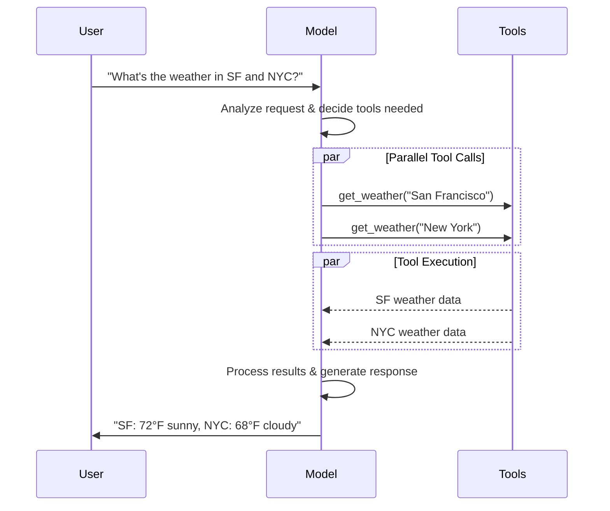

# Models

[LLM](https://en.wikipedia.org/wiki/Large_language_model) là những công cụ AI mạnh mẽ có thể diễn giải và tạo ra văn bản giống con người. Chúng đủ linh hoạt để viết nội dung, dịch ngôn ngữ, tóm tắt và trả lời câu hỏi mà không cần huấn luyện chuyên biệt cho từng tác vụ.

Ngoài việc tạo văn bản, nhiều model còn hỗ trợ:

* [Tool calling](#tool-calling): gọi các tool bên ngoài (như truy vấn cơ sở dữ liệu hoặc gọi API) và sử dụng kết quả trong phản hồi của chúng.
* [Structured output](#structured-output): trong đó phản hồi của model bị ràng buộc phải tuân theo một định dạng đã được định nghĩa.
* [Multimodality](#multimodal): xử lý và trả về dữ liệu khác ngoài văn bản, chẳng hạn như hình ảnh, âm thanh và video.
* [Reasoning](#reasoning): model thực hiện suy luận nhiều bước để đi đến kết luận.

Model chính là bộ máy suy luận (reasoning engine) của [agent](agents.md). Chúng thúc đẩy quá trình ra quyết định của agent, xác định tool nào cần gọi, cách diễn giải kết quả, và khi nào đưa ra câu trả lời cuối cùng.

Chất lượng và khả năng của model bạn chọn ảnh hưởng trực tiếp đến độ tin cậy và hiệu năng cơ bản của agent. Các model khác nhau sẽ nổi trội ở những tác vụ khác nhau: một số giỏi hơn trong việc tuân theo các chỉ dẫn phức tạp, một số khác giỏi về structured reasoning, và một số hỗ trợ context window lớn hơn để xử lý nhiều thông tin hơn.

Các standard model interface của LangChain cho phép bạn truy cập nhiều tích hợp nhà cung cấp khác nhau, giúp bạn dễ dàng thử nghiệm và chuyển đổi giữa các model để tìm ra lựa chọn phù hợp nhất cho use case của mình.

Để biết thông tin tích hợp và khả năng cụ thể theo từng nhà cung cấp, xem [trang chat model](https://docs.langchain.com/oss/python/integrations/chat) của nhà cung cấp đó.

!!! tip "Mẹo"
    [LangSmith](https://docs.langchain.com/langsmith/observability) trace mỗi lệnh gọi model để bạn có thể so sánh các nhà cung cấp, kiểm tra tool routing và debug lỗi. Làm theo [tracing quickstart](https://docs.langchain.com/langsmith/trace-with-langchain) để thiết lập.

    Chúng tôi cũng khuyến nghị bạn thiết lập [LangSmith Engine](https://docs.langchain.com/langsmith/engine), công cụ giám sát các trace của bạn, phát hiện vấn đề và đề xuất cách khắc phục.

## Sử dụng cơ bản

Model có thể được sử dụng theo hai cách:

1. **Với agent (With agents)**: Model có thể được chỉ định động khi tạo một [agent](agents.md#model).
2. **Độc lập (Standalone)**: Model có thể được gọi trực tiếp (bên ngoài agent loop) cho các tác vụ như tạo văn bản, phân loại, hoặc trích xuất mà không cần đến agent framework.

Cùng một model interface hoạt động trong cả hai bối cảnh, giúp bạn linh hoạt bắt đầu đơn giản rồi mở rộng dần lên các workflow dựa trên agent phức tạp hơn khi cần.

### Khởi tạo một model

Cách dễ nhất để bắt đầu với một model độc lập trong LangChain là sử dụng [`init_chat_model`](https://reference.langchain.com/python/langchain/chat_models/base/init_chat_model) để khởi tạo model từ nhà cung cấp chat model mà bạn chọn (các ví dụ bên dưới):

=== "OpenAI"
    👉 Đọc [tài liệu tích hợp OpenAI chat model](https://docs.langchain.com/oss/python/integrations/chat/openai/)

    Cài đặt package:

    === "pip"
        ```bash
        pip install -U "langchain[openai]"
        ```

    === "uv"
        ```bash
        uv add "langchain[openai]"
        ```

    Khởi tạo model:

    === "init_chat_model"
        ```python
        import os
        from langchain.chat_models import init_chat_model

        os.environ["OPENAI_API_KEY"] = "sk-..."

        model = init_chat_model("gpt-5.5")
        ```

    === "Model Class"
        ```python
        import os
        from langchain_openai import ChatOpenAI

        os.environ["OPENAI_API_KEY"] = "sk-..."

        model = ChatOpenAI(model="gpt-5.5")
        ```

=== "Anthropic"
    👉 Đọc [tài liệu tích hợp Anthropic chat model](https://docs.langchain.com/oss/python/integrations/chat/anthropic/)

    Cài đặt package:

    === "pip"
        ```bash
        pip install -U "langchain[anthropic]"
        ```

    === "uv"
        ```bash
        uv add "langchain[anthropic]"
        ```

    Khởi tạo model:

    === "init_chat_model"
        ```python
        import os
        from langchain.chat_models import init_chat_model

        os.environ["ANTHROPIC_API_KEY"] = "sk-..."

        model = init_chat_model("claude-sonnet-4-6")
        ```

    === "Model Class"
        ```python
        import os
        from langchain_anthropic import ChatAnthropic

        os.environ["ANTHROPIC_API_KEY"] = "sk-..."

        model = ChatAnthropic(model="claude-sonnet-4-6")
        ```

=== "Azure"
    👉 Đọc [tài liệu tích hợp Azure chat model](https://docs.langchain.com/oss/python/integrations/chat/azure_chat_openai/)

    Cài đặt package:

    === "pip"
        ```bash
        pip install -U "langchain[openai]"
        ```

    === "uv"
        ```bash
        uv add "langchain[openai]"
        ```

    Khởi tạo model:

    === "init_chat_model"
        ```python
        import os
        from langchain.chat_models import init_chat_model

        os.environ["AZURE_OPENAI_API_KEY"] = "..."
        os.environ["AZURE_OPENAI_ENDPOINT"] = "..."
        os.environ["OPENAI_API_VERSION"] = "2025-03-01-preview"

        model = init_chat_model(
            "azure_openai:gpt-5.5",
            azure_deployment=os.environ["AZURE_OPENAI_DEPLOYMENT_NAME"],
        )
        ```

    === "Model Class"
        ```python
        import os
        from langchain_openai import AzureChatOpenAI

        os.environ["AZURE_OPENAI_API_KEY"] = "..."
        os.environ["AZURE_OPENAI_ENDPOINT"] = "..."
        os.environ["OPENAI_API_VERSION"] = "2025-03-01-preview"

        model = AzureChatOpenAI(
            model="gpt-5.5",
            azure_deployment=os.environ["AZURE_OPENAI_DEPLOYMENT_NAME"]
        )
        ```

=== "Google Gemini"
    👉 Đọc [tài liệu tích hợp Google GenAI chat model](https://docs.langchain.com/oss/python/integrations/chat/google_generative_ai/)

    Cài đặt package:

    === "pip"
        ```bash
        pip install -U "langchain[google-genai]"
        ```

    === "uv"
        ```bash
        uv add "langchain[google-genai]"
        ```

    Khởi tạo model:

    === "init_chat_model"
        ```python
        import os
        from langchain.chat_models import init_chat_model

        os.environ["GOOGLE_API_KEY"] = "..."

        model = init_chat_model("google_genai:gemini-2.5-flash-lite")
        ```

    === "Model Class"
        ```python
        import os
        from langchain_google_genai import ChatGoogleGenerativeAI

        os.environ["GOOGLE_API_KEY"] = "..."

        model = ChatGoogleGenerativeAI(model="gemini-2.5-flash-lite")
        ```

=== "AWS Bedrock"
    👉 Đọc [tài liệu tích hợp AWS Bedrock chat model](https://docs.langchain.com/oss/python/integrations/chat/bedrock/)

    Cài đặt package:

    === "pip"
        ```bash
        pip install -U "langchain[aws]"
        ```

    === "uv"
        ```bash
        uv add "langchain[aws]"
        ```

    Khởi tạo model:

    === "init_chat_model"
        ```python
        from langchain.chat_models import init_chat_model

        # Follow the steps here to configure your credentials:
        # https://docs.aws.amazon.com/bedrock/latest/userguide/getting-started.html

        model = init_chat_model(
            "us.anthropic.claude-sonnet-4-6",
            model_provider="bedrock_converse",
        )
        ```

    === "Model Class"
        ```python
        from langchain_aws import ChatBedrock

        model = ChatBedrock(model="us.anthropic.claude-sonnet-4-6")
        ```

=== "HuggingFace"
    👉 Đọc [tài liệu tích hợp HuggingFace chat model](https://docs.langchain.com/oss/python/integrations/chat/huggingface/)

    Cài đặt package:

    === "pip"
        ```bash
        pip install -U "langchain[huggingface]"
        ```

    === "uv"
        ```bash
        uv add "langchain[huggingface]"
        ```

    Khởi tạo model:

    === "init_chat_model"
        ```python
        import os
        from langchain.chat_models import init_chat_model

        os.environ["HUGGINGFACEHUB_API_TOKEN"] = "hf_..."

        model = init_chat_model(
            "microsoft/Phi-3-mini-4k-instruct",
            model_provider="huggingface",
            temperature=0.7,
            max_tokens=1024,
        )
        ```

    === "Model Class"
        ```python
        import os
        from langchain_huggingface import ChatHuggingFace, HuggingFaceEndpoint

        os.environ["HUGGINGFACEHUB_API_TOKEN"] = "hf_..."

        llm = HuggingFaceEndpoint(
            repo_id="microsoft/Phi-3-mini-4k-instruct",
            temperature=0.7,
            max_length=1024,
        )
        model = ChatHuggingFace(llm=llm)
        ```

=== "OpenRouter"
    👉 Đọc [tài liệu tích hợp OpenRouter chat model](https://docs.langchain.com/oss/python/integrations/chat/openrouter/)

    Cài đặt package:

    === "pip"
        ```bash
        pip install -U "langchain-openrouter"
        ```

    === "uv"
        ```bash
        uv add "langchain-openrouter"
        ```

    Khởi tạo model:

    === "init_chat_model"
        ```python
        import os
        from langchain.chat_models import init_chat_model

        os.environ["OPENROUTER_API_KEY"] = "sk-..."

        model = init_chat_model(
            "auto",
            model_provider="openrouter",
        )
        ```

    === "Model Class"
        ```python
        import os
        from langchain_openrouter import ChatOpenRouter

        os.environ["OPENROUTER_API_KEY"] = "sk-..."

        model = ChatOpenRouter(model="auto")
        ```

```python
response = model.invoke("Why do parrots talk?")
```

Xem [`init_chat_model`](https://reference.langchain.com/python/langchain/chat_models/base/init_chat_model) để biết thêm chi tiết, bao gồm thông tin về cách truyền [tham số](#parameters) cho model.

### Các nhà cung cấp và model được hỗ trợ

LangChain hỗ trợ tất cả các nhà cung cấp model lớn thông qua các package tích hợp chuyên dụng. Mỗi package của nhà cung cấp triển khai cùng một interface chuẩn, vì vậy bạn có thể hoán đổi nhà cung cấp mà không cần viết lại logic ứng dụng. Các tên model mới hoạt động ngay lập tức, không cần cập nhật LangChain, vì các package của nhà cung cấp truyền tên model trực tiếp đến API của nhà cung cấp đó.

Duyệt qua [danh sách đầy đủ các nhà cung cấp được hỗ trợ](https://docs.langchain.com/oss/python/integrations/providers/overview), hoặc xem [Providers and models](https://docs.langchain.com/oss/python/concepts/providers-and-models) để có cái nhìn tổng quan về khái niệm cách các nhà cung cấp, package và tên model phối hợp với nhau trong LangChain.

### Các phương thức chính

**Invoke** ([xem chi tiết](#invoke))
Model nhận messages làm đầu vào và xuất ra messages sau khi tạo xong một phản hồi hoàn chỉnh.

**Stream** ([xem chi tiết](#stream))
Gọi model, nhưng stream đầu ra theo thời gian thực khi nó được tạo ra.

**Batch** ([xem chi tiết](#batch))
Gửi nhiều request đến một model theo một batch để xử lý hiệu quả hơn.

!!! info "Thông tin"
    Ngoài chat model, LangChain còn hỗ trợ các công nghệ liên quan khác, chẳng hạn như embedding model và vector store. Xem [trang integrations](https://docs.langchain.com/oss/python/integrations/providers/overview) để biết chi tiết.

## Tham số {#parameters}

Một chat model nhận các tham số có thể dùng để cấu hình hành vi của nó. Tập hợp đầy đủ các tham số được hỗ trợ tùy thuộc vào model và nhà cung cấp, nhưng các tham số chuẩn bao gồm:

* **`model`** (`string`, bắt buộc)
    Tên hoặc định danh của model cụ thể mà bạn muốn sử dụng với một nhà cung cấp. Bạn cũng có thể chỉ định cả model và nhà cung cấp của nó trong một tham số duy nhất theo định dạng `'{model_provider}:{model}'`, ví dụ `'openai:o1'`.

* **`api_key`** (`string`)
    Khóa cần thiết để xác thực với nhà cung cấp model. Khóa này thường được cấp khi bạn đăng ký quyền truy cập model. Thường được truy cập bằng cách thiết lập một biến môi trường (một biến có giá trị được thiết lập bên ngoài chương trình, thường thông qua chức năng tích hợp sẵn của hệ điều hành hoặc microservice).

* **`temperature`** (`number`)
    Kiểm soát mức độ ngẫu nhiên trong đầu ra của model. Giá trị càng cao khiến phản hồi càng sáng tạo; giá trị thấp hơn khiến phản hồi mang tính xác định hơn.

* **`max_tokens`** (`number`)
    Giới hạn tổng số token (đơn vị cơ bản mà model đọc và tạo ra; các nhà cung cấp có thể định nghĩa khác nhau, nhưng nhìn chung chúng có thể đại diện cho một từ hoàn chỉnh hoặc một phần của từ) trong phản hồi, từ đó kiểm soát hiệu quả độ dài của đầu ra.

* **`timeout`** (`number`)
    Thời gian tối đa (tính bằng giây) để chờ phản hồi từ model trước khi hủy request.

* **`max_retries`** (`number`, mặc định `6`)
    Số lần thử tối đa mà hệ thống sẽ thực hiện để gửi lại một request nếu nó thất bại do các vấn đề như network timeout hoặc rate limit. Việc retry sử dụng exponential backoff kèm jitter. Các lỗi mạng, rate limit (429) và lỗi server (5xx) sẽ được tự động retry. Các lỗi client như 401 (unauthorized) hoặc 404 sẽ không được retry. Đối với các tác vụ [agent](https://docs.langchain.com/oss/python/deepagents/overview) chạy dài trên mạng không ổn định, cân nhắc tăng giá trị này lên 10 đến 15.

Khi sử dụng [`init_chat_model`](https://reference.langchain.com/python/langchain/chat_models/base/init_chat_model), truyền các tham số này dưới dạng `**kwargs` nội tuyến (tham số từ khóa tùy ý, xem thêm tại [đây](https://www.w3schools.com/python/python_args_kwargs.asp)):

```python
model = init_chat_model(
    "claude-sonnet-4-6",
    # Kwargs passed to the model:
    temperature=0.7,
    timeout=30,
    max_tokens=1000,
    max_retries=6,  # Default; increase for unreliable networks
)
```

### Khả năng phục hồi kết nối

Chat model của LangChain tự động retry các API request thất bại với exponential backoff. Theo mặc định, model sẽ retry tối đa **6 lần** đối với lỗi mạng, rate limit (429), và lỗi server (5xx). Các lỗi client như 401 (unauthorized) hoặc 404 sẽ không được retry.

Bạn có thể điều chỉnh `max_retries` và `timeout` khi tạo một model, sau đó truyền instance đó cho `create_agent`, `create_deep_agent`, hoặc gọi nó độc lập:

```python
from langchain.chat_models import init_chat_model

model = init_chat_model(
    "google_genai:gemini-3.6-flash",
    max_retries=10,  # Increase for unreliable networks (default: 6)
    timeout=120,  # Seconds; increase for slow connections
)
```

!!! tip "Mẹo"
    Đối với các agent graph chạy dài trên mạng không ổn định, cân nhắc tăng `max_retries` (ví dụ 10 đến 15) và sử dụng một [checkpointer](https://docs.langchain.com/oss/python/langgraph/persistence) để tiến trình được bảo toàn qua các lần thất bại.

!!! info "Thông tin"
    Mỗi tích hợp chat model có thể có thêm các tham số riêng để kiểm soát chức năng đặc thù của nhà cung cấp.

    Ví dụ, [`ChatOpenAI`](https://reference.langchain.com/python/langchain-openai/chat_models/base/ChatOpenAI) có `use_responses_api` để quyết định có sử dụng OpenAI Responses API hay Completions API.

    Để tìm tất cả các tham số được hỗ trợ bởi một chat model cụ thể, hãy vào trang [chat model integrations](https://docs.langchain.com/oss/python/integrations/chat).

---

## Invocation (Gọi model)

Một chat model phải được gọi (invoke) để tạo ra đầu ra. Có ba phương thức gọi chính, mỗi phương thức phù hợp với các use case khác nhau.

### Invoke

Cách đơn giản và trực tiếp nhất để gọi một model là sử dụng [`invoke()`](https://reference.langchain.com/python/langchain-core/language_models/chat_models/BaseChatModel/invoke) với một message đơn hoặc một danh sách messages.

```python title="Single message"
response = model.invoke("Why do parrots have colorful feathers?")
print(response)
```

Một danh sách messages có thể được cung cấp cho chat model để đại diện cho lịch sử hội thoại. Mỗi message có một role (vai trò) mà model dùng để xác định ai đã gửi message đó trong cuộc hội thoại.

Xem hướng dẫn [messages](messages.md) để biết thêm chi tiết về role, type và content.

```python title="Dictionary format"
conversation = [
    {"role": "system", "content": "You are a helpful assistant that translates English to French."},
    {"role": "user", "content": "Translate: I love programming."},
    {"role": "assistant", "content": "J'adore la programmation."},
    {"role": "user", "content": "Translate: I love building applications."}
]

response = model.invoke(conversation)
print(response)  # AIMessage("J'adore créer des applications.")
```

```python title="Message objects"
from langchain.messages import HumanMessage, AIMessage, SystemMessage

conversation = [
    SystemMessage("You are a helpful assistant that translates English to French."),
    HumanMessage("Translate: I love programming."),
    AIMessage("J'adore la programmation."),
    HumanMessage("Translate: I love building applications.")
]

response = model.invoke(conversation)
print(response)  # AIMessage("J'adore créer des applications.")
```

!!! info "Thông tin"
    Nếu kiểu trả về của lệnh invoke là một string, hãy đảm bảo bạn đang sử dụng một chat model chứ không phải một LLM. Các LLM kiểu cũ, chỉ hoàn thành văn bản (text-completion), trả về string trực tiếp. Chat model của LangChain đều có tiền tố "Chat", ví dụ [`ChatOpenAI`](https://reference.langchain.com/python/langchain-openai/chat_models/base/ChatOpenAI) (xem [tích hợp OpenAI](https://docs.langchain.com/oss/integrations/chat/openai)).

### Stream

Hầu hết các model có thể stream nội dung đầu ra của chúng trong khi nội dung đó đang được tạo ra. Bằng cách hiển thị đầu ra dần dần, streaming cải thiện đáng kể trải nghiệm người dùng, đặc biệt với các phản hồi dài hơn.

Gọi [`stream()`](https://reference.langchain.com/python/langchain-core/language_models/chat_models/BaseChatModel/stream) trả về một iterator (một đối tượng cung cấp quyền truy cập dần dần vào từng phần tử của một tập hợp, theo thứ tự) sinh ra các chunk đầu ra khi chúng được tạo ra. Bạn có thể dùng vòng lặp để xử lý từng chunk theo thời gian thực:

```python title="Basic text streaming"
for chunk in model.stream("Why do parrots have colorful feathers?"):
    print(chunk.text, end="|", flush=True)
```

```python title="Stream tool calls, reasoning, and other content"
for chunk in model.stream("What color is the sky?"):
    for block in chunk.content_blocks:
        if block["type"] == "reasoning" and (reasoning := block.get("reasoning")):
            print(f"Reasoning: {reasoning}")
        elif block["type"] == "tool_call_chunk":
            print(f"Tool call chunk: {block}")
        elif block["type"] == "text":
            print(block["text"])
        else:
            ...
```

Khác với [`invoke()`](#invoke), vốn trả về một [`AIMessage`](https://reference.langchain.com/python/langchain-core/messages/ai/AIMessage) duy nhất sau khi model hoàn tất việc tạo toàn bộ phản hồi, `stream()` trả về nhiều đối tượng [`AIMessageChunk`](https://reference.langchain.com/python/langchain-core/messages/ai/AIMessageChunk), mỗi đối tượng chứa một phần của văn bản đầu ra. Quan trọng là, mỗi chunk trong một stream được thiết kế để có thể gộp lại thành một message hoàn chỉnh thông qua phép cộng:

```python title="Construct an AIMessage"
full = None  # None | AIMessageChunk
for chunk in model.stream("What color is the sky?"):
    full = chunk if full is None else full + chunk
    print(full.text)

# The
# The sky
# The sky is
# The sky is typically
# The sky is typically blue
# ...

print(full.content_blocks)
# [{"type": "text", "text": "The sky is typically blue..."}]
```

Message kết quả có thể được xử lý giống như một message được tạo bằng [`invoke()`](#invoke), ví dụ, nó có thể được gộp vào lịch sử message và truyền lại cho model làm ngữ cảnh hội thoại.

!!! warning "Cảnh báo"
    Streaming chỉ hoạt động nếu tất cả các bước trong chương trình đều biết cách xử lý một stream các chunk. Ví dụ, một ứng dụng không có khả năng streaming là ứng dụng cần lưu toàn bộ đầu ra vào bộ nhớ trước khi có thể xử lý nó.

??? note "Chủ đề nâng cao về streaming"
    ??? note "Streaming events"
        Chat model của LangChain cũng có thể stream các sự kiện ngữ nghĩa (semantic events) bằng `astream_events()`.

        Cách này giúp đơn giản hóa việc lọc theo loại sự kiện và metadata khác, đồng thời sẽ tự động gộp message hoàn chỉnh ở phía sau. Xem ví dụ bên dưới.

        ```python
        async for event in model.astream_events("Hello"):

            if event["event"] == "on_chat_model_start":
                print(f"Input: {event['data']['input']}")

            elif event["event"] == "on_chat_model_stream":
                print(f"Token: {event['data']['chunk'].text}")

            elif event["event"] == "on_chat_model_end":
                print(f"Full message: {event['data']['output'].text}")

            else:
                pass
        ```

        ```txt
        Input: Hello
        Token: Hi
        Token:  there
        Token: !
        Token:  How
        Token:  can
        Token:  I
        ...
        Full message: Hi there! How can I help today?
        ```

        !!! tip "Mẹo"
            Xem tài liệu tham khảo [`astream_events()`](https://reference.langchain.com/python/langchain_core/language_models/#langchain_core.language_models.chat_models.BaseChatModel.astream_events) để biết các loại sự kiện và chi tiết khác.

    ??? note "Chat model \"Auto-streaming\""
        LangChain đơn giản hóa việc streaming từ chat model bằng cách tự động bật chế độ streaming trong một số trường hợp nhất định, ngay cả khi bạn không gọi tường minh các phương thức streaming. Điều này đặc biệt hữu ích khi bạn dùng phương thức invoke không streaming nhưng vẫn muốn stream toàn bộ ứng dụng, bao gồm cả các kết quả trung gian từ chat model.

        Ví dụ, trong [LangGraph agent](agents.md), bạn có thể gọi `model.invoke()` bên trong các node, nhưng LangChain sẽ tự động chuyển sang streaming nếu đang chạy ở chế độ streaming.

        #### Cách hoạt động

        Khi bạn `invoke()` một chat model, LangChain sẽ tự động chuyển sang chế độ streaming nội bộ nếu phát hiện rằng bạn đang cố stream toàn bộ ứng dụng. Kết quả của lệnh invoke sẽ giống hệt như những gì đoạn code gọi invoke mong đợi; tuy nhiên, trong khi chat model đang được stream, LangChain sẽ lo việc gọi các sự kiện [`on_llm_new_token`](https://reference.langchain.com/python/langchain-core/callbacks/base/AsyncCallbackHandler/on_llm_new_token) trong hệ thống callback của LangChain.

        Các sự kiện callback cho phép `stream()` và `astream_events()` của LangGraph hiển thị đầu ra của chat model theo thời gian thực.

### Batch

Việc batch một tập hợp các request độc lập tới một model có thể cải thiện đáng kể hiệu năng và giảm chi phí, vì việc xử lý có thể được thực hiện song song:

```python title="Batch"
responses = model.batch([
    "Why do parrots have colorful feathers?",
    "How do airplanes fly?",
    "What is quantum computing?"
])
for response in responses:
    print(response)
```

!!! note "Ghi chú"
    Phần này mô tả một phương thức của chat model là [`batch()`](https://reference.langchain.com/python/langchain_core/language_models/#langchain_core.language_models.chat_models.BaseChatModel.batch), phương thức này song song hóa các lệnh gọi model ở phía client.

    Nó **khác biệt** với các batch API do các nhà cung cấp inference hỗ trợ, chẳng hạn như [OpenAI](https://platform.openai.com/docs/guides/batch) hoặc [Anthropic](https://platform.claude.com/docs/en/build-with-claude/batch-processing#message-batches-api).

Theo mặc định, [`batch()`](https://reference.langchain.com/python/langchain_core/language_models/#langchain_core.language_models.chat_models.BaseChatModel.batch) chỉ trả về đầu ra cuối cùng cho toàn bộ batch. Nếu bạn muốn nhận đầu ra cho từng input riêng lẻ ngay khi nó tạo xong, bạn có thể stream kết quả bằng [`batch_as_completed()`](https://reference.langchain.com/python/langchain_core/language_models/#langchain_core.language_models.chat_models.BaseChatModel.batch_as_completed):

```python title="Yield batch responses upon completion"
for response in model.batch_as_completed([
    "Why do parrots have colorful feathers?",
    "How do airplanes fly?",
    "What is quantum computing?"
]):
    print(response)
```

!!! note "Ghi chú"
    Khi sử dụng [`batch_as_completed()`](https://reference.langchain.com/python/langchain_core/language_models/#langchain_core.language_models.chat_models.BaseChatModel.batch_as_completed), kết quả có thể đến không theo đúng thứ tự. Mỗi kết quả bao gồm chỉ số input để đối chiếu, giúp khôi phục lại thứ tự ban đầu khi cần.

!!! tip "Mẹo"
    Khi xử lý số lượng lớn input bằng [`batch()`](https://reference.langchain.com/python/langchain_core/language_models/#langchain_core.language_models.chat_models.BaseChatModel.batch) hoặc [`batch_as_completed()`](https://reference.langchain.com/python/langchain_core/language_models/#langchain_core.language_models.chat_models.BaseChatModel.batch_as_completed), bạn có thể muốn kiểm soát số lượng lệnh gọi song song tối đa. Việc này có thể thực hiện bằng cách thiết lập thuộc tính [`max_concurrency`](https://reference.langchain.com/python/langchain-core/runnables/config/RunnableConfig) trong dictionary [`RunnableConfig`](https://reference.langchain.com/python/langchain-core/runnables/config/RunnableConfig).

    ```python title="Batch with max concurrency"
    model.batch(
        list_of_inputs,
        config={
            'max_concurrency': 5,  # Limit to 5 parallel calls
        }
    )
    ```

    Xem tài liệu tham khảo [`RunnableConfig`](https://reference.langchain.com/python/langchain-core/runnables/config/RunnableConfig) để biết danh sách đầy đủ các thuộc tính được hỗ trợ.

Để biết thêm chi tiết về batching, xem [tài liệu tham khảo](https://reference.langchain.com/python/langchain_core/language_models/#langchain_core.language_models.chat_models.BaseChatModel.batch).

---

## Tool calling

Model có thể yêu cầu gọi các tool để thực hiện những tác vụ như lấy dữ liệu từ cơ sở dữ liệu, tìm kiếm trên web, hoặc chạy code. Tool là sự kết hợp của:

1. Một schema, bao gồm tên của tool, một mô tả và/hoặc định nghĩa tham số (thường là một JSON schema)
2. Một hàm hoặc coroutine (một phương thức có thể tạm dừng thực thi và tiếp tục sau đó) để thực thi.

!!! note "Ghi chú"
    Bạn có thể nghe thấy thuật ngữ "function calling". Chúng tôi dùng thuật ngữ này thay thế cho "tool calling" một cách tương đương.

Đây là luồng tool calling cơ bản giữa người dùng và model:



Để các tool bạn đã định nghĩa khả dụng cho model sử dụng, bạn phải bind (gắn kết) chúng bằng [`bind_tools`](https://reference.langchain.com/python/langchain-core/language_models/chat_models/BaseChatModel/bind_tools). Trong các lần gọi tiếp theo, model có thể chọn gọi bất kỳ tool nào đã được bind khi cần.

Một số nhà cung cấp model cung cấp built-in tool (các tool được thực thi phía server, chẳng hạn như web search và code interpreter) có thể được bật thông qua tham số của model hoặc của lệnh invoke (ví dụ [`ChatOpenAI`](https://docs.langchain.com/oss/python/integrations/chat/openai), [`ChatAnthropic`](https://docs.langchain.com/oss/python/integrations/chat/anthropic)). Kiểm tra [tài liệu tham khảo của nhà cung cấp](https://docs.langchain.com/oss/python/integrations/providers/overview) tương ứng để biết chi tiết.

!!! tip "Mẹo"
    Xem [hướng dẫn tools](tools.md) để biết chi tiết và các lựa chọn khác khi tạo tool.

```python title="Binding user tools"
from langchain.tools import tool

@tool
def get_weather(location: str) -> str:
    """Get the weather at a location."""
    return f"It's sunny in {location}."


model_with_tools = model.bind_tools([get_weather])  # [!code highlight]

response = model_with_tools.invoke("What's the weather like in Boston?")
for tool_call in response.tool_calls:
    # View tool calls made by the model
    print(f"Tool: {tool_call['name']}")
    print(f"Args: {tool_call['args']}")
```

Khi bind các tool do người dùng định nghĩa, phản hồi của model sẽ bao gồm một **yêu cầu** thực thi một tool. Khi sử dụng model một cách độc lập, tách rời khỏi [agent](agents.md), bạn phải tự thực thi tool được yêu cầu và trả kết quả về cho model để dùng trong bước suy luận tiếp theo. Khi sử dụng một [agent](agents.md), agent loop sẽ tự xử lý vòng lặp thực thi tool cho bạn.

Dưới đây là một số cách phổ biến bạn có thể dùng tool calling.

??? note "Tool execution loop"
    Khi một model trả về các tool call, bạn cần thực thi các tool đó và trả kết quả về cho model. Điều này tạo ra một vòng lặp hội thoại, trong đó model có thể dùng kết quả của tool để tạo ra phản hồi cuối cùng. LangChain cung cấp các abstraction [agent](agents.md) để xử lý việc điều phối này cho bạn.

    Đây là một ví dụ đơn giản về cách thực hiện điều này:

    ```python title="Tool execution loop"
    # Bind (potentially multiple) tools to the model
    model_with_tools = model.bind_tools([get_weather])

    # Step 1: Model generates tool calls
    messages = [{"role": "user", "content": "What's the weather in Boston?"}]
    ai_msg = model_with_tools.invoke(messages)
    messages.append(ai_msg)

    # Step 2: Execute tools and collect results
    for tool_call in ai_msg.tool_calls:
        # Execute the tool with the generated arguments
        tool_result = get_weather.invoke(tool_call)
        messages.append(tool_result)

    # Step 3: Pass results back to model for final response
    final_response = model_with_tools.invoke(messages)
    print(final_response.text)
    # "The current weather in Boston is 72°F and sunny."
    ```

    Mỗi [`ToolMessage`](https://reference.langchain.com/python/langchain-core/messages/tool/ToolMessage) mà tool trả về bao gồm một `tool_call_id` khớp với tool call gốc, giúp model đối chiếu kết quả với yêu cầu tương ứng.

??? note "Forcing tool calls (Ép buộc gọi tool)"
    Theo mặc định, model có toàn quyền lựa chọn tool đã bind nào để sử dụng dựa trên input của người dùng. Tuy nhiên, đôi khi bạn có thể muốn ép model phải chọn một tool, đảm bảo model dùng một tool cụ thể hoặc **bất kỳ** tool nào trong một danh sách cho trước:

    ```python title="Force use of any tool"
    model_with_tools = model.bind_tools([tool_1], tool_choice="any")
    ```

    ```python title="Force use of specific tools"
    model_with_tools = model.bind_tools([tool_1], tool_choice="tool_1")
    ```

??? note "Parallel tool calls (Gọi tool song song)"
    Nhiều model hỗ trợ gọi nhiều tool song song khi phù hợp. Điều này cho phép model thu thập thông tin từ nhiều nguồn khác nhau cùng một lúc.

    ```python title="Parallel tool calls"
    model_with_tools = model.bind_tools([get_weather])

    response = model_with_tools.invoke(
        "What's the weather in Boston and Tokyo?"
    )


    # The model may generate multiple tool calls
    print(response.tool_calls)
    # [
    #   {'name': 'get_weather', 'args': {'location': 'Boston'}, 'id': 'call_1'},
    #   {'name': 'get_weather', 'args': {'location': 'Tokyo'}, 'id': 'call_2'},
    # ]


    # Execute all tools (can be done in parallel with async)
    results = []
    for tool_call in response.tool_calls:
        if tool_call['name'] == 'get_weather':
            result = get_weather.invoke(tool_call)
        ...
        results.append(result)
    ```

    Model tự xác định thông minh khi nào việc thực thi song song là phù hợp, dựa trên tính độc lập của các thao tác được yêu cầu.

    !!! tip "Mẹo"
        Hầu hết các model hỗ trợ tool calling đều bật parallel tool calls theo mặc định. Một số model (bao gồm [OpenAI](https://docs.langchain.com/oss/python/integrations/chat/openai) và [Anthropic](https://docs.langchain.com/oss/python/integrations/chat/anthropic)) cho phép bạn tắt tính năng này. Để làm vậy, thiết lập `parallel_tool_calls=False`:

        ```python
        model.bind_tools([get_weather], parallel_tool_calls=False)
        ```

??? note "Streaming tool calls (Stream tool call)"
    Khi stream phản hồi, tool call được xây dựng dần dần thông qua [`ToolCallChunk`](https://reference.langchain.com/python/langchain-core/messages/tool/ToolCallChunk). Điều này cho phép bạn thấy tool call ngay khi chúng đang được tạo ra thay vì phải chờ đến khi có phản hồi hoàn chỉnh.

    ```python title="Streaming tool calls"
    for chunk in model_with_tools.stream(
        "What's the weather in Boston and Tokyo?"
    ):
        # Tool call chunks arrive progressively
        for tool_chunk in chunk.tool_call_chunks:
            if name := tool_chunk.get("name"):
                print(f"Tool: {name}")
            if id_ := tool_chunk.get("id"):
                print(f"ID: {id_}")
            if args := tool_chunk.get("args"):
                print(f"Args: {args}")

    # Output:
    # Tool: get_weather
    # ID: call_SvMlU1TVIZugrFLckFE2ceRE
    # Args: {"lo
    # Args: catio
    # Args: n": "B
    # Args: osto
    # Args: n"}
    # Tool: get_weather
    # ID: call_QMZdy6qInx13oWKE7KhuhOLR
    # Args: {"lo
    # Args: catio
    # Args: n": "T
    # Args: okyo
    # Args: "}
    ```

    Bạn có thể gộp các chunk lại để xây dựng thành các tool call hoàn chỉnh:

    ```python title="Accumulate tool calls"
    gathered = None
    for chunk in model_with_tools.stream("What's the weather in Boston?"):
        gathered = chunk if gathered is None else gathered + chunk
        print(gathered.tool_calls)
    ```

---

## Structured output

Model có thể được yêu cầu cung cấp phản hồi theo một định dạng khớp với một schema cho trước. Điều này hữu ích để đảm bảo đầu ra có thể được parse và sử dụng dễ dàng trong các bước xử lý tiếp theo. LangChain hỗ trợ nhiều loại schema và phương thức để ép buộc structured output.

!!! tip "Mẹo"
    Để tìm hiểu về structured output, xem [Structured output](structured-output.md).

=== "Pydantic"
    [Pydantic model](https://docs.pydantic.dev/latest/concepts/models/#basic-model-usage) cung cấp bộ tính năng phong phú nhất với field validation, mô tả (description), và cấu trúc lồng nhau (nested structures).

    ```python
    from pydantic import BaseModel, Field

    class Movie(BaseModel):
        """A movie with details."""
        title: str = Field(description="The title of the movie")
        year: int = Field(description="The year the movie was released")
        director: str = Field(description="The director of the movie")
        rating: float = Field(description="The movie's rating out of 10")

    model_with_structure = model.with_structured_output(Movie)
    response = model_with_structure.invoke("Provide details about the movie Inception")
    print(response)  # Movie(title="Inception", year=2010, director="Christopher Nolan", rating=8.8)
    ```

=== "TypedDict"
    `TypedDict` của Python cung cấp một giải pháp đơn giản hơn thay cho Pydantic model, phù hợp khi bạn không cần validation lúc chạy (runtime).

    ```python
    from typing_extensions import TypedDict, Annotated

    class MovieDict(TypedDict):
        """A movie with details."""
        title: Annotated[str, ..., "The title of the movie"]
        year: Annotated[int, ..., "The year the movie was released"]
        director: Annotated[str, ..., "The director of the movie"]
        rating: Annotated[float, ..., "The movie's rating out of 10"]

    model_with_structure = model.with_structured_output(MovieDict)
    response = model_with_structure.invoke("Provide details about the movie Inception")
    print(response)  # {'title': 'Inception', 'year': 2010, 'director': 'Christopher Nolan', 'rating': 8.8}
    ```

=== "JSON Schema"
    Cung cấp một [JSON Schema](https://json-schema.org/understanding-json-schema/about) để có toàn quyền kiểm soát và khả năng tương tác tối đa.

    ```python
    import json

    json_schema = {
        "title": "Movie",
        "description": "A movie with details",
        "type": "object",
        "properties": {
            "title": {
                "type": "string",
                "description": "The title of the movie"
            },
            "year": {
                "type": "integer",
                "description": "The year the movie was released"
            },
            "director": {
                "type": "string",
                "description": "The director of the movie"
            },
            "rating": {
                "type": "number",
                "description": "The movie's rating out of 10"
            }
        },
        "required": ["title", "year", "director", "rating"]
    }

    model_with_structure = model.with_structured_output(
        json_schema,
        method="json_schema",
    )
    response = model_with_structure.invoke("Provide details about the movie Inception")
    print(response)  # {'title': 'Inception', 'year': 2010, ...}
    ```

!!! note "Ghi chú"
    **Những lưu ý quan trọng về structured output**

    * **Tham số Method**: Một số nhà cung cấp hỗ trợ các phương thức khác nhau cho structured output:
        * `'json_schema'`: Sử dụng các tính năng structured output chuyên dụng do nhà cung cấp cung cấp.
        * `'function_calling'`: Tạo ra structured output bằng cách ép buộc một [tool call](#tool-calling) tuân theo schema đã cho.
        * `'json_mode'`: Tiền thân của `'json_schema'` được một số nhà cung cấp hỗ trợ. Tạo ra JSON hợp lệ, nhưng schema phải được mô tả trong prompt.
    * **Include raw**: Thiết lập `include_raw=True` để nhận cả đầu ra đã parse và raw AI message.
    * **Validation**: Pydantic model cung cấp validation tự động. `TypedDict` và JSON Schema yêu cầu validation thủ công.

    Xem [trang tích hợp của nhà cung cấp](https://docs.langchain.com/oss/python/integrations/providers/overview) để biết các phương thức được hỗ trợ và tùy chọn cấu hình.

??? note "Ví dụ: Đầu ra message kèm theo structure đã parse"
    Sẽ hữu ích khi trả về đối tượng [`AIMessage`](https://reference.langchain.com/python/langchain-core/messages/ai/AIMessage) thô cùng với biểu diễn đã parse để truy cập metadata phản hồi như [số lượng token](#token-usage). Để làm điều này, thiết lập [`include_raw=True`](https://reference.langchain.com/python/langchain-core/language_models/chat_models/BaseChatModel/with_structured_output) khi gọi [`with_structured_output`](https://reference.langchain.com/python/langchain-core/language_models/chat_models/BaseChatModel/with_structured_output):

    ```python
    from pydantic import BaseModel, Field

    class Movie(BaseModel):
        """A movie with details."""
        title: str = Field(description="The title of the movie")
        year: int = Field(description="The year the movie was released")
        director: str = Field(description="The director of the movie")
        rating: float = Field(description="The movie's rating out of 10")

    model_with_structure = model.with_structured_output(Movie, include_raw=True)  # [!code highlight]
    response = model_with_structure.invoke("Provide details about the movie Inception")
    response
    # {
    #     "raw": AIMessage(...),
    #     "parsed": Movie(title=..., year=..., ...),
    #     "parsing_error": None,
    # }
    ```

??? note "Ví dụ: Cấu trúc lồng nhau"
    Schema có thể được lồng nhau:

    === "Pydantic BaseModel"
        ```python
        from pydantic import BaseModel, Field

        class Actor(BaseModel):
            name: str
            role: str

        class MovieDetails(BaseModel):
            title: str
            year: int
            cast: list[Actor]
            genres: list[str]
            budget: float | None = Field(None, description="Budget in millions USD")

        model_with_structure = model.with_structured_output(MovieDetails)
        ```

    === "TypedDict"
        ```python
        from typing_extensions import Annotated, TypedDict

        class Actor(TypedDict):
            name: str
            role: str

        class MovieDetails(TypedDict):
            title: str
            year: int
            cast: list[Actor]
            genres: list[str]
            budget: Annotated[float | None, ..., "Budget in millions USD"]

        model_with_structure = model.with_structured_output(MovieDetails)
        ```

---

## Chủ đề nâng cao

### Model profiles

!!! info "Thông tin"
    Model profiles yêu cầu `langchain>=1.1`.

Chat model của LangChain có thể lộ ra một dictionary các tính năng và khả năng được hỗ trợ thông qua thuộc tính `profile`:

```python
model.profile
# {
#   "max_input_tokens": 400000,
#   "image_inputs": True,
#   "reasoning_output": True,
#   "tool_calling": True,
#   ...
# }
```

Tham khảo đầy đủ các field trong [API reference](https://reference.langchain.com/python/langchain-core/language_models/model_profile/ModelProfile).

Phần lớn dữ liệu model profile được cung cấp bởi dự án [models.dev](https://github.com/sst/models.dev), một sáng kiến mã nguồn mở cung cấp dữ liệu về khả năng của model. Các dữ liệu này được bổ sung thêm các field khác để phục vụ mục đích sử dụng với LangChain. Các phần bổ sung này được giữ đồng bộ với dự án gốc khi nó phát triển.

Dữ liệu model profile cho phép ứng dụng thích ứng động với khả năng của model. Ví dụ:

1. [Summarization middleware](middleware/built-in.md#summarization) có thể kích hoạt việc tóm tắt dựa trên kích thước context window của model.
2. Các chiến lược [Structured output](structured-output.md) trong `create_agent` có thể được tự động suy ra (ví dụ, bằng cách kiểm tra hỗ trợ cho các tính năng structured output gốc).
3. Input của model có thể bị giới hạn dựa trên các [modality](#multimodal) được hỗ trợ và số token input tối đa.
4. [Deep Agents Code](https://docs.langchain.com/oss/deepagents/code) lọc [bộ chuyển đổi model tương tác](https://docs.langchain.com/oss/deepagents/code/providers#which-models-appear-in-the-switcher) chỉ hiển thị các model mà profile của chúng báo cáo hỗ trợ `tool_calling` và I/O dạng văn bản, đồng thời hiển thị kích thước context window và các cờ khả năng trong view chi tiết của bộ chọn.

??? note "Cập nhật hoặc ghi đè dữ liệu profile"
    Dữ liệu model profile có thể được thay đổi nếu nó bị thiếu, lỗi thời, hoặc không chính xác.

    **Cách 1 (khắc phục nhanh)**

    Bạn có thể khởi tạo một chat model với bất kỳ profile hợp lệ nào:

    ```python
    custom_profile = {
        "max_input_tokens": 100_000,
        "tool_calling": True,
        "structured_output": True,
        # ...
    }
    model = init_chat_model("...", profile=custom_profile)
    ```

    `profile` cũng là một `dict` thông thường và có thể được cập nhật tại chỗ. Nếu instance model được chia sẻ, cân nhắc dùng `model_copy` để tránh làm thay đổi trạng thái dùng chung.

    ```python
    new_profile = model.profile | {"key": "value"}
    model.model_copy(update={"profile": new_profile})
    ```

    **Cách 2 (khắc phục dữ liệu tại nguồn)**

    Nguồn dữ liệu chính là dự án [models.dev](https://models.dev/). Dữ liệu này được gộp với các field bổ sung và ghi đè trong các [integration package](https://docs.langchain.com/oss/python/integrations/providers/overview) của LangChain và được phát hành cùng các package đó.

    Dữ liệu model profile có thể được cập nhật theo quy trình sau:

    1. (Nếu cần) cập nhật dữ liệu nguồn tại [models.dev](https://models.dev/) thông qua một pull request tới [repository trên GitHub](https://github.com/sst/models.dev) của dự án.
    2. (Nếu cần) cập nhật các field bổ sung và ghi đè trong `langchain_<package>/data/profile_augmentations.toml` thông qua một pull request tới [integration package](https://docs.langchain.com/oss/python/integrations/providers/overview) của LangChain.
    3. Sử dụng công cụ CLI [`langchain-model-profiles`](https://pypi.org/project/langchain-model-profiles/) để lấy dữ liệu mới nhất từ [models.dev](https://models.dev/), gộp các phần bổ sung và cập nhật dữ liệu profile:

    === "pip"
        ```bash
        pip install -U langchain-model-profiles
        ```

    === "uv"
        ```bash
        uv add langchain-model-profiles
        ```

    ```bash
    langchain-profiles refresh --provider <provider> --data-dir <data_dir>
    ```

    Lệnh này:

    * Tải dữ liệu mới nhất cho `<provider>` từ models.dev
    * Gộp các phần bổ sung từ `profile_augmentations.toml` trong `<data_dir>`
    * Ghi các profile đã gộp vào `profiles.py` trong `<data_dir>`

    Ví dụ: từ [`libs/partners/anthropic`](https://github.com/langchain-ai/langchain/tree/master/libs/partners/anthropic) trong [LangChain monorepo](https://github.com/langchain-ai/langchain):

    ```bash
    uv run --with langchain-model-profiles --provider anthropic --data-dir langchain_anthropic/data
    ```

!!! warning "Cảnh báo"
    Model profile là một tính năng beta. Định dạng của một profile có thể thay đổi.

### Multimodal

Một số model có thể xử lý và trả về dữ liệu phi văn bản như hình ảnh, âm thanh và video. Bạn có thể truyền dữ liệu phi văn bản cho model bằng cách cung cấp [content block](messages.md#message-content).

!!! tip "Mẹo"
    Tất cả chat model của LangChain có khả năng multimodal ở tầng dưới đều hỗ trợ:

    1. Dữ liệu theo định dạng chuẩn liên nhà cung cấp (xem [hướng dẫn messages](messages.md) của chúng tôi)
    2. Định dạng OpenAI [chat completions](https://platform.openai.com/docs/api-reference/chat)
    3. Bất kỳ định dạng nào gốc của nhà cung cấp cụ thể đó (ví dụ, model Anthropic chấp nhận định dạng gốc của Anthropic)

Xem [phần multimodal](messages.md#multimodal) trong hướng dẫn messages để biết chi tiết.

Một số model (không phải LLM nào cũng như nhau, xem thêm tại [đây](https://models.dev/)) có thể trả về dữ liệu multimodal như một phần của phản hồi. Nếu được gọi để làm vậy, [`AIMessage`](https://reference.langchain.com/python/langchain-core/messages/ai/AIMessage) kết quả sẽ có các content block với kiểu multimodal.

```python title="Multimodal output"
response = model.invoke("Create a picture of a cat")
print(response.content_blocks)
# [
#     {"type": "text", "text": "Here's a picture of a cat"},
#     {"type": "image", "base64": "...", "mime_type": "image/jpeg"},
# ]
```

Xem [trang integrations](https://docs.langchain.com/oss/python/integrations/providers/overview) để biết chi tiết về các nhà cung cấp cụ thể.

### Reasoning

Nhiều model có khả năng thực hiện suy luận nhiều bước để đi đến kết luận. Điều này liên quan đến việc chia nhỏ các vấn đề phức tạp thành các bước nhỏ hơn, dễ quản lý hơn.

**Nếu được model gốc hỗ trợ**, bạn có thể hiển thị quá trình suy luận này để hiểu rõ hơn cách model đi đến câu trả lời cuối cùng.

```python title="Stream reasoning output"
for chunk in model.stream("Why do parrots have colorful feathers?"):
    reasoning_steps = [r for r in chunk.content_blocks if r["type"] == "reasoning"]
    print(reasoning_steps if reasoning_steps else chunk.text)
```

```python title="Complete reasoning output"
response = model.invoke("Why do parrots have colorful feathers?")
reasoning_steps = [b for b in response.content_blocks if b["type"] == "reasoning"]
print(" ".join(step["reasoning"] for step in reasoning_steps))
```

Tùy vào model, đôi khi bạn có thể chỉ định mức độ nỗ lực (effort) mà nó nên đầu tư vào việc suy luận. Tương tự, bạn có thể yêu cầu model tắt hoàn toàn tính năng suy luận. Điều này có thể ở dạng các "tier" (bậc) phân loại (ví dụ `'low'` hoặc `'high'`) hoặc ngân sách token dạng số nguyên.

!!! note "Ghi chú"
    `reasoning_effort` như một tham số chuẩn yêu cầu `langchain-core>=1.5.2`, cộng với phiên bản package đối tác tương ứng: `langchain-anthropic>=1.5.3`, `langchain-openai>=1.4.1`, `langchain-fireworks>=1.5.2`, `langchain-xai>=1.3.0`, `langchain-google-genai>=4.3.1`, hoặc `langchain-aws>=1.6.5`.

[`ChatOpenAI`](https://reference.langchain.com/python/langchain-openai/chat_models/base/ChatOpenAI), [`ChatAnthropic`](https://reference.langchain.com/python/langchain-anthropic/chat_models/ChatAnthropic), [`ChatFireworks`](https://reference.langchain.com/python/langchain-fireworks/chat_models/ChatFireworks), [`ChatXAI`](https://reference.langchain.com/python/langchain-xai/chat_models/ChatXAI), [`ChatGoogleGenerativeAI`](https://reference.langchain.com/python/langchain-google-genai/chat_models/ChatGoogleGenerativeAI), và [`ChatBedrockConverse`](https://reference.langchain.com/python/langchain-aws/chat_models/bedrock_converse/ChatBedrockConverse) hỗ trợ một tham số chuẩn `reasoning_effort`. Giống như `temperature`, nó có thể được thiết lập lúc khởi tạo model hoặc theo từng lệnh invoke, và mỗi nhà cung cấp sẽ chuyển đổi nó sang định dạng API riêng của họ:

```python
from langchain_anthropic import ChatAnthropic

model = ChatAnthropic(model="claude-sonnet-4-6")
response = model.invoke(
    "Why do parrots have colorful feathers?",
    reasoning_effort="high",
)
```

Các mức effort được hỗ trợ và giá trị mặc định theo tài liệu của nhà cung cấp sẽ khác nhau tùy theo từng model. Kiểm tra [profile](#model-profiles) của một model để biết các mức nó hỗ trợ và giá trị mặc định:

```python
model.profile["reasoning_effort_levels"]  # e.g. ['low', 'medium', 'high']
model.profile["reasoning_effort_default"]  # e.g. 'high'
```

Một số nhà cung cấp cũng chấp nhận một alias gốc cho `reasoning_effort` (ví dụ, `ChatAnthropic` chấp nhận `effort` và `ChatGoogleGenerativeAI` chấp nhận `thinking_level`). Xem trang [chat model integrations](https://docs.langchain.com/oss/python/integrations/chat) để biết chi tiết theo từng nhà cung cấp.

Để biết chi tiết, xem [trang integrations](https://docs.langchain.com/oss/python/integrations/providers/overview) hoặc [tài liệu tham khảo](https://reference.langchain.com/python/integrations/) cho chat model tương ứng của bạn.

### Local models (Model chạy cục bộ)

LangChain hỗ trợ chạy model cục bộ trên phần cứng của riêng bạn. Điều này hữu ích cho các trường hợp mà quyền riêng tư dữ liệu là quan trọng, bạn muốn gọi một model tùy chỉnh, hoặc khi bạn muốn tránh các chi phí phát sinh khi sử dụng model dựa trên cloud.

[Ollama](https://docs.langchain.com/oss/python/integrations/chat/ollama) là một trong những cách dễ nhất để chạy chat model và embedding model cục bộ.

### Prompt caching

Nhiều nhà cung cấp cung cấp tính năng prompt caching để giảm độ trễ và chi phí khi xử lý lặp lại cùng một token. Bạn có thể kích hoạt caching ở ba cấp độ:

* **Implicit provider caching (caching ngầm định của nhà cung cấp)**: các nhà cung cấp tự động chuyển tiếp phần tiết kiệm chi phí nếu một request trúng cache, không cần cấu hình gì. Ví dụ: [OpenAI](https://docs.langchain.com/oss/python/integrations/chat/openai) và [Gemini](https://docs.langchain.com/oss/python/integrations/chat/google_generative_ai).
* **Provider-level explicit controls (kiểm soát tường minh cấp nhà cung cấp)**: các nhà cung cấp cho phép bạn chỉ định thủ công các điểm cache để kiểm soát tốt hơn hoặc đảm bảo tiết kiệm chi phí. Các cơ chế này phản ánh đúng hành vi API/nhà cung cấp gốc. Ví dụ:
    * [`ChatOpenAI`](https://reference.langchain.com/python/langchain-openai/chat_models/base/ChatOpenAI) (thông qua `prompt_cache_key`)
    * Content-block [`cache_control`](https://docs.langchain.com/oss/python/integrations/chat/anthropic#prompt-caching) của Anthropic
    * [Gemini](https://reference.langchain.com/python/integrations/langchain_google_genai/).
    * Các block [`cachePoint`](https://docs.langchain.com/oss/python/integrations/chat/bedrock#prompt-caching) của AWS Bedrock
* **LangChain middleware**: đối với agent, middleware cho phép LangChain tối ưu hóa việc caching system prompt và nội dung tool ổn định. Ví dụ:
    * [`AnthropicPromptCachingMiddleware`](https://docs.langchain.com/oss/python/integrations/middleware/anthropic#prompt-caching) của Anthropic
    * [`BedrockPromptCachingMiddleware`](https://docs.langchain.com/oss/python/integrations/middleware/aws#prompt-caching) của AWS Bedrock

!!! warning "Cảnh báo"
    Prompt caching thường chỉ được kích hoạt khi vượt qua một ngưỡng token input tối thiểu. Xem [trang của nhà cung cấp](https://docs.langchain.com/oss/python/integrations/chat) để biết chi tiết.

Việc sử dụng cache sẽ được phản ánh trong [usage metadata](messages.md#token-usage) của phản hồi model.

### Server-side tool use

Một số nhà cung cấp hỗ trợ vòng lặp [tool-calling](#tool-calling) phía server: model có thể tương tác với web search, code interpreter, và các tool khác, đồng thời phân tích kết quả trong một lượt hội thoại duy nhất.

Nếu một model gọi một tool phía server, nội dung của message phản hồi sẽ bao gồm nội dung đại diện cho lệnh gọi và kết quả của tool. Truy cập [content block](messages.md#standard-content-blocks) của phản hồi sẽ trả về các tool call và kết quả phía server theo định dạng không phụ thuộc nhà cung cấp:

```python title="Invoke with server-side tool use"
from langchain.chat_models import init_chat_model

model = init_chat_model("gpt-5.4-mini")

tool = {"type": "web_search"}
model_with_tools = model.bind_tools([tool])

response = model_with_tools.invoke("What was a positive news story from today?")
print(response.content_blocks)
```

```python title="Result expandable"
[
    {
        "type": "server_tool_call",
        "name": "web_search",
        "args": {
            "query": "positive news stories today",
            "type": "search"
        },
        "id": "ws_abc123"
    },
    {
        "type": "server_tool_result",
        "tool_call_id": "ws_abc123",
        "status": "success"
    },
    {
        "type": "text",
        "text": "Here are some positive news stories from today...",
        "annotations": [
            {
                "end_index": 410,
                "start_index": 337,
                "title": "article title",
                "type": "citation",
                "url": "..."
            }
        ]
    }
]
```

Đây đại diện cho một lượt hội thoại duy nhất; không có các đối tượng [ToolMessage](messages.md#tool-message) liên quan cần phải truyền vào như trong [tool-calling](#tool-calling) phía client.

Xem [trang integration](https://docs.langchain.com/oss/python/integrations/chat) cho nhà cung cấp cụ thể của bạn để biết các tool khả dụng và chi tiết sử dụng.

### Rate limiting

Nhiều nhà cung cấp chat model áp đặt giới hạn số lượng lệnh gọi có thể thực hiện trong một khoảng thời gian nhất định. Nếu bạn chạm giới hạn này, bạn thường sẽ nhận được một phản hồi lỗi rate limit từ nhà cung cấp, và sẽ cần chờ trước khi thực hiện thêm request.

Để giúp quản lý rate limit, các tích hợp chat model chấp nhận tham số `rate_limiter` có thể được cung cấp lúc khởi tạo để kiểm soát tốc độ thực hiện request.

??? note "Khởi tạo và sử dụng một rate limiter"
    LangChain đi kèm với (một tùy chọn) [`InMemoryRateLimiter`](https://reference.langchain.com/python/langchain-core/rate_limiters/InMemoryRateLimiter) tích hợp sẵn. Rate limiter này an toàn với thread và có thể được chia sẻ bởi nhiều thread trong cùng một process.

    ```python title="Define a rate limiter"
    from langchain.rate_limiters import InMemoryRateLimiter

    rate_limiter = InMemoryRateLimiter(
        requests_per_second=0.1,  # 1 request every 10s
        check_every_n_seconds=0.1,  # Check every 100ms whether allowed to make a request
        max_bucket_size=10,  # Controls the maximum burst size.
    )

    model = init_chat_model(
        model="gpt-5.5",
        model_provider="openai",
        rate_limiter=rate_limiter  # [!code highlight]
    )
    ```

    !!! warning "Cảnh báo"
        Rate limiter được cung cấp chỉ có thể giới hạn số lượng request theo đơn vị thời gian. Nó sẽ không giúp ích nếu bạn cần giới hạn dựa trên kích thước của request.

### Base URL và cấu hình proxy

Bạn có thể cấu hình một base URL tùy chỉnh cho các nhà cung cấp triển khai OpenAI Chat Completions API.

!!! warning "Cảnh báo"
    `model_provider="openai"` (hoặc sử dụng `ChatOpenAI` trực tiếp) nhắm tới đặc tả API chính thức của OpenAI. Các field đặc thù của nhà cung cấp từ router và proxy có thể không được trích xuất hoặc giữ lại.

    Đối với OpenRouter và LiteLLM, nên ưu tiên dùng các tích hợp chuyên dụng:

    * [OpenRouter qua `ChatOpenRouter`](https://docs.langchain.com/oss/python/integrations/chat/openrouter) (`langchain-openrouter`)
    * [LiteLLM qua `ChatLiteLLM` / `ChatLiteLLMRouter`](https://docs.langchain.com/oss/python/integrations/chat) (`langchain-litellm`)

??? note "Base URL tùy chỉnh"
    Nhiều nhà cung cấp model cung cấp API tương thích OpenAI (ví dụ, [Together AI](https://www.together.ai/), [vLLM](https://github.com/vllm-project/vllm)). Bạn có thể dùng [`init_chat_model`](https://reference.langchain.com/python/langchain/chat_models/base/init_chat_model) với các nhà cung cấp này bằng cách chỉ định tham số `base_url` phù hợp:

    ```python
    model = init_chat_model(
        model="MODEL_NAME",
        model_provider="openai",
        base_url="BASE_URL",
        api_key="YOUR_API_KEY",
    )
    ```

    !!! note "Ghi chú"
        Khi khởi tạo trực tiếp bằng chat model class, tên tham số có thể khác nhau tùy theo nhà cung cấp. Kiểm tra [tài liệu tham khảo](https://docs.langchain.com/oss/python/integrations/providers/overview) tương ứng để biết chi tiết.

??? note "Cấu hình HTTP proxy"
    Đối với các triển khai yêu cầu HTTP proxy, một số tích hợp model hỗ trợ cấu hình proxy:

    ```python
    from langchain_openai import ChatOpenAI

    model = ChatOpenAI(
        model="gpt-5.5",
        openai_proxy="http://proxy.example.com:8080"
    )
    ```

    !!! note "Ghi chú"
        Hỗ trợ proxy khác nhau tùy theo tích hợp. Kiểm tra [tài liệu tham khảo](https://docs.langchain.com/oss/python/integrations/providers/overview) của nhà cung cấp model cụ thể để biết các tùy chọn cấu hình proxy.

### Log probabilities

Một số model có thể được cấu hình để trả về log probability ở cấp token, thể hiện xác suất của một token cho trước, bằng cách thiết lập tham số `logprobs` khi khởi tạo model:

```python
model = init_chat_model(
    model="gpt-5.5",
    model_provider="openai"
).bind(logprobs=True)

response = model.invoke("Why do parrots talk?")
print(response.response_metadata["logprobs"])
```

### Token usage

Nhiều nhà cung cấp model trả về thông tin sử dụng token như một phần của phản hồi lệnh invoke. Khi có sẵn, thông tin này sẽ được đưa vào các đối tượng [`AIMessage`](https://reference.langchain.com/python/langchain-core/messages/ai/AIMessage) do model tương ứng tạo ra. Để biết thêm chi tiết, xem hướng dẫn [messages](messages.md).

!!! note "Ghi chú"
    Một số API của nhà cung cấp, đáng chú ý là OpenAI và Azure OpenAI chat completions, yêu cầu người dùng chủ động bật (opt-in) để nhận dữ liệu sử dụng token trong ngữ cảnh streaming. Xem phần [streaming usage metadata](https://docs.langchain.com/oss/python/integrations/chat/openai#streaming-usage-metadata) trong hướng dẫn tích hợp để biết chi tiết.

Bạn có thể theo dõi tổng số lượng token trên nhiều model trong một ứng dụng bằng cách dùng callback hoặc context manager, như minh họa bên dưới:

=== "Callback handler"
    ```python
    from langchain.chat_models import init_chat_model
    from langchain_core.callbacks import UsageMetadataCallbackHandler

    model_1 = init_chat_model(model="gpt-5.4-mini")
    model_2 = init_chat_model(model="claude-haiku-4-5-20251001")

    callback = UsageMetadataCallbackHandler()
    result_1 = model_1.invoke("Hello", config={"callbacks": [callback]})
    result_2 = model_2.invoke("Hello", config={"callbacks": [callback]})
    print(callback.usage_metadata)
    ```

    ```python
    {
        'gpt-5.4-mini': {
            'input_tokens': 8,
            'output_tokens': 10,
            'total_tokens': 18,
            'input_token_details': {'audio': 0, 'cache_read': 0},
            'output_token_details': {'audio': 0, 'reasoning': 0}
        },
        'claude-haiku-4-5-20251001': {
            'input_tokens': 8,
            'output_tokens': 21,
            'total_tokens': 29,
            'input_token_details': {'cache_read': 0, 'cache_creation': 0}
        }
    }
    ```

=== "Context manager"
    ```python
    from langchain.chat_models import init_chat_model
    from langchain_core.callbacks import get_usage_metadata_callback

    model_1 = init_chat_model(model="gpt-5.4-mini")
    model_2 = init_chat_model(model="claude-haiku-4-5-20251001")

    with get_usage_metadata_callback() as cb:
        model_1.invoke("Hello")
        model_2.invoke("Hello")
        print(cb.usage_metadata)
    ```

    ```python
    {
        'gpt-5.4-mini': {
            'input_tokens': 8,
            'output_tokens': 10,
            'total_tokens': 18,
            'input_token_details': {'audio': 0, 'cache_read': 0},
            'output_token_details': {'audio': 0, 'reasoning': 0}
        },
        'claude-haiku-4-5-20251001': {
            'input_tokens': 8,
            'output_tokens': 21,
            'total_tokens': 29,
            'input_token_details': {'cache_read': 0, 'cache_creation': 0}
        }
    }
    ```

### Invocation config

Khi gọi một model, bạn có thể truyền thêm cấu hình thông qua tham số `config` bằng dictionary [`RunnableConfig`](https://reference.langchain.com/python/langchain-core/runnables/config/RunnableConfig). Điều này cho phép kiểm soát runtime đối với hành vi thực thi, callback, và theo dõi metadata.

Các tùy chọn cấu hình phổ biến bao gồm:

```python title="Invocation with config"
response = model.invoke(
    "Tell me a joke",
    config={
        "run_name": "joke_generation",      # Custom name for this run
        "tags": ["humor", "demo"],          # Tags for categorization
        "metadata": {"user_id": "123"},     # Custom metadata
        "callbacks": [my_callback_handler], # Callback handlers
    }
)
```

Các giá trị cấu hình này đặc biệt hữu ích khi:

* Debug với [LangSmith](https://docs.langchain.com/langsmith/observability) tracing
* Triển khai logging hoặc monitoring tùy chỉnh
* Kiểm soát mức sử dụng tài nguyên trong production
* Theo dõi các lệnh invoke xuyên suốt các pipeline phức tạp

??? note "Các thuộc tính cấu hình chính"
    * **`run_name`** (`string`)
        Định danh lệnh invoke cụ thể này trong log và trace. Không được kế thừa bởi các sub-call.

    * **`tags`** (`string[]`)
        Các nhãn được kế thừa bởi tất cả sub-call, dùng để lọc và tổ chức trong các công cụ debug.

    * **`metadata`** (`object`)
        Các cặp khóa-giá trị tùy chỉnh dùng để theo dõi ngữ cảnh bổ sung, được kế thừa bởi tất cả sub-call.

    * **`max_concurrency`** (`number`)
        Kiểm soát số lượng lệnh gọi song song tối đa khi sử dụng [`batch()`](https://reference.langchain.com/python/langchain_core/language_models/#langchain_core.language_models.chat_models.BaseChatModel.batch) hoặc [`batch_as_completed()`](https://reference.langchain.com/python/langchain_core/language_models/#langchain_core.language_models.chat_models.BaseChatModel.batch_as_completed).

    * **`callbacks`** (`array`)
        Các handler để theo dõi và phản hồi lại các sự kiện trong quá trình thực thi.

    * **`recursion_limit`** (`number`)
        Độ sâu đệ quy tối đa cho các chain, nhằm ngăn vòng lặp vô hạn trong các pipeline phức tạp.

!!! tip "Mẹo"
    Xem đầy đủ tài liệu tham khảo [`RunnableConfig`](https://reference.langchain.com/python/langchain-core/runnables/config/RunnableConfig) để biết tất cả các thuộc tính được hỗ trợ.

### Configurable models

Bạn cũng có thể tạo một model có thể cấu hình lúc chạy (runtime-configurable) bằng cách chỉ định [`configurable_fields`](https://reference.langchain.com/python/langchain_core/language_models/#langchain_core.language_models.chat_models.BaseChatModel.configurable_fields). Nếu bạn không chỉ định giá trị model, thì `'model'` và `'model_provider'` sẽ có thể cấu hình theo mặc định.

```python
from langchain.chat_models import init_chat_model

configurable_model = init_chat_model(temperature=0)

configurable_model.invoke(
    "what's your name",
    config={"configurable": {"model": "gpt-5-nano"}},  # Run with GPT-5-Nano
)
configurable_model.invoke(
    "what's your name",
    config={"configurable": {"model": "claude-sonnet-4-6"}},  # Run with Claude
)
```

??? note "Configurable model với giá trị mặc định"
    Chúng ta có thể tạo một configurable model với các giá trị model mặc định, chỉ định tham số nào có thể cấu hình, và thêm tiền tố cho các tham số có thể cấu hình:

    ```python
    first_model = init_chat_model(
            model="gpt-5.4-mini",
            temperature=0,
            configurable_fields=("model", "model_provider", "temperature", "max_tokens"),
            config_prefix="first",  # Useful when you have a chain with multiple models
    )

    first_model.invoke("what's your name")
    ```

    ```python
    first_model.invoke(
        "what's your name",
        config={
            "configurable": {
                "first_model": "claude-sonnet-4-6",
                "first_temperature": 0.5,
                "first_max_tokens": 100,
            }
        },
    )
    ```

    Xem tài liệu tham khảo [`init_chat_model`](https://reference.langchain.com/python/langchain/chat_models/base/init_chat_model) để biết thêm chi tiết về `configurable_fields` và `config_prefix`.

??? note "Sử dụng configurable model theo cách khai báo"
    Chúng ta có thể gọi các thao tác khai báo như `bind_tools`, `with_structured_output`, `with_configurable`, v.v. trên một configurable model và chain một configurable model theo cách tương tự như khi chain một đối tượng chat model được khởi tạo thông thường.

    ```python
    from pydantic import BaseModel, Field


    class GetWeather(BaseModel):
        """Get the current weather in a given location"""

            location: str = Field(description="The city and state, e.g. San Francisco, CA")


    class GetPopulation(BaseModel):
        """Get the current population in a given location"""

            location: str = Field(description="The city and state, e.g. San Francisco, CA")


    model = init_chat_model(temperature=0)
    model_with_tools = model.bind_tools([GetWeather, GetPopulation])

    model_with_tools.invoke(
        "what's bigger in 2024 LA or NYC", config={"configurable": {"model": "gpt-5.4-mini"}}
    ).tool_calls
    ```

    ```
    [
        {
            'name': 'GetPopulation',
            'args': {'location': 'Los Angeles, CA'},
            'id': 'call_Ga9m8FAArIyEjItHmztPYA22',
            'type': 'tool_call'
        },
        {
            'name': 'GetPopulation',
            'args': {'location': 'New York, NY'},
            'id': 'call_jh2dEvBaAHRaw5JUDthOs7rt',
            'type': 'tool_call'
        }
    ]
    ```

    ```python
    model_with_tools.invoke(
        "what's bigger in 2024 LA or NYC",
        config={"configurable": {"model": "claude-sonnet-4-6"}},
    ).tool_calls
    ```

    ```
    [
        {
            'name': 'GetPopulation',
            'args': {'location': 'Los Angeles, CA'},
            'id': 'toolu_01JMufPf4F4t2zLj7miFeqXp',
            'type': 'tool_call'
        },
        {
            'name': 'GetPopulation',
            'args': {'location': 'New York City, NY'},
            'id': 'toolu_01RQBHcE8kEEbYTuuS8WqY1u',
            'type': 'tool_call'
        }
    ]
    ```

### Dynamic model selection (Lựa chọn model động)

Dynamic model được chọn tại thời điểm runtime (môi trường thực thi của agent, chứa cấu hình bất biến và dữ liệu ngữ cảnh tồn tại xuyên suốt quá trình thực thi của agent, ví dụ user ID, thông tin session, hoặc cấu hình đặc thù của ứng dụng) dựa trên state (dữ liệu chạy xuyên suốt quá trình thực thi của agent, bao gồm messages, các field tùy chỉnh, và bất kỳ thông tin nào cần được theo dõi và có thể bị thay đổi trong quá trình xử lý, ví dụ tùy chọn người dùng hoặc số liệu thống kê sử dụng tool) và context hiện tại. Điều này cho phép định tuyến logic phức tạp và tối ưu hóa chi phí.

Để sử dụng dynamic model, hãy tạo middleware bằng decorator [`@wrap_model_call`](https://reference.langchain.com/python/langchain/agents/middleware/types/wrap_model_call) để chỉnh sửa model trong request:

```python
from langchain_openai import ChatOpenAI
from langchain.agents import create_agent
from langchain.agents.middleware import wrap_model_call, ModelRequest, ModelResponse


basic_model = ChatOpenAI(model="gpt-5.4-mini")
advanced_model = ChatOpenAI(model="gpt-5.5")

@wrap_model_call
def dynamic_model_selection(request: ModelRequest, handler) -> ModelResponse:
    """Choose model based on conversation complexity."""
    message_count = len(request.state["messages"])

    if message_count > 10:
        # Use an advanced model for longer conversations
        model = advanced_model
    else:
        model = basic_model

    return handler(request.override(model=model))

agent = create_agent(
    model=basic_model,  # Default model
    tools=tools,
    middleware=[dynamic_model_selection]
)
```

!!! warning "Cảnh báo"
    Các model đã pre-bound (model đã được gọi sẵn [`bind_tools`](https://reference.langchain.com/python/langchain-core/language_models/chat_models/BaseChatModel/bind_tools)) không được hỗ trợ khi sử dụng structured output. Nếu bạn cần lựa chọn model động kết hợp với structured output, hãy đảm bảo các model được truyền cho middleware chưa được pre-bound.

!!! tip "Mẹo"
    Để biết chi tiết cấu hình model, xem [Models](models.md). Để biết các mẫu lựa chọn model động, xem [Dynamic model in middleware](middleware/overview.md#dynamic-model).
