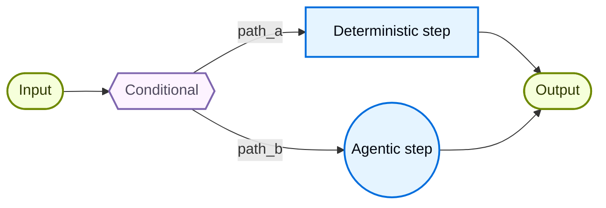
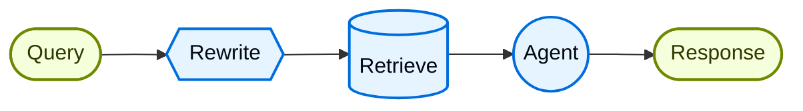

# Workflow tùy chỉnh

Trong kiến trúc **custom workflow**, bạn tự định nghĩa luồng thực thi (execution flow) riêng bằng [LangGraph](https://docs.langchain.com/oss/python/langgraph/overview). Bạn có toàn quyền kiểm soát cấu trúc graph, bao gồm các bước tuần tự, nhánh rẽ có điều kiện, vòng lặp, và thực thi song song.



## Đặc điểm chính

* Toàn quyền kiểm soát cấu trúc graph
* Kết hợp logic tất định (deterministic) với hành vi agentic
* Hỗ trợ các bước tuần tự, nhánh rẽ có điều kiện, vòng lặp, và thực thi song song
* Nhúng các pattern khác dưới dạng node trong workflow của bạn

## Khi nào nên dùng

Sử dụng custom workflow khi các pattern tiêu chuẩn (subagent, skill, v.v.) không phù hợp với yêu cầu của bạn, khi bạn cần kết hợp logic tất định với hành vi agentic, hoặc khi use case của bạn đòi hỏi định tuyến (routing) phức tạp hay xử lý nhiều giai đoạn (multi-stage).

Mỗi node trong workflow của bạn có thể là một hàm đơn giản, một lệnh gọi LLM, hoặc toàn bộ một [agent](https://docs.langchain.com/oss/python/langchain/agents) với [tool](https://docs.langchain.com/oss/python/langchain/tools). Bạn cũng có thể kết hợp các kiến trúc khác bên trong một custom workflow, chẳng hạn như nhúng một hệ thống multi-agent làm một node duy nhất.

Để xem một ví dụ đầy đủ về custom workflow, hãy xem tutorial bên dưới.

**[Tutorial: Xây dựng knowledge base đa nguồn với routing](https://docs.langchain.com/oss/python/langchain/multi-agent/router-knowledge-base)**
[Router pattern](router.md) là một ví dụ về custom workflow. Tutorial này hướng dẫn xây dựng một router truy vấn GitHub, Notion, và Slack song song, sau đó tổng hợp (synthesize) kết quả.

## Triển khai cơ bản

Điểm mấu chốt (core insight) là bạn có thể gọi trực tiếp một agent LangChain bên trong bất kỳ node LangGraph nào, kết hợp tính linh hoạt của custom workflow với sự tiện lợi của các agent dựng sẵn (prebuilt):

```python
from langchain.agents import create_agent
from langgraph.graph import StateGraph, START, END

agent = create_agent(model="openai:gpt-5.5", tools=[...])

def agent_node(state: State) -> dict:
    """Một node LangGraph gọi một agent LangChain."""
    result = agent.invoke({
        "messages": [{"role": "user", "content": state["query"]}]
    })
    return {"answer": result["messages"][-1].content}

# Xây dựng một workflow đơn giản
workflow = (
    StateGraph(State)
    .add_node("agent", agent_node)
    .add_edge(START, "agent")
    .add_edge("agent", END)
    .compile()
)
```

## Ví dụ: Pipeline RAG

Một use case phổ biến là kết hợp [retrieval](https://docs.langchain.com/oss/python/deepagents/retrieval) với một agent. Ví dụ này xây dựng một assistant thống kê WNBA, truy xuất (retrieve) từ knowledge base và có thể lấy tin tức trực tiếp (live news).

**Custom RAG workflow**

Workflow này minh họa ba loại node:

* **Model node** (Rewrite): Viết lại (rewrite) query của người dùng để retrieval tốt hơn, sử dụng [structured output](https://docs.langchain.com/oss/python/langchain/structured-output).
* **Deterministic node** (Retrieve): Thực hiện tìm kiếm tương đồng vector (vector similarity search), không có LLM tham gia.
* **Agent node** (Agent): Suy luận (reason) dựa trên context đã truy xuất và có thể lấy thêm thông tin qua tool.



!!! tip "Mẹo"
    Bạn có thể dùng LangGraph state để truyền thông tin giữa các bước của workflow. Điều này cho phép mỗi phần trong workflow đọc và cập nhật các field có cấu trúc, giúp dễ dàng chia sẻ dữ liệu và context giữa các node.

```python
from typing import TypedDict
from pydantic import BaseModel
from langgraph.graph import StateGraph, START, END
from langchain.agents import create_agent
from langchain.tools import tool
from langchain_openai import ChatOpenAI, OpenAIEmbeddings
from langchain_core.vectorstores import InMemoryVectorStore

class State(TypedDict):
    question: str
    rewritten_query: str
    documents: list[str]
    answer: str

# Knowledge base WNBA gồm đội hình, kết quả trận đấu, và thống kê cầu thủ
embeddings = OpenAIEmbeddings()
vector_store = InMemoryVectorStore(embeddings)
vector_store.add_texts([
    # Đội hình
    "New York Liberty 2024 roster: Breanna Stewart, Sabrina Ionescu, Jonquel Jones, Courtney Vandersloot.",
    "Las Vegas Aces 2024 roster: A'ja Wilson, Kelsey Plum, Jackie Young, Chelsea Gray.",
    "Indiana Fever 2024 roster: Caitlin Clark, Aliyah Boston, Kelsey Mitchell, NaLyssa Smith.",
    # Kết quả trận đấu
    "2024 WNBA Finals: New York Liberty defeated Minnesota Lynx 3-2 to win the championship.",
    "June 15, 2024: Indiana Fever 85, Chicago Sky 79. Caitlin Clark had 23 points and 8 assists.",
    "August 20, 2024: Las Vegas Aces 92, Phoenix Mercury 84. A'ja Wilson scored 35 points.",
    # Thống kê cầu thủ
    "A'ja Wilson 2024 season stats: 26.9 PPG, 11.9 RPG, 2.6 BPG. Won MVP award.",
    "Caitlin Clark 2024 rookie stats: 19.2 PPG, 8.4 APG, 5.7 RPG. Won Rookie of the Year.",
    "Breanna Stewart 2024 stats: 20.4 PPG, 8.5 RPG, 3.5 APG.",
])
retriever = vector_store.as_retriever(search_kwargs={"k": 5})

@tool
def get_latest_news(query: str) -> str:
    """Lấy tin tức và cập nhật mới nhất về WNBA."""
    # API tin tức của bạn ở đây
    return "Latest: The WNBA announced expanded playoff format for 2025..."

agent = create_agent(
    model="openai:gpt-5.5",
    tools=[get_latest_news],
)

model = ChatOpenAI(model="gpt-5.5")

class RewrittenQuery(BaseModel):
    query: str

def rewrite_query(state: State) -> dict:
    """Viết lại query của người dùng để retrieval tốt hơn."""
    system_prompt = """Rewrite this query to retrieve relevant WNBA information.
The knowledge base contains: team rosters, game results with scores, and player statistics (PPG, RPG, APG).
Focus on specific player names, team names, or stat categories mentioned."""
    response = model.with_structured_output(RewrittenQuery).invoke([
        {"role": "system", "content": system_prompt},
        {"role": "user", "content": state["question"]}
    ])
    return {"rewritten_query": response.query}

def retrieve(state: State) -> dict:
    """Truy xuất tài liệu dựa trên query đã viết lại."""
    docs = retriever.invoke(state["rewritten_query"])
    return {"documents": [doc.page_content for doc in docs]}

def call_agent(state: State) -> dict:
    """Tạo câu trả lời sử dụng context đã truy xuất."""
    context = "\n\n".join(state["documents"])
    prompt = f"Context:\n{context}\n\nQuestion: {state['question']}"
    response = agent.invoke({"messages": [{"role": "user", "content": prompt}]})
    return {"answer": response["messages"][-1].content_blocks}

workflow = (
    StateGraph(State)
    .add_node("rewrite", rewrite_query)
    .add_node("retrieve", retrieve)
    .add_node("agent", call_agent)
    .add_edge(START, "rewrite")
    .add_edge("rewrite", "retrieve")
    .add_edge("retrieve", "agent")
    .add_edge("agent", END)
    .compile()
)

result = workflow.invoke({"question": "Who won the 2024 WNBA Championship?"})
print(result["answer"])
```

!!! info "Thông tin"
    Trong môi trường production, hãy sử dụng một vector store bền vững (persistent) như [Valkey](https://docs.langchain.com/oss/python/integrations/vectorstores/valkey), [Databricks Vector Search](https://docs.langchain.com/oss/python/integrations/vectorstores/databricks_vector_search), hoặc [MongoDB Atlas](https://docs.langchain.com/oss/python/integrations/vectorstores/mongodb_atlas) thay vì `InMemoryVectorStore`. Xem [tất cả vector store](https://docs.langchain.com/oss/python/integrations/vectorstores).

---

[Kết nối tài liệu này](https://docs.langchain.com/use-these-docs) với Claude, VSCode, và nhiều công cụ khác qua MCP để nhận câu trả lời theo thời gian thực.

[Chỉnh sửa trang này trên GitHub](https://github.com/langchain-ai/docs/edit/main/src/oss/langchain/multi-agent/custom-workflow.mdx) hoặc [báo lỗi (file an issue)](https://github.com/langchain-ai/docs/issues/new/choose).
