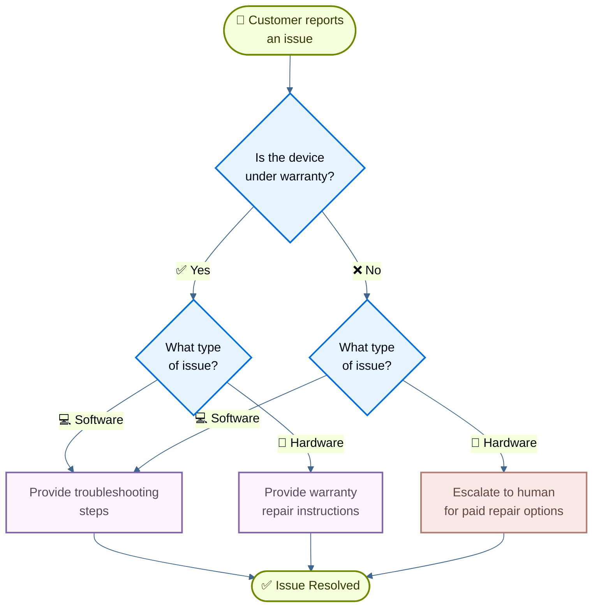

# Xây dựng hỗ trợ khách hàng bằng handoffs

[State machine pattern](handoffs.md) mô tả các workflow trong đó hành vi của agent thay đổi khi nó di chuyển qua các state khác nhau của một tác vụ. Hướng dẫn này trình bày cách triển khai một state machine bằng cách dùng tool call để thay đổi động cấu hình của một agent duy nhất: cập nhật các tool khả dụng và instruction dựa trên state hiện tại. State có thể được xác định từ nhiều nguồn: các hành động trước đó của agent (tool call), state bên ngoài (chẳng hạn kết quả gọi API), hoặc thậm chí là input ban đầu của người dùng (ví dụ, bằng cách chạy một classifier để xác định ý định của người dùng).

Trong hướng dẫn này, bạn sẽ xây dựng một agent hỗ trợ khách hàng thực hiện các việc sau:

* Thu thập thông tin bảo hành trước khi tiếp tục.
* Phân loại vấn đề là phần cứng hay phần mềm.
* Đưa ra giải pháp hoặc escalate (chuyển tiếp) lên hỗ trợ từ con người.
* Duy trì conversation state xuyên suốt nhiều turn.

Khác với [subagents pattern](https://docs.langchain.com/oss/python/langchain/multi-agent/subagents-personal-assistant), nơi các sub-agent được gọi như tool, **state machine pattern** sử dụng một agent duy nhất có cấu hình thay đổi dựa trên tiến trình của workflow. Mỗi "step" chỉ đơn giản là một cấu hình khác nhau (system prompt + tools) của cùng một agent nền tảng, được chọn động dựa trên state.

Đây là workflow mà chúng ta sẽ xây dựng:



## Thiết lập

### Cài đặt

Hướng dẫn này yêu cầu package `langchain`:

=== "pip"

    ```bash
    pip install langchain
    ```

=== "uv"

    ```bash
    uv add langchain
    ```

=== "conda"

    ```bash
    conda install langchain -c conda-forge
    ```

Để biết thêm chi tiết, xem [hướng dẫn cài đặt](../install.md) của chúng tôi.

### LangSmith

Thiết lập [LangSmith](https://smith.langchain.com?utm_source=docs\&utm_medium=cta\&utm_campaign=langsmith-signup\&utm_content=oss-langchain-multi-agent-handoffs-customer-support) để theo dõi những gì đang diễn ra bên trong agent của bạn. Sau đó thiết lập các biến môi trường sau:

=== "Shell"

    ```bash
    export LANGSMITH_TRACING="true"
    export LANGSMITH_API_KEY="..."
    ```

=== "Python"

    ```python
    import getpass
    import os

    os.environ["LANGSMITH_TRACING"] = "true"
    os.environ["LANGSMITH_API_KEY"] = getpass.getpass()
    ```

### Chọn một LLM

Chọn một chat model từ bộ tích hợp của LangChain:

=== "OpenAI"

    👉 Đọc [tài liệu tích hợp mô hình chat OpenAI](https://docs.langchain.com/oss/python/integrations/chat/openai/)

    === "pip"

        ```bash
        pip install -U "langchain[openai]"
        ```

    === "uv"

        ```bash
        uv add "langchain[openai]"
        ```

    === "init_chat_model"

        ```python
        import os
        from langchain.chat_models import init_chat_model

        os.environ["OPENAI_API_KEY"] = "sk-..."

        model = init_chat_model("gpt-5.5")
        ```

    === "Model Class"

        ```python
        import os
        from langchain_openai import ChatOpenAI

        os.environ["OPENAI_API_KEY"] = "sk-..."

        model = ChatOpenAI(model="gpt-5.5")
        ```

=== "Anthropic"

    👉 Đọc [tài liệu tích hợp mô hình chat Anthropic](https://docs.langchain.com/oss/python/integrations/chat/anthropic/)

    === "pip"

        ```bash
        pip install -U "langchain[anthropic]"
        ```

    === "uv"

        ```bash
        uv add "langchain[anthropic]"
        ```

    === "init_chat_model"

        ```python
        import os
        from langchain.chat_models import init_chat_model

        os.environ["ANTHROPIC_API_KEY"] = "sk-..."

        model = init_chat_model("claude-sonnet-4-6")
        ```

    === "Model Class"

        ```python
        import os
        from langchain_anthropic import ChatAnthropic

        os.environ["ANTHROPIC_API_KEY"] = "sk-..."

        model = ChatAnthropic(model="claude-sonnet-4-6")
        ```

=== "Azure"

    👉 Đọc [tài liệu tích hợp mô hình chat Azure](https://docs.langchain.com/oss/python/integrations/chat/azure_chat_openai/)

    === "pip"

        ```bash
        pip install -U "langchain[openai]"
        ```

    === "uv"

        ```bash
        uv add "langchain[openai]"
        ```

    === "init_chat_model"

        ```python
        import os
        from langchain.chat_models import init_chat_model

        os.environ["AZURE_OPENAI_API_KEY"] = "..."
        os.environ["AZURE_OPENAI_ENDPOINT"] = "..."
        os.environ["OPENAI_API_VERSION"] = "2025-03-01-preview"

        model = init_chat_model(
            "azure_openai:gpt-5.5",
            azure_deployment=os.environ["AZURE_OPENAI_DEPLOYMENT_NAME"],
        )
        ```

    === "Model Class"

        ```python
        import os
        from langchain_openai import AzureChatOpenAI

        os.environ["AZURE_OPENAI_API_KEY"] = "..."
        os.environ["AZURE_OPENAI_ENDPOINT"] = "..."
        os.environ["OPENAI_API_VERSION"] = "2025-03-01-preview"

        model = AzureChatOpenAI(
            model="gpt-5.5",
            azure_deployment=os.environ["AZURE_OPENAI_DEPLOYMENT_NAME"]
        )
        ```

=== "Google Gemini"

    👉 Đọc [tài liệu tích hợp mô hình chat Google GenAI](https://docs.langchain.com/oss/python/integrations/chat/google_generative_ai/)

    === "pip"

        ```bash
        pip install -U "langchain[google-genai]"
        ```

    === "uv"

        ```bash
        uv add "langchain[google-genai]"
        ```

    === "init_chat_model"

        ```python
        import os
        from langchain.chat_models import init_chat_model

        os.environ["GOOGLE_API_KEY"] = "..."

        model = init_chat_model("google_genai:gemini-2.5-flash-lite")
        ```

    === "Model Class"

        ```python
        import os
        from langchain_google_genai import ChatGoogleGenerativeAI

        os.environ["GOOGLE_API_KEY"] = "..."

        model = ChatGoogleGenerativeAI(model="gemini-2.5-flash-lite")
        ```

=== "AWS Bedrock"

    👉 Đọc [tài liệu tích hợp mô hình chat AWS Bedrock](https://docs.langchain.com/oss/python/integrations/chat/bedrock/)

    === "pip"

        ```bash
        pip install -U "langchain[aws]"
        ```

    === "uv"

        ```bash
        uv add "langchain[aws]"
        ```

    === "init_chat_model"

        ```python
        from langchain.chat_models import init_chat_model

        # Follow the steps here to configure your credentials:
        # https://docs.aws.amazon.com/bedrock/latest/userguide/getting-started.html

        model = init_chat_model(
            "us.anthropic.claude-sonnet-4-6",
            model_provider="bedrock_converse",
        )
        ```

    === "Model Class"

        ```python
        from langchain_aws import ChatBedrock

        model = ChatBedrock(model="us.anthropic.claude-sonnet-4-6")
        ```

=== "HuggingFace"

    👉 Đọc [tài liệu tích hợp mô hình chat HuggingFace](https://docs.langchain.com/oss/python/integrations/chat/huggingface/)

    === "pip"

        ```bash
        pip install -U "langchain[huggingface]"
        ```

    === "uv"

        ```bash
        uv add "langchain[huggingface]"
        ```

    === "init_chat_model"

        ```python
        import os
        from langchain.chat_models import init_chat_model

        os.environ["HUGGINGFACEHUB_API_TOKEN"] = "hf_..."

        model = init_chat_model(
            "microsoft/Phi-3-mini-4k-instruct",
            model_provider="huggingface",
            temperature=0.7,
            max_tokens=1024,
        )
        ```

    === "Model Class"

        ```python
        import os
        from langchain_huggingface import ChatHuggingFace, HuggingFaceEndpoint

        os.environ["HUGGINGFACEHUB_API_TOKEN"] = "hf_..."

        llm = HuggingFaceEndpoint(
            repo_id="microsoft/Phi-3-mini-4k-instruct",
            temperature=0.7,
            max_length=1024,
        )
        model = ChatHuggingFace(llm=llm)
        ```

=== "OpenRouter"

    👉 Đọc [tài liệu tích hợp mô hình chat OpenRouter](https://docs.langchain.com/oss/python/integrations/chat/openrouter/)

    === "pip"

        ```bash
        pip install -U "langchain-openrouter"
        ```

    === "uv"

        ```bash
        uv add "langchain-openrouter"
        ```

    === "init_chat_model"

        ```python
        import os
        from langchain.chat_models import init_chat_model

        os.environ["OPENROUTER_API_KEY"] = "sk-..."

        model = init_chat_model(
            "auto",
            model_provider="openrouter",
        )
        ```

    === "Model Class"

        ```python
        import os
        from langchain_openrouter import ChatOpenRouter

        os.environ["OPENROUTER_API_KEY"] = "sk-..."

        model = ChatOpenRouter(model="auto")
        ```

## 1. Định nghĩa state tùy chỉnh

Đầu tiên, định nghĩa một state schema tùy chỉnh để theo dõi step nào đang hoạt động:

```python
from langchain.agents import AgentState
from typing_extensions import NotRequired
from typing import Literal

# Define the possible workflow steps
SupportStep = Literal["warranty_collector", "issue_classifier", "resolution_specialist"]  # [!code highlight]

class SupportState(AgentState):  # [!code highlight]
    """State for customer support workflow."""
    current_step: NotRequired[SupportStep]  # [!code highlight]
    warranty_status: NotRequired[Literal["in_warranty", "out_of_warranty"]]
    issue_type: NotRequired[Literal["hardware", "software"]]
```

Trường `current_step` là phần cốt lõi của state machine pattern: nó quyết định cấu hình nào (prompt + tools) sẽ được nạp trong mỗi turn.

## 2. Tạo các tool quản lý workflow state

Tạo các tool cập nhật workflow state. Các tool này cho phép agent ghi nhận thông tin và chuyển sang step tiếp theo.

Điểm mấu chốt là dùng `Command` để cập nhật state, bao gồm cả trường `current_step`:

```python
from langchain.tools import tool, ToolRuntime
from langchain.messages import ToolMessage
from langgraph.types import Command

@tool
def record_warranty_status(
    status: Literal["in_warranty", "out_of_warranty"],
    runtime: ToolRuntime[None, SupportState],
) -> Command:  # [!code highlight]
    """Record the customer's warranty status and transition to issue classification."""
    return Command(  # [!code highlight]
        update={  # [!code highlight]
            "messages": [
                ToolMessage(
                    content=f"Warranty status recorded as: {status}",
                    tool_call_id=runtime.tool_call_id,
                )
            ],
            "warranty_status": status,
            "current_step": "issue_classifier",  # [!code highlight]
        }
    )


@tool
def record_issue_type(
    issue_type: Literal["hardware", "software"],
    runtime: ToolRuntime[None, SupportState],
) -> Command:  # [!code highlight]
    """Record the type of issue and transition to resolution specialist."""
    return Command(  # [!code highlight]
        update={  # [!code highlight]
            "messages": [
                ToolMessage(
                    content=f"Issue type recorded as: {issue_type}",
                    tool_call_id=runtime.tool_call_id,
                )
            ],
            "issue_type": issue_type,
            "current_step": "resolution_specialist",  # [!code highlight]
        }
    )


@tool
def escalate_to_human(reason: str) -> str:
    """Escalate the case to a human support specialist."""
    # In a real system, this would create a ticket, notify staff, etc.
    return f"Escalating to human support. Reason: {reason}"


@tool
def provide_solution(solution: str) -> str:
    """Provide a solution to the customer's issue."""
    return f"Solution provided: {solution}"
```

Hãy để ý cách `record_warranty_status` và `record_issue_type` trả về đối tượng `Command` cập nhật cả dữ liệu (`warranty_status`, `issue_type`) VÀ `current_step`. Đây chính là cách state machine hoạt động: tool điều khiển tiến trình của workflow.

## 3. Định nghĩa cấu hình cho từng step

Định nghĩa prompt và tool cho từng step. Đầu tiên, định nghĩa các prompt cho từng step:

**Xem đầy đủ định nghĩa các prompt**

```python
# Define prompts as constants for easy reference
WARRANTY_COLLECTOR_PROMPT = """You are a customer support agent helping with device issues.

CURRENT STAGE: Warranty verification

At this step, you need to:
1. Greet the customer warmly
2. Ask if their device is under warranty
3. Use record_warranty_status to record their response and move to the next step

Be conversational and friendly. Don't ask multiple questions at once."""

ISSUE_CLASSIFIER_PROMPT = """You are a customer support agent helping with device issues.

CURRENT STAGE: Issue classification
CUSTOMER INFO: Warranty status is {warranty_status}

At this step, you need to:
1. Ask the customer to describe their issue
2. Determine if it's a hardware issue (physical damage, broken parts) or software issue (app crashes, performance)
3. Use record_issue_type to record the classification and move to the next step

If unclear, ask clarifying questions before classifying."""

RESOLUTION_SPECIALIST_PROMPT = """You are a customer support agent helping with device issues.

CURRENT STAGE: Resolution
CUSTOMER INFO: Warranty status is {warranty_status}, issue type is {issue_type}

At this step, you need to:
1. For SOFTWARE issues: provide troubleshooting steps using provide_solution
2. For HARDWARE issues:
   - If IN WARRANTY: explain warranty repair process using provide_solution
   - If OUT OF WARRANTY: escalate_to_human for paid repair options

Be specific and helpful in your solutions."""
```

Sau đó, ánh xạ tên step tới cấu hình tương ứng bằng một dictionary:

```python
# Step configuration: maps step name to (prompt, tools, required_state)
STEP_CONFIG = {
    "warranty_collector": {
        "prompt": WARRANTY_COLLECTOR_PROMPT,
        "tools": [record_warranty_status],
        "requires": [],
    },
    "issue_classifier": {
        "prompt": ISSUE_CLASSIFIER_PROMPT,
        "tools": [record_issue_type],
        "requires": ["warranty_status"],
    },
    "resolution_specialist": {
        "prompt": RESOLUTION_SPECIALIST_PROMPT,
        "tools": [provide_solution, escalate_to_human],
        "requires": ["warranty_status", "issue_type"],
    },
}
```

Cấu hình dựa trên dictionary này giúp việc sau trở nên dễ dàng:

* Nhìn thấy toàn bộ các step chỉ trong một cái nhìn
* Thêm step mới (chỉ cần thêm một entry)
* Hiểu các phụ thuộc của workflow (trường `requires`)
* Dùng prompt template với các biến state (ví dụ: `{warranty_status}`)

## 4. Tạo middleware dựa trên step

Tạo middleware đọc `current_step` từ state và áp dụng cấu hình phù hợp. Chúng ta sẽ dùng decorator `@wrap_model_call` để có một cách triển khai gọn gàng:

```python
from langchain.agents.middleware import wrap_model_call, ModelRequest, ModelResponse
from typing import Callable


@wrap_model_call  # [!code highlight]
def apply_step_config(
    request: ModelRequest,
    handler: Callable[[ModelRequest], ModelResponse],
) -> ModelResponse:
    """Configure agent behavior based on the current step."""
    # Get current step (defaults to warranty_collector for first interaction)
    current_step = request.state.get("current_step", "warranty_collector")  # [!code highlight]

    # Look up step configuration
    stage_config = STEP_CONFIG[current_step]  # [!code highlight]

    # Validate required state exists
    for key in stage_config["requires"]:
        if request.state.get(key) is None:
            raise ValueError(f"{key} must be set before reaching {current_step}")

    # Format prompt with state values (supports {warranty_status}, {issue_type}, etc.)
    system_prompt = stage_config["prompt"].format(**request.state)

    # Inject system prompt and step-specific tools
    request = request.override(  # [!code highlight]
        system_prompt=system_prompt,  # [!code highlight]
        tools=stage_config["tools"],  # [!code highlight]
    )

    return handler(request)
```

Middleware này thực hiện:

1. **Đọc step hiện tại**: Lấy `current_step` từ state (mặc định là "warranty_collector").
2. **Tra cứu cấu hình**: Tìm entry tương ứng trong `STEP_CONFIG`.
3. **Kiểm tra các phụ thuộc**: Đảm bảo các trường state bắt buộc đã tồn tại.
4. **Định dạng prompt**: Chèn các giá trị state vào prompt template.
5. **Áp dụng cấu hình**: Ghi đè system prompt và các tool khả dụng.

Phương thức `request.override()` chính là điểm mấu chốt: nó cho phép chúng ta thay đổi hành vi của agent một cách động dựa trên state, mà không cần tạo các instance agent riêng biệt.

## 5. Tạo agent

Bây giờ hãy tạo agent với middleware dựa trên step và một checkpointer để duy trì state:

```python
from langchain.agents import create_agent
from langgraph.checkpoint.memory import InMemorySaver

# Collect all tools from all step configurations
all_tools = [
    record_warranty_status,
    record_issue_type,
    provide_solution,
    escalate_to_human,
]

# Create the agent with step-based configuration
agent = create_agent(
    model,
    tools=all_tools,
    state_schema=SupportState,  # [!code highlight]
    middleware=[apply_step_config],  # [!code highlight]
    checkpointer=InMemorySaver(),  # [!code highlight]
)
```

!!! note "Ghi chú"
    **Vì sao cần checkpointer?** Checkpointer duy trì state xuyên suốt các turn hội thoại. Nếu không có nó, state `current_step` sẽ bị mất giữa các tin nhắn của người dùng, làm hỏng workflow.

## 6. Kiểm thử workflow

Kiểm thử toàn bộ workflow:

```python
from langchain.messages import HumanMessage
from langchain_core.utils.uuid import uuid7

# Configuration for this conversation thread
thread_id = str(uuid7())
config = {"configurable": {"thread_id": thread_id}}

# Turn 1: Initial message - starts with warranty_collector step
print("=== Turn 1: Warranty Collection ===")
result = agent.invoke(
    {"messages": [HumanMessage("Hi, my phone screen is cracked")]},
    config
)
for msg in result['messages']:
    msg.pretty_print()

# Turn 2: User responds about warranty
print("\n=== Turn 2: Warranty Response ===")
result = agent.invoke(
    {"messages": [HumanMessage("Yes, it's still under warranty")]},
    config
)
for msg in result['messages']:
    msg.pretty_print()
print(f"Current step: {result.get('current_step')}")

# Turn 3: User describes the issue
print("\n=== Turn 3: Issue Description ===")
result = agent.invoke(
    {"messages": [HumanMessage("The screen is physically cracked from dropping it")]},
    config
)
for msg in result['messages']:
    msg.pretty_print()
print(f"Current step: {result.get('current_step')}")

# Turn 4: Resolution
print("\n=== Turn 4: Resolution ===")
result = agent.invoke(
    {"messages": [HumanMessage("What should I do?")]},
    config
)
for msg in result['messages']:
    msg.pretty_print()
```

Luồng dự kiến:

1. **Bước xác minh bảo hành**: Hỏi về tình trạng bảo hành.
2. **Bước phân loại vấn đề**: Hỏi về vấn đề, xác định đó là phần cứng.
3. **Bước giải quyết**: Cung cấp hướng dẫn sửa chữa theo bảo hành.

## 7. Tìm hiểu về state transition

Hãy cùng theo dõi những gì xảy ra ở mỗi turn:

### Turn 1: Tin nhắn ban đầu

```python
{
    "messages": [HumanMessage("Hi, my phone screen is cracked")],
    "current_step": "warranty_collector"  # Default value
}
```

Middleware áp dụng:

* System prompt: `WARRANTY_COLLECTOR_PROMPT`
* Tools: `[record_warranty_status]`

### Turn 2: Sau khi warranty được ghi nhận

Tool call: `record_warranty_status("in_warranty")` trả về:

```python
Command(update={
    "warranty_status": "in_warranty",
    "current_step": "issue_classifier"  # State transition!
})
```

Ở turn tiếp theo, middleware áp dụng:

* System prompt: `ISSUE_CLASSIFIER_PROMPT` (được định dạng với `warranty_status="in_warranty"`)
* Tools: `[record_issue_type]`

### Turn 3: Sau khi issue được phân loại

Tool call: `record_issue_type("hardware")` trả về:

```python
Command(update={
    "issue_type": "hardware",
    "current_step": "resolution_specialist"  # State transition!
})
```

Ở turn tiếp theo, middleware áp dụng:

* System prompt: `RESOLUTION_SPECIALIST_PROMPT` (được định dạng với `warranty_status` và `issue_type`)
* Tools: `[provide_solution, escalate_to_human]`

Điểm mấu chốt: **Tool điều khiển workflow** bằng cách cập nhật `current_step`, còn **middleware phản hồi** bằng cách áp dụng cấu hình phù hợp ở turn tiếp theo.

## 8. Quản lý lịch sử tin nhắn

Khi agent tiến triển qua các step, lịch sử tin nhắn sẽ tăng dần. Dùng [summarization middleware](../short-term-memory.md#summarize-messages) để nén các tin nhắn trước đó trong khi vẫn giữ được ngữ cảnh hội thoại:

```python
from langchain.agents import create_agent
from langchain.agents.middleware import SummarizationMiddleware  # [!code highlight]
from langgraph.checkpoint.memory import InMemorySaver

agent = create_agent(
    model,
    tools=all_tools,
    state_schema=SupportState,
    middleware=[
        apply_step_config,
        SummarizationMiddleware(  # [!code highlight]
            model="gpt-5.4-mini",
            trigger=("tokens", 4000),
            keep=("messages", 10)
        )
    ],
    checkpointer=InMemorySaver(),
)
```

Xem [hướng dẫn về short-term memory](../short-term-memory.md) để biết thêm các kỹ thuật quản lý bộ nhớ khác.

## 9. Thêm tính linh hoạt: Quay lại bước trước

Một số workflow cần cho phép người dùng quay lại các step trước đó để chỉnh sửa thông tin (ví dụ: thay đổi tình trạng bảo hành hoặc phân loại vấn đề). Tuy nhiên, không phải mọi transition đều hợp lý: chẳng hạn, thông thường bạn không thể quay lại sau khi khoản hoàn tiền đã được xử lý. Với workflow hỗ trợ này, chúng ta sẽ thêm các tool để quay lại bước xác minh bảo hành và bước phân loại vấn đề.

!!! tip "Mẹo"
    Nếu workflow của bạn cần các transition tùy ý giữa hầu hết các step, hãy cân nhắc xem bạn có thực sự cần một structured workflow hay không. Pattern này phù hợp nhất khi các step đi theo một trình tự tuần tự rõ ràng, thỉnh thoảng có các transition ngược để chỉnh sửa.

Thêm các tool "quay lại" vào step giải quyết:

```python
@tool
def go_back_to_warranty() -> Command:  # [!code highlight]
    """Go back to warranty verification step."""
    return Command(update={"current_step": "warranty_collector"})  # [!code highlight]


@tool
def go_back_to_classification() -> Command:  # [!code highlight]
    """Go back to issue classification step."""
    return Command(update={"current_step": "issue_classifier"})  # [!code highlight]


# Update the resolution_specialist configuration to include these tools
STEP_CONFIG["resolution_specialist"]["tools"].extend([
    go_back_to_warranty,
    go_back_to_classification
])
```

Cập nhật prompt của resolution specialist để đề cập tới các tool này:

```python
RESOLUTION_SPECIALIST_PROMPT = """You are a customer support agent helping with device issues.

CURRENT STAGE: Resolution
CUSTOMER INFO: Warranty status is {warranty_status}, issue type is {issue_type}

At this step, you need to:
1. For SOFTWARE issues: provide troubleshooting steps using provide_solution
2. For HARDWARE issues:
   - If IN WARRANTY: explain warranty repair process using provide_solution
   - If OUT OF WARRANTY: escalate_to_human for paid repair options

If the customer indicates any information was wrong, use:
- go_back_to_warranty to correct warranty status
- go_back_to_classification to correct issue type

Be specific and helpful in your solutions."""
```

Giờ đây agent có thể xử lý các chỉnh sửa:

```python
result = agent.invoke(
    {"messages": [HumanMessage("Actually, I made a mistake - my device is out of warranty")]},
    config
)
# Agent will call go_back_to_warranty and restart the warranty verification step
```

## Ví dụ đầy đủ

Dưới đây là toàn bộ nội dung được ghép lại thành một script có thể chạy được:

**Mã nguồn đầy đủ**

```python
"""
Customer Support State Machine Example

This example demonstrates the state machine pattern.
A single agent dynamically changes its behavior based on the current_step state,
creating a state machine for sequential information collection.
"""

from langchain_core.utils.uuid import uuid7

from langgraph.checkpoint.memory import InMemorySaver
from langgraph.types import Command
from typing import Callable, Literal
from typing_extensions import NotRequired

from langchain.agents import AgentState, create_agent
from langchain.agents.middleware import wrap_model_call, ModelRequest, ModelResponse, SummarizationMiddleware
from langchain.chat_models import init_chat_model
from langchain.messages import HumanMessage, ToolMessage
from langchain.tools import tool, ToolRuntime

model = init_chat_model("google_genai:gemini-3.6-flash")


# Define the possible workflow steps
SupportStep = Literal["warranty_collector", "issue_classifier", "resolution_specialist"]


class SupportState(AgentState):
    """State for customer support workflow."""

    current_step: NotRequired[SupportStep]
    warranty_status: NotRequired[Literal["in_warranty", "out_of_warranty"]]
    issue_type: NotRequired[Literal["hardware", "software"]]


@tool
def record_warranty_status(
    status: Literal["in_warranty", "out_of_warranty"],
    runtime: ToolRuntime[None, SupportState],
) -> Command:
    """Record the customer's warranty status and transition to issue classification."""
    return Command(
        update={
            "messages": [
                ToolMessage(
                    content=f"Warranty status recorded as: {status}",
                    tool_call_id=runtime.tool_call_id,
                )
            ],
            "warranty_status": status,
            "current_step": "issue_classifier",
        }
    )


@tool
def record_issue_type(
    issue_type: Literal["hardware", "software"],
    runtime: ToolRuntime[None, SupportState],
) -> Command:
    """Record the type of issue and transition to resolution specialist."""
    return Command(
        update={
            "messages": [
                ToolMessage(
                    content=f"Issue type recorded as: {issue_type}",
                    tool_call_id=runtime.tool_call_id,
                )
            ],
            "issue_type": issue_type,
            "current_step": "resolution_specialist",
        }
    )


@tool
def escalate_to_human(reason: str) -> str:
    """Escalate the case to a human support specialist."""
    # In a real system, this would create a ticket, notify staff, etc.
    return f"Escalating to human support. Reason: {reason}"


@tool
def provide_solution(solution: str) -> str:
    """Provide a solution to the customer's issue."""
    return f"Solution provided: {solution}"


# Define prompts as constants
WARRANTY_COLLECTOR_PROMPT = """You are a customer support agent helping with device issues.

CURRENT STEP: Warranty verification

At this step, you need to:
1. Greet the customer warmly
2. Ask if their device is under warranty
3. Use record_warranty_status to record their response and move to the next step

Be conversational and friendly. Don't ask multiple questions at once."""

ISSUE_CLASSIFIER_PROMPT = """You are a customer support agent helping with device issues.

CURRENT STEP: Issue classification
CUSTOMER INFO: Warranty status is {warranty_status}

At this step, you need to:
1. Ask the customer to describe their issue
2. Determine if it's a hardware issue (physical damage, broken parts) or software issue (app crashes, performance)
3. Use record_issue_type to record the classification and move to the next step

If unclear, ask clarifying questions before classifying."""

RESOLUTION_SPECIALIST_PROMPT = """You are a customer support agent helping with device issues.

CURRENT STEP: Resolution
CUSTOMER INFO: Warranty status is {warranty_status}, issue type is {issue_type}

At this step, you need to:
1. For SOFTWARE issues: provide troubleshooting steps using provide_solution
2. For HARDWARE issues:
   - If IN WARRANTY: explain warranty repair process using provide_solution
   - If OUT OF WARRANTY: escalate_to_human for paid repair options

Be specific and helpful in your solutions."""


# Step configuration: maps step name to (prompt, tools, required_state)
STEP_CONFIG = {
    "warranty_collector": {
        "prompt": WARRANTY_COLLECTOR_PROMPT,
        "tools": [record_warranty_status],
        "requires": [],
    },
    "issue_classifier": {
        "prompt": ISSUE_CLASSIFIER_PROMPT,
        "tools": [record_issue_type],
        "requires": ["warranty_status"],
    },
    "resolution_specialist": {
        "prompt": RESOLUTION_SPECIALIST_PROMPT,
        "tools": [provide_solution, escalate_to_human],
        "requires": ["warranty_status", "issue_type"],
    },
}


@wrap_model_call
def apply_step_config(
    request: ModelRequest,
    handler: Callable[[ModelRequest], ModelResponse],
) -> ModelResponse:
    """Configure agent behavior based on the current step."""
    # Get current step (defaults to warranty_collector for first interaction)
    current_step = request.state.get("current_step", "warranty_collector")

    # Look up step configuration
    step_config = STEP_CONFIG[current_step]

    # Validate required state exists
    for key in step_config["requires"]:
        if request.state.get(key) is None:
            raise ValueError(f"{key} must be set before reaching {current_step}")

    # Format prompt with state values
    system_prompt = step_config["prompt"].format(**request.state)

    # Inject system prompt and step-specific tools
    request = request.override(
        system_prompt=system_prompt,
        tools=step_config["tools"],
    )

    return handler(request)


# Collect all tools from all step configurations
all_tools = [
    record_warranty_status,
    record_issue_type,
    provide_solution,
    escalate_to_human,
]

# Create the agent with step-based configuration and summarization
agent = create_agent(
    model,
    tools=all_tools,
    state_schema=SupportState,
    middleware=[
        apply_step_config,
        SummarizationMiddleware(
            model="gpt-5.4-mini",
            trigger=("tokens", 4000),
            keep=("messages", 10)
        )
    ],
    checkpointer=InMemorySaver(),
)


# ============================================================================
# Test the workflow
# ============================================================================

if __name__ == "__main__":
    thread_id = str(uuid7())
    config = {"configurable": {"thread_id": thread_id}}

    result = agent.invoke(
        {"messages": [HumanMessage("Hi, my phone screen is cracked")]},
        config
    )

    result = agent.invoke(
        {"messages": [HumanMessage("Yes, it's still under warranty")]},
        config
    )

    result = agent.invoke(
        {"messages": [HumanMessage("The screen is physically cracked from dropping it")]},
        config
    )

    result = agent.invoke(
        {"messages": [HumanMessage("What should I do?")]},
        config
    )
    for msg in result['messages']:
        msg.pretty_print()
```

## Bước tiếp theo

* Tìm hiểu về [subagents pattern](https://docs.langchain.com/oss/python/langchain/multi-agent/subagents-personal-assistant) để điều phối tập trung
* Khám phá [middleware](https://docs.langchain.com/oss/python/langchain/middleware) để có thêm các hành vi động
* Đọc [tổng quan về multi-agent](https://docs.langchain.com/oss/python/langchain/multi-agent) để so sánh các pattern
* Dùng [LangSmith](https://smith.langchain.com?utm_source=docs\&utm_medium=cta\&utm_campaign=langsmith-signup\&utm_content=oss-langchain-multi-agent-handoffs-customer-support) để debug và giám sát hệ thống multi-agent của bạn

---

[Kết nối các tài liệu này](https://docs.langchain.com/use-these-docs) với Claude, VSCode và nhiều công cụ khác qua MCP để nhận câu trả lời theo thời gian thực.

[Chỉnh sửa trang này trên GitHub](https://github.com/langchain-ai/docs/edit/main/src/oss/langchain/multi-agent/handoffs-customer-support.mdx) hoặc [báo lỗi](https://github.com/langchain-ai/docs/issues/new/choose).
