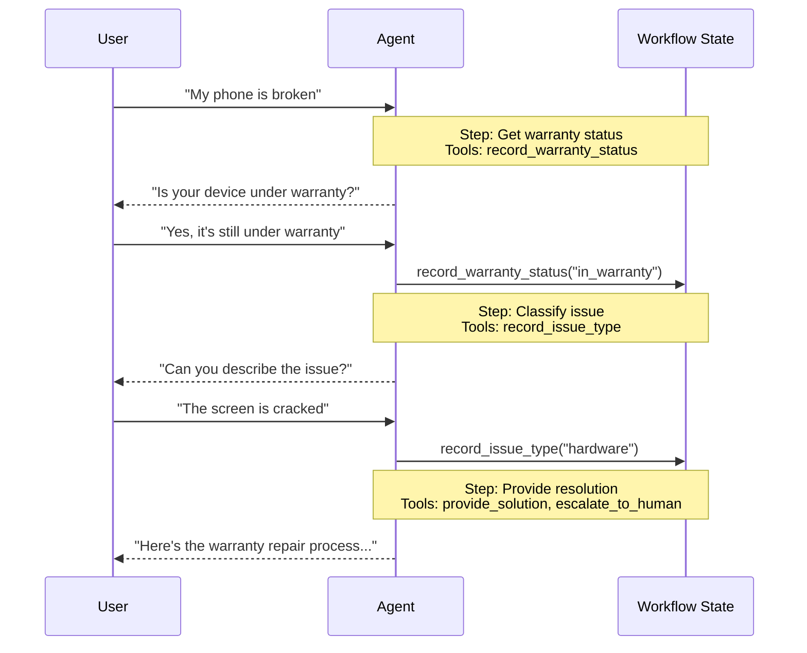

# Handoffs

Trong kiến trúc **handoffs**, hành vi (behavior) thay đổi linh động dựa trên state. Cơ chế cốt lõi: các [tool](https://docs.langchain.com/oss/python/langchain/tools) cập nhật một biến state (ví dụ `current_step` hoặc `active_agent`) được duy trì qua các turn, và hệ thống đọc biến này để điều chỉnh hành vi: hoặc áp dụng cấu hình khác (system prompt, tools), hoặc định tuyến (route) sang một [agent](https://docs.langchain.com/oss/python/langchain/agents) khác. Pattern này hỗ trợ cả việc handoff giữa các agent riêng biệt lẫn việc thay đổi cấu hình linh động trong một agent duy nhất.

!!! tip "Mẹo"
    Thuật ngữ **handoffs** được [OpenAI](https://openai.github.io/openai-agents-python/handoffs/) đặt ra để chỉ việc dùng tool call (ví dụ `transfer_to_sales_agent`) nhằm chuyển quyền điều khiển (control) giữa các agent hoặc các state.



## Đặc điểm chính

* Hành vi điều khiển bởi state (state-driven behavior): Hành vi thay đổi dựa trên một biến state (ví dụ `current_step` hoặc `active_agent`)
* Chuyển trạng thái bằng tool (tool-based transitions): Các tool cập nhật biến state để di chuyển giữa các state
* Tương tác trực tiếp với người dùng: Cấu hình của mỗi state xử lý trực tiếp các message của người dùng
* State bền vững (persistent state): State được duy trì qua các turn hội thoại

## Khi nào nên dùng

Dùng pattern handoffs khi bạn cần áp đặt các ràng buộc tuần tự (sequential constraint) (chỉ mở khoá các khả năng sau khi các điều kiện tiên quyết được đáp ứng), khi agent cần trò chuyện trực tiếp với người dùng qua nhiều state khác nhau, hoặc khi bạn đang xây dựng các luồng hội thoại nhiều giai đoạn (multi-stage). Pattern này đặc biệt hữu ích cho các kịch bản customer support, nơi bạn cần thu thập thông tin theo một trình tự cụ thể: ví dụ, thu thập warranty ID trước khi xử lý hoàn tiền (refund).

## Triển khai cơ bản

Cơ chế cốt lõi là một [tool](https://docs.langchain.com/oss/python/langchain/tools) trả về một [`Command`](https://docs.langchain.com/oss/python/langgraph/graph-api#command) để cập nhật state, kích hoạt việc chuyển sang một step hoặc agent mới:

```python
from langchain.tools import tool
from langchain.messages import ToolMessage
from langgraph.types import Command

@tool
def transfer_to_specialist(runtime) -> Command:
    """Transfer to the specialist agent."""
    return Command(
        update={
            "messages": [
                ToolMessage(  # [!code highlight]
                    content="Transferred to specialist",
                    tool_call_id=runtime.tool_call_id  # [!code highlight]
                )
            ],
            "current_step": "specialist"  # Triggers behavior change
        }
    )
```

!!! note "Ghi chú"
    **Tại sao cần có `ToolMessage`?** Khi một LLM gọi một tool, nó mong đợi một phản hồi (response). `ToolMessage` với `tool_call_id` khớp sẽ hoàn tất chu trình request-response này: nếu thiếu nó, lịch sử hội thoại (conversation history) sẽ bị sai định dạng (malformed). Điều này là bắt buộc bất cứ khi nào tool handoff của bạn cập nhật messages.

Để xem cách triển khai đầy đủ, xem hướng dẫn bên dưới.

**[Hướng dẫn: Xây dựng customer support với handoffs](handoffs-customer-support.md)**

Tìm hiểu cách xây dựng một customer support agent sử dụng pattern handoffs, trong đó một agent duy nhất chuyển đổi giữa các cấu hình khác nhau.

## Các cách triển khai

Có hai cách để triển khai handoffs: **[single agent with middleware](#single-agent-with-middleware)** (một agent duy nhất với cấu hình linh động) hoặc **[multiple agent subgraphs](#multiple-agent-subgraphs)** (các agent riêng biệt dưới dạng các node trong graph).

### Single agent with middleware

Một agent duy nhất thay đổi hành vi của nó dựa trên state. Middleware chặn (intercept) mỗi lần gọi model và điều chỉnh linh động system prompt cùng các tool khả dụng. Các tool cập nhật biến state để kích hoạt việc chuyển đổi (transition):

```python
from langchain.tools import ToolRuntime, tool
from langchain.messages import ToolMessage
from langgraph.types import Command

@tool
def record_warranty_status(
    status: str,
    runtime: ToolRuntime[None, SupportState]
) -> Command:
    """Record warranty status and transition to next step."""
    return Command(
        update={
            "messages": [
                ToolMessage(
                    content=f"Warranty status recorded: {status}",
                    tool_call_id=runtime.tool_call_id
                )
            ],
            "warranty_status": status,
            "current_step": "specialist"  # Update state to trigger transition
        }
    )
```

**Ví dụ đầy đủ: Customer support với middleware**

```python
from langchain.agents import AgentState, create_agent
from langchain.agents.middleware import wrap_model_call, ModelRequest, ModelResponse
from langchain.tools import tool, ToolRuntime
from langchain.messages import ToolMessage
from langgraph.types import Command
from typing import Callable

# 1. Định nghĩa state với bộ theo dõi current_step
class SupportState(AgentState):  # [!code highlight]
    """Track which step is currently active."""
    current_step: str = "triage"  # [!code highlight]
    warranty_status: str | None = None

# 2. Các tool cập nhật current_step thông qua Command
@tool
def record_warranty_status(
    status: str,
    runtime: ToolRuntime[None, SupportState]
) -> Command:  # [!code highlight]
    """Record warranty status and transition to next step."""
    return Command(update={  # [!code highlight]
        "messages": [  # [!code highlight]
            ToolMessage(
                content=f"Warranty status recorded: {status}",
                tool_call_id=runtime.tool_call_id
            )
        ],
        "warranty_status": status,
        # Chuyển sang step tiếp theo
        "current_step": "specialist"    # [!code highlight]
    })

# 3. Middleware áp dụng cấu hình linh động dựa trên current_step
@wrap_model_call  # [!code highlight]
def apply_step_config(
    request: ModelRequest,
    handler: Callable[[ModelRequest], ModelResponse]
) -> ModelResponse:
    """Configure agent behavior based on current_step."""
    step = request.state.get("current_step", "triage")  # [!code highlight]

    # Ánh xạ mỗi step tới cấu hình tương ứng
    configs = {
        "triage": {
            "prompt": "Collect warranty information...",
            "tools": [record_warranty_status]
        },
        "specialist": {
            "prompt": "Provide solutions based on warranty: {warranty_status}",
            "tools": [provide_solution, escalate]
        }
    }

    config = configs[step]
    request = request.override(  # [!code highlight]
        system_prompt=config["prompt"].format(**request.state),  # [!code highlight]
        tools=config["tools"]  # [!code highlight]
    )
    return handler(request)

# 4. Tạo agent kèm middleware
agent = create_agent(
    model,
    tools=[record_warranty_status, provide_solution, escalate],
    state_schema=SupportState,
    middleware=[apply_step_config],  # [!code highlight]
    checkpointer=InMemorySaver()  # Duy trì state qua các turn  # [!code highlight]
)
```

### Multiple agent subgraphs

Nhiều agent riêng biệt tồn tại dưới dạng các node tách biệt trong một graph. Các tool handoff điều hướng giữa các node agent bằng cách dùng `Command.PARENT` để chỉ định node nào sẽ chạy tiếp theo.

!!! warning "Cảnh báo"
    Subgraph handoffs đòi hỏi phải cẩn thận về **[context engineering](https://docs.langchain.com/oss/python/langchain/context-engineering)**. Không như single-agent middleware (nơi lịch sử message tự nhiên trôi chảy), bạn phải quyết định rõ ràng những message nào được truyền giữa các agent. Nếu làm sai, các agent sẽ nhận lịch sử hội thoại bị lỗi định dạng hoặc context quá tải (bloated). Xem [Context engineering](#context-engineering) bên dưới.

```python
from langchain.messages import AIMessage, ToolMessage
from langchain.tools import tool, ToolRuntime
from langgraph.types import Command

@tool
def transfer_to_sales(
    runtime: ToolRuntime,
) -> Command:
    """Transfer to the sales agent."""
    last_ai_message = next(  # [!code highlight]
        msg for msg in reversed(runtime.state["messages"]) if isinstance(msg, AIMessage)  # [!code highlight]
    )  # [!code highlight]
    transfer_message = ToolMessage(  # [!code highlight]
        content="Transferred to sales agent",  # [!code highlight]
        tool_call_id=runtime.tool_call_id,  # [!code highlight]
    )  # [!code highlight]
    return Command(
        goto="sales_agent",
        update={
            "active_agent": "sales_agent",
            "messages": [last_ai_message, transfer_message],  # [!code highlight]
        },
        graph=Command.PARENT
    )
```

**Ví dụ đầy đủ: Sales và support với handoffs**

Ví dụ này minh hoạ một hệ thống multi-agent gồm các agent sales và support riêng biệt. Mỗi agent là một node graph riêng, và các tool handoff cho phép các agent chuyển giao hội thoại cho nhau.

```python
from typing import Literal

from langchain.agents import AgentState, create_agent
from langchain.messages import AIMessage, ToolMessage
from langchain.tools import tool, ToolRuntime
from langgraph.graph import StateGraph, START, END
from langgraph.types import Command
from typing_extensions import NotRequired


# 1. Định nghĩa state với bộ theo dõi active_agent
class MultiAgentState(AgentState):
    active_agent: NotRequired[str]


# 2. Tạo các tool handoff
@tool
def transfer_to_sales(
    runtime: ToolRuntime,
) -> Command:
    """Transfer to the sales agent."""
    last_ai_message = next(  # [!code highlight]
        msg for msg in reversed(runtime.state["messages"]) if isinstance(msg, AIMessage)  # [!code highlight]
    )  # [!code highlight]
    transfer_message = ToolMessage(  # [!code highlight]
        content="Transferred to sales agent from support agent",  # [!code highlight]
        tool_call_id=runtime.tool_call_id,  # [!code highlight]
    )  # [!code highlight]
    return Command(
        goto="sales_agent",
        update={
            "active_agent": "sales_agent",
            "messages": [last_ai_message, transfer_message],  # [!code highlight]
        },
        graph=Command.PARENT,
    )


@tool
def transfer_to_support(
    runtime: ToolRuntime,
) -> Command:
    """Transfer to the support agent."""
    last_ai_message = next(  # [!code highlight]
        msg for msg in reversed(runtime.state["messages"]) if isinstance(msg, AIMessage)  # [!code highlight]
    )  # [!code highlight]
    transfer_message = ToolMessage(  # [!code highlight]
        content="Transferred to support agent from sales agent",  # [!code highlight]
        tool_call_id=runtime.tool_call_id,  # [!code highlight]
    )  # [!code highlight]
    return Command(
        goto="support_agent",
        update={
            "active_agent": "support_agent",
            "messages": [last_ai_message, transfer_message],  # [!code highlight]
        },
        graph=Command.PARENT,
    )


# 3. Tạo các agent kèm tool handoff
sales_agent = create_agent(
    model="google_genai:gemini-3.6-flash",
    tools=[transfer_to_support],
    system_prompt="You are a sales agent. Help with sales inquiries. If asked about technical issues or support, transfer to the support agent.",
)

support_agent = create_agent(
    model="google_genai:gemini-3.6-flash",
    tools=[transfer_to_sales],
    system_prompt="You are a support agent. Help with technical issues. If asked about pricing or purchasing, transfer to the sales agent.",
)


# 4. Tạo các agent node để gọi các agent
def call_sales_agent(state: MultiAgentState) -> Command:
    """Node that calls the sales agent."""
    response = sales_agent.invoke(state)
    return response


def call_support_agent(state: MultiAgentState) -> Command:
    """Node that calls the support agent."""
    response = support_agent.invoke(state)
    return response


# 5. Tạo router kiểm tra xem nên kết thúc hay tiếp tục
def route_after_agent(
    state: MultiAgentState,
) -> Literal["sales_agent", "support_agent", "__end__"]:
    """Route based on active_agent, or END if the agent finished without handoff."""
    messages = state.get("messages", [])

    # Kiểm tra message cuối cùng - nếu là AIMessage không có tool call, ta đã xong
    if messages:
        last_msg = messages[-1]
        if isinstance(last_msg, AIMessage) and not last_msg.tool_calls:  # [!code highlight]
            return "__end__"  # [!code highlight]

    # Nếu không, route tới agent đang active
    active = state.get("active_agent", "sales_agent")
    return active if active else "sales_agent"


def route_initial(
    state: MultiAgentState,
) -> Literal["sales_agent", "support_agent"]:
    """Route to the active agent based on state, default to sales agent."""
    return state.get("active_agent") or "sales_agent"


# 6. Xây dựng graph
builder = StateGraph(MultiAgentState)
builder.add_node("sales_agent", call_sales_agent)
builder.add_node("support_agent", call_support_agent)

# Bắt đầu với routing có điều kiện dựa trên active_agent ban đầu
builder.add_conditional_edges(START, route_initial, ["sales_agent", "support_agent"])

# Sau mỗi agent, kiểm tra xem nên kết thúc hay route sang agent khác
builder.add_conditional_edges(
    "sales_agent", route_after_agent, ["sales_agent", "support_agent", END]
)
builder.add_conditional_edges(
    "support_agent", route_after_agent, ["sales_agent", "support_agent", END]
)

graph = builder.compile()
result = graph.invoke(
    {
        "messages": [
            {
                "role": "user",
                "content": "Hi, I'm having trouble with my account login. Can you help?",
            }
        ]
    }
)

for msg in result["messages"]:
    msg.pretty_print()
```

!!! tip "Mẹo"
    Dùng **single agent với middleware** cho hầu hết các use case handoffs: cách này đơn giản hơn. Chỉ dùng **multiple agent subgraphs** khi bạn cần các cách triển khai agent tuỳ biến riêng (ví dụ một node mà bản thân nó là một graph phức tạp với các bước reflection hoặc retrieval).

#### Context engineering

Với subgraph handoffs, bạn kiểm soát chính xác những message nào được truyền giữa các agent. Sự chính xác này rất cần thiết để duy trì lịch sử hội thoại hợp lệ và tránh context bị phình to (bloat) khiến các agent phía sau (downstream) bị nhầm lẫn. Để biết thêm về chủ đề này, xem [context engineering](https://docs.langchain.com/oss/python/langchain/context-engineering).

**Xử lý context trong quá trình handoff**

Khi handoff giữa các agent, bạn cần đảm bảo lịch sử hội thoại vẫn hợp lệ. LLM luôn mong đợi các tool call được ghép cặp (paired) với response tương ứng, vì vậy khi dùng `Command.PARENT` để handoff sang một agent khác, bạn phải bao gồm cả hai:

1. **`AIMessage` chứa tool call** (message đã kích hoạt việc handoff)
2. **Một `ToolMessage` xác nhận việc handoff** (response nhân tạo cho tool call đó)

Nếu thiếu sự ghép cặp này, agent nhận sẽ thấy một hội thoại không đầy đủ và có thể tạo ra lỗi hoặc hành vi không mong muốn.

Ví dụ dưới đây giả định chỉ có tool handoff được gọi (không có parallel tool call):

```python
@tool
def transfer_to_sales(runtime: ToolRuntime) -> Command:
    # Lấy AI message đã kích hoạt handoff này
    last_ai_message = runtime.state["messages"][-1]

    # Tạo một tool response nhân tạo để hoàn tất cặp ghép
    transfer_message = ToolMessage(
        content="Transferred to sales agent",
        tool_call_id=runtime.tool_call_id,
    )

    return Command(
        goto="sales_agent",
        update={
            "active_agent": "sales_agent",
            # Chỉ truyền hai message này, không truyền toàn bộ lịch sử của subagent
            "messages": [last_ai_message, transfer_message],
        },
        graph=Command.PARENT,
    )
```

!!! note "Ghi chú"
    **Tại sao không truyền toàn bộ message của subagent?** Mặc dù bạn có thể đưa toàn bộ hội thoại của subagent vào handoff, cách này thường gây ra vấn đề. Agent nhận có thể bị rối bởi các bước suy luận (reasoning) nội bộ không liên quan, và chi phí token tăng lên không cần thiết. Bằng cách chỉ truyền cặp handoff, bạn giữ cho context của parent graph tập trung vào việc điều phối (coordination) ở mức cao. Nếu agent nhận cần thêm context, hãy cân nhắc tóm tắt (summarize) công việc của subagent trong nội dung `ToolMessage` thay vì truyền nguyên lịch sử message.

**Trả quyền điều khiển lại cho người dùng**

Khi trả quyền điều khiển lại cho người dùng (kết thúc turn của agent), hãy đảm bảo message cuối cùng là một `AIMessage`. Điều này giúp duy trì lịch sử hội thoại hợp lệ và báo hiệu cho giao diện người dùng rằng agent đã hoàn tất công việc.

## Cân nhắc khi triển khai

Khi thiết kế hệ thống multi-agent của bạn, hãy cân nhắc:

* **Chiến lược lọc context (context filtering strategy)**: Mỗi agent sẽ nhận toàn bộ lịch sử hội thoại, các phần đã lọc, hay các bản tóm tắt? Các agent khác nhau có thể cần context khác nhau tuỳ theo vai trò của chúng.
* **Ngữ nghĩa của tool (tool semantics)**: Làm rõ liệu các tool handoff chỉ cập nhật routing state hay còn thực hiện các side effect khác. Ví dụ, `transfer_to_sales()` có nên đồng thời tạo một support ticket không, hay đó nên là một hành động riêng?
* **Hiệu quả sử dụng token (token efficiency)**: Cân bằng giữa mức độ đầy đủ của context và chi phí token. Việc tóm tắt (summarization) và truyền context có chọn lọc trở nên quan trọng hơn khi hội thoại càng dài.

***

[Kết nối các tài liệu này](https://docs.langchain.com/use-these-docs) với Claude, VSCode, và nhiều công cụ khác qua MCP để có câu trả lời theo thời gian thực.

[Chỉnh sửa trang này trên GitHub](https://github.com/langchain-ai/docs/edit/main/src/oss/langchain/multi-agent/handoffs.mdx) hoặc [báo lỗi](https://github.com/langchain-ai/docs/issues/new/choose).
