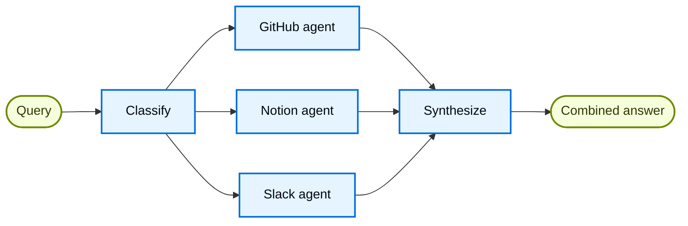

# Xây dựng một knowledge base đa nguồn với routing

## Tổng quan

**Pattern router** là một kiến trúc [multi-agent](index.md), trong đó một bước routing sẽ phân loại input và điều hướng nó tới các agent chuyên biệt, kết quả sau đó được tổng hợp thành một response gộp. Pattern này phát huy tác dụng tốt khi kiến thức của tổ chức bạn nằm rải rác trên nhiều **vertical** riêng biệt (các domain kiến thức tách biệt, mỗi domain cần một agent riêng với tool và prompt chuyên biệt).

Trong hướng dẫn này, bạn sẽ xây dựng một router knowledge base đa nguồn, minh họa các lợi ích này qua một kịch bản doanh nghiệp thực tế. Hệ thống sẽ điều phối ba chuyên gia:

* Một **GitHub agent** tìm kiếm code, issue, và pull request.
* Một **Notion agent** tìm kiếm tài liệu nội bộ và wiki.
* Một **Slack agent** tìm kiếm các thread và cuộc thảo luận liên quan.

Khi người dùng hỏi "How do I authenticate API requests?", router sẽ phân rã câu hỏi thành các câu hỏi con theo từng nguồn, route chúng tới các agent liên quan song song, rồi tổng hợp kết quả thành một câu trả lời mạch lạc.



### Vì sao dùng router?

Pattern router mang lại một số lợi ích:

* **Thực thi song song**: Truy vấn nhiều nguồn cùng lúc, giảm độ trễ so với cách tiếp cận tuần tự.
* **Agent chuyên biệt**: Mỗi vertical có tool và prompt tập trung, được tối ưu cho domain của nó.
* **Routing có chọn lọc**: Không phải câu hỏi nào cũng cần mọi nguồn, router sẽ chọn lọc thông minh các vertical liên quan.
* **Câu hỏi con có mục tiêu rõ ràng**: Mỗi agent nhận một câu hỏi được tùy chỉnh riêng cho domain của nó, giúp cải thiện chất lượng kết quả.
* **Tổng hợp gọn gàng**: Kết quả từ nhiều nguồn được kết hợp thành một response duy nhất, mạch lạc.

### Khái niệm

Chúng ta sẽ tìm hiểu các khái niệm sau:

* [Hệ thống multi-agent](index.md)
* [StateGraph](https://docs.langchain.com/oss/python/langgraph/graph-api) để điều phối workflow
* [Send API](https://docs.langchain.com/oss/python/langgraph/graph-api#send) để thực thi song song

!!! tip "Mẹo"
    **Router so với Subagents**: [Pattern subagents](subagents.md) cũng có thể route tới nhiều agent. Dùng pattern router khi bạn cần tiền xử lý chuyên biệt, logic routing tùy chỉnh, hoặc muốn kiểm soát tường minh việc thực thi song song. Dùng pattern subagents khi bạn muốn LLM tự quyết định gọi agent nào một cách động.

## Thiết lập

### Cài đặt

Hướng dẫn này yêu cầu các package `langchain` và `langgraph`:

=== "pip"
    ```bash
    pip install langchain langgraph
    ```

=== "uv"
    ```bash
    uv add langchain langgraph
    ```

=== "conda"
    ```bash
    conda install langchain langgraph -c conda-forge
    ```

Để biết thêm chi tiết, xem [hướng dẫn cài đặt](../install.md) của chúng tôi.

### LangSmith

Thiết lập [LangSmith](https://smith.langchain.com?utm_source=docs&utm_medium=cta&utm_campaign=langsmith-signup&utm_content=oss-langchain-multi-agent-router-knowledge-base) để kiểm tra những gì đang diễn ra bên trong agent của bạn. Sau đó thiết lập các biến môi trường sau:

=== "Shell"
    ```bash
    export LANGSMITH_TRACING="true"
    export LANGSMITH_API_KEY="..."
    ```

=== "Python"
    ```python
    import getpass
    import os

    os.environ["LANGSMITH_TRACING"] = "true"
    os.environ["LANGSMITH_API_KEY"] = getpass.getpass()
    ```

### Chọn một LLM

Chọn một chat model từ bộ tích hợp của LangChain:

=== "OpenAI"
    👉 Đọc [tài liệu tích hợp OpenAI chat model](https://docs.langchain.com/oss/python/integrations/chat/openai/)

    === "pip"
        ```bash
        pip install -U "langchain[openai]"
        ```

    === "uv"
        ```bash
        uv add "langchain[openai]"
        ```

    === "init_chat_model"
        ```python
        import os
        from langchain.chat_models import init_chat_model

        os.environ["OPENAI_API_KEY"] = "sk-..."

        model = init_chat_model("gpt-5.5")
        ```

    === "Model Class"
        ```python
        import os
        from langchain_openai import ChatOpenAI

        os.environ["OPENAI_API_KEY"] = "sk-..."

        model = ChatOpenAI(model="gpt-5.5")
        ```

=== "Anthropic"
    👉 Đọc [tài liệu tích hợp Anthropic chat model](https://docs.langchain.com/oss/python/integrations/chat/anthropic/)

    === "pip"
        ```bash
        pip install -U "langchain[anthropic]"
        ```

    === "uv"
        ```bash
        uv add "langchain[anthropic]"
        ```

    === "init_chat_model"
        ```python
        import os
        from langchain.chat_models import init_chat_model

        os.environ["ANTHROPIC_API_KEY"] = "sk-..."

        model = init_chat_model("claude-sonnet-4-6")
        ```

    === "Model Class"
        ```python
        import os
        from langchain_anthropic import ChatAnthropic

        os.environ["ANTHROPIC_API_KEY"] = "sk-..."

        model = ChatAnthropic(model="claude-sonnet-4-6")
        ```

=== "Azure"
    👉 Đọc [tài liệu tích hợp Azure chat model](https://docs.langchain.com/oss/python/integrations/chat/azure_chat_openai/)

    === "pip"
        ```bash
        pip install -U "langchain[openai]"
        ```

    === "uv"
        ```bash
        uv add "langchain[openai]"
        ```

    === "init_chat_model"
        ```python
        import os
        from langchain.chat_models import init_chat_model

        os.environ["AZURE_OPENAI_API_KEY"] = "..."
        os.environ["AZURE_OPENAI_ENDPOINT"] = "..."
        os.environ["OPENAI_API_VERSION"] = "2025-03-01-preview"

        model = init_chat_model(
            "azure_openai:gpt-5.5",
            azure_deployment=os.environ["AZURE_OPENAI_DEPLOYMENT_NAME"],
        )
        ```

    === "Model Class"
        ```python
        import os
        from langchain_openai import AzureChatOpenAI

        os.environ["AZURE_OPENAI_API_KEY"] = "..."
        os.environ["AZURE_OPENAI_ENDPOINT"] = "..."
        os.environ["OPENAI_API_VERSION"] = "2025-03-01-preview"

        model = AzureChatOpenAI(
            model="gpt-5.5",
            azure_deployment=os.environ["AZURE_OPENAI_DEPLOYMENT_NAME"]
        )
        ```

=== "Google Gemini"
    👉 Đọc [tài liệu tích hợp Google GenAI chat model](https://docs.langchain.com/oss/python/integrations/chat/google_generative_ai/)

    === "pip"
        ```bash
        pip install -U "langchain[google-genai]"
        ```

    === "uv"
        ```bash
        uv add "langchain[google-genai]"
        ```

    === "init_chat_model"
        ```python
        import os
        from langchain.chat_models import init_chat_model

        os.environ["GOOGLE_API_KEY"] = "..."

        model = init_chat_model("google_genai:gemini-2.5-flash-lite")
        ```

    === "Model Class"
        ```python
        import os
        from langchain_google_genai import ChatGoogleGenerativeAI

        os.environ["GOOGLE_API_KEY"] = "..."

        model = ChatGoogleGenerativeAI(model="gemini-2.5-flash-lite")
        ```

=== "AWS Bedrock"
    👉 Đọc [tài liệu tích hợp AWS Bedrock chat model](https://docs.langchain.com/oss/python/integrations/chat/bedrock/)

    === "pip"
        ```bash
        pip install -U "langchain[aws]"
        ```

    === "uv"
        ```bash
        uv add "langchain[aws]"
        ```

    === "init_chat_model"
        ```python
        from langchain.chat_models import init_chat_model

        # Làm theo các bước tại đây để cấu hình credential:
        # https://docs.aws.amazon.com/bedrock/latest/userguide/getting-started.html

        model = init_chat_model(
            "us.anthropic.claude-sonnet-4-6",
            model_provider="bedrock_converse",
        )
        ```

    === "Model Class"
        ```python
        from langchain_aws import ChatBedrock

        model = ChatBedrock(model="us.anthropic.claude-sonnet-4-6")
        ```

=== "HuggingFace"
    👉 Đọc [tài liệu tích hợp HuggingFace chat model](https://docs.langchain.com/oss/python/integrations/chat/huggingface/)

    === "pip"
        ```bash
        pip install -U "langchain[huggingface]"
        ```

    === "uv"
        ```bash
        uv add "langchain[huggingface]"
        ```

    === "init_chat_model"
        ```python
        import os
        from langchain.chat_models import init_chat_model

        os.environ["HUGGINGFACEHUB_API_TOKEN"] = "hf_..."

        model = init_chat_model(
            "microsoft/Phi-3-mini-4k-instruct",
            model_provider="huggingface",
            temperature=0.7,
            max_tokens=1024,
        )
        ```

    === "Model Class"
        ```python
        import os
        from langchain_huggingface import ChatHuggingFace, HuggingFaceEndpoint

        os.environ["HUGGINGFACEHUB_API_TOKEN"] = "hf_..."

        llm = HuggingFaceEndpoint(
            repo_id="microsoft/Phi-3-mini-4k-instruct",
            temperature=0.7,
            max_length=1024,
        )
        model = ChatHuggingFace(llm=llm)
        ```

=== "OpenRouter"
    👉 Đọc [tài liệu tích hợp OpenRouter chat model](https://docs.langchain.com/oss/python/integrations/chat/openrouter/)

    === "pip"
        ```bash
        pip install -U "langchain-openrouter"
        ```

    === "uv"
        ```bash
        uv add "langchain-openrouter"
        ```

    === "init_chat_model"
        ```python
        import os
        from langchain.chat_models import init_chat_model

        os.environ["OPENROUTER_API_KEY"] = "sk-..."

        model = init_chat_model(
            "auto",
            model_provider="openrouter",
        )
        ```

    === "Model Class"
        ```python
        import os
        from langchain_openrouter import ChatOpenRouter

        os.environ["OPENROUTER_API_KEY"] = "sk-..."

        model = ChatOpenRouter(model="auto")
        ```

## 1. Định nghĩa state

Đầu tiên, định nghĩa các state schema. Chúng ta dùng ba kiểu:

* **`AgentInput`**: State đơn giản được truyền cho mỗi subagent (chỉ gồm một query)
* **`AgentOutput`**: Kết quả trả về từ mỗi subagent (tên nguồn + kết quả)
* **`RouterState`**: State chính của workflow, theo dõi query, các classification, kết quả, và câu trả lời cuối cùng

```python
from typing import Annotated, Literal, TypedDict
import operator


class AgentInput(TypedDict):
    """Simple input state for each subagent."""
    query: str


class AgentOutput(TypedDict):
    """Output from each subagent."""
    source: str
    result: str


class Classification(TypedDict):
    """A single routing decision: which agent to call with what query."""
    source: Literal["github", "notion", "slack"]
    query: str


class RouterState(TypedDict):
    query: str
    classifications: list[Classification]
    results: Annotated[list[AgentOutput], operator.add]  # Reducer thu thập kết quả song song
    final_answer: str
```

Trường `results` dùng một **reducer** (`operator.add` trong Python, hàm concat trong JS) để gom output từ các lần thực thi agent song song vào một list duy nhất.

## 2. Định nghĩa tool cho từng vertical

Tạo tool cho mỗi domain kiến thức. Trong một hệ thống production, các tool này sẽ gọi API thực. Trong hướng dẫn này, chúng ta dùng cài đặt giả lập (stub) trả về dữ liệu mock. Chúng ta định nghĩa 7 tool trên 3 vertical: GitHub (search code, issue, PR), Notion (search doc, get page), và Slack (search message, get thread).

```python
from langchain.tools import tool


@tool
def search_code(query: str, repo: str = "main") -> str:
    """Search code in GitHub repositories."""
    return f"Found code matching '{query}' in {repo}: authentication middleware in src/auth.py"


@tool
def search_issues(query: str) -> str:
    """Search GitHub issues and pull requests."""
    return f"Found 3 issues matching '{query}': #142 (API auth docs), #89 (OAuth flow), #203 (token refresh)"


@tool
def search_prs(query: str) -> str:
    """Search pull requests for implementation details."""
    return f"PR #156 added JWT authentication, PR #178 updated OAuth scopes"


@tool
def search_notion(query: str) -> str:
    """Search Notion workspace for documentation."""
    return f"Found documentation: 'API Authentication Guide' - covers OAuth2 flow, API keys, and JWT tokens"


@tool
def get_page(page_id: str) -> str:
    """Get a specific Notion page by ID."""
    return f"Page content: Step-by-step authentication setup instructions"


@tool
def search_slack(query: str) -> str:
    """Search Slack messages and threads."""
    return f"Found discussion in #engineering: 'Use Bearer tokens for API auth, see docs for refresh flow'"


@tool
def get_thread(thread_id: str) -> str:
    """Get a specific Slack thread."""
    return f"Thread discusses best practices for API key rotation"
```

## 3. Tạo các agent chuyên biệt

Tạo một agent cho mỗi vertical. Mỗi agent có tool đặc thù cho domain và một prompt được tối ưu cho nguồn kiến thức của nó. Cả ba đều theo cùng một pattern, chỉ khác nhau ở tool và system prompt.

```python
from langchain.agents import create_agent
from langchain.chat_models import init_chat_model

model = init_chat_model("openai:gpt-5.5")

github_agent = create_agent(
    model,
    tools=[search_code, search_issues, search_prs],
    system_prompt=(
        "You are a GitHub expert. Answer questions about code, "
        "API references, and implementation details by searching "
        "repositories, issues, and pull requests."
    ),
)

notion_agent = create_agent(
    model,
    tools=[search_notion, get_page],
    system_prompt=(
        "You are a Notion expert. Answer questions about internal "
        "processes, policies, and team documentation by searching "
        "the organization's Notion workspace."
    ),
)

slack_agent = create_agent(
    model,
    tools=[search_slack, get_thread],
    system_prompt=(
        "You are a Slack expert. Answer questions by searching "
        "relevant threads and discussions where team members have "
        "shared knowledge and solutions."
    ),
)
```

## 4. Xây dựng router workflow

Bây giờ hãy xây dựng router workflow bằng một `StateGraph`. Workflow gồm bốn bước chính:

1. **Classify**: Phân tích query và xác định gọi agent nào với câu hỏi con nào
2. **Route**: Fan-out tới các agent đã chọn song song, dùng `Send`
3. **Query agents**: Mỗi agent nhận một `AgentInput` đơn giản và trả về một `AgentOutput`
4. **Synthesize**: Kết hợp các kết quả đã thu thập thành một response mạch lạc

```python
from pydantic import BaseModel, Field
from langgraph.graph import StateGraph, START, END
from langgraph.types import Send

router_llm = init_chat_model("openai:gpt-5.4-mini")


# Định nghĩa structured output schema cho classifier
class ClassificationResult(BaseModel):  # [!code highlight]
    """Result of classifying a user query into agent-specific sub-questions."""
    classifications: list[Classification] = Field(
        description="List of agents to invoke with their targeted sub-questions"
    )


def classify_query(state: RouterState) -> dict:
    """Classify query and determine which agents to invoke."""
    structured_llm = router_llm.with_structured_output(ClassificationResult)  # [!code highlight]

    result = structured_llm.invoke([
        {
            "role": "system",
            "content": """Analyze this query and determine which knowledge bases to consult.
For each relevant source, generate a targeted sub-question optimized for that source.

Available sources:
- github: Code, API references, implementation details, issues, pull requests
- notion: Internal documentation, processes, policies, team wikis
- slack: Team discussions, informal knowledge sharing, recent conversations

Return ONLY the sources that are relevant to the query. Each source should have
a targeted sub-question optimized for that specific knowledge domain.

Example for "How do I authenticate API requests?":
- github: "What authentication code exists? Search for auth middleware, JWT handling"
- notion: "What authentication documentation exists? Look for API auth guides"
(slack omitted because it's not relevant for this technical question)"""
        },
        {"role": "user", "content": state["query"]}
    ])

    return {"classifications": result.classifications}


def route_to_agents(state: RouterState) -> list[Send]:
    """Fan out to agents based on classifications."""
    return [
        Send(c["source"], {"query": c["query"]})  # [!code highlight]
        for c in state["classifications"]
    ]


def query_github(state: AgentInput) -> dict:
    """Query the GitHub agent."""
    result = github_agent.invoke({
        "messages": [{"role": "user", "content": state["query"]}]  # [!code highlight]
    })
    return {"results": [{"source": "github", "result": result["messages"][-1].content}]}


def query_notion(state: AgentInput) -> dict:
    """Query the Notion agent."""
    result = notion_agent.invoke({
        "messages": [{"role": "user", "content": state["query"]}]  # [!code highlight]
    })
    return {"results": [{"source": "notion", "result": result["messages"][-1].content}]}


def query_slack(state: AgentInput) -> dict:
    """Query the Slack agent."""
    result = slack_agent.invoke({
        "messages": [{"role": "user", "content": state["query"]}]  # [!code highlight]
    })
    return {"results": [{"source": "slack", "result": result["messages"][-1].content}]}


def synthesize_results(state: RouterState) -> dict:
    """Combine results from all agents into a coherent answer."""
    if not state["results"]:
        return {"final_answer": "No results found from any knowledge source."}

    # Định dạng kết quả để tổng hợp
    formatted = [
        f"**From {r['source'].title()}:**\n{r['result']}"
        for r in state["results"]
    ]

    synthesis_response = router_llm.invoke([
        {
            "role": "system",
            "content": f"""Synthesize these search results to answer the original question: "{state['query']}"

- Combine information from multiple sources without redundancy
- Highlight the most relevant and actionable information
- Note any discrepancies between sources
- Keep the response concise and well-organized"""
        },
        {"role": "user", "content": "\n\n".join(formatted)}
    ])

    return {"final_answer": synthesis_response.content}
```

## 5. Biên dịch (compile) workflow

Bây giờ hãy lắp ráp workflow bằng cách nối các node với edge. Điểm mấu chốt là dùng `add_conditional_edges` với hàm routing để cho phép thực thi song song:

```python
workflow = (
    StateGraph(RouterState)
    .add_node("classify", classify_query)
    .add_node("github", query_github)
    .add_node("notion", query_notion)
    .add_node("slack", query_slack)
    .add_node("synthesize", synthesize_results)
    .add_edge(START, "classify")
    .add_conditional_edges("classify", route_to_agents, ["github", "notion", "slack"])
    .add_edge("github", "synthesize")
    .add_edge("notion", "synthesize")
    .add_edge("slack", "synthesize")
    .add_edge("synthesize", END)
    .compile()
)
```

Lệnh gọi `add_conditional_edges` nối node classify với các node agent thông qua hàm `route_to_agents`. Khi `route_to_agents` trả về nhiều object `Send`, các node đó sẽ thực thi song song.

## 6. Dùng router

Thử router của bạn với các query trải rộng trên nhiều domain kiến thức:

```python
result = workflow.invoke({
    "query": "How do I authenticate API requests?"
})

print("Original query:", result["query"])
print("\nClassifications:")
for c in result["classifications"]:
    print(f"  {c['source']}: {c['query']}")
print("\n" + "=" * 60 + "\n")
print("Final Answer:")
print(result["final_answer"])
```

Output kỳ vọng:

```
Original query: How do I authenticate API requests?

Classifications:
  github: What authentication code exists? Search for auth middleware, JWT handling
  notion: What authentication documentation exists? Look for API auth guides

============================================================

Final Answer:
To authenticate API requests, you have several options:

1. **JWT Tokens**: The recommended approach for most use cases.
   Implementation details are in `src/auth.py` (PR #156).

2. **OAuth2 Flow**: For third-party integrations, follow the OAuth2
   flow documented in Notion's 'API Authentication Guide'.

3. **API Keys**: For server-to-server communication, use Bearer tokens
   in the Authorization header.

For token refresh handling, see issue #203 and PR #178 for the latest
OAuth scope updates.
```

Router đã phân tích query, phân loại để xác định gọi agent nào (GitHub và Notion, nhưng không gọi Slack cho câu hỏi kỹ thuật này), gọi cả hai agent song song, và tổng hợp kết quả thành một câu trả lời mạch lạc.

## 7. Hiểu về kiến trúc

Router workflow tuân theo một pattern rõ ràng:

### Giai đoạn classification (phân loại)

Hàm `classify_query` dùng **structured output** để phân tích query của người dùng và xác định gọi agent nào. Đây chính là nơi "trí thông minh" routing nằm ở đó:

* Dùng một Pydantic model (Python) hoặc Zod schema (JS) để đảm bảo output hợp lệ
* Trả về một list các object `Classification`, mỗi object gồm một `source` và `query` có mục tiêu rõ ràng
* Chỉ bao gồm các nguồn liên quan, các nguồn không liên quan đơn giản là bị bỏ qua

Cách tiếp cận có cấu trúc này đáng tin cậy hơn việc parse JSON tự do, và làm cho logic routing trở nên tường minh.

### Thực thi song song với Send

Hàm `route_to_agents` ánh xạ các classification thành các object `Send`. Mỗi `Send` chỉ định node đích và state cần truyền:

```python
# Classifications: [{"source": "github", "query": "..."}, {"source": "notion", "query": "..."}]
# Trở thành:
[Send("github", {"query": "..."}), Send("notion", {"query": "..."})]
# Cả hai agent thực thi đồng thời, mỗi agent chỉ nhận query mà nó cần
```

Mỗi node agent nhận một `AgentInput` đơn giản chỉ gồm trường `query`, không phải toàn bộ router state. Điều này giữ cho interface gọn gàng và tường minh.

### Thu thập kết quả bằng reducer

Kết quả agent chảy về state chính thông qua một **reducer**. Mỗi agent trả về:

```python
{"results": [{"source": "github", "result": "..."}]}
```

Reducer (`operator.add` trong Python) sẽ nối các list này lại, gom toàn bộ kết quả song song vào `state["results"]`.

### Giai đoạn synthesis (tổng hợp)

Sau khi tất cả agent hoàn thành, hàm `synthesize_results` sẽ duyệt qua các kết quả đã thu thập:

* Chờ tất cả các nhánh song song hoàn thành (LangGraph tự động xử lý việc này)
* Tham chiếu tới query gốc để đảm bảo câu trả lời giải quyết đúng điều người dùng hỏi
* Kết hợp thông tin từ tất cả các nguồn mà không lặp lại

!!! note "Ghi chú"
    **Kết quả một phần**: Trong hướng dẫn này, tất cả agent đã chọn đều phải hoàn thành trước khi bước synthesis diễn ra.

## 8. Ví dụ hoàn chỉnh

Dưới đây là toàn bộ ví dụ gộp lại trong một script có thể chạy được:

**Xem toàn bộ code**

```python
"""
Multi-Source Knowledge Router Example

This example demonstrates the router pattern for multi-agent systems.
A router classifies queries, routes them to specialized agents in parallel,
and synthesizes results into a combined response.
"""

import operator
from typing import Annotated, Literal, TypedDict

from langchain.agents import create_agent
from langchain.chat_models import init_chat_model
from langchain.tools import tool
from langgraph.graph import StateGraph, START, END
from langgraph.types import Send
from pydantic import BaseModel, Field


# Định nghĩa state
class AgentInput(TypedDict):
    """Simple input state for each subagent."""
    query: str


class AgentOutput(TypedDict):
    """Output from each subagent."""
    source: str
    result: str


class Classification(TypedDict):
    """A single routing decision: which agent to call with what query."""
    source: Literal["github", "notion", "slack"]
    query: str


class RouterState(TypedDict):
    query: str
    classifications: list[Classification]
    results: Annotated[list[AgentOutput], operator.add]
    final_answer: str


# Structured output schema cho classifier
class ClassificationResult(BaseModel):
    """Result of classifying a user query into agent-specific sub-questions."""
    classifications: list[Classification] = Field(
        description="List of agents to invoke with their targeted sub-questions"
    )


# Tools
@tool
def search_code(query: str, repo: str = "main") -> str:
    """Search code in GitHub repositories."""
    return f"Found code matching '{query}' in {repo}: authentication middleware in src/auth.py"


@tool
def search_issues(query: str) -> str:
    """Search GitHub issues and pull requests."""
    return f"Found 3 issues matching '{query}': #142 (API auth docs), #89 (OAuth flow), #203 (token refresh)"


@tool
def search_prs(query: str) -> str:
    """Search pull requests for implementation details."""
    return f"PR #156 added JWT authentication, PR #178 updated OAuth scopes"


@tool
def search_notion(query: str) -> str:
    """Search Notion workspace for documentation."""
    return f"Found documentation: 'API Authentication Guide' - covers OAuth2 flow, API keys, and JWT tokens"


@tool
def get_page(page_id: str) -> str:
    """Get a specific Notion page by ID."""
    return f"Page content: Step-by-step authentication setup instructions"


@tool
def search_slack(query: str) -> str:
    """Search Slack messages and threads."""
    return f"Found discussion in #engineering: 'Use Bearer tokens for API auth, see docs for refresh flow'"


@tool
def get_thread(thread_id: str) -> str:
    """Get a specific Slack thread."""
    return f"Thread discusses best practices for API key rotation"


# Models và agents
model = init_chat_model("openai:gpt-5.5")
router_llm = init_chat_model("openai:gpt-5.4-mini")

github_agent = create_agent(
    model,
    tools=[search_code, search_issues, search_prs],
    system_prompt=(
        "You are a GitHub expert. Answer questions about code, "
        "API references, and implementation details by searching "
        "repositories, issues, and pull requests."
    ),
)

notion_agent = create_agent(
    model,
    tools=[search_notion, get_page],
    system_prompt=(
        "You are a Notion expert. Answer questions about internal "
        "processes, policies, and team documentation by searching "
        "the organization's Notion workspace."
    ),
)

slack_agent = create_agent(
    model,
    tools=[search_slack, get_thread],
    system_prompt=(
        "You are a Slack expert. Answer questions by searching "
        "relevant threads and discussions where team members have "
        "shared knowledge and solutions."
    ),
)


# Workflow nodes
def classify_query(state: RouterState) -> dict:
    """Classify query and determine which agents to invoke."""
    structured_llm = router_llm.with_structured_output(ClassificationResult)

    result = structured_llm.invoke([
        {
            "role": "system",
            "content": """Analyze this query and determine which knowledge bases to consult.
For each relevant source, generate a targeted sub-question optimized for that source.

Available sources:
- github: Code, API references, implementation details, issues, pull requests
- notion: Internal documentation, processes, policies, team wikis
- slack: Team discussions, informal knowledge sharing, recent conversations

Return ONLY the sources that are relevant to the query."""
        },
        {"role": "user", "content": state["query"]}
    ])

    return {"classifications": result.classifications}


def route_to_agents(state: RouterState) -> list[Send]:
    """Fan out to agents based on classifications."""
    return [
        Send(c["source"], {"query": c["query"]})
        for c in state["classifications"]
    ]


def query_github(state: AgentInput) -> dict:
    """Query the GitHub agent."""
    result = github_agent.invoke({
        "messages": [{"role": "user", "content": state["query"]}]
    })
    return {"results": [{"source": "github", "result": result["messages"][-1].content}]}


def query_notion(state: AgentInput) -> dict:
    """Query the Notion agent."""
    result = notion_agent.invoke({
        "messages": [{"role": "user", "content": state["query"]}]
    })
    return {"results": [{"source": "notion", "result": result["messages"][-1].content}]}


def query_slack(state: AgentInput) -> dict:
    """Query the Slack agent."""
    result = slack_agent.invoke({
        "messages": [{"role": "user", "content": state["query"]}]
    })
    return {"results": [{"source": "slack", "result": result["messages"][-1].content}]}


def synthesize_results(state: RouterState) -> dict:
    """Combine results from all agents into a coherent answer."""
    if not state["results"]:
        return {"final_answer": "No results found from any knowledge source."}

    formatted = [
        f"**From {r['source'].title()}:**\n{r['result']}"
        for r in state["results"]
    ]

    synthesis_response = router_llm.invoke([
        {
            "role": "system",
            "content": f"""Synthesize these search results to answer the original question: "{state['query']}"

- Combine information from multiple sources without redundancy
- Highlight the most relevant and actionable information
- Note any discrepancies between sources
- Keep the response concise and well-organized"""
        },
        {"role": "user", "content": "\n\n".join(formatted)}
    ])

    return {"final_answer": synthesis_response.content}


# Xây dựng workflow
workflow = (
    StateGraph(RouterState)
    .add_node("classify", classify_query)
    .add_node("github", query_github)
    .add_node("notion", query_notion)
    .add_node("slack", query_slack)
    .add_node("synthesize", synthesize_results)
    .add_edge(START, "classify")
    .add_conditional_edges("classify", route_to_agents, ["github", "notion", "slack"])
    .add_edge("github", "synthesize")
    .add_edge("notion", "synthesize")
    .add_edge("slack", "synthesize")
    .add_edge("synthesize", END)
    .compile()
)


if __name__ == "__main__":
    result = workflow.invoke({
        "query": "How do I authenticate API requests?"
    })

    print("Original query:", result["query"])
    print("\nClassifications:")
    for c in result["classifications"]:
        print(f"  {c['source']}: {c['query']}")
    print("\n" + "=" * 60 + "\n")
    print("Final Answer:")
    print(result["final_answer"])
```

## 9. Nâng cao: Router có lưu trạng thái (stateful)

Router chúng ta đã xây dựng cho tới nay là **stateless** (mỗi request được xử lý độc lập, không có bộ nhớ giữa các lần gọi). Với hội thoại nhiều lượt, bạn cần một cách tiếp cận **stateful**.

### Cách tiếp cận bọc router thành tool

Cách đơn giản nhất để thêm bộ nhớ hội thoại là bọc router stateless thành một tool mà một conversational agent có thể gọi:

```python
from langgraph.checkpoint.memory import InMemorySaver


@tool
def search_knowledge_base(query: str) -> str:
    """Search across multiple knowledge sources (GitHub, Notion, Slack).

    Use this to find information about code, documentation, or team discussions.
    """
    result = workflow.invoke({"query": query})
    return result["final_answer"]


conversational_agent = create_agent(
    model,
    tools=[search_knowledge_base],
    system_prompt=(
        "You are a helpful assistant that answers questions about our organization. "
        "Use the search_knowledge_base tool to find information across our code, "
        "documentation, and team discussions."
    ),
    checkpointer=InMemorySaver(),
)
```

Cách này giữ router stateless trong khi conversational agent xử lý bộ nhớ và context. Người dùng có thể trò chuyện nhiều lượt, và agent sẽ gọi tool router khi cần.

```python
config = {"configurable": {"thread_id": "user-123"}}

result = conversational_agent.invoke(
    {"messages": [{"role": "user", "content": "How do I authenticate API requests?"}]},
    config
)
print(result["messages"][-1].content)

result = conversational_agent.invoke(
    {"messages": [{"role": "user", "content": "What about rate limiting for those endpoints?"}]},
    config
)
print(result["messages"][-1].content)
```

!!! tip "Mẹo"
    Cách tiếp cận bọc router thành tool được khuyến nghị cho hầu hết các use case. Nó mang lại sự phân tách rõ ràng: router xử lý truy vấn đa nguồn, còn conversational agent xử lý context và bộ nhớ.

### Cách tiếp cận lưu trạng thái đầy đủ (full persistence)

Nếu bạn cần bản thân router duy trì state, ví dụ để dùng kết quả tìm kiếm trước đó cho quyết định routing, hãy dùng [persistence](../short-term-memory.md) để lưu lịch sử message ở cấp router.

!!! warning "Cảnh báo"
    **Router stateful làm tăng độ phức tạp.** Khi route tới các agent khác nhau qua nhiều lượt, hội thoại có thể cảm giác thiếu nhất quán nếu các agent có tone hoặc prompt khác nhau. Cân nhắc dùng [pattern handoffs](handoffs.md) hoặc [pattern subagents](subagents.md) thay thế, cả hai đều có ngữ nghĩa rõ ràng hơn cho hội thoại nhiều lượt với các agent khác nhau.

## 10. Những điểm chính cần nhớ

Pattern router phát huy tác dụng tốt khi bạn có:

* **Vertical riêng biệt**: Các domain kiến thức tách biệt, mỗi domain cần tool và prompt chuyên biệt
* **Nhu cầu truy vấn song song**: Các câu hỏi hưởng lợi từ việc truy vấn nhiều nguồn cùng lúc
* **Yêu cầu tổng hợp**: Kết quả từ nhiều nguồn cần được kết hợp thành một response mạch lạc

Pattern này có ba giai đoạn: **decompose** (phân tích query và sinh câu hỏi con có mục tiêu rõ ràng), **route** (thực thi query song song), và **synthesize** (kết hợp kết quả).

!!! tip "Mẹo"
    **Khi nào nên dùng pattern router**

    Dùng pattern router khi bạn có nhiều nguồn kiến thức độc lập, cần truy vấn song song với độ trễ thấp, và muốn kiểm soát tường minh logic routing.

    Với các trường hợp đơn giản hơn cần lựa chọn tool động, cân nhắc [pattern subagents](subagents.md). Với các workflow nơi agent cần trò chuyện tuần tự với người dùng, cân nhắc [handoffs](handoffs.md).

## Bước tiếp theo

* Tìm hiểu về [handoffs](handoffs.md) cho hội thoại giữa các agent
* Khám phá [pattern subagents](subagents-personal-assistant.md) để điều phối tập trung
* Đọc [tổng quan multi-agent](index.md) để so sánh các pattern khác nhau
* Dùng [LangSmith](https://smith.langchain.com?utm_source=docs&utm_medium=cta&utm_campaign=langsmith-signup&utm_content=oss-langchain-multi-agent-router-knowledge-base) để debug và giám sát router của bạn
