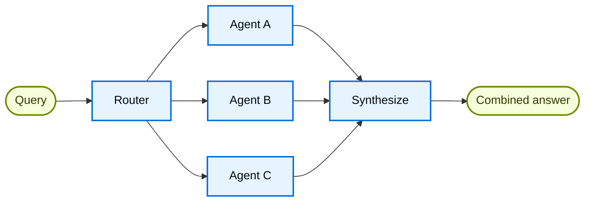

# Router

Trong kiến trúc **router**, một bước routing sẽ phân loại input và điều hướng nó đến các [agent](/oss/python/langchain/agents) chuyên biệt. Kiến trúc này hữu ích khi bạn có nhiều **vertical** riêng biệt (các domain kiến thức tách biệt, mỗi domain cần một agent riêng).



## Đặc điểm chính

* Router phân rã (decompose) query
* Không, một, hoặc nhiều agent chuyên biệt được gọi song song (parallel)
* Kết quả được tổng hợp (synthesize) thành một response mạch lạc

## Khi nào nên dùng

Dùng pattern router khi bạn có các vertical riêng biệt (domain kiến thức tách biệt, mỗi domain cần agent riêng), cần truy vấn nhiều nguồn song song, và muốn tổng hợp kết quả thành một response gộp.

## Cách triển khai cơ bản

Router phân loại query và điều hướng nó đến (các) agent phù hợp. Dùng [`Command`](/oss/python/langgraph/graph-api#command) để routing tới một agent duy nhất, hoặc [`Send`](/oss/python/langgraph/graph-api#send) để fan-out song song tới nhiều agent.

=== "Một agent (single agent)"
    Dùng `Command` để route tới một agent chuyên biệt duy nhất:

    ```python
    from langgraph.types import Command

    def classify_query(query: str) -> str:
        """Use LLM to classify query and determine the appropriate agent."""
        # Logic phân loại ở đây
        ...

    def route_query(state: State) -> Command:
        """Route to the appropriate agent based on query classification."""
        active_agent = classify_query(state["query"])

        # Route tới agent đã chọn
        return Command(goto=active_agent)
    ```

=== "Nhiều agent (song song)"
    Dùng `Send` để fan-out tới nhiều agent chuyên biệt cùng lúc:

    ```python
    from typing import TypedDict
    from langgraph.types import Send

    class ClassificationResult(TypedDict):
        query: str
        agent: str

    def classify_query(query: str) -> list[ClassificationResult]:
        """Use LLM to classify query and determine which agents to invoke."""
        # Logic phân loại ở đây
        ...

    def route_query(state: State):
        """Route to relevant agents based on query classification."""
        classifications = classify_query(state["query"])

        # Fan-out tới các agent đã chọn, chạy song song
        return [
            Send(c["agent"], {"query": c["query"]})
            for c in classifications
        ]
    ```

Để xem ví dụ triển khai đầy đủ, tham khảo tutorial bên dưới.

**Tutorial: Xây dựng knowledge base đa nguồn với routing** ([xem chi tiết](/oss/python/langchain/multi-agent/router-knowledge-base))
Xây dựng một router truy vấn song song GitHub, Notion, và Slack, sau đó tổng hợp kết quả thành một câu trả lời mạch lạc. Bao gồm định nghĩa state, các agent chuyên biệt, thực thi song song bằng `Send`, và tổng hợp kết quả.

## Stateless và stateful

Có hai cách tiếp cận:

* [**Router không lưu trạng thái (stateless)**](#stateless): xử lý mỗi request độc lập
* [**Router có lưu trạng thái (stateful)**](#stateful): duy trì lịch sử hội thoại qua nhiều request

## Stateless

Mỗi request được route độc lập, không có bộ nhớ giữa các lần gọi. Với hội thoại nhiều lượt (multi-turn), xem phần [Router stateful](#stateful).

!!! tip "Mẹo"
    **Router so với Subagents**: Cả hai pattern đều có thể phân phối công việc cho nhiều agent, nhưng khác nhau ở cách ra quyết định routing:

    * **Router**: một bước routing riêng biệt (thường là một lệnh gọi LLM hoặc logic rule-based) phân loại input và điều hướng tới agent. Bản thân router thường không lưu lịch sử hội thoại hay điều phối nhiều lượt, nó chỉ là một bước tiền xử lý (preprocessing).
    * **Subagents**: một supervisor agent chính sẽ chủ động quyết định gọi [subagent](/oss/python/langchain/multi-agent/subagents) nào như một phần của hội thoại đang diễn ra. Agent chính duy trì context, có thể gọi nhiều subagent qua nhiều lượt, và điều phối các workflow phức tạp nhiều bước.

    Dùng **router** khi bạn có các nhóm input rõ ràng và muốn phân loại tất định (deterministic) hoặc nhẹ (lightweight). Dùng **supervisor** khi cần điều phối linh hoạt, có nhận biết hội thoại (conversation-aware), nơi LLM tự quyết định bước tiếp theo dựa trên context đang thay đổi.

## Stateful

Với hội thoại nhiều lượt, bạn cần duy trì context qua nhiều lần gọi.

### Bọc router thành tool (tool wrapper)

Cách đơn giản nhất: bọc router stateless thành một tool mà một conversational agent có thể gọi. Conversational agent xử lý bộ nhớ và context; router vẫn giữ stateless. Cách này tránh được sự phức tạp của việc quản lý lịch sử hội thoại giữa nhiều agent chạy song song.

```python
@tool
def search_docs(query: str) -> str:
    """Search across multiple documentation sources."""
    result = workflow.invoke({"query": query})
    return result["final_answer"]

# Conversational agent dùng router như một tool
conversational_agent = create_agent(
    model,
    tools=[search_docs],
    prompt="You are a helpful assistant. Use search_docs to answer questions."
)
```

### Lưu trạng thái đầy đủ (full persistence)

Nếu bạn cần bản thân router duy trì state, dùng cơ chế [persistence](/oss/python/langchain/short-term-memory) để lưu lịch sử message. Khi route tới một agent, lấy các message trước đó từ state và chọn lọc đưa vào context của agent, đây là một đòn bẩy (lever) cho [context engineering](/oss/python/langchain/context-engineering).

!!! warning "Cảnh báo"
    **Router stateful cần tự quản lý lịch sử.** Nếu router chuyển đổi giữa các agent qua nhiều lượt, hội thoại có thể không mượt với người dùng cuối khi các agent có tone hoặc prompt khác nhau. Với cách gọi song song, bạn sẽ cần duy trì lịch sử ở cấp router (input và output đã tổng hợp) và tận dụng lịch sử này trong logic routing. Cân nhắc dùng [pattern handoffs](/oss/python/langchain/multi-agent/handoffs) hoặc [pattern subagents](/oss/python/langchain/multi-agent/subagents) thay thế, cả hai đều có ngữ nghĩa rõ ràng hơn cho hội thoại nhiều lượt.
