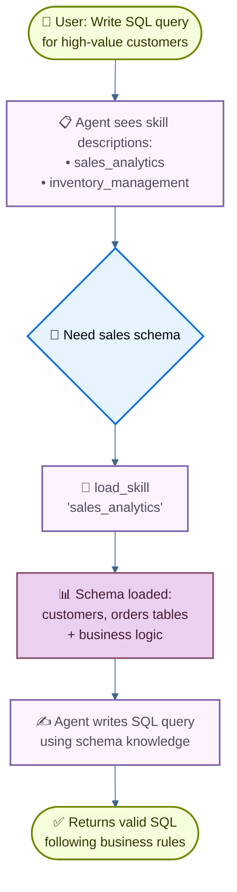

# Xây dựng trợ lý SQL với skill tải theo yêu cầu

Hướng dẫn này trình bày cách sử dụng **progressive disclosure** (kỹ thuật quản lý ngữ cảnh trong đó agent chỉ tải thông tin khi cần thay vì tải sẵn từ đầu) để triển khai **skill** (các chỉ dẫn chuyên biệt dựa trên prompt). Agent tải skill thông qua tool call, thay vì thay đổi động system prompt, chỉ khám phá và tải những skill cần thiết cho từng tác vụ.

**Trường hợp sử dụng:** Hãy tưởng tượng bạn đang xây dựng một agent giúp viết truy vấn SQL cho nhiều mảng nghiệp vụ khác nhau trong một doanh nghiệp lớn. Tổ chức của bạn có thể có datastore riêng cho từng mảng nghiệp vụ, hoặc một cơ sở dữ liệu nguyên khối duy nhất với hàng nghìn bảng. Dù theo cách nào, việc tải tất cả schema ngay từ đầu sẽ làm quá tải context window. Progressive disclosure giải quyết vấn đề này bằng cách chỉ tải schema liên quan khi cần thiết. Kiến trúc này còn cho phép các product owner và stakeholder khác nhau đóng góp và duy trì skill cho mảng nghiệp vụ riêng của họ một cách độc lập.

**Bạn sẽ xây dựng gì:** Một trợ lý truy vấn SQL với hai skill (phân tích bán hàng và quản lý tồn kho). Agent nhìn thấy các mô tả skill gọn nhẹ trong system prompt, sau đó chỉ tải đầy đủ schema cơ sở dữ liệu và business logic thông qua tool call khi liên quan đến truy vấn của người dùng.

!!! note "Ghi chú"
    Để xem ví dụ đầy đủ về một SQL agent có thực thi truy vấn, tự sửa lỗi và xác thực, xem [hướng dẫn SQL Agent](../sql-agent.md) của chúng tôi. Hướng dẫn này tập trung vào mẫu progressive disclosure, có thể áp dụng cho bất kỳ lĩnh vực nào.

!!! tip "Mẹo"
    Progressive disclosure được Anthropic phổ biến như một kỹ thuật xây dựng hệ thống skill có khả năng mở rộng cho agent. Cách tiếp cận này sử dụng kiến trúc ba tầng (metadata → nội dung cốt lõi → tài nguyên chi tiết), trong đó agent chỉ tải thông tin khi cần. Để tìm hiểu thêm về kỹ thuật này, xem [Equipping agents for the real world with Agent Skills](https://www.anthropic.com/engineering/equipping-agents-for-the-real-world-with-agent-skills).

## Cách hoạt động

Dưới đây là luồng xử lý khi người dùng yêu cầu một truy vấn SQL:



**Tại sao dùng progressive disclosure:**

* **Giảm mức sử dụng context**: chỉ tải 2 đến 3 skill cần thiết cho một tác vụ, không tải toàn bộ skill có sẵn
* **Cho phép các đội hoạt động độc lập**: các đội khác nhau có thể phát triển skill chuyên biệt một cách độc lập (tương tự các kiến trúc multi-agent khác)
* **Mở rộng hiệu quả**: thêm hàng chục hoặc hàng trăm skill mà không làm quá tải context
* **Đơn giản hóa lịch sử hội thoại**: một agent duy nhất với một luồng hội thoại

**Skill là gì:** Skill, như được Claude Code phổ biến, chủ yếu dựa trên prompt: đây là các đơn vị chỉ dẫn chuyên biệt, độc lập cho các tác vụ nghiệp vụ cụ thể. Trong Claude Code, skill được thể hiện dưới dạng các thư mục chứa file trên hệ thống file, được khám phá thông qua các thao tác file. Skill định hướng hành vi thông qua prompt và có thể cung cấp thông tin về cách sử dụng tool hoặc bao gồm mã mẫu để agent lập trình thực thi.

!!! tip "Mẹo"
    Skill kết hợp với progressive disclosure có thể được xem là một dạng [RAG (Retrieval-Augmented Generation)](https://docs.langchain.com/oss/python/deepagents/rag), trong đó mỗi skill là một đơn vị truy xuất (retrieval unit), dù không nhất thiết dựa trên embedding hay tìm kiếm từ khóa, mà dựa trên các tool để duyệt nội dung (như thao tác file hoặc, trong hướng dẫn này, tra cứu trực tiếp).

**Đánh đổi:**

* **Độ trễ**: Tải skill theo yêu cầu đòi hỏi thêm tool call, làm tăng độ trễ cho lần đầu tiên cần đến mỗi skill
* **Kiểm soát luồng xử lý**: Các cách triển khai cơ bản dựa vào prompting để định hướng việc sử dụng skill, bạn không thể áp đặt các ràng buộc cứng như "luôn thử skill A trước skill B" nếu không có logic tùy chỉnh

!!! tip "Mẹo"
    **Tự triển khai hệ thống skill của riêng bạn**

    Khi xây dựng hệ thống skill của riêng bạn (như trong hướng dẫn này), khái niệm cốt lõi là progressive disclosure, tức tải thông tin theo yêu cầu. Ngoài ra, bạn có toàn quyền linh hoạt trong cách triển khai:

    * **Lưu trữ**: cơ sở dữ liệu, S3, cấu trúc dữ liệu trong bộ nhớ, hoặc bất kỳ backend nào
    * **Khám phá**: tra cứu trực tiếp (như trong hướng dẫn này), RAG cho tập skill lớn, quét hệ thống file, hoặc gọi API
    * **Logic tải**: tùy chỉnh đặc tính độ trễ và thêm logic để tìm kiếm trong nội dung skill hoặc xếp hạng mức độ liên quan
    * **Hiệu ứng phụ**: định nghĩa điều gì xảy ra khi một skill được tải, chẳng hạn như expose các tool gắn với skill đó (được trình bày ở phần 8)

    Sự linh hoạt này cho phép bạn tối ưu theo yêu cầu cụ thể về hiệu năng, lưu trữ và kiểm soát luồng xử lý.

## Cài đặt

### Cài đặt package

Hướng dẫn này yêu cầu package `langchain`:

=== "pip"

    ```bash
    pip install langchain
    ```

=== "uv"

    ```bash
    uv add langchain
    ```

=== "conda"

    ```bash
    conda install langchain -c conda-forge
    ```

Để biết thêm chi tiết, xem [hướng dẫn cài đặt](../install.md) của chúng tôi.

### LangSmith

Thiết lập [LangSmith](https://smith.langchain.com?utm_source=docs&utm_medium=cta&utm_campaign=langsmith-signup&utm_content=oss-langchain-multi-agent-skills-sql-assistant) để theo dõi những gì đang diễn ra bên trong agent của bạn. Sau đó thiết lập các biến môi trường sau:

=== "Shell"

    ```bash
    export LANGSMITH_TRACING="true"
    export LANGSMITH_API_KEY="..."
    ```

=== "Python"

    ```python
    import getpass
    import os

    os.environ["LANGSMITH_TRACING"] = "true"
    os.environ["LANGSMITH_API_KEY"] = getpass.getpass()
    ```

### Chọn LLM

Chọn một chat model từ bộ tích hợp của LangChain:

=== "OpenAI"

    👉 Đọc [tài liệu tích hợp chat model OpenAI](https://docs.langchain.com/oss/python/integrations/chat/openai/)

    === "pip"

        ```bash
        pip install -U "langchain[openai]"
        ```

    === "uv"

        ```bash
        uv add "langchain[openai]"
        ```

    === "init_chat_model"

        ```python
        import os
        from langchain.chat_models import init_chat_model

        os.environ["OPENAI_API_KEY"] = "sk-..."

        model = init_chat_model("gpt-5.5")
        ```

    === "Model Class"

        ```python
        import os
        from langchain_openai import ChatOpenAI

        os.environ["OPENAI_API_KEY"] = "sk-..."

        model = ChatOpenAI(model="gpt-5.5")
        ```

=== "Anthropic"

    👉 Đọc [tài liệu tích hợp chat model Anthropic](https://docs.langchain.com/oss/python/integrations/chat/anthropic/)

    === "pip"

        ```bash
        pip install -U "langchain[anthropic]"
        ```

    === "uv"

        ```bash
        uv add "langchain[anthropic]"
        ```

    === "init_chat_model"

        ```python
        import os
        from langchain.chat_models import init_chat_model

        os.environ["ANTHROPIC_API_KEY"] = "sk-..."

        model = init_chat_model("claude-sonnet-4-6")
        ```

    === "Model Class"

        ```python
        import os
        from langchain_anthropic import ChatAnthropic

        os.environ["ANTHROPIC_API_KEY"] = "sk-..."

        model = ChatAnthropic(model="claude-sonnet-4-6")
        ```

=== "Azure"

    👉 Đọc [tài liệu tích hợp chat model Azure](https://docs.langchain.com/oss/python/integrations/chat/azure_chat_openai/)

    === "pip"

        ```bash
        pip install -U "langchain[openai]"
        ```

    === "uv"

        ```bash
        uv add "langchain[openai]"
        ```

    === "init_chat_model"

        ```python
        import os
        from langchain.chat_models import init_chat_model

        os.environ["AZURE_OPENAI_API_KEY"] = "..."
        os.environ["AZURE_OPENAI_ENDPOINT"] = "..."
        os.environ["OPENAI_API_VERSION"] = "2025-03-01-preview"

        model = init_chat_model(
            "azure_openai:gpt-5.5",
            azure_deployment=os.environ["AZURE_OPENAI_DEPLOYMENT_NAME"],
        )
        ```

    === "Model Class"

        ```python
        import os
        from langchain_openai import AzureChatOpenAI

        os.environ["AZURE_OPENAI_API_KEY"] = "..."
        os.environ["AZURE_OPENAI_ENDPOINT"] = "..."
        os.environ["OPENAI_API_VERSION"] = "2025-03-01-preview"

        model = AzureChatOpenAI(
            model="gpt-5.5",
            azure_deployment=os.environ["AZURE_OPENAI_DEPLOYMENT_NAME"]
        )
        ```

=== "Google Gemini"

    👉 Đọc [tài liệu tích hợp chat model Google GenAI](https://docs.langchain.com/oss/python/integrations/chat/google_generative_ai/)

    === "pip"

        ```bash
        pip install -U "langchain[google-genai]"
        ```

    === "uv"

        ```bash
        uv add "langchain[google-genai]"
        ```

    === "init_chat_model"

        ```python
        import os
        from langchain.chat_models import init_chat_model

        os.environ["GOOGLE_API_KEY"] = "..."

        model = init_chat_model("google_genai:gemini-2.5-flash-lite")
        ```

    === "Model Class"

        ```python
        import os
        from langchain_google_genai import ChatGoogleGenerativeAI

        os.environ["GOOGLE_API_KEY"] = "..."

        model = ChatGoogleGenerativeAI(model="gemini-2.5-flash-lite")
        ```

=== "AWS Bedrock"

    👉 Đọc [tài liệu tích hợp chat model AWS Bedrock](https://docs.langchain.com/oss/python/integrations/chat/bedrock/)

    === "pip"

        ```bash
        pip install -U "langchain[aws]"
        ```

    === "uv"

        ```bash
        uv add "langchain[aws]"
        ```

    === "init_chat_model"

        ```python
        from langchain.chat_models import init_chat_model

        # Follow the steps here to configure your credentials:
        # https://docs.aws.amazon.com/bedrock/latest/userguide/getting-started.html

        model = init_chat_model(
            "us.anthropic.claude-sonnet-4-6",
            model_provider="bedrock_converse",
        )
        ```

    === "Model Class"

        ```python
        from langchain_aws import ChatBedrock

        model = ChatBedrock(model="us.anthropic.claude-sonnet-4-6")
        ```

=== "HuggingFace"

    👉 Đọc [tài liệu tích hợp chat model HuggingFace](https://docs.langchain.com/oss/python/integrations/chat/huggingface/)

    === "pip"

        ```bash
        pip install -U "langchain[huggingface]"
        ```

    === "uv"

        ```bash
        uv add "langchain[huggingface]"
        ```

    === "init_chat_model"

        ```python
        import os
        from langchain.chat_models import init_chat_model

        os.environ["HUGGINGFACEHUB_API_TOKEN"] = "hf_..."

        model = init_chat_model(
            "microsoft/Phi-3-mini-4k-instruct",
            model_provider="huggingface",
            temperature=0.7,
            max_tokens=1024,
        )
        ```

    === "Model Class"

        ```python
        import os
        from langchain_huggingface import ChatHuggingFace, HuggingFaceEndpoint

        os.environ["HUGGINGFACEHUB_API_TOKEN"] = "hf_..."

        llm = HuggingFaceEndpoint(
            repo_id="microsoft/Phi-3-mini-4k-instruct",
            temperature=0.7,
            max_length=1024,
        )
        model = ChatHuggingFace(llm=llm)
        ```

=== "OpenRouter"

    👉 Đọc [tài liệu tích hợp chat model OpenRouter](https://docs.langchain.com/oss/python/integrations/chat/openrouter/)

    === "pip"

        ```bash
        pip install -U "langchain-openrouter"
        ```

    === "uv"

        ```bash
        uv add "langchain-openrouter"
        ```

    === "init_chat_model"

        ```python
        import os
        from langchain.chat_models import init_chat_model

        os.environ["OPENROUTER_API_KEY"] = "sk-..."

        model = init_chat_model(
            "auto",
            model_provider="openrouter",
        )
        ```

    === "Model Class"

        ```python
        import os
        from langchain_openrouter import ChatOpenRouter

        os.environ["OPENROUTER_API_KEY"] = "sk-..."

        model = ChatOpenRouter(model="auto")
        ```

## 1. Định nghĩa skill

Trước tiên, định nghĩa cấu trúc cho skill. Mỗi skill có một tên, một mô tả ngắn gọn (hiển thị trong system prompt), và nội dung đầy đủ (được tải theo yêu cầu):

```python
from typing import TypedDict

class Skill(TypedDict):  # [!code highlight]
    """A skill that can be progressively disclosed to the agent."""
    name: str  # Unique identifier for the skill
    description: str  # 1-2 sentence description to show in system prompt
    content: str  # Full skill content with detailed instructions
```

Bây giờ hãy định nghĩa các skill mẫu cho một trợ lý truy vấn SQL. Các skill này được thiết kế **gọn nhẹ về phần mô tả** (hiển thị cho agent ngay từ đầu) nhưng **chi tiết về phần nội dung** (chỉ tải khi cần):

??? note "Xem đầy đủ định nghĩa skill"

    ```python
    SKILLS: list[Skill] = [
        {
            "name": "sales_analytics",
            "description": "Database schema and business logic for sales data analysis including customers, orders, and revenue.",
            "content": """# Sales Analytics Schema

    ## Tables

    ### customers
    - customer_id (PRIMARY KEY)
    - name
    - email
    - signup_date
    - status (active/inactive)
    - customer_tier (bronze/silver/gold/platinum)

    ### orders
    - order_id (PRIMARY KEY)
    - customer_id (FOREIGN KEY -> customers)
    - order_date
    - status (pending/completed/cancelled/refunded)
    - total_amount
    - sales_region (north/south/east/west)

    ### order_items
    - item_id (PRIMARY KEY)
    - order_id (FOREIGN KEY -> orders)
    - product_id
    - quantity
    - unit_price
    - discount_percent

    ## Business Logic

    **Active customers**: status = 'active' AND signup_date <= CURRENT_DATE - INTERVAL '90 days'

    **Revenue calculation**: Only count orders with status = 'completed'. Use total_amount from orders table, which already accounts for discounts.

    **Customer lifetime value (CLV)**: Sum of all completed order amounts for a customer.

    **High-value orders**: Orders with total_amount > 1000

    ## Example Query

    -- Get top 10 customers by revenue in the last quarter
    SELECT
        c.customer_id,
        c.name,
        c.customer_tier,
        SUM(o.total_amount) as total_revenue
    FROM customers c
    JOIN orders o ON c.customer_id = o.customer_id
    WHERE o.status = 'completed'
      AND o.order_date >= CURRENT_DATE - INTERVAL '3 months'
    GROUP BY c.customer_id, c.name, c.customer_tier
    ORDER BY total_revenue DESC
    LIMIT 10;
    """,
        },
        {
            "name": "inventory_management",
            "description": "Database schema and business logic for inventory tracking including products, warehouses, and stock levels.",
            "content": """# Inventory Management Schema

    ## Tables

    ### products
    - product_id (PRIMARY KEY)
    - product_name
    - sku
    - category
    - unit_cost
    - reorder_point (minimum stock level before reordering)
    - discontinued (boolean)

    ### warehouses
    - warehouse_id (PRIMARY KEY)
    - warehouse_name
    - location
    - capacity

    ### inventory
    - inventory_id (PRIMARY KEY)
    - product_id (FOREIGN KEY -> products)
    - warehouse_id (FOREIGN KEY -> warehouses)
    - quantity_on_hand
    - last_updated

    ### stock_movements
    - movement_id (PRIMARY KEY)
    - product_id (FOREIGN KEY -> products)
    - warehouse_id (FOREIGN KEY -> warehouses)
    - movement_type (inbound/outbound/transfer/adjustment)
    - quantity (positive for inbound, negative for outbound)
    - movement_date
    - reference_number

    ## Business Logic

    **Available stock**: quantity_on_hand from inventory table where quantity_on_hand > 0

    **Products needing reorder**: Products where total quantity_on_hand across all warehouses is less than or equal to the product's reorder_point

    **Active products only**: Exclude products where discontinued = true unless specifically analyzing discontinued items

    **Stock valuation**: quantity_on_hand * unit_cost for each product

    ## Example Query

    -- Find products below reorder point across all warehouses
    SELECT
        p.product_id,
        p.product_name,
        p.reorder_point,
        SUM(i.quantity_on_hand) as total_stock,
        p.unit_cost,
        (p.reorder_point - SUM(i.quantity_on_hand)) as units_to_reorder
    FROM products p
    JOIN inventory i ON p.product_id = i.product_id
    WHERE p.discontinued = false
    GROUP BY p.product_id, p.product_name, p.reorder_point, p.unit_cost
    HAVING SUM(i.quantity_on_hand) <= p.reorder_point
    ORDER BY units_to_reorder DESC;
    """,
        },
    ]
    ```

## 2. Tạo tool tải skill

Tạo một tool để tải toàn bộ nội dung skill theo yêu cầu:

```python
from langchain.tools import tool

@tool  # [!code highlight]
def load_skill(skill_name: str) -> str:
    """Load the full content of a skill into the agent's context.

    Use this when you need detailed information about how to handle a specific
    type of request. This will provide you with comprehensive instructions,
    policies, and guidelines for the skill area.

    Args:
        skill_name: The name of the skill to load (e.g., "expense_reporting", "travel_booking")
    """
    # Find and return the requested skill
    for skill in SKILLS:
        if skill["name"] == skill_name:
            return f"Loaded skill: {skill_name}\n\n{skill['content']}"  # [!code highlight]

    # Skill not found
    available = ", ".join(s["name"] for s in SKILLS)
    return f"Skill '{skill_name}' not found. Available skills: {available}"
```

Tool `load_skill` trả về toàn bộ nội dung skill dưới dạng chuỗi, và nội dung này trở thành một phần của cuộc hội thoại dưới dạng ToolMessage. Để biết thêm chi tiết về cách tạo và sử dụng tool, xem [hướng dẫn Tools](../tools.md).

## 3. Xây dựng skill middleware

Tạo middleware tùy chỉnh để chèn mô tả skill vào system prompt. Middleware này giúp skill có thể được khám phá mà không cần tải toàn bộ nội dung ngay từ đầu.

!!! note "Ghi chú"
    Hướng dẫn này minh họa cách tạo middleware tùy chỉnh. Để tìm hiểu toàn diện về khái niệm và mẫu middleware, xem [tài liệu custom middleware](../middleware/custom.md).

```python
from langchain.agents.middleware import ModelRequest, ModelResponse, AgentMiddleware
from langchain.messages import SystemMessage
from typing import Callable

class SkillMiddleware(AgentMiddleware):  # [!code highlight]
    """Middleware that injects skill descriptions into the system prompt."""

    # Register the load_skill tool as a class variable
    tools = [load_skill]  # [!code highlight]

    def __init__(self):
        """Initialize and generate the skills prompt from SKILLS."""
        # Build skills prompt from the SKILLS list
        skills_list = []
        for skill in SKILLS:
            skills_list.append(
                f"- **{skill['name']}**: {skill['description']}"
            )
        self.skills_prompt = "\n".join(skills_list)

    def wrap_model_call(
        self,
        request: ModelRequest,
        handler: Callable[[ModelRequest], ModelResponse],
    ) -> ModelResponse:
        """Sync: Inject skill descriptions into system prompt."""
        # Build the skills addendum
        skills_addendum = ( # [!code highlight]
            f"\n\n## Available Skills\n\n{self.skills_prompt}\n\n" # [!code highlight]
            "Use the load_skill tool when you need detailed information " # [!code highlight]
            "about handling a specific type of request." # [!code highlight]
        )

        # Append to system message content blocks
        new_content = list(request.system_message.content_blocks) + [
            {"type": "text", "text": skills_addendum}
        ]
        new_system_message = SystemMessage(content=new_content)
        modified_request = request.override(system_message=new_system_message)
        return handler(modified_request)
```

Middleware này thêm mô tả skill vào cuối system prompt, giúp agent nhận biết các skill khả dụng mà không cần tải toàn bộ nội dung của chúng. Tool `load_skill` được đăng ký như một biến class, giúp agent có thể sử dụng nó.

!!! note "Ghi chú"
    **Lưu ý khi triển khai thực tế**: Hướng dẫn này tải danh sách skill trong `__init__` để đơn giản hóa. Trong một hệ thống thực tế, bạn có thể muốn tải skill trong hook `before_agent` thay vào đó, cho phép làm mới định kỳ để phản ánh các thay đổi mới nhất (ví dụ: khi có skill mới được thêm vào hoặc skill hiện có được chỉnh sửa). Xem [tài liệu hook before_agent](../middleware/custom.md#node-style-hooks) để biết chi tiết.

## 4. Tạo agent hỗ trợ skill

Bây giờ hãy tạo agent với skill middleware và một checkpointer để lưu trữ trạng thái lâu dài:

```python
from langchain.agents import create_agent
from langgraph.checkpoint.memory import InMemorySaver

# Create the agent with skill support
agent = create_agent(
    model,
    system_prompt=(
        "You are a SQL query assistant that helps users "
        "write queries against business databases."
    ),
    middleware=[SkillMiddleware()],  # [!code highlight]
    checkpointer=InMemorySaver(),
)
```

Agent giờ đây có quyền truy cập vào mô tả skill trong system prompt và có thể gọi `load_skill` để lấy toàn bộ nội dung skill khi cần. Checkpointer duy trì lịch sử hội thoại qua các lượt.

## 5. Kiểm tra progressive disclosure

Kiểm tra agent với một câu hỏi đòi hỏi kiến thức đặc thù của skill:

```python
from langchain_core.utils.uuid import uuid7

# Configuration for this conversation thread
thread_id = str(uuid7())
config = {"configurable": {"thread_id": thread_id}}

# Ask for a SQL query
result = agent.invoke(  # [!code highlight]
    {
        "messages": [
            {
                "role": "user",
                "content": (
                    "Write a SQL query to find all customers "
                    "who made orders over $1000 in the last month"
                ),
            }
        ]
    },
    config
)

# Print the conversation
for message in result["messages"]:
    if hasattr(message, 'pretty_print'):
        message.pretty_print()
    else:
        print(f"{message.type}: {message.content}")
```

Kết quả mong đợi:

```
================================ Human Message =================================

Write a SQL query to find all customers who made orders over $1000 in the last month
================================== Ai Message ==================================
Tool Calls:
  load_skill (call_abc123)
 Call ID: call_abc123
  Args:
    skill_name: sales_analytics
================================= Tool Message =================================
Name: load_skill

Loaded skill: sales_analytics

# Sales Analytics Schema

## Tables

### customers
- customer_id (PRIMARY KEY)
- name
- email
- signup_date
- status (active/inactive)
- customer_tier (bronze/silver/gold/platinum)

### orders
- order_id (PRIMARY KEY)
- customer_id (FOREIGN KEY -> customers)
- order_date
- status (pending/completed/cancelled/refunded)
- total_amount
- sales_region (north/south/east/west)

[... rest of schema ...]

## Business Logic

**High-value orders**: Orders with `total_amount > 1000`
**Revenue calculation**: Only count orders with `status = 'completed'`

================================== Ai Message ==================================

Here's a SQL query to find all customers who made orders over $1000 in the last month:

```sql
SELECT DISTINCT
    c.customer_id,
    c.name,
    c.email,
    c.customer_tier
FROM customers c
JOIN orders o ON c.customer_id = o.customer_id
WHERE o.total_amount > 1000
  AND o.status = 'completed'
  AND o.order_date >= CURRENT_DATE - INTERVAL '1 month'
ORDER BY c.customer_id;
```

This query:
- Joins customers with their orders
- Filters for high-value orders (>$1000) using the total_amount field
- Only includes completed orders (as per the business logic)
- Restricts to orders from the last month
- Returns distinct customers to avoid duplicates if they made multiple qualifying orders
```

Agent đã thấy mô tả skill gọn nhẹ trong system prompt, nhận ra câu hỏi cần kiến thức về cơ sở dữ liệu bán hàng, gọi `load_skill("sales_analytics")` để lấy đầy đủ schema và business logic, sau đó sử dụng thông tin đó để viết một truy vấn chính xác tuân theo quy ước của cơ sở dữ liệu.

## 6. Nâng cao: Thêm ràng buộc với state tùy chỉnh

??? note "Tùy chọn: Theo dõi skill đã tải và áp đặt ràng buộc tool"
    Bạn có thể thêm ràng buộc để đảm bảo một số tool chỉ khả dụng sau khi các skill cụ thể đã được tải. Điều này đòi hỏi theo dõi những skill nào đã được tải trong state tùy chỉnh của agent.

    ### Định nghĩa state tùy chỉnh

    Trước tiên, mở rộng agent state để theo dõi các skill đã tải:

    ```python
    from langchain.agents.middleware import AgentState

    class CustomState(AgentState):  # [!code highlight]
        skills_loaded: NotRequired[list[str]]  # Track which skills have been loaded  # [!code highlight]
    ```

    ### Cập nhật load_skill để thay đổi state

    Chỉnh sửa tool `load_skill` để cập nhật state khi một skill được tải:

    ```python
    from langgraph.types import Command  # [!code highlight]
    from langchain.tools import tool, ToolRuntime
    from langchain.messages import ToolMessage  # [!code highlight]

    @tool
    def load_skill(skill_name: str, runtime: ToolRuntime) -> Command:  # [!code highlight]
        """Load the full content of a skill into the agent's context.

        Use this when you need detailed information about how to handle a specific
        type of request. This will provide you with comprehensive instructions,
        policies, and guidelines for the skill area.

        Args:
            skill_name: The name of the skill to load
        """
        # Find and return the requested skill
        for skill in SKILLS:
            if skill["name"] == skill_name:
                skill_content = f"Loaded skill: {skill_name}\n\n{skill['content']}"

                # Update state to track loaded skill
                return Command(  # [!code highlight]
                    update={  # [!code highlight]
                        "messages": [  # [!code highlight]
                            ToolMessage(  # [!code highlight]
                                content=skill_content,  # [!code highlight]
                                tool_call_id=runtime.tool_call_id,  # [!code highlight]
                            )  # [!code highlight]
                        ],  # [!code highlight]
                        "skills_loaded": [skill_name],  # [!code highlight]
                    }  # [!code highlight]
                )  # [!code highlight]

        # Skill not found
        available = ", ".join(s["name"] for s in SKILLS)
        return Command(
            update={
                "messages": [
                    ToolMessage(
                        content=f"Skill '{skill_name}' not found. Available skills: {available}",
                        tool_call_id=runtime.tool_call_id,
                    )
                ]
            }
        )
    ```

    ### Tạo tool bị ràng buộc

    Tạo một tool chỉ có thể sử dụng được sau khi một skill cụ thể đã được tải:

    ````python
    @tool
    def write_sql_query(  # [!code highlight]
        query: str,
        vertical: str,
        runtime: ToolRuntime,
    ) -> str:
        """Write and validate a SQL query for a specific business vertical.

        This tool helps format and validate SQL queries. You must load the
        appropriate skill first to understand the database schema.

        Args:
            query: The SQL query to write
            vertical: The business vertical (sales_analytics or inventory_management)
        """
        # Check if the required skill has been loaded
        skills_loaded = runtime.state.get("skills_loaded", [])  # [!code highlight]

        if vertical not in skills_loaded:  # [!code highlight]
            return (  # [!code highlight]
                f"Error: You must load the '{vertical}' skill first "  # [!code highlight]
                f"to understand the database schema before writing queries. "  # [!code highlight]
                f"Use load_skill('{vertical}') to load the schema."  # [!code highlight]
            )  # [!code highlight]

        # Validate and format the query
        return (
            f"SQL Query for {vertical}:\n\n"
            f"```sql\n{query}\n```\n\n"
            f"✓ Query validated against {vertical} schema\n"
            f"Ready to execute against the database."
        )
    ````

    ### Cập nhật middleware và agent

    Cập nhật middleware để sử dụng state schema tùy chỉnh:

    ```python
    class SkillMiddleware(AgentMiddleware[CustomState]):  # [!code highlight]
        """Middleware that injects skill descriptions into the system prompt."""

        state_schema = CustomState  # [!code highlight]
        tools = [load_skill, write_sql_query]  # [!code highlight]

        # ... rest of the middleware implementation stays the same
    ```

    Tạo agent với middleware đã đăng ký tool bị ràng buộc:

    ```python
    agent = create_agent(
        model,
        system_prompt=(
            "You are a SQL query assistant that helps users "
            "write queries against business databases."
        ),
        middleware=[SkillMiddleware()],  # [!code highlight]
        checkpointer=InMemorySaver(),
    )
    ```

    Bây giờ nếu agent cố gắng sử dụng `write_sql_query` trước khi tải skill cần thiết, nó sẽ nhận được thông báo lỗi yêu cầu tải skill phù hợp (ví dụ: `sales_analytics` hoặc `inventory_management`) trước. Điều này đảm bảo agent có đủ kiến thức về schema trước khi cố gắng xác thực truy vấn.

## Ví dụ hoàn chỉnh

??? note "Xem script hoàn chỉnh có thể chạy được"
    Dưới đây là một triển khai hoàn chỉnh, có thể chạy được, kết hợp tất cả các phần trong hướng dẫn này:

    ```python
    from langchain_core.utils.uuid import uuid7
    from typing import TypedDict, NotRequired
    from langchain.tools import tool
    from langchain.agents import create_agent
    from langchain.agents.middleware import ModelRequest, ModelResponse, AgentMiddleware
    from langchain.messages import SystemMessage
    from langgraph.checkpoint.memory import InMemorySaver
    from typing import Callable

    # Define skill structure
    class Skill(TypedDict):
        """A skill that can be progressively disclosed to the agent."""
        name: str
        description: str
        content: str

    # Define skills with schemas and business logic
    SKILLS: list[Skill] = [
        {
            "name": "sales_analytics",
            "description": "Database schema and business logic for sales data analysis including customers, orders, and revenue.",
            "content": """# Sales Analytics Schema

    ## Tables

    ### customers
    - customer_id (PRIMARY KEY)
    - name
    - email
    - signup_date
    - status (active/inactive)
    - customer_tier (bronze/silver/gold/platinum)

    ### orders
    - order_id (PRIMARY KEY)
    - customer_id (FOREIGN KEY -> customers)
    - order_date
    - status (pending/completed/cancelled/refunded)
    - total_amount
    - sales_region (north/south/east/west)

    ### order_items
    - item_id (PRIMARY KEY)
    - order_id (FOREIGN KEY -> orders)
    - product_id
    - quantity
    - unit_price
    - discount_percent

    ## Business Logic

    **Active customers**: status = 'active' AND signup_date <= CURRENT_DATE - INTERVAL '90 days'

    **Revenue calculation**: Only count orders with status = 'completed'. Use total_amount from orders table, which already accounts for discounts.

    **Customer lifetime value (CLV)**: Sum of all completed order amounts for a customer.

    **High-value orders**: Orders with total_amount > 1000

    ## Example Query

    -- Get top 10 customers by revenue in the last quarter
    SELECT
        c.customer_id,
        c.name,
        c.customer_tier,
        SUM(o.total_amount) as total_revenue
    FROM customers c
    JOIN orders o ON c.customer_id = o.customer_id
    WHERE o.status = 'completed'
      AND o.order_date >= CURRENT_DATE - INTERVAL '3 months'
    GROUP BY c.customer_id, c.name, c.customer_tier
    ORDER BY total_revenue DESC
    LIMIT 10;
    """,
        },
        {
            "name": "inventory_management",
            "description": "Database schema and business logic for inventory tracking including products, warehouses, and stock levels.",
            "content": """# Inventory Management Schema

    ## Tables

    ### products
    - product_id (PRIMARY KEY)
    - product_name
    - sku
    - category
    - unit_cost
    - reorder_point (minimum stock level before reordering)
    - discontinued (boolean)

    ### warehouses
    - warehouse_id (PRIMARY KEY)
    - warehouse_name
    - location
    - capacity

    ### inventory
    - inventory_id (PRIMARY KEY)
    - product_id (FOREIGN KEY -> products)
    - warehouse_id (FOREIGN KEY -> warehouses)
    - quantity_on_hand
    - last_updated

    ### stock_movements
    - movement_id (PRIMARY KEY)
    - product_id (FOREIGN KEY -> products)
    - warehouse_id (FOREIGN KEY -> warehouses)
    - movement_type (inbound/outbound/transfer/adjustment)
    - quantity (positive for inbound, negative for outbound)
    - movement_date
    - reference_number

    ## Business Logic

    **Available stock**: quantity_on_hand from inventory table where quantity_on_hand > 0

    **Products needing reorder**: Products where total quantity_on_hand across all warehouses is less than or equal to the product's reorder_point

    **Active products only**: Exclude products where discontinued = true unless specifically analyzing discontinued items

    **Stock valuation**: quantity_on_hand * unit_cost for each product

    ## Example Query

    -- Find products below reorder point across all warehouses
    SELECT
        p.product_id,
        p.product_name,
        p.reorder_point,
        SUM(i.quantity_on_hand) as total_stock,
        p.unit_cost,
        (p.reorder_point - SUM(i.quantity_on_hand)) as units_to_reorder
    FROM products p
    JOIN inventory i ON p.product_id = i.product_id
    WHERE p.discontinued = false
    GROUP BY p.product_id, p.product_name, p.reorder_point, p.unit_cost
    HAVING SUM(i.quantity_on_hand) <= p.reorder_point
    ORDER BY units_to_reorder DESC;
    """,
        },
    ]

    # Create skill loading tool
    @tool
    def load_skill(skill_name: str) -> str:
        """Load the full content of a skill into the agent's context.

        Use this when you need detailed information about how to handle a specific
        type of request. This will provide you with comprehensive instructions,
        policies, and guidelines for the skill area.

        Args:
            skill_name: The name of the skill to load (e.g., "sales_analytics", "inventory_management")
        """
        # Find and return the requested skill
        for skill in SKILLS:
            if skill["name"] == skill_name:
                return f"Loaded skill: {skill_name}\n\n{skill['content']}"

        # Skill not found
        available = ", ".join(s["name"] for s in SKILLS)
        return f"Skill '{skill_name}' not found. Available skills: {available}"

    # Create skill middleware
    class SkillMiddleware(AgentMiddleware):
        """Middleware that injects skill descriptions into the system prompt."""

        # Register the load_skill tool as a class variable
        tools = [load_skill]

        def __init__(self):
            """Initialize and generate the skills prompt from SKILLS."""
            # Build skills prompt from the SKILLS list
            skills_list = []
            for skill in SKILLS:
                skills_list.append(
                    f"- **{skill['name']}**: {skill['description']}"
                )
            self.skills_prompt = "\n".join(skills_list)

        def wrap_model_call(
            self,
            request: ModelRequest,
            handler: Callable[[ModelRequest], ModelResponse],
        ) -> ModelResponse:
            """Sync: Inject skill descriptions into system prompt."""
            # Build the skills addendum
            skills_addendum = (
                f"\n\n## Available Skills\n\n{self.skills_prompt}\n\n"
                "Use the load_skill tool when you need detailed information "
                "about handling a specific type of request."
            )

            # Append to system message content blocks
            new_content = list(request.system_message.content_blocks) + [
                {"type": "text", "text": skills_addendum}
            ]
            new_system_message = SystemMessage(content=new_content)
            modified_request = request.override(system_message=new_system_message)
            return handler(modified_request)

    # Initialize your chat model (replace with your model)
    # Example: from langchain_anthropic import ChatAnthropic
    # model = ChatAnthropic(model="claude-3-5-sonnet-20241022")
    from langchain_openai import ChatOpenAI
    model = ChatOpenAI(model="gpt-5.5")

    # Create the agent with skill support
    agent = create_agent(
        model,
        system_prompt=(
            "You are a SQL query assistant that helps users "
            "write queries against business databases."
        ),
        middleware=[SkillMiddleware()],
        checkpointer=InMemorySaver(),
    )

    # Example usage
    if __name__ == "__main__":
        # Configuration for this conversation thread
        thread_id = str(uuid7())
        config = {"configurable": {"thread_id": thread_id}}

        # Ask for a SQL query
        result = agent.invoke(
            {
                "messages": [
                    {
                        "role": "user",
                        "content": (
                            "Write a SQL query to find all customers "
                            "who made orders over $1000 in the last month"
                        ),
                    }
                ]
            },
            config
        )

        # Print the conversation
        for message in result["messages"]:
            if hasattr(message, 'pretty_print'):
                message.pretty_print()
            else:
                print(f"{message.type}: {message.content}")
    ```

    Ví dụ hoàn chỉnh này bao gồm:

    * Định nghĩa skill với đầy đủ schema cơ sở dữ liệu
    * Tool `load_skill` để tải theo yêu cầu
    * `SkillMiddleware` chèn mô tả skill vào system prompt
    * Tạo agent với middleware và checkpointer
    * Ví dụ sử dụng minh họa cách agent tải skill và viết truy vấn SQL

    Để chạy được, bạn cần:

    1. Cài đặt các package cần thiết: `pip install langchain langchain-openai langgraph`
    2. Thiết lập API key của bạn (ví dụ: `export OPENAI_API_KEY=...`)
    3. Thay thế phần khởi tạo model bằng nhà cung cấp LLM bạn muốn dùng

## Các biến thể triển khai

??? note "Xem các tùy chọn triển khai và đánh đổi"
    Hướng dẫn này triển khai skill dưới dạng dictionary Python trong bộ nhớ, được tải thông qua tool call. Tuy nhiên, có nhiều cách khác để triển khai progressive disclosure với skill:

    **Backend lưu trữ:**

    * **In-memory** (hướng dẫn này): skill được định nghĩa dưới dạng cấu trúc dữ liệu Python, truy cập nhanh, không tốn chi phí I/O
    * **File system** (cách tiếp cận của Claude Code): skill là các thư mục chứa file, được khám phá thông qua thao tác file như `read_file`
    * **Remote storage**: skill lưu trong S3, cơ sở dữ liệu, Notion, hoặc API, được lấy về theo yêu cầu

    **Khám phá skill** (cách agent biết những skill nào tồn tại):

    * **Liệt kê trong system prompt**: mô tả skill nằm trong system prompt (được dùng trong hướng dẫn này)
    * **Dựa trên file**: khám phá skill bằng cách quét thư mục (cách tiếp cận của Claude Code)
    * **Dựa trên registry**: truy vấn một dịch vụ registry skill hoặc API để lấy danh sách skill khả dụng
    * **Tra cứu động**: liệt kê skill khả dụng thông qua một tool call

    **Chiến lược progressive disclosure** (cách nội dung skill được tải):

    * **Tải một lần**: tải toàn bộ nội dung skill trong một tool call (được dùng trong hướng dẫn này)
    * **Phân trang**: tải nội dung skill thành nhiều trang/phần cho các skill lớn
    * **Dựa trên tìm kiếm**: tìm kiếm trong nội dung của một skill cụ thể để lấy các phần liên quan (ví dụ: dùng thao tác grep/read trên file skill)
    * **Phân cấp**: tải tổng quan skill trước, sau đó đi sâu vào các phần con cụ thể

    **Cân nhắc về kích thước** (mô hình tư duy tham khảo, chưa được chuẩn hóa, hãy tối ưu cho hệ thống của bạn):

    * **Skill nhỏ** (dưới 1K token / khoảng 750 từ): có thể đưa trực tiếp vào system prompt và cache bằng prompt caching để tiết kiệm chi phí và phản hồi nhanh hơn
    * **Skill trung bình** (1 đến 10K token / khoảng 750 đến 7.5K từ): hưởng lợi từ việc tải theo yêu cầu để tránh quá tải context (hướng dẫn này)
    * **Skill lớn** (trên 10K token / khoảng 7.5K từ, hoặc trên 5 đến 10% context window): nên sử dụng các kỹ thuật progressive disclosure như phân trang, tải dựa trên tìm kiếm, hoặc khám phá phân cấp để tránh tiêu tốn quá nhiều context

    Lựa chọn phụ thuộc vào yêu cầu của bạn: in-memory nhanh nhất nhưng cần triển khai lại mỗi khi cập nhật skill, trong khi lưu trữ dựa trên file hoặc remote cho phép quản lý skill linh động mà không cần thay đổi code.

## Progressive disclosure và context engineering

??? note "Kết hợp với few-shot prompting và các kỹ thuật khác"
    Progressive disclosure về bản chất là một **kỹ thuật [context engineering](../context-engineering.md)**: bạn đang quản lý thông tin nào khả dụng cho agent và vào thời điểm nào. Hướng dẫn này tập trung vào việc tải schema cơ sở dữ liệu, nhưng cùng nguyên lý này áp dụng được cho các loại context khác.

    ### Kết hợp với few-shot prompting

    Đối với trường hợp truy vấn SQL, bạn có thể mở rộng progressive disclosure để tải động **few-shot example** phù hợp với truy vấn của người dùng:

    **Cách tiếp cận ví dụ:**

    1. Người dùng hỏi: "Tìm những khách hàng chưa đặt hàng trong 6 tháng qua"
    2. Agent tải schema `sales_analytics` (như đã trình bày trong hướng dẫn này)
    3. Agent cũng tải 2 đến 3 truy vấn ví dụ liên quan (thông qua semantic search hoặc tra cứu theo tag):
       * Truy vấn tìm khách hàng không hoạt động
       * Truy vấn lọc theo ngày
       * Truy vấn join bảng customers và orders
    4. Agent viết truy vấn dựa trên cả kiến thức về schema VÀ các mẫu ví dụ

    Sự kết hợp giữa progressive disclosure (tải schema theo yêu cầu) và few-shot prompting động (tải các ví dụ liên quan) tạo ra một mẫu context engineering mạnh mẽ, có khả năng mở rộng cho các cơ sở tri thức lớn trong khi vẫn cho ra kết quả chất lượng cao, bám sát ngữ cảnh.

## Bước tiếp theo

* Tìm hiểu về [middleware](../middleware/overview.md) để có thêm các hành vi agent linh động hơn
* Khám phá các kỹ thuật [context engineering](../context-engineering.md) để quản lý context của agent
* Khám phá [mẫu handoffs](handoffs-customer-support.md) cho các quy trình tuần tự
* Đọc về [mẫu subagents](subagents-personal-assistant.md) để định tuyến tác vụ song song
* Xem [các mẫu multi-agent](index.md) để biết thêm cách tiếp cận khác cho agent chuyên biệt
* Sử dụng [LangSmith](https://smith.langchain.com?utm_source=docs&utm_medium=cta&utm_campaign=langsmith-signup&utm_content=oss-langchain-multi-agent-skills-sql-assistant) để debug và giám sát việc tải skill
