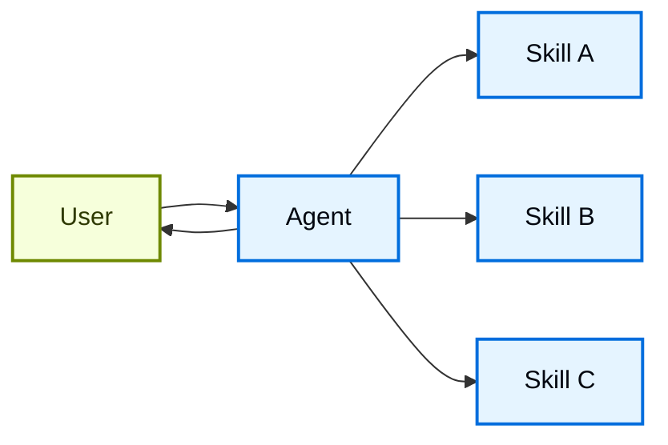

# Skills

Trong kiến trúc **skills**, các khả năng chuyên biệt được đóng gói thành các "skill" có thể gọi được (invocable), giúp mở rộng hành vi của [agent](/oss/python/langchain/agents). Skill chủ yếu là các đặc tả chuyên biệt hóa dựa trên prompt (prompt-driven) mà agent có thể gọi khi cần.
Để xem hỗ trợ skill có sẵn (built-in), xem [Deep Agents](/oss/python/deepagents/skills).

!!! tip "Mẹo"
    Pattern này về mặt khái niệm giống với [Agent Skills](https://agentskills.io/) và [llms.txt](https://llmstxt.org/) (được giới thiệu bởi Jeremy Howard), vốn dùng tool calling để tiết lộ dần (progressive disclosure) tài liệu. Pattern skills áp dụng progressive disclosure cho các prompt chuyên biệt và kiến thức domain, thay vì chỉ áp dụng cho các trang tài liệu.

    Để tìm các skill dùng ngay giúp cải thiện hiệu năng agent của bạn trên các tác vụ trong hệ sinh thái LangChain, xem repository [LangChain Skills](https://github.com/langchain-ai/langchain-skills).



## Đặc điểm chính

* Chuyên biệt hóa dựa trên prompt: Skill chủ yếu được định nghĩa bằng các prompt chuyên biệt
* Tiết lộ dần (progressive disclosure): Skill trở nên khả dụng tùy theo context hoặc nhu cầu người dùng
* Phân phối theo team: Các team khác nhau có thể phát triển và duy trì skill độc lập
* Kết hợp nhẹ (lightweight composition): Skill đơn giản hơn so với subagent đầy đủ
* Nhận biết tham chiếu (reference awareness): Skill có thể tham chiếu tới script, template, và các tài nguyên khác

## Khi nào nên dùng

Dùng pattern skills khi bạn muốn một [agent](/oss/python/langchain/agents) duy nhất có nhiều khả năng chuyên biệt hóa khác nhau, không cần áp đặt ràng buộc cụ thể giữa các skill, hoặc khi các team khác nhau cần phát triển khả năng một cách độc lập. Ví dụ phổ biến gồm coding assistant (skill cho từng ngôn ngữ hoặc tác vụ khác nhau), knowledge base (skill cho từng domain khác nhau), và creative assistant (skill cho từng định dạng khác nhau).

## Cách triển khai cơ bản

```python
from langchain.tools import tool
from langchain.agents import create_agent

@tool
def load_skill(skill_name: str) -> str:
    """Load a specialized skill prompt.

    Available skills:
    - write_sql: SQL query writing expert
    - review_legal_doc: Legal document reviewer

    Returns the skill's prompt and context.
    """
    # Load nội dung skill từ file/database
    ...

agent = create_agent(
    model="gpt-5.5",
    tools=[load_skill],
    system_prompt=(
        "You are a helpful assistant. "
        "You have access to two skills: "
        "write_sql and review_legal_doc. "
        "Use load_skill to access them."
    ),
)
```

Để xem ví dụ triển khai đầy đủ, tham khảo tutorial bên dưới.

**Tutorial: Xây dựng SQL assistant với skill theo yêu cầu (on-demand)** ([xem chi tiết](/oss/python/langchain/multi-agent/skills-sql-assistant))
Tìm hiểu cách triển khai skill với progressive disclosure, trong đó agent load prompt và schema chuyên biệt theo yêu cầu (on-demand) thay vì load sẵn từ đầu.

## Mở rộng pattern

Khi viết triển khai tùy chỉnh, bạn có thể mở rộng pattern skills cơ bản theo nhiều cách:

* **Đăng ký tool động (dynamic tool registration)**: Kết hợp progressive disclosure với quản lý state để đăng ký [tool](/oss/python/langchain/tools) mới khi skill được load. Ví dụ, load một skill "database_admin" có thể vừa thêm context chuyên biệt vừa đăng ký các tool đặc thù cho database (backup, restore, migrate). Cách này dùng chung cơ chế tool-và-state được dùng xuyên suốt các pattern multi-agent, tức là tool cập nhật state để thay đổi động khả năng của agent.

* **Skill phân cấp (hierarchical skills)**: Skill có thể định nghĩa các skill khác theo cấu trúc cây, tạo ra các chuyên biệt hóa lồng nhau. Ví dụ, load skill "data_science" có thể làm khả dụng các sub-skill như "pandas_expert", "visualization", và "statistical_analysis". Mỗi sub-skill có thể được load độc lập khi cần, cho phép tiết lộ dần kiến thức domain ở mức chi tiết (fine-grained). Cách tiếp cận phân cấp này giúp quản lý các knowledge base lớn bằng cách tổ chức khả năng thành các nhóm logic có thể được khám phá và load theo yêu cầu.

* **Nhận biết tham chiếu (reference awareness)**: Dù mỗi skill chỉ có một prompt, prompt này có thể tham chiếu tới vị trí của các asset khác và cung cấp thông tin về thời điểm agent nên dùng các asset đó.
  Khi các asset đó trở nên liên quan, agent sẽ biết các file này tồn tại và đọc chúng vào bộ nhớ khi cần để hoàn thành tác vụ.
  Cách này cũng tuân theo pattern progressive disclosure và giới hạn lượng thông tin trong context window.
