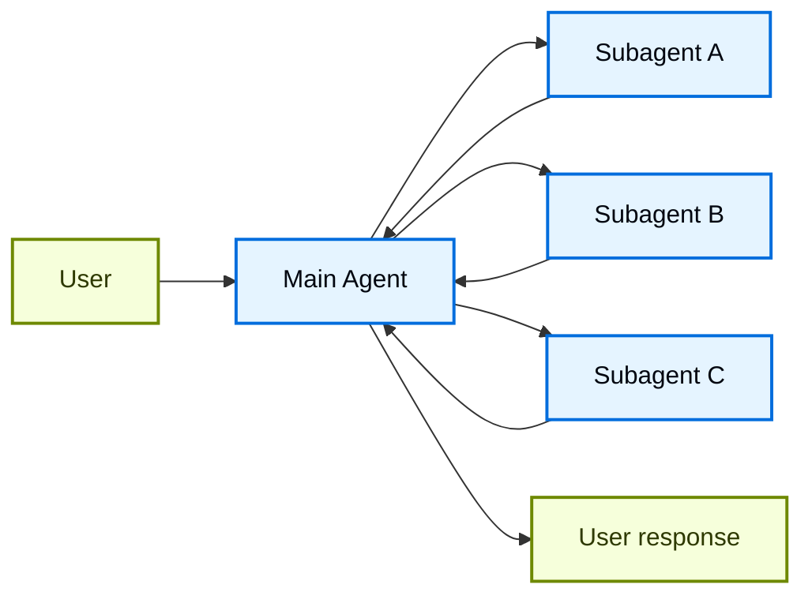
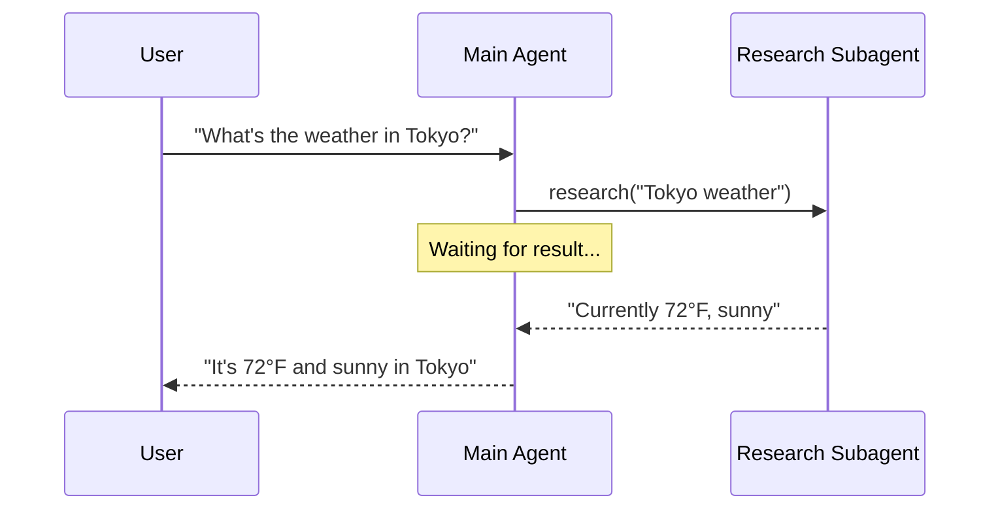
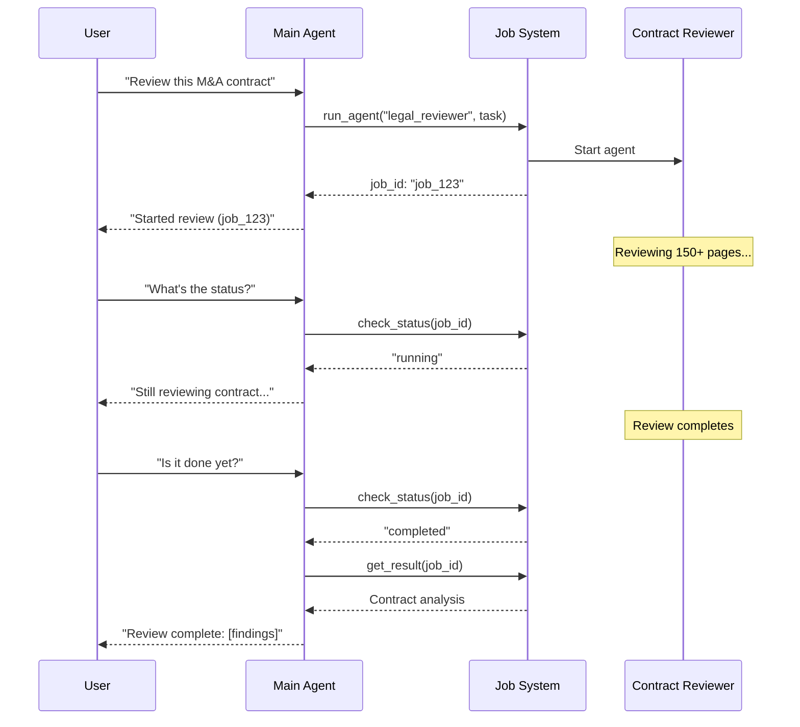
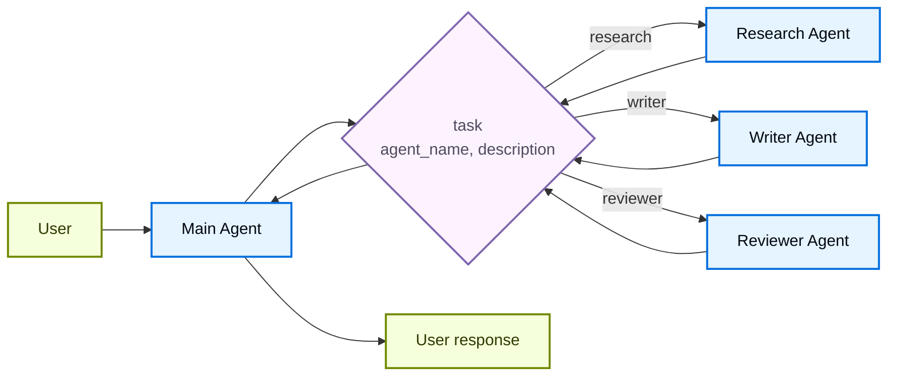

# Subagents

Trong kiến trúc **subagents**, một [agent](../agents.md) chính ở trung tâm (thường gọi là **supervisor**) điều phối các subagent bằng cách gọi chúng như [tool](https://docs.langchain.com/oss/python/langchain/tools). Agent chính quyết định gọi subagent nào, cung cấp input gì, và kết hợp kết quả ra sao. Subagent là stateless, tức không nhớ các tương tác trước đó, toàn bộ bộ nhớ hội thoại do agent chính duy trì. Điều này mang lại khả năng cô lập [context](https://docs.langchain.com/oss/python/langchain/context-engineering): mỗi lần gọi subagent hoạt động trong một context window sạch, tránh làm phình to context của hội thoại chính.

Để xem hỗ trợ subagent có sẵn (built-in), xem [Deep Agents](https://docs.langchain.com/oss/python/deepagents/subagents).



## Đặc điểm chính

* Kiểm soát tập trung: Mọi routing đều đi qua agent chính
* Không tương tác trực tiếp với người dùng: Subagent trả kết quả về cho agent chính, không phải cho người dùng (dù bạn có thể dùng [interrupt](https://docs.langchain.com/oss/python/langgraph/interrupts#pause-using-interrupt) bên trong một subagent để cho phép tương tác với người dùng)
* Subagent qua tool: Subagent được gọi thông qua tool
* Thực thi song song: Agent chính có thể gọi nhiều subagent trong cùng một turn

!!! note "Ghi chú"
    **Supervisor so với Router**: Một supervisor agent (pattern này) khác với [router](router.md). Supervisor là một agent đầy đủ, duy trì context hội thoại và chủ động quyết định gọi subagent nào qua nhiều turn. Router thường chỉ là một bước phân loại đơn lẻ, điều hướng tới agent mà không duy trì trạng thái hội thoại đang diễn ra.

## Khi nào nên dùng

Dùng pattern subagents khi bạn có nhiều domain riêng biệt (ví dụ: lịch, email, CRM, database), khi subagent không cần trò chuyện trực tiếp với người dùng, hoặc khi bạn muốn kiểm soát workflow tập trung. Với các trường hợp đơn giản chỉ cần vài [tool](https://docs.langchain.com/oss/python/langchain/tools), dùng [một agent duy nhất](../agents.md) là đủ.

!!! tip "Mẹo"
    **Cần tương tác người dùng bên trong một subagent?** Dù subagent thường trả kết quả về cho agent chính thay vì trò chuyện trực tiếp với người dùng, bạn vẫn có thể dùng [interrupt](https://docs.langchain.com/oss/python/langgraph/interrupts#pause-using-interrupt) bên trong một subagent để tạm dừng thực thi và thu thập input từ người dùng. Điều này hữu ích khi một subagent cần làm rõ hoặc xin phê duyệt trước khi tiếp tục. Agent chính vẫn là bộ điều phối, nhưng subagent có thể thu thập thông tin từ người dùng giữa chừng tác vụ.

## Cách triển khai cơ bản

Cơ chế cốt lõi là bọc một subagent thành tool mà agent chính có thể gọi:

```python
from langchain.tools import tool
from langchain.agents import create_agent

# Tạo một subagent
subagent = create_agent(model="google_genai:gemini-3.6-flash", tools=[...])

# Bọc nó thành một tool
@tool("research", description="Research a topic and return findings")
def call_research_agent(query: str):
    result = subagent.invoke({"messages": [{"role": "user", "content": query}]})
    return result["messages"][-1].content

# Agent chính với subagent như một tool
main_agent = create_agent(model="google_genai:gemini-3.6-flash", tools=[call_research_agent])
```

**Tutorial: Xây dựng trợ lý cá nhân với subagents** ([xem chi tiết](subagents-personal-assistant.md))
Tìm hiểu cách xây dựng một trợ lý cá nhân dùng pattern subagents, trong đó một agent chính (supervisor) ở trung tâm điều phối các worker agent chuyên biệt.

## Các quyết định thiết kế

Khi triển khai pattern subagents, bạn sẽ cần đưa ra một số lựa chọn thiết kế quan trọng. Bảng dưới đây tóm tắt các lựa chọn, mỗi mục được trình bày chi tiết ở các phần bên dưới.

| Quyết định | Các lựa chọn |
| ----------------------------------------- | -------------------------------------------------------------------------------------- |
| [**Sync so với async**](#sync-so-voi-async) | Sync (blocking) so với async (chạy nền) |
| [**Pattern tool**](#pattern-tool) | Tool riêng cho mỗi agent so với một tool dispatch duy nhất |
| [**Đặc tả subagent**](#dac-ta-subagent) | System prompt so với ràng buộc enum so với discovery qua tool (chỉ áp dụng cho tool dispatch duy nhất) |
| [**Input của subagent**](#input-cua-subagent) | Chỉ query so với đầy đủ context |
| [**Output của subagent**](#output-cua-subagent) | Kết quả subagent so với toàn bộ lịch sử hội thoại |

## Sync so với async

Việc thực thi subagent có thể là **đồng bộ** (sync, blocking) hoặc **bất đồng bộ** (async, chạy nền). Lựa chọn của bạn phụ thuộc vào việc agent chính có cần kết quả để tiếp tục hay không.

| Chế độ | Hành vi của agent chính | Phù hợp cho | Đánh đổi |
| --------- | ------------------------------------------- | -------------------------------------- | ------------------------------------ |
| **Sync** | Chờ subagent hoàn thành | Agent chính cần kết quả để tiếp tục | Đơn giản, nhưng chặn (block) hội thoại |
| **Async** | Tiếp tục trong khi subagent chạy ở nền | Tác vụ độc lập, người dùng không nên phải chờ | Phản hồi nhanh, nhưng phức tạp hơn |

!!! tip "Mẹo"
    Đừng nhầm với `async`/`await` của Python. Ở đây, "async" nghĩa là agent chính khởi động một job chạy nền (thường ở một process hoặc service riêng) và tiếp tục mà không bị chặn.

### Đồng bộ (mặc định)

Theo mặc định, các lệnh gọi subagent là **đồng bộ**: agent chính chờ mỗi subagent hoàn thành trước khi tiếp tục. Dùng sync khi hành động tiếp theo của agent chính phụ thuộc vào kết quả của subagent.



**Khi nào dùng sync:**

* Agent chính cần kết quả của subagent để soạn response
* Các tác vụ có phụ thuộc thứ tự (ví dụ: lấy dữ liệu → phân tích → phản hồi)
* Lỗi của subagent nên chặn response của agent chính

**Đánh đổi:**

* Triển khai đơn giản, chỉ cần gọi và chờ
* Người dùng không thấy phản hồi nào cho tới khi tất cả subagent hoàn thành
* Tác vụ chạy lâu sẽ làm đóng băng hội thoại

### Bất đồng bộ

Dùng **thực thi bất đồng bộ** khi công việc của subagent độc lập, tức agent chính không cần kết quả đó để tiếp tục trò chuyện với người dùng. Agent chính khởi động một job nền và vẫn giữ khả năng phản hồi.



**Khi nào dùng async:**

* Công việc của subagent độc lập với luồng hội thoại chính
* Người dùng vẫn nên chat tiếp trong khi công việc đang diễn ra
* Bạn muốn chạy song song nhiều tác vụ độc lập

**Pattern ba tool:**

1. **Start job**: Khởi động tác vụ chạy nền, trả về một job ID
2. **Check status**: Trả về trạng thái hiện tại (pending, running, completed, failed)
3. **Get result**: Lấy kết quả đã hoàn thành

**Xử lý khi job hoàn thành:** Khi một job hoàn tất, ứng dụng của bạn cần thông báo cho người dùng. Một cách tiếp cận: hiển thị một thông báo mà khi được click sẽ gửi một `HumanMessage` dạng "Check job_123 and summarize the results."

## Pattern tool

Có hai cách chính để expose subagent dưới dạng tool:

| Pattern | Phù hợp cho | Đánh đổi |
| ------------------------------------------------- | ------------------------------------------------------------- | ------------------------------------------------- |
| [**Tool riêng cho mỗi agent**](#tool-rieng-cho-moi-agent) | Kiểm soát chi tiết input/output của từng subagent | Cần setup nhiều hơn, nhưng tùy biến sâu hơn |
| [**Tool dispatch duy nhất**](#tool-dispatch-duy-nhat) | Nhiều agent, nhiều team phân tán, ưu tiên convention hơn cấu hình | Kết hợp đơn giản hơn, ít tùy biến theo từng agent hơn |

### Tool riêng cho mỗi agent


Ý tưởng cốt lõi là bọc subagent thành tool mà agent chính có thể gọi:

```python
from langchain.tools import tool
from langchain.agents import create_agent

# Tạo một subagent
subagent = create_agent(model="...", tools=[...])  # [!code highlight]

# Bọc nó thành tool  # [!code highlight]
@tool("subagent_name", description="subagent_description")  # [!code highlight]
def call_subagent(query: str):  # [!code highlight]
    result = subagent.invoke({"messages": [{"role": "user", "content": query}]})
    return result["messages"][-1].content

# Agent chính với subagent như một tool  # [!code highlight]
main_agent = create_agent(model="...", tools=[call_subagent])  # [!code highlight]
```

Agent chính gọi tool subagent khi nó xác định tác vụ khớp với mô tả của subagent, nhận kết quả, và tiếp tục điều phối. Xem [Context engineering](#context-engineering) để kiểm soát chi tiết hơn.

### Tool dispatch duy nhất

Một cách tiếp cận khác dùng một tool tham số hóa duy nhất để gọi các sub-agent tạm thời (ephemeral) cho các tác vụ độc lập. Khác với cách [tool riêng cho mỗi agent](#tool-rieng-cho-moi-agent) nơi mỗi sub-agent được bọc thành một tool riêng, cách này dùng một tool `task` duy nhất theo convention: mô tả tác vụ được truyền dưới dạng một human message cho sub-agent, và message cuối cùng của sub-agent được trả về làm kết quả tool.

Dùng cách này khi bạn muốn phân phối việc phát triển agent cho nhiều team, cần cô lập các tác vụ phức tạp vào các context window riêng, cần một cách mở rộng để thêm agent mới mà không sửa coordinator, hoặc thích convention hơn tùy biến. Cách này đánh đổi sự linh hoạt trong context engineering để lấy sự đơn giản trong việc kết hợp agent và khả năng cô lập context mạnh.



**Đặc điểm chính:**

* Một tool task duy nhất: một tool tham số hóa có thể gọi bất kỳ sub-agent nào đã đăng ký theo tên
* Gọi theo convention: agent được chọn theo tên, tác vụ được truyền dưới dạng human message, message cuối cùng được trả về làm kết quả tool
* Phân phối theo team: các team khác nhau có thể phát triển và triển khai agent độc lập
* Khám phá agent: sub-agent có thể được khám phá qua system prompt (liệt kê các agent khả dụng) hoặc qua [progressive disclosure](skills-sql-assistant.md) (load thông tin agent theo yêu cầu qua tool)

!!! tip "Mẹo"
    Một điểm thú vị của cách tiếp cận này là sub-agent có thể có đúng khả năng giống hệt agent chính. Trong trường hợp đó, việc gọi một sub-agent **thực chất chủ yếu là để cô lập context**, cho phép các tác vụ phức tạp, nhiều bước chạy trong các context window riêng biệt mà không làm phình to lịch sử hội thoại của agent chính. Sub-agent hoàn thành công việc một cách tự trị và chỉ trả về một bản tóm tắt ngắn gọn, giữ cho luồng chính tập trung và hiệu quả.

**Agent registry với task dispatcher**

```python
from langchain.tools import tool
from langchain.agents import create_agent

# Các sub-agent do các team khác nhau phát triển
research_agent = create_agent(
    model="gpt-5.5",
    prompt="You are a research specialist..."
)

writer_agent = create_agent(
    model="gpt-5.5",
    prompt="You are a writing specialist..."
)

# Registry các sub-agent khả dụng
SUBAGENTS = {
    "research": research_agent,
    "writer": writer_agent,
}

@tool
def task(
    agent_name: str,
    description: str
) -> str:
    """Launch an ephemeral subagent for a task.

    Available agents:
    - research: Research and fact-finding
    - writer: Content creation and editing
    """
    agent = SUBAGENTS[agent_name]
    result = agent.invoke({
        "messages": [
            {"role": "user", "content": description}
        ]
    })
    return result["messages"][-1].content

# Agent điều phối chính
main_agent = create_agent(
    model="gpt-5.5",
    tools=[task],
    system_prompt=(
        "You coordinate specialized sub-agents. "
        "Available: research (fact-finding), "
        "writer (content creation). "
        "Use the task tool to delegate work."
    ),
)
```

## Context engineering

Kiểm soát cách context chảy giữa agent chính và các subagent của nó:

| Nhóm | Mục đích | Ảnh hưởng đến |
| ----------------------------------------- | -------------------------------------------------------- | ----------------------------- |
| [**Đặc tả subagent**](#dac-ta-subagent) | Đảm bảo subagent được gọi đúng lúc cần | Quyết định routing của agent chính |
| [**Input của subagent**](#input-cua-subagent) | Đảm bảo subagent có thể thực thi tốt với context được tối ưu | Hiệu năng của subagent |
| [**Output của subagent**](#output-cua-subagent) | Đảm bảo supervisor có thể hành động dựa trên kết quả subagent | Hiệu năng của agent chính |

Xem thêm hướng dẫn toàn diện của chúng tôi về [context engineering](https://docs.langchain.com/oss/python/langchain/context-engineering) cho agent.

### Đặc tả subagent

**Tên** và **mô tả** gắn với subagent là cách chính để agent chính biết nên gọi subagent nào. Đây là các đòn bẩy (lever) prompting, hãy chọn chúng cẩn thận.

* **Tên**: Cách agent chính gọi tới sub-agent. Giữ tên rõ ràng và hướng hành động (ví dụ: `research_agent`, `code_reviewer`).
* **Mô tả**: Những gì agent chính biết về khả năng của sub-agent. Mô tả cụ thể tác vụ nào nó xử lý và khi nào nên dùng nó.

Với thiết kế [tool dispatch duy nhất](#tool-dispatch-duy-nhat), bạn cần cung cấp thêm cho agent chính thông tin về các subagent mà nó có thể gọi.
Bạn có thể cung cấp thông tin này theo nhiều cách khác nhau, tùy vào số lượng agent và registry của bạn là tĩnh hay động:

| Phương pháp | Phù hợp cho | Đánh đổi |
| ----------------------------- | ----------------------------------------- | ---------------------------------------------------------------------- |
| **Liệt kê trong system prompt** | Danh sách agent nhỏ, cố định (< 10 agent) | Đơn giản, nhưng cần cập nhật prompt khi agent thay đổi |
| **Ràng buộc enum** | Danh sách agent nhỏ, cố định (< 10 agent) | An toàn kiểu (type-safe) và tường minh, nhưng cần sửa code khi agent thay đổi |
| **Discovery qua tool** | Registry agent lớn hoặc động | Linh hoạt và mở rộng tốt, nhưng thêm độ phức tạp |

#### Liệt kê trong system prompt

Liệt kê trực tiếp các agent khả dụng trong system prompt của agent chính. Agent chính thấy danh sách agent và mô tả của chúng như một phần trong hướng dẫn của nó.

**Khi nào dùng:**

* Bạn có một tập agent nhỏ, cố định (< 10)
* Registry agent hiếm khi thay đổi
* Bạn muốn triển khai đơn giản nhất

**Ví dụ:**

```python
main_agent = create_agent(
    model="...",
    tools=[task],
    system_prompt=(
        "You coordinate specialized sub-agents. "
        "Available agents:\n"
        "- research: Research and fact-finding\n"
        "- writer: Content creation and editing\n"
        "- reviewer: Code and document review\n"
        "Use the task tool to delegate work."
    ),
)
```

#### Ràng buộc enum trên tool dispatch

Thêm ràng buộc enum vào tham số `agent_name` trong tool dispatch của bạn. Điều này mang lại an toàn kiểu và làm cho các agent khả dụng trở nên tường minh trong schema của tool.

**Khi nào dùng:**

* Bạn có một tập agent nhỏ, cố định (< 10)
* Bạn muốn an toàn kiểu và tên agent tường minh
* Bạn thích validate dựa trên schema hơn là hướng dẫn dựa trên prompt

**Ví dụ:**

```python
from enum import Enum

class AgentName(str, Enum):
    RESEARCH = "research"
    WRITER = "writer"
    REVIEWER = "reviewer"

@tool
def task(
    agent_name: AgentName,  # Ràng buộc enum
    description: str
) -> str:
    """Launch an ephemeral subagent for a task."""
    # ...
```

#### Discovery qua tool

Cung cấp một tool riêng (ví dụ `list_agents` hoặc `search_agents`) mà agent chính có thể gọi để khám phá các agent khả dụng theo yêu cầu (on-demand). Cách này cho phép progressive disclosure và hỗ trợ registry động.

**Khi nào dùng:**

* Bạn có nhiều agent (> 10) hoặc registry đang tăng dần
* Registry agent thay đổi thường xuyên hoặc mang tính động
* Bạn muốn giảm kích thước prompt và lượng token sử dụng
* Các team khác nhau quản lý các agent khác nhau một cách độc lập

**Ví dụ:**

```python
@tool
def list_agents(query: str = "") -> str:
    """List available subagents, optionally filtered by query."""
    agents = search_agent_registry(query)
    return format_agent_list(agents)

@tool
def task(agent_name: str, description: str) -> str:
    """Launch an ephemeral subagent for a task."""
    # ...

main_agent = create_agent(
    model="...",
    tools=[task, list_agents],
    system_prompt="Use list_agents to discover available subagents, then use task to invoke them."
)
```

### Input của subagent

Tùy chỉnh context mà subagent nhận được để thực thi tác vụ của nó. Thêm input mà việc chụp lại (capture) trong một prompt tĩnh là không thực tế, như toàn bộ lịch sử message, kết quả trước đó, hoặc metadata tác vụ, bằng cách lấy từ state của agent.

```python
from langchain.agents import AgentState
from langchain.tools import tool, ToolRuntime

class CustomState(AgentState):
    example_state_key: str

@tool(
    "subagent1_name",
    description="subagent1_description"
)
def call_subagent1(query: str, runtime: ToolRuntime[None, CustomState]):
    # Áp dụng logic cần thiết để chuyển đổi message thành input phù hợp
    subagent_input = some_logic(query, runtime.state["messages"])
    result = subagent1.invoke({
        "messages": subagent_input,
        # Bạn cũng có thể truyền các state key khác ở đây nếu cần.
        # Đảm bảo định nghĩa các key này trong cả state schema
        # của agent chính lẫn subagent.
        "example_state_key": runtime.state["example_state_key"]
    })
    return result["messages"][-1].content
```

### Output của subagent

Tùy chỉnh những gì agent chính nhận lại để có thể ra quyết định tốt. Có hai chiến lược:

1. **Prompt cho sub-agent**: Chỉ định chính xác những gì cần trả về. Một lỗi thường gặp là sub-agent thực hiện tool call hoặc reasoning nhưng không đưa kết quả vào message cuối cùng, hãy nhắc nó rằng supervisor chỉ thấy output cuối cùng.
2. **Định dạng bằng code**: Điều chỉnh hoặc bổ sung response trước khi trả về. Ví dụ, truyền thêm các state key cụ thể cùng với văn bản cuối cùng bằng [`Command`](https://docs.langchain.com/oss/python/langgraph/graph-api#command).

```python
from typing import Annotated
from langchain.agents import AgentState
from langchain.tools import InjectedToolCallId
from langgraph.types import Command


@tool(
    "subagent1_name",
    description="subagent1_description"
)
def call_subagent1(
    query: str,
    tool_call_id: Annotated[str, InjectedToolCallId],
) -> Command:
    result = subagent1.invoke({
        "messages": [{"role": "user", "content": query}]
    })
    return Command(update={
        # Truyền thêm state từ subagent
        "example_state_key": result["example_state_key"],
        "messages": [
            ToolMessage(
                content=result["messages"][-1].content,
                tool_call_id=tool_call_id
            )
        ]
    })
```

## Checkpointing và kiểm tra state

Theo mặc định, subagent dùng chế độ **checkpointer kế thừa** (inherited): mỗi lần gọi bắt đầu với state mới, hỗ trợ [interrupt](https://docs.langchain.com/oss/python/langgraph/interrupts#pause-using-interrupt), và chạy an toàn khi song song. Nếu bạn cần một subagent duy trì lịch sử hội thoại riêng, bền vững qua nhiều lần gọi, hãy compile nó với `checkpointer=True` (chế độ continuations). Xem [subgraph persistence](https://docs.langchain.com/oss/python/langgraph/use-subgraphs#subgraph-persistence) để so sánh đầy đủ các chế độ.

Vì subagent được gọi bên trong các hàm tool, LangGraph không thể [tự động phát hiện tĩnh](https://docs.langchain.com/oss/python/langgraph/use-subgraphs#view-subgraph-state) chúng. Điều này có nghĩa là [`get_state` với `subgraphs`](https://docs.langchain.com/oss/python/langgraph/use-subgraphs#view-subgraph-state) sẽ không trả về state của subagent. Nếu bạn cần đọc state của graph lồng nhau (ví dụ trong lúc [interrupt](https://docs.langchain.com/oss/python/langgraph/interrupts#pause-using-interrupt)), hãy gọi subagent từ một [node function](https://docs.langchain.com/oss/python/langgraph/use-subgraphs#call-a-subgraph-inside-a-node) trong một graph tùy chỉnh thay vì gọi qua tool. Xem [subgraph persistence](https://docs.langchain.com/oss/python/langgraph/use-subgraphs#subgraph-persistence) để biết chi tiết mỗi chế độ ảnh hưởng thế nào tới khả năng quan sát state.

**Di chuyển từ langgraph-supervisor** ([xem hướng dẫn](https://docs.langchain.com/oss/python/migrate/langgraph-supervisor))
Package langgraph-supervisor không còn được bảo trì tích cực. Tìm hiểu cách di chuyển từ `create_supervisor` sang pattern subagents, bao gồm cả luồng interrupt và resume với callback từ API bên ngoài.
