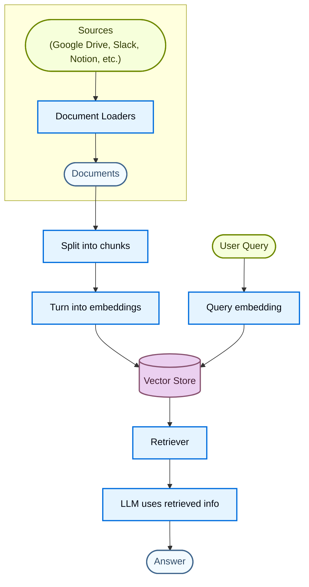
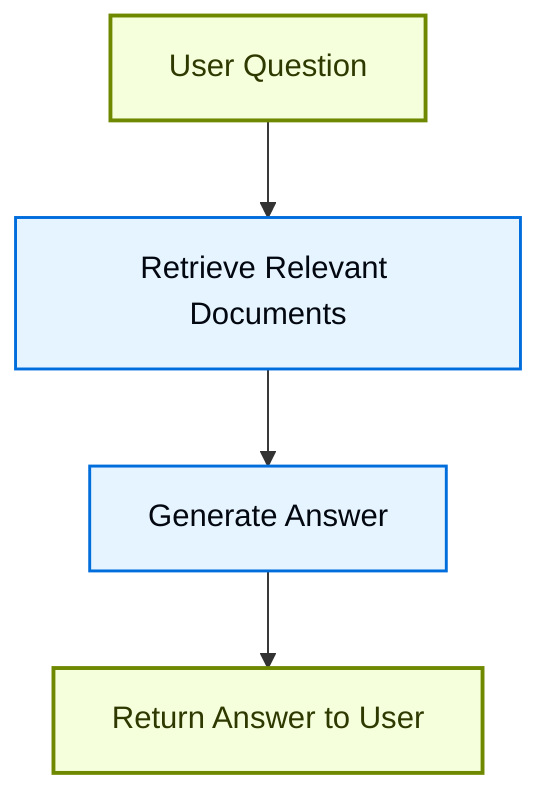
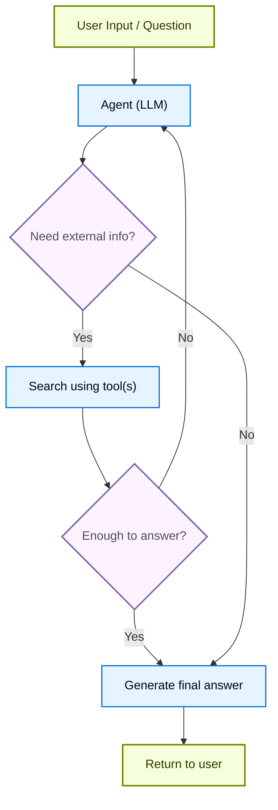
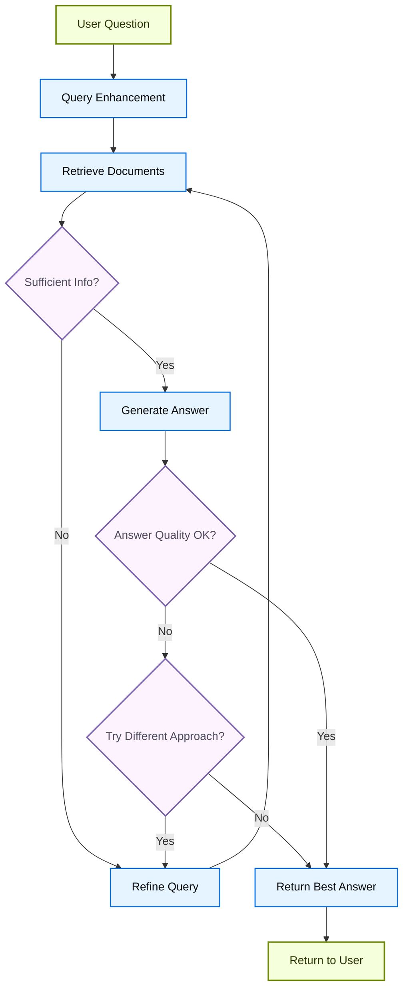

# Retrieval

Large Language Model (LLM) rất mạnh, nhưng có hai giới hạn chính:

* **Context hữu hạn**: chúng không thể nạp toàn bộ corpus cùng lúc.
* **Kiến thức tĩnh**: dữ liệu huấn luyện của chúng bị đóng băng tại một thời điểm.

Retrieval giải quyết các vấn đề này bằng cách lấy kiến thức bên ngoài liên quan tại thời điểm truy vấn (query time). Đây là nền tảng của **Retrieval-Augmented Generation (RAG)**, giúp tăng cường câu trả lời của LLM bằng thông tin gắn với ngữ cảnh cụ thể.

## Xây dựng knowledge base

Một **knowledge base** là kho lưu trữ tài liệu hoặc dữ liệu có cấu trúc, được dùng trong quá trình retrieval.

Nếu cần một knowledge base tùy chỉnh, bạn có thể dùng document loader và vector store của LangChain để xây dựng từ dữ liệu của riêng bạn.

!!! note "Ghi chú"
    Nếu bạn đã có sẵn một knowledge base (ví dụ: một SQL database, document database, CRM, hay hệ thống tài liệu nội bộ), bạn **không** cần xây lại nó. Bạn có thể:

    * Kết nối nó như một **tool** cho agent trong Agentic RAG.
    * Truy vấn nó và cung cấp nội dung lấy được làm context cho LLM [(2-Step RAG)](#2-step-rag).

Để biết thêm thông tin, xem tutorial sau để xây dựng một knowledge base có thể tìm kiếm và một workflow RAG tối giản:

**Tutorial: Semantic search** ([xem chi tiết](/oss/python/langchain/knowledge-base))
Tìm hiểu cách tạo một knowledge base có thể tìm kiếm từ dữ liệu của riêng bạn bằng document loader, embedding, và vector store của LangChain.
Trong tutorial này, bạn sẽ xây dựng một search engine trên một file PDF, cho phép lấy ra các đoạn văn bản liên quan tới một query. Bạn cũng sẽ triển khai một workflow RAG tối giản trên nền search engine này để thấy cách kiến thức bên ngoài có thể được tích hợp vào reasoning của LLM.

### Từ retrieval đến RAG

Retrieval cho phép LLM truy cập context liên quan tại runtime. Nhưng phần lớn ứng dụng thực tế còn đi xa hơn: chúng **tích hợp retrieval với generation** để tạo ra câu trả lời có căn cứ (grounded), nhận biết ngữ cảnh (context-aware).

Đây chính là ý tưởng cốt lõi đằng sau **Retrieval-Augmented Generation (RAG)**. Retrieval pipeline trở thành nền tảng cho một hệ thống rộng hơn, kết hợp giữa tìm kiếm (search) và generation.

### Retrieval pipeline

Một retrieval workflow điển hình trông như sau:



Mỗi thành phần đều là module riêng biệt: bạn có thể thay loader, splitter, embedding, hoặc vector store mà không cần viết lại logic của ứng dụng.

### Các thành phần cấu thành

**Document loaders** ([tìm hiểu thêm](/oss/python/integrations/document_loaders))
Nạp dữ liệu từ các nguồn bên ngoài (Google Drive, Slack, Notion,...), trả về các object [`Document`](https://reference.langchain.com/python/langchain-core/documents/base/Document) chuẩn hóa.

**Text splitters** ([tìm hiểu thêm](/oss/python/integrations/splitters))
Chia nhỏ tài liệu lớn thành các chunk nhỏ hơn, có thể được lấy ra riêng lẻ và vừa với context window của model.

**Embedding models** ([tìm hiểu thêm](/oss/python/integrations/embeddings))
Một embedding model chuyển văn bản thành một vector số, sao cho các đoạn văn bản có ý nghĩa tương tự sẽ nằm gần nhau trong không gian vector đó.

**Vector stores** ([tìm hiểu thêm](/oss/python/integrations/vectorstores/))
Các database chuyên biệt để lưu trữ và tìm kiếm embedding.

**Retrievers** ([tìm hiểu thêm](/oss/python/integrations/retrievers/))
Một retriever là một interface trả về tài liệu dựa trên một query phi cấu trúc (unstructured).

## Các kiến trúc RAG

RAG có thể được triển khai theo nhiều cách, tùy theo nhu cầu hệ thống của bạn. Chúng tôi trình bày từng loại trong các phần dưới đây.

| Kiến trúc | Mô tả | Kiểm soát | Linh hoạt | Độ trễ | Ví dụ use case |
| --------------- | ----- | --------- | ----------- | ---------- | ------------------------------------------------- |
| **2-Step RAG** | Retrieval luôn xảy ra trước generation. Đơn giản và dễ dự đoán | ✅ Cao | ❌ Thấp | ⚡ Nhanh | FAQ, bot tài liệu |
| **Agentic RAG** | Một agent chạy bằng LLM tự quyết định *khi nào* và *cách nào* retrieval trong lúc reasoning | ❌ Thấp | ✅ Cao | ⏳ Thay đổi | Trợ lý nghiên cứu có quyền dùng nhiều tool |
| **Hybrid** | Kết hợp đặc điểm của cả hai cách tiếp cận, kèm các bước validate | ⚖️ Trung bình | ⚖️ Trung bình | ⏳ Thay đổi | Q&A theo domain cụ thể kèm kiểm tra chất lượng |

!!! info "Thông tin"
    **Độ trễ**: Độ trễ nhìn chung **dễ dự đoán** hơn trong **2-Step RAG**, vì số lượng lệnh gọi LLM tối đa được biết trước và có giới hạn. Tính dễ dự đoán này giả định thời gian inference của LLM là yếu tố chi phối. Tuy nhiên, độ trễ thực tế cũng có thể bị ảnh hưởng bởi hiệu năng của các bước retrieval, như thời gian phản hồi API, độ trễ mạng, hoặc truy vấn database, những yếu tố có thể thay đổi tùy theo tool và hạ tầng đang dùng.

### 2-Step RAG

Trong **2-Step RAG**, bước retrieval luôn được thực thi trước bước generation. Kiến trúc này đơn giản và dễ dự đoán, phù hợp với nhiều ứng dụng nơi việc lấy tài liệu liên quan là điều kiện tiên quyết rõ ràng để sinh câu trả lời.



**Tutorial: Semantic search** ([xem chi tiết](/oss/python/langchain/knowledge-base))
Xây dựng một knowledge base có thể tìm kiếm bằng document loader, embedding, và vector store, sau đó chạy một workflow RAG retrieve-rồi-generate tối giản trên nền đó.

**Tutorial: Đánh giá một ứng dụng RAG** ([xem chi tiết](/langsmith/evaluate-rag-tutorial))
Xây dựng một ứng dụng RAG retrieve-rồi-generate đơn giản, và đo độ chính xác câu trả lời, độ liên quan, tính có căn cứ (groundedness), và chất lượng retrieval bằng LangSmith.

### Agentic RAG

**Agentic Retrieval-Augmented Generation (RAG)** kết hợp điểm mạnh của Retrieval-Augmented Generation với reasoning dựa trên agent. Thay vì lấy tài liệu trước khi trả lời, một agent (chạy bằng LLM) reasoning từng bước và quyết định **khi nào** và **cách nào** retrieval thông tin trong lúc tương tác.

!!! tip "Mẹo"
    Thứ duy nhất một agent cần để có hành vi RAG là quyền truy cập vào một hoặc nhiều **tool** có thể lấy kiến thức bên ngoài, như document loader, web API, hoặc truy vấn database.



```python
import requests
from langchain.tools import tool
from langchain.chat_models import init_chat_model
from langchain.agents import create_agent


@tool
def fetch_url(url: str) -> str:
    """Fetch text content from a URL"""
    response = requests.get(url, timeout=10.0)
    response.raise_for_status()
    return response.text

system_prompt = """\
Use fetch_url when you need to fetch information from a web-page; quote relevant snippets.
"""

agent = create_agent(
    model="claude-sonnet-4-6",
    tools=[fetch_url], # Một tool cho retrieval [!code highlight]
    system_prompt=system_prompt,
)
```

**Ví dụ mở rộng: Agentic RAG cho llms.txt của LangGraph**

Ví dụ này triển khai một **hệ thống Agentic RAG** để hỗ trợ người dùng truy vấn tài liệu LangGraph. Agent bắt đầu bằng cách load [llms.txt](https://llmstxt.org/), file liệt kê các URL tài liệu khả dụng, sau đó có thể dùng động một tool `fetch_documentation` để lấy và xử lý nội dung liên quan dựa trên câu hỏi của người dùng.

```python
import requests
from langchain.agents import create_agent
from langchain.messages import HumanMessage
from langchain.tools import tool
from markdownify import markdownify


ALLOWED_DOMAINS = ["https://langchain-ai.github.io/"]
LLMS_TXT = 'https://langchain-ai.github.io/langgraph/llms.txt'


@tool
def fetch_documentation(url: str) -> str:  # [!code highlight]
    """Fetch and convert documentation from a URL"""
    if not any(url.startswith(domain) for domain in ALLOWED_DOMAINS):
        return (
            "Error: URL not allowed. "
            f"Must start with one of: {', '.join(ALLOWED_DOMAINS)}"
        )
    response = requests.get(url, timeout=10.0)
    response.raise_for_status()
    return markdownify(response.text)


# Ta sẽ fetch nội dung của llms.txt, nên việc này có thể
# thực hiện trước mà không cần một request LLM.
llms_txt_content = requests.get(LLMS_TXT).text

# System prompt cho agent
system_prompt = f"""
You are an expert Python developer and technical assistant.
Your primary role is to help users with questions about LangGraph and related tools.

Instructions:

1. If a user asks a question you're unsure about—or one that likely involves API usage,
   behavior, or configuration—you MUST use the `fetch_documentation` tool to consult the relevant docs.
2. When citing documentation, summarize clearly and include relevant context from the content.
3. Do not use any URLs outside of the allowed domain.
4. If a documentation fetch fails, tell the user and proceed with your best expert understanding.

You can access official documentation from the following approved sources:

{llms_txt_content}

You MUST consult the documentation to get up to date documentation
before answering a user's question about LangGraph.

Your answers should be clear, concise, and technically accurate.
"""

tools = [fetch_documentation]

model = init_chat_model("claude-sonnet-4-6", max_tokens=32_000)

agent = create_agent(
    model=model,
    tools=tools,  # [!code highlight]
    system_prompt=system_prompt,  # [!code highlight]
    name="Agentic RAG",
)

response = agent.invoke({
    'messages': [
        HumanMessage(content=(
            "Write a short example of a langgraph agent using the "
            "prebuilt create react agent. the agent should be able "
            "to look up stock pricing information."
        ))
    ]
})

print(response['messages'][-1].content)
```

**Tutorial: RAG với Deep Agents** ([xem chi tiết](/oss/python/deepagents/rag))
Xây dựng một agent Q&A tài liệu, lấy ra các chunk liên quan tại thời điểm query, đẩy chúng ra filesystem, và giao việc phân tích cho các subagent.

### Hybrid RAG

Hybrid RAG kết hợp đặc điểm của cả 2-Step RAG và Agentic RAG. Nó bổ sung các bước trung gian như tiền xử lý query (query preprocessing), validate kết quả retrieval, và kiểm tra sau khi generation. Các hệ thống này mang lại nhiều linh hoạt hơn so với pipeline cố định, trong khi vẫn giữ được một phần kiểm soát với quá trình thực thi.

Các thành phần điển hình gồm:

* **Tăng cường query (query enhancement)**: Chỉnh sửa câu hỏi input để cải thiện chất lượng retrieval. Có thể bao gồm viết lại query chưa rõ ràng, sinh nhiều biến thể, hoặc mở rộng query với context bổ sung.
* **Validate retrieval**: Đánh giá xem tài liệu lấy được có liên quan và đủ hay không. Nếu chưa, hệ thống có thể tinh chỉnh lại query và retrieval lại.
* **Validate câu trả lời**: Kiểm tra câu trả lời được sinh ra về độ chính xác, đầy đủ, và mức độ khớp với nội dung nguồn. Nếu cần, hệ thống có thể sinh lại hoặc chỉnh sửa câu trả lời.

Kiến trúc này thường hỗ trợ nhiều vòng lặp giữa các bước:



Kiến trúc này phù hợp với:

* Ứng dụng có query mơ hồ hoặc chưa được xác định rõ (underspecified)
* Hệ thống cần các bước validate hoặc kiểm soát chất lượng
* Workflow liên quan tới nhiều nguồn hoặc cần tinh chỉnh lặp lại nhiều lần

**Tutorial: Agentic RAG kèm Self-Correction** ([xem chi tiết](/oss/python/langgraph/agentic-rag))
Một ví dụ về **Hybrid RAG** kết hợp reasoning kiểu agentic với retrieval và tự sửa lỗi (self-correction).
