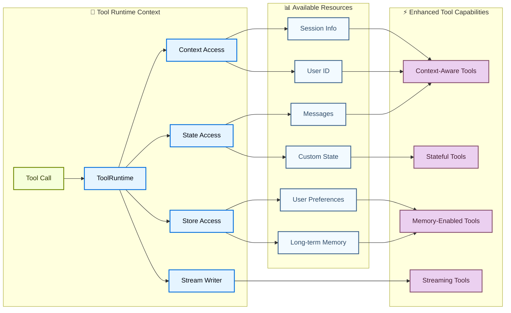

# Tools

Tools mở rộng những gì [agent](agents.md) có thể làm: cho phép chúng lấy dữ liệu theo thời gian thực, thực thi code, truy vấn cơ sở dữ liệu bên ngoài, và thực hiện các hành động trong thế giới thực.

Về bản chất, tool là các hàm có thể gọi được (callable) với input và output được định nghĩa rõ ràng, được truyền cho một [chat model](models.md). Model quyết định khi nào cần gọi một tool dựa trên ngữ cảnh hội thoại, và cung cấp tham số input nào.

!!! tip "Mẹo"
    Để biết chi tiết về cách model xử lý tool call, xem [Tool calling](models.md#tool-calling). Trace các tool call và debug lỗi với [LangSmith](https://smith.langchain.com?utm_source=docs&utm_medium=cta&utm_campaign=langsmith-signup&utm_content=oss-langchain-tools). Làm theo [tracing quickstart](https://docs.langchain.com/langsmith/trace-with-langchain) để thiết lập.

    Chúng tôi cũng khuyến nghị bạn thiết lập [LangSmith Engine](https://docs.langchain.com/langsmith/engine), công cụ giám sát các trace của bạn, phát hiện vấn đề và đề xuất cách khắc phục.

## Tạo tool

### Định nghĩa tool cơ bản

Cách đơn giản nhất để tạo một tool là dùng decorator [`@tool`](https://reference.langchain.com/python/langchain-core/tools/convert/tool). Theo mặc định, docstring của hàm sẽ trở thành mô tả của tool, giúp model hiểu khi nào nên sử dụng nó:

```python
from langchain.tools import tool

@tool
def search_database(query: str, limit: int = 10) -> str:
    """Search the customer database for records matching the query.

    Args:
        query: Search terms to look for
        limit: Maximum number of results to return
    """
    return f"Found {limit} results for '{query}'"
```

Type hint là **bắt buộc** vì chúng định nghĩa input schema của tool. Docstring nên đầy đủ thông tin và ngắn gọn để giúp model hiểu mục đích của tool.

!!! note "Ghi chú"
    **Server-side tool use:** Một số chat model có sẵn built-in tool (web search, code interpreter) được thực thi phía server. Xem [Server-side tool use](#server-side-tool-use) để biết chi tiết.

!!! warning "Cảnh báo"
    Nên ưu tiên `snake_case` cho tên tool (ví dụ, `web_search` thay vì `Web Search`). Một số nhà cung cấp model gặp vấn đề với hoặc từ chối các tên chứa khoảng trắng hoặc ký tự đặc biệt với lỗi trả về. Việc chỉ dùng ký tự chữ số, dấu gạch dưới, và dấu gạch ngang giúp cải thiện khả năng tương thích giữa các nhà cung cấp.

### Tùy chỉnh thuộc tính tool

#### Tên tool tùy chỉnh

Theo mặc định, tên tool lấy từ tên hàm. Ghi đè khi bạn cần một tên mô tả rõ hơn:

```python
@tool("web_search")  # Custom name
def search(query: str) -> str:
    """Search the web for information."""
    return f"Results for: {query}"

print(search.name)  # web_search
```

#### Mô tả tool tùy chỉnh

Ghi đè mô tả tool được tạo tự động để hướng dẫn model rõ ràng hơn:

```python
@tool("calculator", description="Performs arithmetic calculations. Use this for any math problems.")
def calc(expression: str) -> str:
    """Evaluate mathematical expressions."""
    return str(eval(expression))
```

### Định nghĩa schema nâng cao

Định nghĩa các input phức tạp bằng Pydantic model hoặc JSON schema:

=== "Pydantic model"
    ```python
    from pydantic import BaseModel, Field
    from typing import Literal

    class WeatherInput(BaseModel):
        """Input for weather queries."""
        location: str = Field(description="City name or coordinates")
        units: Literal["celsius", "fahrenheit"] = Field(
            default="celsius",
            description="Temperature unit preference"
        )
        include_forecast: bool = Field(
            default=False,
            description="Include 5-day forecast"
        )

    @tool(args_schema=WeatherInput)
    def get_weather(location: str, units: str = "celsius", include_forecast: bool = False) -> str:
        """Get current weather and optional forecast."""
        temp = 22 if units == "celsius" else 72
        result = f"Current weather in {location}: {temp} degrees {units[0].upper()}"
        if include_forecast:
            result += "\nNext 5 days: Sunny"
        return result
    ```

=== "JSON Schema"
    ```python
    weather_schema = {
        "type": "object",
        "properties": {
            "location": {"type": "string"},
            "units": {"type": "string"},
            "include_forecast": {"type": "boolean"}
        },
        "required": ["location", "units", "include_forecast"]
    }

    @tool(args_schema=weather_schema)
    def get_weather(location: str, units: str = "celsius", include_forecast: bool = False) -> str:
        """Get current weather and optional forecast."""
        temp = 22 if units == "celsius" else 72
        result = f"Current weather in {location}: {temp} degrees {units[0].upper()}"
        if include_forecast:
            result += "\nNext 5 days: Sunny"
        return result
    ```

### Tên tham số dành riêng (Reserved)

Các tên tham số sau đây được dành riêng và không thể dùng làm tham số của tool. Sử dụng các tên này sẽ gây ra lỗi lúc chạy (runtime).

| Tên tham số | Mục đích |
| --- | --- |
| `config` | Dành riêng để truyền `RunnableConfig` cho tool nội bộ |
| `runtime` | Dành riêng cho tham số `ToolRuntime` (truy cập state, context, store) |

Để truy cập thông tin runtime, hãy dùng tham số [`ToolRuntime`](https://reference.langchain.com/python/langchain/tools/#langchain.tools.ToolRuntime) thay vì đặt tên tham số riêng của bạn là `config` hoặc `runtime`.

Nếu bạn dùng `InjectedState`, `InjectedStore`, `get_runtime()`, hoặc `InjectedToolCallId`, xem [Migrate from older injection patterns](#migrate-from-older-injection-patterns).

## Truy cập context {#access-context}

Tools mạnh mẽ nhất khi chúng có thể truy cập thông tin runtime như lịch sử hội thoại, dữ liệu người dùng, và bộ nhớ lâu dài (persistent memory). Phần này trình bày cách truy cập và cập nhật thông tin này từ bên trong tool của bạn.

Tools có thể truy cập thông tin runtime thông qua tham số [`ToolRuntime`](https://reference.langchain.com/python/langchain/tools/#langchain.tools.ToolRuntime), cung cấp:

| Thành phần | Mô tả | Trường hợp sử dụng |
| --- | --- | --- |
| **State** | Bộ nhớ ngắn hạn, dữ liệu có thể thay đổi tồn tại trong suốt cuộc hội thoại hiện tại (messages, counter, các field tùy chỉnh) | Truy cập lịch sử hội thoại, theo dõi số lần gọi tool |
| **Context** | Cấu hình bất biến được truyền tại thời điểm invoke (user ID, thông tin session) | Cá nhân hóa phản hồi dựa trên danh tính người dùng |
| **Store** | Bộ nhớ dài hạn, dữ liệu tồn tại lâu dài, vượt qua nhiều cuộc hội thoại | Lưu tùy chọn người dùng, duy trì knowledge base |
| **Stream Writer** | Phát các cập nhật theo thời gian thực trong lúc tool đang thực thi | Hiển thị tiến trình cho các thao tác chạy dài |
| **Execution Info** | Thông tin danh tính và retry cho lần thực thi hiện tại (thread ID, run ID, số lần thử) | Truy cập thread/run ID, điều chỉnh hành vi theo trạng thái retry |
| **Server Info** | Metadata riêng của server khi chạy trên LangGraph Server (assistant ID, graph ID, người dùng đã xác thực) | Truy cập assistant ID, graph ID, hoặc thông tin người dùng đã xác thực |
| **Config** | [`RunnableConfig`](https://reference.langchain.com/python/langchain-core/runnables/config/RunnableConfig) cho lần thực thi | Truy cập callback, tag, và metadata |
| **Tool Call ID** | Định danh duy nhất cho lần gọi tool hiện tại | Đối chiếu các tool call cho log và lệnh gọi model |



### Bộ nhớ ngắn hạn (State)

State đại diện cho bộ nhớ ngắn hạn tồn tại trong suốt cuộc hội thoại. Nó bao gồm lịch sử message và bất kỳ field tùy chỉnh nào bạn định nghĩa trong [graph state](https://docs.langchain.com/oss/python/langgraph/graph-api#state) của mình.

!!! info "Thông tin"
    Thêm `runtime: ToolRuntime` vào signature của tool để truy cập state. Tham số này được tự động inject và ẩn khỏi LLM, nó sẽ không xuất hiện trong schema của tool.

#### Truy cập state

Tools có thể truy cập state hội thoại hiện tại bằng `runtime.state`:

```python
from langchain.tools import tool, ToolRuntime
from langchain.messages import HumanMessage

@tool
def get_last_user_message(runtime: ToolRuntime) -> str:
    """Get the most recent message from the user."""
    messages = runtime.state["messages"]

    # Find the last human message
    for message in reversed(messages):
        if isinstance(message, HumanMessage):
            return message.content

    return "No user messages found"

# Access custom state fields
@tool
def get_user_preference(
    pref_name: str,
    runtime: ToolRuntime
) -> str:
    """Get a user preference value."""
    preferences = runtime.state.get("user_preferences", {})
    return preferences.get(pref_name, "Not set")
```

!!! warning "Cảnh báo"
    Tham số `runtime` bị ẩn khỏi model. Với ví dụ trên, model chỉ thấy `pref_name` trong schema của tool.

#### Cập nhật state

Dùng [`Command`](https://reference.langchain.com/python/langgraph/types/Command) để cập nhật state của agent. Điều này hữu ích cho các tool cần cập nhật các field state tùy chỉnh.
Bao gồm một `ToolMessage` trong bản cập nhật để model có thể thấy kết quả của lệnh gọi tool:

```python
from langchain.agents import AgentState
from langchain.messages import ToolMessage
from langchain.tools import ToolRuntime, tool
from langgraph.types import Command


class CustomState(AgentState):
    user_name: str


@tool
def set_user_name(new_name: str, runtime: ToolRuntime[None, CustomState]) -> Command:
    """Set the user's name in the conversation state."""
    return Command(
        update={
            "user_name": new_name,
            "messages": [
                ToolMessage(
                    content=f"User name set to {new_name}.",
                    tool_call_id=runtime.tool_call_id,
                )
            ],
        }
    )
```

!!! tip "Mẹo"
    Khi tool cập nhật các biến state, cân nhắc định nghĩa một [reducer](https://docs.langchain.com/oss/python/langgraph/graph-api#reducers) cho các field đó. Vì LLM có thể gọi nhiều tool song song, một reducer sẽ xác định cách giải quyết xung đột khi cùng một field state bị cập nhật bởi các lệnh gọi tool đồng thời.

### Context

Context cung cấp dữ liệu cấu hình bất biến được truyền tại thời điểm invoke. Dùng nó cho user ID, chi tiết session, hoặc các thiết lập đặc thù của ứng dụng không nên thay đổi trong suốt cuộc hội thoại.

!!! note "Ghi chú"
    Trong khi `thread_id` (được truyền qua `config={"configurable": {"thread_id": ...}}`) xác định phạm vi của *cuộc hội thoại*: lịch sử message và checkpoint, thì `context` mang dữ liệu *theo từng lần chạy* mà tool và middleware của bạn đọc tại thời điểm invoke. Trong production, bạn thường truyền cả hai cùng lúc: một `thread_id` ổn định cho mỗi cuộc hội thoại, và một đối tượng `context` cho mỗi lần invoke.

Truy cập context thông qua `runtime.context`. Truyền nó cùng với `thread_id` để cuộc hội thoại được lưu trữ liên tục qua các lượt:

=== "Google"
    ```python
    from dataclasses import dataclass

    from langchain.agents import create_agent
    from langchain.tools import tool, ToolRuntime
    from langchain_core.utils.uuid import uuid7
    from langchain_openai import ChatOpenAI


    USER_DATABASE = {
        "user123": {
            "name": "Alice Johnson",
            "account_type": "Premium",
            "balance": 5000,
            "email": "alice@example.com",
        },
        "user456": {
            "name": "Bob Smith",
            "account_type": "Standard",
            "balance": 1200,
            "email": "bob@example.com",
        },
    }


    @dataclass
    class UserContext:
        user_id: str


    @tool
    def get_account_info(runtime: ToolRuntime[UserContext]) -> str:
        """Get the current user's account information."""
        user_id = runtime.context.user_id

        if user_id in USER_DATABASE:
            user = USER_DATABASE[user_id]
            return (
                f"Account holder: {user['name']}\n"
                f"Type: {user['account_type']}\n"
                f"Balance: ${user['balance']}"
            )
        return "User not found"


    model = ChatOpenAI(model="google_genai:gemini-3.6-flash")
    agent = create_agent(
        model,
        tools=[get_account_info],
        context_schema=UserContext,
        system_prompt="You are a financial assistant.",
    )

    result = agent.invoke(
        {"messages": [{"role": "user", "content": "What's my current balance?"}]},
        config={"configurable": {"thread_id": str(uuid7())}},
        context=UserContext(user_id="user123"),
    )
    ```

=== "OpenAI"
    ```python
    from dataclasses import dataclass

    from langchain.agents import create_agent
    from langchain.tools import tool, ToolRuntime
    from langchain_core.utils.uuid import uuid7
    from langchain_openai import ChatOpenAI


    USER_DATABASE = {
        "user123": {
            "name": "Alice Johnson",
            "account_type": "Premium",
            "balance": 5000,
            "email": "alice@example.com",
        },
        "user456": {
            "name": "Bob Smith",
            "account_type": "Standard",
            "balance": 1200,
            "email": "bob@example.com",
        },
    }


    @dataclass
    class UserContext:
        user_id: str


    @tool
    def get_account_info(runtime: ToolRuntime[UserContext]) -> str:
        """Get the current user's account information."""
        user_id = runtime.context.user_id

        if user_id in USER_DATABASE:
            user = USER_DATABASE[user_id]
            return (
                f"Account holder: {user['name']}\n"
                f"Type: {user['account_type']}\n"
                f"Balance: ${user['balance']}"
            )
        return "User not found"


    model = ChatOpenAI(model="openai:gpt-5.5")
    agent = create_agent(
        model,
        tools=[get_account_info],
        context_schema=UserContext,
        system_prompt="You are a financial assistant.",
    )

    result = agent.invoke(
        {"messages": [{"role": "user", "content": "What's my current balance?"}]},
        config={"configurable": {"thread_id": str(uuid7())}},
        context=UserContext(user_id="user123"),
    )
    ```

=== "Anthropic"
    ```python
    from dataclasses import dataclass

    from langchain.agents import create_agent
    from langchain.tools import tool, ToolRuntime
    from langchain_core.utils.uuid import uuid7
    from langchain_openai import ChatOpenAI


    USER_DATABASE = {
        "user123": {
            "name": "Alice Johnson",
            "account_type": "Premium",
            "balance": 5000,
            "email": "alice@example.com",
        },
        "user456": {
            "name": "Bob Smith",
            "account_type": "Standard",
            "balance": 1200,
            "email": "bob@example.com",
        },
    }


    @dataclass
    class UserContext:
        user_id: str


    @tool
    def get_account_info(runtime: ToolRuntime[UserContext]) -> str:
        """Get the current user's account information."""
        user_id = runtime.context.user_id

        if user_id in USER_DATABASE:
            user = USER_DATABASE[user_id]
            return (
                f"Account holder: {user['name']}\n"
                f"Type: {user['account_type']}\n"
                f"Balance: ${user['balance']}"
            )
        return "User not found"


    model = ChatOpenAI(model="anthropic:claude-sonnet-4-6")
    agent = create_agent(
        model,
        tools=[get_account_info],
        context_schema=UserContext,
        system_prompt="You are a financial assistant.",
    )

    result = agent.invoke(
        {"messages": [{"role": "user", "content": "What's my current balance?"}]},
        config={"configurable": {"thread_id": str(uuid7())}},
        context=UserContext(user_id="user123"),
    )
    ```

=== "OpenRouter"
    ```python
    from dataclasses import dataclass

    from langchain.agents import create_agent
    from langchain.tools import tool, ToolRuntime
    from langchain_core.utils.uuid import uuid7
    from langchain_openai import ChatOpenAI


    USER_DATABASE = {
        "user123": {
            "name": "Alice Johnson",
            "account_type": "Premium",
            "balance": 5000,
            "email": "alice@example.com",
        },
        "user456": {
            "name": "Bob Smith",
            "account_type": "Standard",
            "balance": 1200,
            "email": "bob@example.com",
        },
    }


    @dataclass
    class UserContext:
        user_id: str


    @tool
    def get_account_info(runtime: ToolRuntime[UserContext]) -> str:
        """Get the current user's account information."""
        user_id = runtime.context.user_id

        if user_id in USER_DATABASE:
            user = USER_DATABASE[user_id]
            return (
                f"Account holder: {user['name']}\n"
                f"Type: {user['account_type']}\n"
                f"Balance: ${user['balance']}"
            )
        return "User not found"


    model = ChatOpenAI(model="openrouter:z-ai/glm-5.2")
    agent = create_agent(
        model,
        tools=[get_account_info],
        context_schema=UserContext,
        system_prompt="You are a financial assistant.",
    )

    result = agent.invoke(
        {"messages": [{"role": "user", "content": "What's my current balance?"}]},
        config={"configurable": {"thread_id": str(uuid7())}},
        context=UserContext(user_id="user123"),
    )
    ```

=== "Fireworks"
    ```python
    from dataclasses import dataclass

    from langchain.agents import create_agent
    from langchain.tools import tool, ToolRuntime
    from langchain_core.utils.uuid import uuid7
    from langchain_openai import ChatOpenAI


    USER_DATABASE = {
        "user123": {
            "name": "Alice Johnson",
            "account_type": "Premium",
            "balance": 5000,
            "email": "alice@example.com",
        },
        "user456": {
            "name": "Bob Smith",
            "account_type": "Standard",
            "balance": 1200,
            "email": "bob@example.com",
        },
    }


    @dataclass
    class UserContext:
        user_id: str


    @tool
    def get_account_info(runtime: ToolRuntime[UserContext]) -> str:
        """Get the current user's account information."""
        user_id = runtime.context.user_id

        if user_id in USER_DATABASE:
            user = USER_DATABASE[user_id]
            return (
                f"Account holder: {user['name']}\n"
                f"Type: {user['account_type']}\n"
                f"Balance: ${user['balance']}"
            )
        return "User not found"


    model = ChatOpenAI(model="fireworks:accounts/fireworks/models/glm-5p2")
    agent = create_agent(
        model,
        tools=[get_account_info],
        context_schema=UserContext,
        system_prompt="You are a financial assistant.",
    )

    result = agent.invoke(
        {"messages": [{"role": "user", "content": "What's my current balance?"}]},
        config={"configurable": {"thread_id": str(uuid7())}},
        context=UserContext(user_id="user123"),
    )
    ```

=== "Baseten"
    ```python
    from dataclasses import dataclass

    from langchain.agents import create_agent
    from langchain.tools import tool, ToolRuntime
    from langchain_core.utils.uuid import uuid7
    from langchain_openai import ChatOpenAI


    USER_DATABASE = {
        "user123": {
            "name": "Alice Johnson",
            "account_type": "Premium",
            "balance": 5000,
            "email": "alice@example.com",
        },
        "user456": {
            "name": "Bob Smith",
            "account_type": "Standard",
            "balance": 1200,
            "email": "bob@example.com",
        },
    }


    @dataclass
    class UserContext:
        user_id: str


    @tool
    def get_account_info(runtime: ToolRuntime[UserContext]) -> str:
        """Get the current user's account information."""
        user_id = runtime.context.user_id

        if user_id in USER_DATABASE:
            user = USER_DATABASE[user_id]
            return (
                f"Account holder: {user['name']}\n"
                f"Type: {user['account_type']}\n"
                f"Balance: ${user['balance']}"
            )
        return "User not found"


    model = ChatOpenAI(model="baseten:zai-org/GLM-5.2")
    agent = create_agent(
        model,
        tools=[get_account_info],
        context_schema=UserContext,
        system_prompt="You are a financial assistant.",
    )

    result = agent.invoke(
        {"messages": [{"role": "user", "content": "What's my current balance?"}]},
        config={"configurable": {"thread_id": str(uuid7())}},
        context=UserContext(user_id="user123"),
    )
    ```

=== "Ollama"
    ```python
    from dataclasses import dataclass

    from langchain.agents import create_agent
    from langchain.tools import tool, ToolRuntime
    from langchain_core.utils.uuid import uuid7
    from langchain_openai import ChatOpenAI


    USER_DATABASE = {
        "user123": {
            "name": "Alice Johnson",
            "account_type": "Premium",
            "balance": 5000,
            "email": "alice@example.com",
        },
        "user456": {
            "name": "Bob Smith",
            "account_type": "Standard",
            "balance": 1200,
            "email": "bob@example.com",
        },
    }


    @dataclass
    class UserContext:
        user_id: str


    @tool
    def get_account_info(runtime: ToolRuntime[UserContext]) -> str:
        """Get the current user's account information."""
        user_id = runtime.context.user_id

        if user_id in USER_DATABASE:
            user = USER_DATABASE[user_id]
            return (
                f"Account holder: {user['name']}\n"
                f"Type: {user['account_type']}\n"
                f"Balance: ${user['balance']}"
            )
        return "User not found"


    model = ChatOpenAI(model="ollama:north-mini-code-1.0")
    agent = create_agent(
        model,
        tools=[get_account_info],
        context_schema=UserContext,
        system_prompt="You are a financial assistant.",
    )

    result = agent.invoke(
        {"messages": [{"role": "user", "content": "What's my current balance?"}]},
        config={"configurable": {"thread_id": str(uuid7())}},
        context=UserContext(user_id="user123"),
    )
    ```

### Bộ nhớ dài hạn (Store)

[`BaseStore`](https://reference.langchain.com/python/langchain-core/stores/BaseStore) cung cấp bộ nhớ lưu trữ lâu dài, tồn tại xuyên suốt nhiều cuộc hội thoại. Khác với state (bộ nhớ ngắn hạn), dữ liệu được lưu vào store vẫn khả dụng trong các phiên làm việc trong tương lai.

Truy cập store thông qua `runtime.store`. Store dùng mẫu namespace/key để tổ chức dữ liệu:

!!! tip "Mẹo"
    Đối với các triển khai production, hãy dùng một triển khai store lâu dài như [`PostgresStore`](https://reference.langchain.com/python/langgraph/store/#langgraph.store.postgres.PostgresStore), `MongoDBStore`, hoặc `RedisStore` thay vì `InMemoryStore`. Xem [tài liệu về memory](https://docs.langchain.com/oss/python/langgraph/add-memory) để biết chi tiết thiết lập.

```python
from typing import Any
from langgraph.store.memory import InMemoryStore
from langchain.agents import create_agent
from langchain.tools import tool, ToolRuntime
from langchain_openai import ChatOpenAI

# Access memory
@tool
def get_user_info(user_id: str, runtime: ToolRuntime) -> str:
    """Look up user info."""
    store = runtime.store
    user_info = store.get(("users",), user_id)
    return str(user_info.value) if user_info else "Unknown user"

# Update memory
@tool
def save_user_info(user_id: str, user_info: dict[str, Any], runtime: ToolRuntime) -> str:
    """Save user info."""
    store = runtime.store
    store.put(("users",), user_id, user_info)
    return "Successfully saved user info."

model = ChatOpenAI(model="gpt-5.5")

store = InMemoryStore()
agent = create_agent(
    model,
    tools=[get_user_info, save_user_info],
    store=store
)

# First session: save user info
agent.invoke({
    "messages": [{"role": "user", "content": "Save the following user: userid: abc123, name: Foo, age: 25, email: foo@langchain.dev"}]
})

# Second session: get user info
agent.invoke({
    "messages": [{"role": "user", "content": "Get user info for user with id 'abc123'"}]
})
# Here is the user info for user with ID "abc123":
# - Name: Foo
# - Age: 25
# - Email: foo@langchain.dev
```

### Stream writer

Stream các cập nhật theo thời gian thực từ tool trong khi đang thực thi. Điều này hữu ích để cung cấp phản hồi tiến trình cho người dùng trong các thao tác chạy dài.

Dùng `runtime.stream_writer` để phát các cập nhật tùy chỉnh:

```python
from langchain.tools import tool, ToolRuntime

@tool
def get_weather(city: str, runtime: ToolRuntime) -> str:
    """Get weather for a given city."""
    writer = runtime.stream_writer

    # Stream custom updates as the tool executes
    writer(f"Looking up data for city: {city}")
    writer(f"Acquired data for city: {city}")

    return f"It's always sunny in {city}!"
```

!!! note "Ghi chú"
    Nếu bạn dùng `runtime.stream_writer` bên trong tool, tool đó phải được gọi trong một ngữ cảnh thực thi (execution context) của LangGraph. Xem [Streaming](streaming.md) để biết thêm chi tiết.

### Execution info

Truy cập thread ID, run ID, và trạng thái retry từ bên trong một tool thông qua `runtime.execution_info`:

```python
from langchain.tools import tool, ToolRuntime

@tool
def log_execution_context(runtime: ToolRuntime) -> str:
    """Log execution identity information."""
    info = runtime.execution_info
    print(f"Thread: {info.thread_id}, Run: {info.run_id}")  # [!code highlight]
    print(f"Attempt: {info.node_attempt}")
    return "done"
```

!!! note "Ghi chú"
    Yêu cầu `deepagents>=0.5.0` (hoặc `langgraph>=1.1.5`).

### Server info

Khi tool của bạn chạy trên LangGraph Server, truy cập assistant ID, graph ID, và người dùng đã xác thực thông qua `runtime.server_info`:

```python
from langchain.tools import tool, ToolRuntime

@tool
def get_assistant_scoped_data(runtime: ToolRuntime) -> str:
    """Fetch data scoped to the current assistant."""
    server = runtime.server_info
    if server is not None:
        print(f"Assistant: {server.assistant_id}, Graph: {server.graph_id}")  # [!code highlight]
        if server.user is not None:
            print(f"User: {server.user.identity}")  # [!code highlight]
    return "done"
```

`server_info` là `None` khi tool không chạy trên LangGraph Server (ví dụ, trong quá trình phát triển cục bộ hoặc kiểm thử).

!!! note "Ghi chú"
    Yêu cầu `deepagents>=0.5.0` (hoặc `langgraph>=1.1.5`).

<a id="migrate-from-older-injection-patterns"></a>
??? note "Migrate from older injection patterns (Di chuyển từ các pattern injection cũ hơn)"
    Các ví dụ cũ trước đây dùng `InjectedState`, `InjectedStore`, `get_runtime()`, hoặc `InjectedToolCallId`. Hãy dùng [`ToolRuntime`](https://reference.langchain.com/python/langchain/tools/#langchain.tools.ToolRuntime) thay thế để có một interface tường minh duy nhất cho state, context, store, và metadata thực thi.

    #### Pattern trước đây

    ```python
    from langchain.tools import tool, InjectedState

    @tool
    def summarize(state: InjectedState) -> str:
        """Summarize the conversation."""
        messages = state["messages"]
        return f"Conversation length: {len(messages)} messages."
    ```

    #### Pattern được khuyến nghị

    ```python
    from langchain.tools import tool, ToolRuntime

    @tool
    def summarize(runtime: ToolRuntime) -> str:
        """Summarize the conversation."""
        messages = runtime.state["messages"]
        return f"Conversation length: {len(messages)} messages."
    ```

    Đối với việc di chuyển ở cấp agent (ví dụ `create_react_agent` và custom state), xem [LangChain v1 migration guide](https://docs.langchain.com/oss/python/migrate/langchain-v1).

## Thực thi tool

Trong LangChain, tool được sử dụng bởi agent (ví dụ thông qua [`create_agent`](https://reference.langchain.com/python/langchain/agents/factory/create_agent)) và việc xử lý lỗi tool được cấu hình thông qua [middleware](middleware/overview.md).

Đối với LangGraph workflow, việc thực thi tool được xử lý bởi [`ToolNode`](https://reference.langchain.com/python/langgraph/agents/#langgraph.prebuilt.tool_node.ToolNode). Xem [ToolNode](https://docs.langchain.com/oss/python/langgraph/workflows-agents#toolnode) để biết cách dùng Graph API, bao gồm cách tool có thể truy cập graph state hiện tại và context theo phạm vi lần chạy (run-scoped context).

### Giá trị trả về của tool

Bạn có thể chọn các giá trị trả về khác nhau cho tool của mình:

* Trả về một `string` cho kết quả dễ đọc với con người.
* Trả về một `object` cho kết quả có cấu trúc mà model nên parse.
* Trả về một `Command` kèm message tùy chọn khi bạn cần ghi vào state.

#### Trả về một string

Trả về một string khi tool nên cung cấp văn bản thuần cho model đọc và sử dụng trong phản hồi tiếp theo của nó.

```python
from langchain.tools import tool


@tool
def get_weather(city: str) -> str:
    """Get weather for a city."""
    return f"It is currently sunny in {city}."
```

Hành vi:

* Giá trị trả về được chuyển đổi thành một `ToolMessage`.
* Model thấy văn bản đó và quyết định bước tiếp theo cần làm.
* Không có field nào của agent state bị thay đổi trừ khi model hoặc một tool khác thực hiện điều đó sau này.

Dùng cách này khi kết quả là văn bản tự nhiên, dễ đọc.

#### Trả về một object

Trả về một object (ví dụ, một `dict`) khi tool của bạn tạo ra dữ liệu có cấu trúc mà model nên kiểm tra.

```python
from langchain.tools import tool


@tool
def get_weather_data(city: str) -> dict:
    """Get structured weather data for a city."""
    return {
        "city": city,
        "temperature_c": 22,
        "conditions": "sunny",
    }
```

Hành vi:

* Object được serialize và gửi lại dưới dạng output của tool.
* Model có thể đọc các field cụ thể và suy luận trên chúng.
* Giống như trả về string, cách này không trực tiếp cập nhật graph state.

Dùng cách này khi việc suy luận ở bước sau được hưởng lợi từ các field rõ ràng thay vì văn bản tự do.

#### Trả về nội dung multimodal

Tool không bị giới hạn ở văn bản thuần túy. Khi model hỗ trợ kết quả tool đa phương thức (multimodal), tool có thể trả về [content block chuẩn](messages.md#standard-content-blocks) để model nhận được văn bản, hình ảnh, và các loại media khác trong một kết quả tool duy nhất.

```python
from langchain.tools import tool


@tool
def capture_screenshot() -> list[dict]:
    """Capture a screenshot of the current page."""
    return [
        {"type": "text", "text": "Screenshot of the current page:"},
        {"type": "image", "url": "https://example.com/page.png"},
    ]
```

Hành vi:

* Giá trị trả về được chuyển đổi thành một `ToolMessage` với `content` đa phương thức.
* Dùng `message.content_blocks` để đọc danh sách block đã chuẩn hóa sau khi tool chạy xong.
* Model phải hỗ trợ các modality mà bạn trả về. Kiểm tra [khả năng của model](https://docs.langchain.com/oss/python/integrations/chat) trước khi trả về hình ảnh, âm thanh, hoặc video.

Để biết các loại block và yêu cầu riêng theo từng nhà cung cấp, xem [Multimodal messages](messages.md#multimodal). Các MCP tool trả về hình ảnh hoặc nội dung hỗn hợp cũng được chuyển đổi tương tự; xem [Multimodal tool content](mcp.md#multimodal-tool-content).

#### Trả về một Command

Trả về một [`Command`](https://reference.langchain.com/python/langgraph/types/Command) khi tool cần cập nhật graph state (ví dụ, thiết lập tùy chọn người dùng hoặc app state).
Khi `Command` nhắm vào graph hiện tại, hãy bao gồm một `ToolMessage` trong bản cập nhật có tool call ID khớp với lệnh gọi tool hiện tại.
Mọi tool call trong lịch sử message phải có một `ToolMessage` tương ứng.

Dùng `runtime.tool_call_id` cho tham số `tool_call_id`. `ToolNode` sẽ ép buộc yêu cầu này: nếu bản cập nhật không có `ToolMessage` khớp với tool call, nó sẽ ném ra một `ValueError`.

```python
from langchain.messages import ToolMessage
from langchain.tools import ToolRuntime, tool
from langgraph.types import Command


@tool
def set_language(language: str, runtime: ToolRuntime) -> Command:
    """Set the preferred response language."""
    return Command(
        update={
            "preferred_language": language,
            "messages": [
                ToolMessage(
                    content=f"Language set to {language}.",
                    tool_call_id=runtime.tool_call_id,
                )
            ],
        }
    )
```

Hành vi:

* Command cập nhật state bằng `update`.
* State đã cập nhật khả dụng cho các bước tiếp theo trong cùng một lần chạy.
* Dùng reducer cho các field có thể bị cập nhật bởi các lệnh gọi tool song song.

Dùng cách này khi tool không chỉ trả về dữ liệu, mà còn thay đổi (mutate) agent state.

#### Trả về trực tiếp từ một tool

Thiết lập return direct trên một tool để rút ngắn agent loop: agent trả kết quả của tool về cho người gọi ngay lập tức, không gửi nó trở lại model để xử lý thêm.

=== "Google"
    ```python
    from langchain.agents import create_agent
    from langchain.tools import tool
    from langchain_openai import ChatOpenAI


    @tool(return_direct=True)
    def fetch_order_status(order_id: str) -> str:
        """Fetch the current status of a customer order."""
        # In production, query your order management system here
        return f"Order {order_id} is shipped and will arrive in 2 days."


    agent = create_agent(
        ChatOpenAI(model="google_genai:gemini-3.6-flash"),
        tools=[fetch_order_status],
    )

    result = agent.invoke({
        "messages": [{"role": "user", "content": "What is the status of order #12345?"}]
    })
    # The agent returns the tool output directly without another LLM call:
    # "Order 12345 is shipped and will arrive in 2 days."
    ```

=== "OpenAI"
    ```python
    from langchain.agents import create_agent
    from langchain.tools import tool
    from langchain_openai import ChatOpenAI


    @tool(return_direct=True)
    def fetch_order_status(order_id: str) -> str:
        """Fetch the current status of a customer order."""
        # In production, query your order management system here
        return f"Order {order_id} is shipped and will arrive in 2 days."


    agent = create_agent(
        ChatOpenAI(model="openai:gpt-5.5"),
        tools=[fetch_order_status],
    )

    result = agent.invoke({
        "messages": [{"role": "user", "content": "What is the status of order #12345?"}]
    })
    # The agent returns the tool output directly without another LLM call:
    # "Order 12345 is shipped and will arrive in 2 days."
    ```

=== "Anthropic"
    ```python
    from langchain.agents import create_agent
    from langchain.tools import tool
    from langchain_openai import ChatOpenAI


    @tool(return_direct=True)
    def fetch_order_status(order_id: str) -> str:
        """Fetch the current status of a customer order."""
        # In production, query your order management system here
        return f"Order {order_id} is shipped and will arrive in 2 days."


    agent = create_agent(
        ChatOpenAI(model="anthropic:claude-sonnet-4-6"),
        tools=[fetch_order_status],
    )

    result = agent.invoke({
        "messages": [{"role": "user", "content": "What is the status of order #12345?"}]
    })
    # The agent returns the tool output directly without another LLM call:
    # "Order 12345 is shipped and will arrive in 2 days."
    ```

=== "OpenRouter"
    ```python
    from langchain.agents import create_agent
    from langchain.tools import tool
    from langchain_openai import ChatOpenAI


    @tool(return_direct=True)
    def fetch_order_status(order_id: str) -> str:
        """Fetch the current status of a customer order."""
        # In production, query your order management system here
        return f"Order {order_id} is shipped and will arrive in 2 days."


    agent = create_agent(
        ChatOpenAI(model="openrouter:z-ai/glm-5.2"),
        tools=[fetch_order_status],
    )

    result = agent.invoke({
        "messages": [{"role": "user", "content": "What is the status of order #12345?"}]
    })
    # The agent returns the tool output directly without another LLM call:
    # "Order 12345 is shipped and will arrive in 2 days."
    ```

=== "Fireworks"
    ```python
    from langchain.agents import create_agent
    from langchain.tools import tool
    from langchain_openai import ChatOpenAI


    @tool(return_direct=True)
    def fetch_order_status(order_id: str) -> str:
        """Fetch the current status of a customer order."""
        # In production, query your order management system here
        return f"Order {order_id} is shipped and will arrive in 2 days."


    agent = create_agent(
        ChatOpenAI(model="fireworks:accounts/fireworks/models/glm-5p2"),
        tools=[fetch_order_status],
    )

    result = agent.invoke({
        "messages": [{"role": "user", "content": "What is the status of order #12345?"}]
    })
    # The agent returns the tool output directly without another LLM call:
    # "Order 12345 is shipped and will arrive in 2 days."
    ```

=== "Baseten"
    ```python
    from langchain.agents import create_agent
    from langchain.tools import tool
    from langchain_openai import ChatOpenAI


    @tool(return_direct=True)
    def fetch_order_status(order_id: str) -> str:
        """Fetch the current status of a customer order."""
        # In production, query your order management system here
        return f"Order {order_id} is shipped and will arrive in 2 days."


    agent = create_agent(
        ChatOpenAI(model="baseten:zai-org/GLM-5.2"),
        tools=[fetch_order_status],
    )

    result = agent.invoke({
        "messages": [{"role": "user", "content": "What is the status of order #12345?"}]
    })
    # The agent returns the tool output directly without another LLM call:
    # "Order 12345 is shipped and will arrive in 2 days."
    ```

=== "Ollama"
    ```python
    from langchain.agents import create_agent
    from langchain.tools import tool
    from langchain_openai import ChatOpenAI


    @tool(return_direct=True)
    def fetch_order_status(order_id: str) -> str:
        """Fetch the current status of a customer order."""
        # In production, query your order management system here
        return f"Order {order_id} is shipped and will arrive in 2 days."


    agent = create_agent(
        ChatOpenAI(model="ollama:north-mini-code-1.0"),
        tools=[fetch_order_status],
    )

    result = agent.invoke({
        "messages": [{"role": "user", "content": "What is the status of order #12345?"}]
    })
    # The agent returns the tool output directly without another LLM call:
    # "Order 12345 is shipped and will arrive in 2 days."
    ```

Hành vi:

* Tool thực thi bình thường và output của nó được bọc trong một `ToolMessage`.
* Agent dừng việc lặp lại và trả output của tool làm phản hồi cuối cùng, bỏ qua bất kỳ lệnh gọi model nào khác.
* **Nhiều tool call song song:** Khi model gọi nhiều tool trong một bước, tất cả chúng sẽ thực thi trước. Sau khi tất cả tool hoàn tất, agent chỉ định tuyến tới `END` khi **mọi** tool trong batch đó đều có `return_direct=True`. Phản hồi cuối cùng bao gồm output `ToolMessage` của mọi tool đã được gọi trong bước đó.

Dùng cách này khi:

* Output của tool là câu trả lời hoàn chỉnh, sẵn sàng cho người dùng (ví dụ, một lookup trả về kết quả sẵn sàng để hiển thị).
* Bạn muốn tránh một lệnh gọi model bổ sung khi không cần suy luận thêm.
* Bạn cần output xác định, không bị chỉnh sửa: model không thể diễn đạt lại, tóm tắt, hoặc hành động dựa trên kết quả tool.

!!! warning "Cảnh báo"
    Vì model không xử lý output của tool, `return_direct=True` không phù hợp cho các tool mà kết quả của chúng cần suy luận thêm, tóm tắt, hoặc kết hợp với các lệnh gọi tool khác.

!!! warning "Cảnh báo"
    **Lệnh gọi song song hỗn hợp:** Nếu model gọi một tool có `return_direct=True` cùng với các tool không có `return_direct=True`, agent sẽ **không** thoát sau bước đó. Nó định tuyến trở lại model với mọi `ToolMessage` từ batch, để model có thể suy luận trên tất cả kết quả. `return_direct` chỉ rút ngắn vòng lặp khi mọi lệnh gọi tool trong bước đó đều có `return_direct=True`.

#### Trả về một Command với return_direct

Một tool có `return_direct=True` cũng có thể trả về một [`Command`](https://reference.langchain.com/python/langgraph/types/Command) để cập nhật graph state trước khi agent thoát. Khác với một giá trị trả về thông thường, một `Command` không tự động được chuyển đổi thành `ToolMessage`. Khi `Command` nhắm vào graph hiện tại (`graph` không được thiết lập hoặc là `None`), hãy bao gồm một `ToolMessage` trong `Command.update` khớp với `tool_call_id` của tool call. Bỏ sót điều này sẽ khiến `ToolNode` ném ra một `ValueError`, vì mọi tool call trong `AIMessage` phải có một `ToolMessage` tương ứng trong lịch sử message.

```python
from langchain.messages import ToolMessage
from langchain.tools import ToolRuntime, tool
from langgraph.types import Command


@tool(return_direct=True)
def fetch_and_store_order(order_id: str, runtime: ToolRuntime) -> Command:
    """Fetch order status and store it in state."""
    status = f"Order {order_id} is shipped and will arrive in 2 days."
    return Command(
        update={
            "last_order_status": status,
            # Must include a ToolMessage so the message history stays valid
            "messages": [
                ToolMessage(
                    content=status,
                    tool_call_id=runtime.tool_call_id,
                )
            ],
        }
    )
```

Để ghi vào một parent graph thay vào đó, thiết lập `graph=Command.PARENT`. Trong trường hợp đó, yêu cầu về `ToolMessage` được bãi bỏ vì việc thực thi rời khỏi graph hiện tại hoàn toàn.

### Xử lý lỗi

Xử lý lỗi tool bằng LangChain agent [middleware](middleware/overview.md) để retry các lệnh gọi tool thất bại hoặc trả về thông báo lỗi tùy chỉnh:

=== "Google"
    ```python
    from collections.abc import Callable

    from langchain.agents import create_agent
    from langchain.agents.middleware import wrap_tool_call
    from langchain.messages import ToolMessage
    from langchain.tools.tool_node import ToolCallRequest


    @wrap_tool_call
    def handle_tool_errors(
        request: ToolCallRequest,
        handler: Callable[[ToolCallRequest], ToolMessage],
    ) -> ToolMessage:
        """Convert tool exceptions into ToolMessages the model can handle."""
        try:
            return handler(request)
        except Exception as e:
            return ToolMessage(
                content=f"Tool error: Please check your input and try again. ({e})",
                tool_call_id=request.tool_call["id"],
            )


    agent = create_agent(
        model="google_genai:gemini-3.6-flash",
        tools=[],
        middleware=[handle_tool_errors],
    )
    ```

=== "OpenAI"
    ```python
    from collections.abc import Callable

    from langchain.agents import create_agent
    from langchain.agents.middleware import wrap_tool_call
    from langchain.messages import ToolMessage
    from langchain.tools.tool_node import ToolCallRequest


    @wrap_tool_call
    def handle_tool_errors(
        request: ToolCallRequest,
        handler: Callable[[ToolCallRequest], ToolMessage],
    ) -> ToolMessage:
        """Convert tool exceptions into ToolMessages the model can handle."""
        try:
            return handler(request)
        except Exception as e:
            return ToolMessage(
                content=f"Tool error: Please check your input and try again. ({e})",
                tool_call_id=request.tool_call["id"],
            )


    agent = create_agent(
        model="openai:gpt-5.5",
        tools=[],
        middleware=[handle_tool_errors],
    )
    ```

=== "Anthropic"
    ```python
    from collections.abc import Callable

    from langchain.agents import create_agent
    from langchain.agents.middleware import wrap_tool_call
    from langchain.messages import ToolMessage
    from langchain.tools.tool_node import ToolCallRequest


    @wrap_tool_call
    def handle_tool_errors(
        request: ToolCallRequest,
        handler: Callable[[ToolCallRequest], ToolMessage],
    ) -> ToolMessage:
        """Convert tool exceptions into ToolMessages the model can handle."""
        try:
            return handler(request)
        except Exception as e:
            return ToolMessage(
                content=f"Tool error: Please check your input and try again. ({e})",
                tool_call_id=request.tool_call["id"],
            )


    agent = create_agent(
        model="anthropic:claude-sonnet-4-6",
        tools=[],
        middleware=[handle_tool_errors],
    )
    ```

=== "OpenRouter"
    ```python
    from collections.abc import Callable

    from langchain.agents import create_agent
    from langchain.agents.middleware import wrap_tool_call
    from langchain.messages import ToolMessage
    from langchain.tools.tool_node import ToolCallRequest


    @wrap_tool_call
    def handle_tool_errors(
        request: ToolCallRequest,
        handler: Callable[[ToolCallRequest], ToolMessage],
    ) -> ToolMessage:
        """Convert tool exceptions into ToolMessages the model can handle."""
        try:
            return handler(request)
        except Exception as e:
            return ToolMessage(
                content=f"Tool error: Please check your input and try again. ({e})",
                tool_call_id=request.tool_call["id"],
            )


    agent = create_agent(
        model="openrouter:z-ai/glm-5.2",
        tools=[],
        middleware=[handle_tool_errors],
    )
    ```

=== "Fireworks"
    ```python
    from collections.abc import Callable

    from langchain.agents import create_agent
    from langchain.agents.middleware import wrap_tool_call
    from langchain.messages import ToolMessage
    from langchain.tools.tool_node import ToolCallRequest


    @wrap_tool_call
    def handle_tool_errors(
        request: ToolCallRequest,
        handler: Callable[[ToolCallRequest], ToolMessage],
    ) -> ToolMessage:
        """Convert tool exceptions into ToolMessages the model can handle."""
        try:
            return handler(request)
        except Exception as e:
            return ToolMessage(
                content=f"Tool error: Please check your input and try again. ({e})",
                tool_call_id=request.tool_call["id"],
            )


    agent = create_agent(
        model="fireworks:accounts/fireworks/models/glm-5p2",
        tools=[],
        middleware=[handle_tool_errors],
    )
    ```

=== "Baseten"
    ```python
    from collections.abc import Callable

    from langchain.agents import create_agent
    from langchain.agents.middleware import wrap_tool_call
    from langchain.messages import ToolMessage
    from langchain.tools.tool_node import ToolCallRequest


    @wrap_tool_call
    def handle_tool_errors(
        request: ToolCallRequest,
        handler: Callable[[ToolCallRequest], ToolMessage],
    ) -> ToolMessage:
        """Convert tool exceptions into ToolMessages the model can handle."""
        try:
            return handler(request)
        except Exception as e:
            return ToolMessage(
                content=f"Tool error: Please check your input and try again. ({e})",
                tool_call_id=request.tool_call["id"],
            )


    agent = create_agent(
        model="baseten:zai-org/GLM-5.2",
        tools=[],
        middleware=[handle_tool_errors],
    )
    ```

=== "Ollama"
    ```python
    from collections.abc import Callable

    from langchain.agents import create_agent
    from langchain.agents.middleware import wrap_tool_call
    from langchain.messages import ToolMessage
    from langchain.tools.tool_node import ToolCallRequest


    @wrap_tool_call
    def handle_tool_errors(
        request: ToolCallRequest,
        handler: Callable[[ToolCallRequest], ToolMessage],
    ) -> ToolMessage:
        """Convert tool exceptions into ToolMessages the model can handle."""
        try:
            return handler(request)
        except Exception as e:
            return ToolMessage(
                content=f"Tool error: Please check your input and try again. ({e})",
                tool_call_id=request.tool_call["id"],
            )


    agent = create_agent(
        model="ollama:north-mini-code-1.0",
        tools=[],
        middleware=[handle_tool_errors],
    )
    ```

### State injection

Tool truy cập graph state thông qua [`ToolRuntime`](https://reference.langchain.com/python/langchain/tools/#langchain.tools.ToolRuntime). Xem [Truy cập context](#access-context) để biết các API cho state, context, store, và streaming.

```python
from langchain.tools import tool, ToolRuntime

@tool
def get_message_count(runtime: ToolRuntime) -> str:
    """Get the number of messages in the conversation."""
    messages = runtime.state["messages"]
    return f"There are {len(messages)} messages."
```

Để biết thêm chi tiết về việc truy cập state, context, và bộ nhớ dài hạn từ tool, xem [Truy cập context](#access-context).

## Lựa chọn tool động (Dynamic tool selection)

Với dynamic tool, tập hợp tool khả dụng cho agent được sửa đổi tại runtime thay vì được định nghĩa sẵn từ đầu. Không phải tool nào cũng phù hợp với mọi tình huống. Quá nhiều tool có thể làm model quá tải (làm tràn context) và tăng lỗi; quá ít tool sẽ giới hạn khả năng. Lựa chọn tool động cho phép thích ứng bộ tool khả dụng dựa trên trạng thái xác thực, quyền người dùng, feature flag, hoặc giai đoạn hội thoại.

Có hai cách tiếp cận tùy thuộc vào việc các tool có được biết trước hay không:

=== "Lọc các tool đã đăng ký sẵn"
    Khi tất cả các tool khả dĩ đều đã được biết tại thời điểm tạo agent, bạn có thể đăng ký sẵn chúng và lọc động những tool nào được hiển thị cho model dựa trên state, quyền, hoặc context.

    === "State"
        Chỉ bật các tool nâng cao sau một số mốc hội thoại nhất định:

        ```python
        from langchain.agents import create_agent
        from langchain.agents.middleware import wrap_model_call, ModelRequest, ModelResponse
        from typing import Callable

        @wrap_model_call
        def state_based_tools(
            request: ModelRequest,
            handler: Callable[[ModelRequest], ModelResponse]
        ) -> ModelResponse:
            """Filter tools based on conversation State."""
            # Read from State: check if user has authenticated
            state = request.state
            is_authenticated = state.get("authenticated", False)
            message_count = len(state["messages"])

            # Only enable sensitive tools after authentication
            if not is_authenticated:
                tools = [t for t in request.tools if t.name.startswith("public_")]
                request = request.override(tools=tools)
            elif message_count < 5:
                # Limit tools early in conversation
                tools = [t for t in request.tools if t.name != "advanced_search"]
                request = request.override(tools=tools)

            return handler(request)

        agent = create_agent(
            model="gpt-5.5",
            tools=[public_search, private_search, advanced_search],
            middleware=[state_based_tools]
        )
        ```

    === "Store"
        Lọc tool dựa trên tùy chọn người dùng hoặc feature flag trong Store:

        ```python
        from dataclasses import dataclass
        from langchain.agents import create_agent
        from langchain.agents.middleware import wrap_model_call, ModelRequest, ModelResponse
        from typing import Callable
        from langgraph.store.memory import InMemoryStore

        @dataclass
        class Context:
            user_id: str

        @wrap_model_call
        def store_based_tools(
            request: ModelRequest,
            handler: Callable[[ModelRequest], ModelResponse]
        ) -> ModelResponse:
            """Filter tools based on Store preferences."""
            user_id = request.runtime.context.user_id

            # Read from Store: get user's enabled features
            store = request.runtime.store
            feature_flags = store.get(("features",), user_id)

            if feature_flags:
                enabled_features = feature_flags.value.get("enabled_tools", [])
                # Only include tools that are enabled for this user
                tools = [t for t in request.tools if t.name in enabled_features]
                request = request.override(tools=tools)

            return handler(request)

        agent = create_agent(
            model="gpt-5.5",
            tools=[search_tool, analysis_tool, export_tool],
            middleware=[store_based_tools],
            context_schema=Context,
            store=InMemoryStore()
        )
        ```

    === "Runtime Context"
        Lọc tool dựa trên quyền người dùng từ Runtime Context:

        ```python
        from dataclasses import dataclass
        from langchain.agents import create_agent
        from langchain.agents.middleware import wrap_model_call, ModelRequest, ModelResponse
        from typing import Callable

        @dataclass
        class Context:
            user_role: str

        @wrap_model_call
        def context_based_tools(
            request: ModelRequest,
            handler: Callable[[ModelRequest], ModelResponse]
        ) -> ModelResponse:
            """Filter tools based on Runtime Context permissions."""
            # Read from Runtime Context: get user role
            if request.runtime is None or request.runtime.context is None:
                # If no context provided, default to viewer (most restrictive)
                user_role = "viewer"
            else:
                user_role = request.runtime.context.user_role

            if user_role == "admin":
                # Admins get all tools
                pass
            elif user_role == "editor":
                # Editors can't delete
                tools = [t for t in request.tools if t.name != "delete_data"]
                request = request.override(tools=tools)
            else:
                # Viewers get read-only tools
                tools = [t for t in request.tools if t.name.startswith("read_")]
                request = request.override(tools=tools)

            return handler(request)

        agent = create_agent(
            model="gpt-5.5",
            tools=[read_data, write_data, delete_data],
            middleware=[context_based_tools],
            context_schema=Context
        )
        ```

    Cách tiếp cận này phù hợp nhất khi:

    * Tất cả các tool khả dĩ đều đã được biết tại thời điểm compile/khởi động
    * Bạn muốn lọc dựa trên quyền, feature flag, hoặc conversation state
    * Tool là tĩnh nhưng tính khả dụng của chúng là động

    Xem [Dynamically selecting tools](middleware/custom.md#dynamically-selecting-tools) để biết thêm ví dụ.

=== "Đăng ký tool tại runtime"
    Khi tool được khám phá hoặc tạo ra tại runtime (ví dụ, được load từ một MCP server, được tạo dựa trên dữ liệu người dùng, hoặc lấy từ một registry từ xa), bạn cần vừa đăng ký tool vừa xử lý việc thực thi chúng một cách động.

    Điều này đòi hỏi hai middleware hook:

    1. `wrap_model_call`: Thêm các tool động vào request
    2. `wrap_tool_call`: Xử lý việc thực thi các tool đã được thêm động

    ```python
    from langchain.tools import tool
    from langchain.agents import create_agent
    from langchain.agents.middleware import AgentMiddleware, ModelRequest, ToolCallRequest

    # A tool that will be added dynamically at runtime
    @tool
    def calculate_tip(bill_amount: float, tip_percentage: float = 20.0) -> str:
        """Calculate the tip amount for a bill."""
        tip = bill_amount * (tip_percentage / 100)
        return f"Tip: ${tip:.2f}, Total: ${bill_amount + tip:.2f}"

    class DynamicToolMiddleware(AgentMiddleware):
        """Middleware that registers and handles dynamic tools."""

        def wrap_model_call(self, request: ModelRequest, handler):
            # Add dynamic tool to the request
            # This could be loaded from an MCP server, database, etc.
            updated = request.override(tools=[*request.tools, calculate_tip])
            return handler(updated)

        def wrap_tool_call(self, request: ToolCallRequest, handler):
            # Handle execution of the dynamic tool
            if request.tool_call["name"] == "calculate_tip":
                return handler(request.override(tool=calculate_tip))
            return handler(request)

    agent = create_agent(
        model="gpt-5.5",
        tools=[get_weather],  # Only static tools registered here
        middleware=[DynamicToolMiddleware()],
    )

    # The agent can now use both get_weather AND calculate_tip
    result = agent.invoke({
        "messages": [{"role": "user", "content": "Calculate a 20% tip on $85"}]
    })
    ```

    Cách tiếp cận này phù hợp nhất khi:

    * Tool được khám phá tại runtime (ví dụ, từ một MCP server)
    * Tool được tạo ra động dựa trên dữ liệu người dùng hoặc cấu hình
    * Bạn đang tích hợp với các registry tool bên ngoài

    !!! note "Ghi chú"
        Hook `wrap_tool_call` là bắt buộc đối với các tool được đăng ký tại runtime vì agent cần biết cách thực thi các tool không có trong danh sách tool ban đầu. Nếu không có nó, agent sẽ không biết cách gọi tool đã được thêm động.

## Headless tools

Một số tool nên chạy **ở nơi ứng dụng của người dùng đang chạy** (thường là trình duyệt), chứ không phải bên trong process. **Headless tools** là các định nghĩa tool, bao gồm tên, mô tả, và argument schema, mà bạn đăng ký trên **server** cùng với agent của mình. **Phần triển khai (implementation)** chỉ được đăng ký trên **client** và được thực thi sau một cú bắt tay interrupt/resume ngắn.

Điều này khác với các tool thông thường mà phần thân hàm chạy trên server, và khác với [server-side tool use](#server-side-tool-use) nơi nhà cung cấp model thực thi built-in tool từ xa.

### Khi nào nên dùng headless tools

Dùng chúng khi công việc phụ thuộc vào **môi trường, thiết bị, hoặc UI** chỉ tồn tại trên client. Ví dụ:

* **Browser API:** Geolocation, IndexedDB, Clipboard, Canvas 2D, file picker, Battery API, v.v.
* **Quyền riêng tư và tính cục bộ:** Dữ liệu ở lại trên thiết bị (ví dụ, "memory" cục bộ trong IndexedDB).
* **Độ trễ:** Không có round trip đến server bổ sung cho các thao tác thuần túy cục bộ.
* **Hiệu ứng có cấu trúc, an toàn:** Ưu tiên nhiều tool nhỏ, có kiểu (typed) (ví dụ một tool cho mỗi canvas primitive) thay vì gửi code tùy ý đến `eval`.

### Cách pattern này hoạt động

Trong cả hai runtime, model thấy một tool bình thường mà nó có thể gọi, nhưng việc thực thi thực tế xảy ra bên ngoài process của server.

1. **Định nghĩa** một headless tool bằng `tool(name=..., description=..., args_schema=...)` từ `langchain.tools`. Một headless tool chỉ có schema, không có phần triển khai trong process.
2. **Đăng ký** tool đó với `create_agent` hoặc graph LangGraph của bạn để model có thể gọi nó bình thường.
3. **Xử lý** payload interrupt khi tool được gọi. Thay vì chạy cục bộ, graph sẽ tạm dừng với một payload có dạng `{"type": "tool", "tool_call": {"id", "name", "args"}}`.
4. **Resume (tiếp tục)** graph sau khi ứng dụng của bạn, một service khác, hoặc một bước con người thực hiện hành động. Đối với các luồng dựa trên trình duyệt, bạn có thể phản chiếu schema ở frontend và gắn `.implement(...)` ở đó.

!!! info "Thông tin"
    Nếu bạn gọi `tool(...)` trong Python chỉ với `name`, `description`, và `args_schema`, LangChain sẽ trả về một `HeadlessTool`. Không có API `.implement()` ở phía Python.

Khi model phát hành một tool call cho một trong các tool này, lần chạy sẽ **interrupt** thay vì thực thi tool cục bộ. Ứng dụng của bạn có thể kiểm tra payload, thực hiện hành động trong đúng môi trường (ví dụ một trình duyệt, một service khác, hoặc một bước review của con người), sau đó **resume** graph với kết quả tool. Khi bạn dùng các hook SDK JS được hỗ trợ, chúng có thể phát hiện các interrupt của headless tool, chạy phần triển khai client tương ứng, và tự động gửi resume command cho bạn.

Dùng callback tùy chọn **`onTool`** để quan sát các sự kiện vòng đời (`start`, `success`, `error`) cho phản hồi UI như spinner hoặc toast.

**Headless tools frontend pattern** ([xem tại đây](https://docs.langchain.com/oss/python/langchain/frontend/headless-tools))
Xem một ví dụ đầu cuối về các tool chỉ có schema được thực thi ở client với `useStream`.

## Prebuilt tools (Tool dựng sẵn)

LangChain cung cấp một bộ sưu tập lớn các tool và toolkit dựng sẵn cho các tác vụ phổ biến như web search, code interpretation, truy cập cơ sở dữ liệu, và nhiều hơn nữa. Các tool sẵn sàng sử dụng này có thể được tích hợp trực tiếp vào agent của bạn mà không cần viết code tùy chỉnh.

Xem trang tích hợp [tools and toolkits](https://docs.langchain.com/oss/python/integrations/tools) để biết danh sách đầy đủ các tool khả dụng, được tổ chức theo danh mục.

## Server-side tool use

Một số chat model có sẵn built-in tool được thực thi phía server bởi nhà cung cấp model. Chúng bao gồm các khả năng như web search và code interpreter, không yêu cầu bạn phải định nghĩa hoặc host logic tool.

Tham khảo các [trang tích hợp chat model](https://docs.langchain.com/oss/python/integrations/providers) riêng lẻ và [tài liệu tool calling](models.md#server-side-tool-use) để biết chi tiết về cách bật và sử dụng các built-in tool này.

---

[Kết nối các tài liệu này](https://docs.langchain.com/use-these-docs) với Claude, VSCode, và nhiều công cụ khác qua MCP để nhận câu trả lời theo thời gian thực.

[Chỉnh sửa trang này trên GitHub](https://github.com/langchain-ai/docs/edit/main/src/oss/langchain/tools.mdx) hoặc [báo lỗi](https://github.com/langchain-ai/docs/issues/new/choose).
