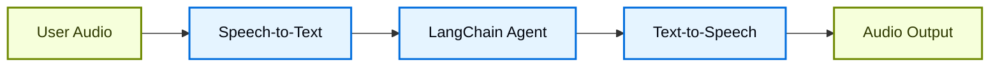
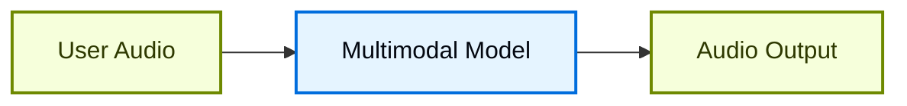

# Xây dựng voice agent với LangChain

## Tổng quan

Giao diện chat đã thống trị cách chúng ta tương tác với AI, nhưng các đột phá gần đây trong multimodal AI đang mở ra những khả năng mới đầy hứng thú. Các generative model chất lượng cao và hệ thống text-to-speech (TTS) biểu cảm hiện cho phép xây dựng agent cảm giác giống bạn đồng hành hội thoại hơn là công cụ đơn thuần.

Voice agent là một ví dụ điển hình. Thay vì dùng bàn phím và chuột để gõ input vào agent, bạn có thể dùng lời nói để tương tác với nó. Đây có thể là cách tương tác với AI tự nhiên và cuốn hút hơn, đặc biệt hữu ích trong một số ngữ cảnh nhất định.

### Voice agent là gì?

Voice agent là [agent](agents.md) có thể tham gia hội thoại bằng giọng nói tự nhiên với người dùng. Các agent này kết hợp speech recognition (nhận diện giọng nói), natural language processing, generative AI, và công nghệ text-to-speech để tạo ra các cuộc hội thoại liền mạch, tự nhiên.

Chúng phù hợp với nhiều use case, bao gồm:

* Customer support (hỗ trợ khách hàng)
* Personal assistant (trợ lý cá nhân)
* Giao diện hands-free (rảnh tay)
* Coaching và training

### Voice agent hoạt động như thế nào?

Ở mức tổng quan, mọi voice agent đều cần xử lý ba tác vụ:

1. **Listen** (nghe): thu âm và chuyển thành văn bản
2. **Think** (suy nghĩ): diễn giải ý định, suy luận, lập kế hoạch
3. **Speak** (nói): sinh âm thanh và stream trả về cho người dùng

Sự khác biệt nằm ở cách các bước này được sắp xếp và kết nối với nhau. Trong thực tế, các agent production theo một trong hai kiến trúc chính sau:

#### 1. Kiến trúc STT > Agent > TTS (kiểu "Sandwich")

Kiến trúc Sandwich kết hợp ba thành phần riêng biệt: speech-to-text (STT), agent LangChain dạng văn bản, và text-to-speech (TTS).



**Ưu điểm:**

* Kiểm soát toàn diện từng thành phần (đổi provider STT/TTS tuỳ ý)
* Tiếp cận được các khả năng mới nhất từ model văn bản hiện đại
* Hành vi minh bạch với ranh giới rõ ràng giữa các thành phần

**Nhược điểm:**

* Cần điều phối nhiều dịch vụ
* Thêm độ phức tạp trong việc quản lý pipeline
* Chuyển đổi từ speech sang text làm mất thông tin (ví dụ: ngữ điệu, cảm xúc)

#### 2. Kiến trúc Speech-to-Speech (S2S)

Speech-to-speech dùng một multimodal model xử lý audio input và sinh audio output một cách native.



**Ưu điểm:**

* Kiến trúc đơn giản hơn với ít thành phần di chuyển
* Độ trễ thường thấp hơn cho tương tác đơn giản
* Xử lý audio trực tiếp giữ được ngữ điệu và sắc thái của giọng nói

**Nhược điểm:**

* Lựa chọn model hạn chế, rủi ro phụ thuộc provider cao hơn
* Tính năng có thể chậm hơn so với model văn bản
* Kém minh bạch hơn trong cách audio được xử lý
* Khả năng kiểm soát và tuỳ biến bị giảm

Hướng dẫn này trình bày **kiến trúc sandwich** để cân bằng giữa hiệu năng, khả năng kiểm soát, và khả năng tiếp cận các tính năng model hiện đại. Kiến trúc sandwich có thể đạt độ trễ dưới 700ms với một số provider STT và TTS, trong khi vẫn kiểm soát được các thành phần module.

### Tổng quan ứng dụng demo

Chúng ta sẽ cùng xây dựng một voice agent dùng kiến trúc sandwich. Agent sẽ quản lý đơn hàng cho một cửa hàng sandwich. Ứng dụng sẽ minh hoạ cả ba thành phần của kiến trúc sandwich, dùng [AssemblyAI](https://www.assemblyai.com/) cho STT và [Cartesia](https://cartesia.ai/) cho TTS (mặc dù adapter có thể được xây dựng cho hầu hết provider khác).

Một ứng dụng tham khảo đầy đủ end-to-end có sẵn tại repository [voice-sandwich-demo](https://github.com/langchain-ai/voice-sandwich-demo). Chúng ta sẽ đi qua ứng dụng đó ở đây.

Demo dùng WebSocket cho giao tiếp hai chiều theo thời gian thực giữa trình duyệt và server. Kiến trúc tương tự có thể được điều chỉnh cho các phương thức truyền tải khác như hệ thống điện thoại (Twilio, Vonage) hoặc kết nối WebRTC.

### Kiến trúc

Demo triển khai một streaming pipeline nơi mỗi giai đoạn xử lý dữ liệu bất đồng bộ (asynchronously):

**Client (Trình duyệt)**

* Thu âm microphone và encode thành PCM
* Thiết lập kết nối WebSocket tới backend server
* Stream các đoạn audio tới server theo thời gian thực
* Nhận và phát lại audio giọng nói đã tổng hợp

**Server (Python)**

* Chấp nhận kết nối WebSocket từ client

* Điều phối pipeline ba bước:
    * [Speech-to-text (STT)](#1-speech-to-text): chuyển tiếp audio tới provider STT (ví dụ AssemblyAI), nhận sự kiện transcript
    * [Agent](#2-langchain-agent): xử lý transcript bằng agent LangChain, stream token phản hồi
    * [Text-to-speech (TTS)](#3-text-to-speech): gửi phản hồi của agent tới provider TTS (ví dụ Cartesia), nhận các đoạn audio

* Trả audio đã tổng hợp về client để phát

Pipeline dùng async generator để cho phép streaming ở mỗi giai đoạn. Điều này cho phép các thành phần downstream bắt đầu xử lý trước khi các giai đoạn upstream hoàn tất, giảm thiểu độ trễ end-to-end.

## Thiết lập

Để biết hướng dẫn cài đặt và thiết lập chi tiết, xem [repository README](https://github.com/langchain-ai/voice-sandwich-demo#readme).

## 1. Speech-to-text

Giai đoạn STT chuyển một luồng audio đầu vào thành transcript văn bản. Cách triển khai dùng pattern producer-consumer để xử lý streaming audio và nhận transcript đồng thời.

### Khái niệm chính

**Pattern Producer-Consumer**: các đoạn audio được gửi tới dịch vụ STT đồng thời với việc nhận sự kiện transcript. Điều này cho phép việc chuyển văn bản bắt đầu trước khi toàn bộ audio đến nơi.

**Các loại sự kiện**:

* `stt_chunk`: transcript một phần, được cung cấp khi dịch vụ STT đang xử lý audio
* `stt_output`: transcript cuối cùng, đã định dạng, kích hoạt việc xử lý của agent

**Kết nối WebSocket**: duy trì kết nối liên tục tới API STT thời gian thực của AssemblyAI, cấu hình cho audio PCM 16kHz với định dạng turn tự động.

### Triển khai

```python
from typing import AsyncIterator
import asyncio
from assemblyai_stt import AssemblyAISTT
from events import VoiceAgentEvent

async def stt_stream(
    audio_stream: AsyncIterator[bytes],
) -> AsyncIterator[VoiceAgentEvent]:
    """
    Transform stream: Audio (Bytes) → Voice Events (VoiceAgentEvent)

    Uses a producer-consumer pattern where:
    - Producer: Reads audio chunks and sends them to AssemblyAI
    - Consumer: Receives transcription events from AssemblyAI
    """
    stt = AssemblyAISTT(sample_rate=16000)

    async def send_audio():
        """Background task that pumps audio chunks to AssemblyAI."""
        try:
            async for audio_chunk in audio_stream:
                await stt.send_audio(audio_chunk)
        finally:
            # Signal completion when audio stream ends
            await stt.close()

    # Launch audio sending in background
    send_task = asyncio.create_task(send_audio())

    try:
        # Receive and yield transcription events as they arrive
        async for event in stt.receive_events():
            yield event
    finally:
        # Cleanup
        with contextlib.suppress(asyncio.CancelledError):
            send_task.cancel()
            await send_task
        await stt.close()
```

Ứng dụng triển khai một client AssemblyAI để quản lý kết nối WebSocket và parse message. Xem bên dưới cho phần triển khai; các adapter tương tự có thể xây dựng cho các provider STT khác.

**AssemblyAI Client**

```python
class AssemblyAISTT:
    def __init__(self, api_key: str | None = None, sample_rate: int = 16000):
        self.api_key = api_key or os.getenv("ASSEMBLYAI_API_KEY")
        self.sample_rate = sample_rate
        self._ws: WebSocketClientProtocol | None = None

    async def send_audio(self, audio_chunk: bytes) -> None:
        """Send PCM audio bytes to AssemblyAI."""
        ws = await self._ensure_connection()
        await ws.send(audio_chunk)

    async def receive_events(self) -> AsyncIterator[STTEvent]:
        """Yield STT events as they arrive from AssemblyAI."""
        async for raw_message in self._ws:
            message = json.loads(raw_message)

            if message["type"] == "Turn":
                # Final formatted transcript
                if message.get("turn_is_formatted"):
                    yield STTOutputEvent.create(message["transcript"])
                # Partial transcript
                else:
                    yield STTChunkEvent.create(message["transcript"])

    async def _ensure_connection(self) -> WebSocketClientProtocol:
        """Establish WebSocket connection if not already connected."""
        if self._ws is None:
            url = f"wss://streaming.assemblyai.com/v3/ws?sample_rate={self.sample_rate}&format_turns=true"
            self._ws = await websockets.connect(
                url,
                additional_headers={"Authorization": self.api_key}
            )
        return self._ws
```

## 2. LangChain agent

Giai đoạn agent xử lý transcript văn bản thông qua một [agent](agents.md) LangChain và stream token phản hồi. Ở đây, chúng ta stream toàn bộ [text content block](messages.md#content-block-reference) do agent sinh ra.

### Khái niệm chính

**Streaming Responses**: agent dùng [`stream_events(version="v3")`](streaming.md) với `stream.messages` để phát ra token phản hồi ngay khi được sinh, thay vì chờ phản hồi hoàn chỉnh. Điều này cho phép giai đoạn TTS bắt đầu tổng hợp ngay lập tức.

**Conversation Memory**: một [checkpointer](short-term-memory.md) duy trì state hội thoại qua các lượt bằng một thread ID duy nhất. Điều này cho phép agent tham chiếu các trao đổi trước đó trong cuộc hội thoại.

### Triển khai

```python
from langchain_core.utils.uuid import uuid7
from langchain.agents import create_agent
from langchain.messages import HumanMessage
from langgraph.checkpoint.memory import InMemorySaver

# Định nghĩa tool cho agent
def add_to_order(item: str, quantity: int) -> str:
    """Add an item to the customer's sandwich order."""
    return f"Added {quantity} x {item} to the order."

def confirm_order(order_summary: str) -> str:
    """Confirm the final order with the customer."""
    return f"Order confirmed: {order_summary}. Sending to kitchen."

# Tạo agent với tool và memory
agent = create_agent(
    model="google_genai:gemini-3.6-flash",  # Chọn model của bạn
    tools=[add_to_order, confirm_order],
    system_prompt="""You are a helpful sandwich shop assistant.
    Your goal is to take the user's order. Be concise and friendly.
    Do NOT use emojis, special characters, or markdown.
    Your responses will be read by a text-to-speech engine.""",
    checkpointer=InMemorySaver(),
)

async def agent_stream(
    event_stream: AsyncIterator[VoiceAgentEvent],
) -> AsyncIterator[VoiceAgentEvent]:
    """
    Transform stream: Voice Events → Voice Events (with Agent Responses)

    Passes through all upstream events and adds agent_chunk events
    when processing STT transcripts.
    """
    # Sinh thread ID duy nhất cho conversation memory
    thread_id = str(uuid7())

    async for event in event_stream:
        # Pass through all upstream events
        yield event

        # Process final transcripts through the agent
        if event.type == "stt_output":
            # Stream agent response with conversation context
            stream = await agent.astream_events(
                {"messages": [HumanMessage(content=event.transcript)]},
                {"configurable": {"thread_id": thread_id}},
                version="v3",
            )

            # Yield agent response chunks as they arrive
            async for message in stream.messages:
                async for token in message.text:
                    yield AgentChunkEvent.create(token)
```

## 3. Text-to-speech

Giai đoạn TTS tổng hợp văn bản phản hồi của agent thành audio và stream trả về client. Giống giai đoạn STT, nó dùng pattern producer-consumer để xử lý đồng thời việc gửi text và nhận audio.

### Khái niệm chính

**Xử lý đồng thời**: cách triển khai gộp hai luồng bất đồng bộ:

* **Xử lý upstream**: pass through mọi sự kiện và gửi các đoạn text của agent tới provider TTS
* **Nhận audio**: nhận các đoạn audio đã tổng hợp từ provider TTS

**Streaming TTS**: một số provider (như [Cartesia](https://cartesia.ai/)) bắt đầu tổng hợp audio ngay khi nhận được text, cho phép phát audio bắt đầu trước khi agent sinh xong toàn bộ phản hồi.

**Event Passthrough**: mọi sự kiện upstream chảy qua không đổi, cho phép client hoặc các observer khác theo dõi toàn bộ state của pipeline.

### Triển khai

```python
from cartesia_tts import CartesiaTTS
from utils import merge_async_iters

async def tts_stream(
    event_stream: AsyncIterator[VoiceAgentEvent],
) -> AsyncIterator[VoiceAgentEvent]:
    """
    Transform stream: Voice Events → Voice Events (with Audio)

    Merges two concurrent streams:
    1. process_upstream(): passes through events and sends text to Cartesia
    2. tts.receive_events(): yields audio chunks from Cartesia
    """
    tts = CartesiaTTS()

    async def process_upstream() -> AsyncIterator[VoiceAgentEvent]:
        """Process upstream events and send agent text to Cartesia."""
        async for event in event_stream:
            # Pass through all events
            yield event
            # Send agent text to Cartesia for synthesis
            if event.type == "agent_chunk":
                await tts.send_text(event.text)

    try:
        # Merge upstream events with TTS audio events
        # Both streams run concurrently
        async for event in merge_async_iters(
            process_upstream(),
            tts.receive_events()
        ):
            yield event
    finally:
        await tts.close()
```

Ứng dụng triển khai một client Cartesia để quản lý kết nối WebSocket và streaming audio. Xem bên dưới cho phần triển khai; các adapter tương tự có thể xây dựng cho các provider TTS khác.

**Cartesia Client**

```python
import base64
import json
import websockets

class CartesiaTTS:
    def __init__(
        self,
        api_key: Optional[str] = None,
        voice_id: str = "f6ff7c0c-e396-40a9-a70b-f7607edb6937",
        model_id: str = "sonic-3",
        sample_rate: int = 24000,
        encoding: str = "pcm_s16le",
    ):
        self.api_key = api_key or os.getenv("CARTESIA_API_KEY")
        self.voice_id = voice_id
        self.model_id = model_id
        self.sample_rate = sample_rate
        self.encoding = encoding
        self._ws: WebSocketClientProtocol | None = None

    def _generate_context_id(self) -> str:
        """Generate a valid context_id for Cartesia."""
        timestamp = int(time.time() * 1000)
        counter = self._context_counter
        self._context_counter += 1
        return f"ctx_{timestamp}_{counter}"

    async def send_text(self, text: str | None) -> None:
        """Send text to Cartesia for synthesis."""
        if not text or not text.strip():
            return

        ws = await self._ensure_connection()
        payload = {
            "model_id": self.model_id,
            "transcript": text,
            "voice": {
                "mode": "id",
                "id": self.voice_id,
            },
            "output_format": {
                "container": "raw",
                "encoding": self.encoding,
                "sample_rate": self.sample_rate,
            },
            "language": self.language,
            "context_id": self._generate_context_id(),
        }
        await ws.send(json.dumps(payload))

    async def receive_events(self) -> AsyncIterator[TTSChunkEvent]:
        """Yield audio chunks as they arrive from Cartesia."""
        async for raw_message in self._ws:
            message = json.loads(raw_message)

            # Decode and yield audio chunks
            if "data" in message and message["data"]:
                audio_chunk = base64.b64decode(message["data"])
                if audio_chunk:
                    yield TTSChunkEvent.create(audio_chunk)

    async def _ensure_connection(self) -> WebSocketClientProtocol:
        """Establish WebSocket connection if not already connected."""
        if self._ws is None:
            url = (
                f"wss://api.cartesia.ai/tts/websocket"
                f"?api_key={self.api_key}&cartesia_version={self.cartesia_version}"
            )
            self._ws = await websockets.connect(url)

        return self._ws
```

### LangSmith

Nhiều ứng dụng bạn xây dựng với LangChain sẽ chứa nhiều bước với nhiều lệnh gọi LLM. Khi các ứng dụng này ngày càng phức tạp, việc có thể kiểm tra chính xác những gì đang xảy ra bên trong chain hoặc agent trở nên rất quan trọng. Cách tốt nhất để làm điều này là dùng [LangSmith](https://smith.langchain.com?utm_source=docs&utm_medium=cta&utm_campaign=langsmith-signup&utm_content=oss-langchain-voice-agent).

Sau khi đăng ký qua link ở trên, hãy đảm bảo thiết lập biến môi trường để bắt đầu ghi log trace:

```shell
export LANGSMITH_TRACING="true"
export LANGSMITH_API_KEY="..."
```

Hoặc thiết lập trong Python:

```python
import getpass
import os

os.environ["LANGSMITH_TRACING"] = "true"
os.environ["LANGSMITH_API_KEY"] = getpass.getpass()
```

## Ghép mọi thứ lại với nhau

Pipeline hoàn chỉnh nối chuỗi ba giai đoạn lại với nhau:

```python
from langchain_core.runnables import RunnableGenerator

pipeline = (
    RunnableGenerator(stt_stream)      # Audio → STT events
    | RunnableGenerator(agent_stream)  # STT events → Agent events
    | RunnableGenerator(tts_stream)    # Agent events → TTS audio
)

# Use in WebSocket endpoint
@app.websocket("/ws")
async def websocket_endpoint(websocket: WebSocket):
    await websocket.accept()

    async def websocket_audio_stream():
        """Yield audio bytes from WebSocket."""
        while True:
            data = await websocket.receive_bytes()
            yield data

    # Transform audio through pipeline
    output_stream = pipeline.atransform(websocket_audio_stream())

    # Send TTS audio back to client
    async for event in output_stream:
        if event.type == "tts_chunk":
            await websocket.send_bytes(event.audio)
```

Chúng ta dùng [RunnableGenerator](https://reference.langchain.com/python/langchain_core/runnables/#langchain_core.runnables.base.RunnableGenerator) để ghép từng bước của pipeline. Đây là một abstraction mà LangChain dùng nội bộ để quản lý [streaming xuyên suốt các thành phần](https://reference.langchain.com/python/langchain_core/runnables/).

Mỗi giai đoạn xử lý sự kiện độc lập và đồng thời: việc chuyển audio thành văn bản bắt đầu ngay khi audio đến, agent bắt đầu suy luận ngay khi có transcript, và việc tổng hợp giọng nói bắt đầu ngay khi text của agent được sinh ra. Kiến trúc này có thể đạt độ trễ dưới 700ms, hỗ trợ hội thoại tự nhiên.

Để biết thêm về xây dựng agent với LangChain, xem [hướng dẫn Agents](agents.md).
