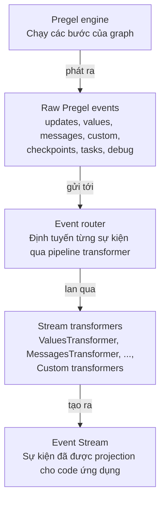
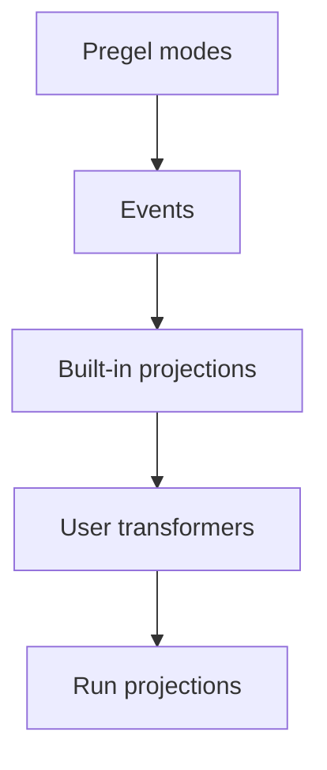

# Event streaming

> Stream các lượt chạy LangGraph với các projection có kiểu cho message, state, subgraph, output, và extension.

Event streaming là mô hình streaming trong-tiến-trình (in-process) được khuyến nghị cho phần lớn code ứng dụng LangGraph. Nó trả về một đối tượng run stream có thể được tiêu thụ theo nhiều cách cùng lúc.

## Bắt đầu nhanh

```py
stream = graph.stream_events({
    "messages": [{"role": "user", "content": "What is 42 * 17?"}],
}, version="v3")

for message in stream.messages:
    for token in message.text:
        print(token, end="", flush=True)

final_state = stream.output
```

Để stream với một graph đã triển khai (deploy) sau Agent Server, xem [LangSmith Streaming API](https://docs.langchain.com/langsmith/streaming).

## Các thành phần khớp với nhau như thế nào

Streaming stack có hai lớp chính:

1. **Streaming** phát ra các sự kiện thực thi graph thô từ Pregel engine.
2. **Event streaming** chuẩn hoá các sự kiện đó, đưa chúng qua các stream transformer, và expose các projection có kiểu.



Event router là cầu nối giữa hai lớp này. Nó nhận các sự kiện Pregel đã chuẩn hoá và truyền từng sự kiện qua các stream transformer đã đăng ký. Các transformer dựng sẵn tạo ra các projection chuẩn như `stream.messages`, `stream.values`, `stream.subgraphs`, và `stream.output`. Các transformer tuỳ chỉnh có thể thêm các projection đặc thù cho ứng dụng dưới `stream.extensions`.

## Event streaming cung cấp những gì

Run stream expose các projection có kiểu trên cùng một luồng sự kiện gốc:

| Projection            | Công dụng                                                |
| ----------------------- | ------------------------------------------------------------ |
| `stream`                 | Duyệt qua mọi sự kiện protocol.                                |
| `stream.messages`        | Stream message từ chat model và token delta.                  |
| `stream.values`          | Duyệt các snapshot state và chờ giá trị cuối cùng.             |
| `stream.output`          | Chờ output cuối cùng.                                          |
| `stream.subgraphs`       | Khám phá và quan sát các lượt thực thi graph lồng nhau.        |
| `stream.interrupts`      | Kiểm tra payload interrupt human-in-the-loop.                  |
| `stream.interrupted`     | Kiểm tra xem lượt chạy có tạm dừng chờ input người dùng không.  |
| `stream.extensions`      | Tiêu thụ các projection stream transformer tuỳ chỉnh.          |

Nhiều consumer có thể đọc các projection này đồng thời. Đọc `stream.messages` không tiêu thụ mất các sự kiện mà `stream.values`, `stream.subgraphs`, hoặc `stream.output` cần.

Event streaming nằm ở một lớp cao hơn [streaming](./streaming.md), lớp expose các sự kiện thực thi graph thô qua các chế độ `stream_mode` như `updates`, `values`, `messages`, `custom`, `checkpoints`, `tasks`, và `debug`. Dùng streaming khi bạn cần truy cập cấp thấp vào các chế độ đó; dùng event streaming khi code ứng dụng được lợi từ các projection có kiểu.

## Stream message

Dùng `stream.messages` cho output của chat model:

```py
stream = graph.stream_events(input, version="v3")

for message in stream.messages:
    text = str(message.text)
    usage = message.output.usage_metadata

    print(text)
    print(usage)
```

`message.text` có thể lặp (iterable) trong code đồng bộ. Lặp qua nó để lấy output theo từng token, hoặc gọi `str(message.text)` để lấy toàn bộ văn bản.

`message.reasoning` expose các reasoning delta, và `message.tool_calls` expose các chunk tham số tool-call. Nếu bạn cần text, reasoning, và chunk tool-call theo đúng thứ tự đến, hãy lặp qua các sự kiện thô của message stream thay vì từng projection riêng lẻ.

## Stream subgraph

Dùng `stream.subgraphs` để quan sát công việc của graph lồng nhau mà không cần parse chuỗi namespace:

```py
stream = graph.stream_events(input, version="v3")

for subgraph in stream.subgraphs:
    print(subgraph.graph_name, subgraph.path)

    for message in subgraph.messages:
        print(message.text)
```

`subgraph.graph_name` là `name` của graph hoặc agent đã compile. Một agent có tên được dispatch từ một tool (ví dụ, một `create_agent(name=...)` được gọi qua tool `task` của Deep Agents) sẽ xuất hiện ở đây dưới tên đó, và sự kiện `lifecycle` mở phạm vi (scope) này mang một `cause` trỏ ngược về tool call đã dispatch nó. Xem [Lifecycle](#lifecycle) để biết thêm thông tin.

Đối với các stream đặc thù cho từng sản phẩm, xem [Deep Agents streaming](https://docs.langchain.com/oss/python/deepagents/event-streaming) cho subagent stream và [LangChain agent streaming](../langchain/streaming.md) cho tool call và sự kiện middleware.

## Stream state

Dùng `stream.values` để stream toàn bộ snapshot state sau mỗi bước:

```py
stream = graph.stream_events(input, version="v3")

for snapshot in stream.values:
    print(snapshot)

final_state = stream.output
```

## Stream nhiều projection

Để tiêu thụ đồng thời trong code async, dùng `astream_events` với `asyncio.gather`:

```py
import asyncio

stream = await graph.astream_events(input, version="v3")

async def consume_messages():
    async for message in stream.messages:
        print(f"[llm] node={message.node}")

async def consume_subgraphs():
    async for subgraph in stream.subgraphs:
        print(f"[subgraph] path={subgraph.path}")

await asyncio.gather(consume_messages(), consume_subgraphs())
```

Với code đồng bộ, dùng `stream.interleave(...)` để tiêu thụ nhiều projection theo đúng thứ tự đến nghiêm ngặt:

```py
stream = graph.stream_events(input, version="v3")

for name, item in stream.interleave("values", "messages", "subgraphs"):
    if name == "values":
        print(f"[state] keys={list(item)}")
    elif name == "messages":
        print(f"[llm] node={item.node}")
    elif name == "subgraphs":
        print(f"[subgraph] path={item.path}")
```

## Resume sau một interrupt

Khi một graph tạm dừng để chờ input từ con người, hãy kiểm tra `stream.interrupted` và `stream.interrupts`, sau đó resume bằng cách gọi lại `stream_events(..., version="v3")` với `Command`.

Việc resume đòi hỏi một graph được compile với checkpointer và một config mang thread ID, xem [persistence](./persistence.md).

```py
from langgraph.types import Command

stream = graph.stream_events(input, version="v3")

for message in stream.messages:
    print(message.text)

if stream.interrupted:
    print(stream.interrupts)

stream = graph.stream_events(
    Command(resume={"decisions": [{"type": "approve"}]}),
    version="v3",
)
final_state = stream.output
```

## Stream toàn bộ sự kiện protocol

Dùng chính đối tượng run khi bạn muốn luồng sự kiện protocol thô:

```py
stream = graph.stream_events({
    "messages": [{"role": "user", "content": "What is 42 * 17?"}],
}, version="v3")

for event in stream:
    namespace = event["params"]["namespace"]
    print(namespace, event["method"], event["params"]["data"])
```

Mỗi sự kiện là một envelope `ProtocolEvent` bọc một payload đặc thù cho từng channel. Đây cũng chính là hình dạng (shape) mà `process(event)` của một transformer nhận được.

```py
class ProtocolEvent(TypedDict):
    seq: int                    # tăng dần nghiêm ngặt trong một lượt chạy; dùng để sắp thứ tự
    method: str                 # tên channel: "messages", "values", "updates", "custom", "tools", "lifecycle", ...
    params: ProtocolEventParams


class ProtocolEventParams(TypedDict):
    namespace: list[str]        # đường dẫn các đoạn "<name>:<runtime_id>" từ graph gốc; [] là gốc
    timestamp: int              # mili-giây theo wall-clock; có thể trôi, đừng dựa vào đây để sắp thứ tự
    data: Any                   # payload đặc thù theo channel; hình dạng phụ thuộc vào `method`
```

`namespace` là một đường dẫn từ graph gốc tới phạm vi (scope) đã phát ra sự kiện. Gốc là mảng rỗng `[]`. Mỗi lượt thực thi con thêm một đoạn `"name:runtime_id"`, nên một tool call lồng nhau bên trong một subgraph sẽ trông như `["researcher:6f4d", "tools:91ac"]`. Phần tên trước dấu `:` là tên graph hoặc node ổn định; phần hậu tố là một runtime ID cho từng lượt gọi. Tự lọc các sự kiện thô theo namespace khi bạn chỉ quan tâm tới một subtree cụ thể: `stream.subgraphs` đã tự làm việc này cho các lượt thực thi graph lồng nhau.

## Channel và vòng đời sự kiện

Các sự kiện thô chảy trên các channel. Tên channel xuất hiện như trường `method` của sự kiện; mỗi channel phát ra một hình dạng sự kiện cụ thể.

| Channel           | Mục đích                                                          |
| ------------------- | ---------------------------------------------------------------------- |
| `values`             | Snapshot đầy đủ của state graph.                                        |
| `updates`            | Delta state theo từng node.                                            |
| `messages`           | Output của chat model, xoay quanh content block.                       |
| `tools`              | Sự kiện tool call bắt đầu, output đã stream, kết thúc, và lỗi.          |
| `lifecycle`          | Thay đổi trạng thái của run, subgraph, và subagent.                     |
| `checkpoints`        | Envelope checkpoint nhẹ cho việc phân nhánh và time travel.             |
| `input`              | Yêu cầu và phản hồi input human-in-the-loop.                            |
| `tasks`              | Sự kiện tạo và kết quả Pregel task.                                     |
| `custom`             | Payload do người dùng định nghĩa từ code graph.                        |
| `custom:<name>`      | Output stream transformer do ứng dụng định nghĩa.                       |

Các projection có kiểu (`stream.messages`, `stream.values`, v.v.) được xây dựng từ các channel này. Tên channel xuất hiện dưới trường `method` trên sự kiện thô khi bạn duyệt trực tiếp qua đối tượng run.

### Messages

Channel `messages` mô hình hoá output dưới dạng content block. Trường `event` của data là một trong:

* `message-start`
* `content-block-start`
* `content-block-delta`
* `content-block-finish`
* `message-finish`

Content block có ranh giới rõ ràng: một block bắt đầu, phát ra không hoặc nhiều delta, và kết thúc trước khi block tiếp theo trong cùng message bắt đầu. Điều này làm cho việc stream token, reasoning block, tool-call block, và nội dung đa phương tiện (multimodal) trở nên tường minh mà không cần các định dạng đặc thù theo nhà cung cấp. `message-finish` có thể bao gồm token usage; các lỗi model-call không thể khôi phục sẽ đến dưới dạng sự kiện lỗi message.

Để tiêu thụ trực tiếp các sự kiện content-block thô thay vì dùng projection `stream.messages`:

```py
for event in stream:
    if event["method"] != "messages":
        continue

    data = event["params"]["data"][0]
    if not isinstance(data, dict):
        continue
    if data.get("event") != "content-block-delta":
        continue

    block = data.get("delta") or {}
    if block.get("type") == "text-delta":
        print(block.get("text", ""), end="", flush=True)
    elif block.get("type") == "reasoning-delta":
        print(f"[thinking]{block.get('reasoning', '')}", end="", flush=True)
```

### Tools

Channel `tools` expose việc thực thi tool. Trường `event` của data là một trong:

* `tool-started`
* `tool-output-delta`
* `tool-finished`
* `tool-error`

Các sự kiện tool được liên kết với nhau qua tool call ID, nên một lượt thực thi tool có thể được nối lại với content block tool-call gốc của nó trên channel `messages`.

### Lifecycle

Channel `lifecycle` theo dõi trạng thái của run gốc, subgraph, và subagent. Trường `event` của data là một trong:

* `started`
* `running`
* `completed`
* `failed`
* `interrupted`

Ngoài `event`, data lifecycle có thể bao gồm `graph_name`, `error`, và `cause` tuỳ chọn, mô tả lý do một scope con bắt đầu (tool call cha, fan-out send, chuyển đổi edge).

## Xây dựng projection của riêng bạn

Stream transformer là lớp projection trong event streaming. Chúng quan sát các sự kiện protocol, tự duy trì state riêng, và expose các view phái sinh của một lượt chạy, những thứ như hoạt động tool, tổng số token, sự kiện tiến độ, artifact, hoặc message cho một protocol khác. `StreamChannel` là primitive projection mà các transformer dùng để publish các view đó.

Các projection dựng sẵn (`stream.messages`, `stream.values`, `stream.subgraphs`, `stream.output`) và các projection đặc thù theo sản phẩm (`stream.tool_calls` của LangChain, `stream.subagents` của Deep Agents) tự bản thân chúng cũng là các transformer dùng cùng một contract này. Các transformer của người dùng xếp chồng lên trên qua đăng ký tại thời điểm compile hoặc gọi, và projection của chúng xuất hiện dưới `stream.extensions`.

Hãy viết một transformer riêng khi các projection có sẵn không khớp với hình dạng mà ứng dụng cần.

### Cách các transformer hoạt động

Event streaming bắt đầu bằng việc stream output từ Pregel engine của LangGraph. Runtime chuẩn hoá các chunk đó thành các sự kiện protocol, sau đó một stream handler định tuyến từng sự kiện qua một chồng (stack) các stream transformer.



Stream handler là bộ điều phối trung tâm cho một stream. Với mỗi sự kiện protocol, nó:

1. Gọi hook `process(event)` của từng transformer đã đăng ký theo thứ tự.
2. Nối các lượt push `StreamChannel` có tên trở lại vào luồng sự kiện protocol.
3. Lưu sự kiện vào run stream trừ khi một transformer chặn (suppress) nó.
4. Gọi `finalize()` hoặc `fail()` trên mọi transformer khi lượt chạy kết thúc.

Transformer chỉ mang tính quan sát. Chúng không gọi ngược vào graph runtime. Thay vào đó, chúng tiêu thụ sự kiện và đẩy các giá trị phái sinh vào `StreamChannel`, promise, hoặc các đối tượng projection khác.

### Hình dạng transformer

Một transformer triển khai interface `StreamTransformer`:

```py
from langgraph.stream import ProtocolEvent, StreamTransformer


class MyTransformer(StreamTransformer):
    def init(self) -> dict:
        ...

    def process(self, event: ProtocolEvent) -> bool:
        ...

    def finalize(self) -> None:
        ...

    def fail(self, err: BaseException) -> None:
        ...
```

* `init()` tạo đối tượng projection. Projection transformer của người dùng xuất hiện dưới `stream.extensions`.
* `process()` quan sát từng sự kiện protocol. Xem [Stream toàn bộ sự kiện protocol](#stream-toan-bo-su-kien-protocol) để biết hình dạng `ProtocolEvent`. Chỉ trả về `false` khi bạn cố ý muốn chặn sự kiện gốc.
* `finalize()` đóng hoặc resolve các projection không phải channel sau một stream thành công.
* `fail()` lan truyền lỗi tới các projection không phải channel.

### Khai báo các stream mode bắt buộc

`required_stream_modes` kiểm soát graph bên dưới phát ra những Pregel stream mode nào trong quá trình stream. Runtime lấy hợp (union) của `required_stream_modes` từ mọi transformer đã đăng ký, và truyền hợp đó làm tham số `stream_mode` cho lệnh gọi `.stream()` của graph. **Các mode mà không transformer nào yêu cầu sẽ không bao giờ được phát ra**: khai báo `("custom",)` chính là điều khiến các sự kiện `custom` chảy qua lượt chạy.

```py
class CustomTransformer(StreamTransformer):
    required_stream_modes = ("custom",)  # [!code highlight]

    def process(self, event: ProtocolEvent) -> bool:
        if event["method"] == "custom":
            ...
        return True
```

`process()` nhận mọi sự kiện graph phát ra và chịu trách nhiệm lọc theo `event["method"]`. Khai báo này chỉ bật việc phát sinh ở thượng nguồn; nó không thu hẹp những gì `process()` nhìn thấy. Các giá trị hợp lệ là các Pregel stream mode: `"messages"`, `"tools"`, `"custom"`, `"values"`, `"updates"`, `"checkpoints"`, `"tasks"`, `"debug"`. Mỗi transformer phải khai báo mọi mode mà nó tác động lên: một mode bị bỏ sót sẽ không được graph phát ra và không bao giờ tới `process()`.

### StreamChannel

`StreamChannel` là primitive projection mà một transformer dùng để stream giá trị. Nó luôn expose một stream có thể lặp tại `stream.extensions.<name>`. Đối số của constructor quyết định liệu mỗi `push()` có đồng thời chảy vào luồng sự kiện chính của lượt chạy dưới dạng sự kiện `custom:<name>` hay không, tức là liệu giá trị của projection có xuất hiện khi duyệt các sự kiện protocol thô hay không.

| Nhu cầu                                              | Dùng                    |
| ------------------------------------------------------- | -------------------------- |
| Chỉ projection kênh phụ (side-channel)                    | `StreamChannel()`           |
| Đồng thời đẩy mỗi push vào luồng sự kiện chính            | `StreamChannel(name)`       |

Payload của channel có tên phải serialize được, vì mỗi giá trị được push cũng trở thành một sự kiện protocol `custom:<name>` trong luồng chính. Hãy giữ promise, async iterable, instance của class, và các handle trong-tiến-trình khác trong các channel không có tên.

Stream handler sở hữu vòng đời của channel. Khi `init()` trả về một channel, handler sẽ đóng hoặc fail nó thay cho bạn khi lượt chạy kết thúc. Transformer chỉ push giá trị.

### Ví dụ: channel có tên

Truyền một tên chuỗi vào `StreamChannel` để expose một projection dạng stream qua `stream.extensions` *và* chuyển tiếp mỗi giá trị được push vào luồng sự kiện chính của lượt chạy dưới dạng sự kiện protocol `custom:<name>`:

```py
from typing import TypedDict

from langgraph.stream import ProtocolEvent, StreamChannel, StreamTransformer


class ToolActivity(TypedDict):
    name: str
    status: str


class ToolActivityTransformer(StreamTransformer):
    required_stream_modes = ("tools",)

    def __init__(self, scope: tuple[str, ...] = ()) -> None:
        super().__init__(scope)
        self.activity = StreamChannel[ToolActivity]("tool_activity")

    def init(self) -> dict:
        return {"tool_activity": self.activity}

    def process(self, event: ProtocolEvent) -> bool:
        if event["method"] != "tools":
            return True

        data = event["params"]["data"]
        if isinstance(data, dict) and data.get("tool_name") and data.get("event"):
            status = "error" if data["event"] == "tool-error" else "started"
            self.activity.push({"name": data["tool_name"], "status": status})
        return True
```

### Ví dụ: channel không tên

Không có tên, channel chỉ là một projection kênh phụ, chỉ truy cập được qua `stream.extensions` nhưng không hiện diện với các consumer đang duyệt sự kiện thô. Đây là lựa chọn đúng cho các projection giữ các handle trong-tiến-trình (promise, async iterable, instance của class) không thể serialize vào luồng sự kiện chính.

Ví dụ dưới đây kết hợp một channel không tên với `get_stream_writer`, cho phép các node của graph phát ra sự kiện channel `custom` mà transformer sau đó rút (drain) vào projection:

```py
from langgraph.config import get_stream_writer
from langgraph.stream import ProtocolEvent, StreamChannel, StreamTransformer


def node(state):
    writer = get_stream_writer()
    writer({"kind": "progress", "message": "retrieving context"})
    return state


class CustomTransformer(StreamTransformer):
    required_stream_modes = ("custom",)

    def __init__(self, scope: tuple[str, ...] = ()) -> None:
        super().__init__(scope)
        self.log = StreamChannel()

    def init(self) -> dict:
        return {"custom": self.log}

    def process(self, event: ProtocolEvent) -> bool:
        if event["method"] == "custom":
            self.log.push(event["params"]["data"])
        return True


stream = graph.stream_events(input, version="v3", transformers=[CustomTransformer])

for item in stream.extensions["custom"]:
    print(item)
```

### Ví dụ: projection giá trị cuối cùng

Dùng stream không tên, promise, hoặc các đối tượng trong-tiến-trình khác khi projection không nên chảy vào luồng sự kiện chính:

```py
from langgraph.stream import ProtocolEvent, StreamChannel, StreamTransformer


class StatsTransformer(StreamTransformer):
    required_stream_modes = ("messages",)

    def __init__(self, scope: tuple[str, ...] = ()) -> None:
        super().__init__(scope)
        self.total_tokens = 0
        self.total_tokens_log = StreamChannel[int]()

    def init(self) -> dict:
        return {"total_tokens": self.total_tokens_log}

    def process(self, event: ProtocolEvent) -> bool:
        data = event["params"]["data"]
        if isinstance(data, dict):
            usage = data.get("usage") or {}
            self.total_tokens += usage.get("output_tokens") or 0
        return True

    def finalize(self) -> None:
        self.total_tokens_log.push(self.total_tokens)
        self.total_tokens_log.close()
```

### Đăng ký tại thời điểm gọi hoặc thời điểm compile

Truyền transformer tại thời điểm gọi cho việc thử nghiệm cục bộ:

```py
stream = graph.stream_events(
    input,
    version="v3",
    transformers=[StatsTransformer, ToolActivityTransformer],
)
```

Compile transformer vào graph khi mọi lượt chạy của graph đó đều cần tạo ra projection:

```py
graph = builder.compile(
    transformers=[StatsTransformer, ToolActivityTransformer],
)
```

### Dựng sẵn: `ToolCallTransformer`

LangGraph cung cấp sẵn `ToolCallTransformer`. Đăng ký nó để expose `stream.tool_calls` trên một `StateGraph` thuần:

```py
from langgraph.prebuilt import ToolCallTransformer

stream = graph.stream_events(input, version="v3", transformers=[ToolCallTransformer])

for tool_call in stream.tool_calls:
    print(tool_call.tool_name, tool_call.input)
```

## Liên quan

LangGraph định nghĩa các primitive streaming. Để dùng streaming với LangChain hoặc Deep Agents, xem tài liệu sản phẩm liên quan:

* [LangChain agent streaming](../langchain/event-streaming.md) đề cập đến message agent kiểu ReAct, tool call, và cập nhật middleware.
* [Deep Agents streaming](https://docs.langchain.com/oss/python/deepagents/event-streaming) đề cập đến subagent, message lồng nhau, và tool call của subagent.
* [Pattern frontend LangChain](../langchain/frontend/overview.md) và [pattern frontend LangGraph](./frontend/overview.md) trình bày các use case UI được xây dựng trên state đã stream.
* [LangSmith Streaming API](https://docs.langchain.com/langsmith/streaming) đề cập đến việc stream với một graph đã triển khai sau Agent Server.

Các định dạng sự kiện và command ở cấp độ wire được định nghĩa trong repository [Agent Protocol](https://github.com/langchain-ai/agent-protocol) và có thể dùng dưới dạng [`langchain-protocol`](https://pypi.org/project/langchain-protocol/) trên PyPI và [`@langchain/protocol`](https://www.npmjs.com/package/@langchain/protocol) trên npm.

---

!!! info "Kết nối tài liệu này"
    [Kết nối tài liệu này](https://docs.langchain.com/use-these-docs) với Claude, VSCode, và nhiều công cụ khác qua MCP để có câu trả lời theo thời gian thực.

!!! info "Đóng góp"
    [Chỉnh sửa trang này trên GitHub](https://github.com/langchain-ai/docs/edit/main/src/oss/langgraph/event-streaming.mdx) hoặc [báo lỗi](https://github.com/langchain-ai/docs/issues/new/choose).
