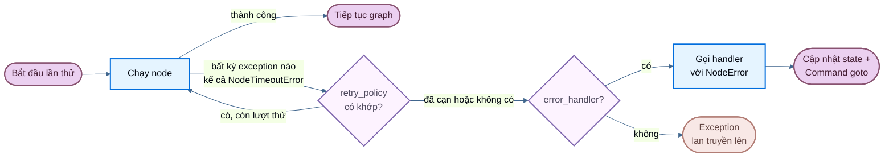

# Fault tolerance (khả năng chịu lỗi)

> Cấu hình timeout, retry theo từng node, và error handler trong LangGraph.

Khi một node thất bại, do một API bên ngoài chậm, một lỗi mạng thoáng qua, hay một exception không được xử lý, LangGraph cung cấp cho bạn ba cơ chế có thể kết hợp để phản ứng:

* [**Retry**](#retries): tự động chạy lại các lần thử thất bại dựa trên loại exception và cấu hình backoff
* [**Timeout**](#timeouts): giới hạn thời gian một lần thử được phép chạy
* [**Xử lý lỗi (error handling)**](#error-handling): chạy một hàm khôi phục sau khi mọi lần retry đã cạn

Dùng [**`set_node_defaults`**](#graph-defaults) để cấu hình các cơ chế này một lần cho toàn bộ node, thay vì lặp lại chúng ở mỗi lệnh gọi `add_node`.

Các cơ chế này kết hợp theo một thứ tự cố định: khi một lần thử node phát sinh bất kỳ exception nào (bao gồm cả [`NodeTimeoutError`](https://reference.langchain.com/python/langgraph/errors/NodeTimeoutError) từ timeout), retry policy sẽ quyết định có retry hay không. Chỉ sau khi retry đã cạn thì error handler mới chạy.

Để dừng một lượt chạy một cách gọn gàng tại ranh giới superstep và tiếp tục sau đó, xem [Graceful shutdown](#graceful-shutdown).

!!! note ""
    Timeout theo từng node và error handler cấp node yêu cầu `langgraph>=1.2`.



## Retries

Một retry policy tự động chạy lại một lần thử node thất bại, dựa trên loại exception và cấu hình backoff.

Truyền `retry_policy=` vào [`add_node`](https://reference.langchain.com/python/langgraph/graph/state/StateGraph/add_node):

```python
from langgraph.types import RetryPolicy

builder.add_node(
    "call_api",
    call_api,
    retry_policy=RetryPolicy(max_attempts=3),
)
```

### Hành vi mặc định

Theo mặc định, `retry_on` dùng `default_retry_on`, sẽ retry trên **mọi** exception ngoại trừ các loại sau (và các lớp con của chúng):

* `ValueError`
* `TypeError`
* `ArithmeticError`
* `ImportError`
* `LookupError`
* `NameError`
* `SyntaxError`
* `RuntimeError`
* `ReferenceError`
* `StopIteration`
* `StopAsyncIteration`
* `OSError`

Đối với các exception từ các thư viện HTTP phổ biến như `requests` và `httpx`, nó chỉ retry trên mã trạng thái 5xx. [`NodeTimeoutError`](https://reference.langchain.com/python/langgraph/errors/NodeTimeoutError) mặc định có thể retry.

### Tham số

| Tham số             | Kiểu                                                                          | Mặc định            | Mô tả                                                                      |
| ------------------- | ------------------------------------------------------------------------------ | ------------------- | --------------------------------------------------------------------------- |
| `max_attempts`      | `int`                                                                          | `3`                  | Số lần thử tối đa, bao gồm cả lần đầu.                                       |
| `initial_interval`  | `float`                                                                        | `0.5`                | Số giây trước lần retry đầu tiên.                                           |
| `backoff_factor`    | `float`                                                                        | `2.0`                | Hệ số nhân áp dụng cho khoảng thời gian sau mỗi lần retry.                   |
| `max_interval`      | `float`                                                                        | `128.0`              | Số giây tối đa giữa các lần retry.                                          |
| `jitter`            | `bool`                                                                         | `True`               | Thêm độ trễ ngẫu nhiên (jitter) vào khoảng thời gian.                       |
| `retry_on`          | `type[Exception] \| Sequence[type[Exception]] \| Callable[[Exception], bool]` | `default_retry_on`   | Các exception cần retry, hoặc một callable trả về `True` cho exception có thể retry. |

### Logic retry tuỳ chỉnh

Truyền một callable hoặc loại exception vào `retry_on`. Import `default_retry_on` để mở rộng hành vi mặc định:

```python
from langgraph.types import RetryPolicy, default_retry_on

def custom_retry_on(exc: BaseException) -> bool:
    if isinstance(exc, MyCustomError):
        return False
    return default_retry_on(exc)

builder.add_node(
    "call_api",
    call_api,
    retry_policy=RetryPolicy(max_attempts=3, retry_on=custom_retry_on),
)
```

### Kiểm tra trạng thái retry

Dùng thông tin thực thi bên trong một node để kiểm tra số lần thử hiện tại. Điều này hữu ích khi chuyển sang phương án dự phòng nếu lệnh gọi chính liên tục thất bại:

```python
from langgraph.graph import StateGraph, START, END
from langgraph.runtime import Runtime
from langgraph.types import RetryPolicy
from typing_extensions import TypedDict

class State(TypedDict):
    result: str

def my_node(state: State, runtime: Runtime) -> State:
    if runtime.execution_info.node_attempt > 1:  # [!code highlight]
        return {"result": call_fallback_api()}
    return {"result": call_primary_api()}

builder = StateGraph(State)
builder.add_node("my_node", my_node, retry_policy=RetryPolicy(max_attempts=3))
builder.add_edge(START, "my_node")
builder.add_edge("my_node", END)
```

`execution_info` cung cấp các trường sau:

| Thuộc tính                 | Kiểu             | Mô tả                                                                            |
| --------------------------- | ---------------- | ----------------------------------------------------------------------------------- |
| `node_attempt`               | `int`             | Số lần thử hiện tại (đánh số từ 1). `1` ở lần đầu, `2` ở lần retry đầu, v.v.        |
| `node_first_attempt_time`   | `float \| None`  | Unix timestamp thời điểm lần thử đầu tiên bắt đầu. Không đổi qua các lần retry.     |
| `thread_id`                 | `str \| None`    | Thread ID cho lần thực thi hiện tại. `None` nếu không có checkpointer.              |
| `run_id`                    | `str \| None`    | Run ID cho lần thực thi hiện tại. `None` nếu không được cung cấp trong config.      |
| `checkpoint_id`             | `str`             | Checkpoint ID cho lần thực thi hiện tại.                                            |
| `task_id`                   | `str`             | Task ID cho lần thực thi hiện tại.                                                  |

`execution_info` luôn có sẵn ngay cả khi không có retry policy, `node_attempt` mặc định là `1`.

## Timeouts

!!! note ""
    Yêu cầu `langgraph>=1.2`.

Tham số `timeout=` trên [`add_node`](https://reference.langchain.com/python/langgraph/graph/state/StateGraph/add_node) giới hạn thời gian một lần thử node được phép chạy. Truyền một số (giây), một `timedelta`, hoặc một [`TimeoutPolicy`](https://reference.langchain.com/python/langgraph/types/TimeoutPolicy) để tách riêng giới hạn run và idle:

```python
from datetime import timedelta
from langgraph.types import TimeoutPolicy

# Giới hạn wall-clock đơn giản
builder.add_node("call_model", call_model, timeout=60)
builder.add_node("call_model", call_model, timeout=timedelta(minutes=2))

# Tách riêng giới hạn run và idle
builder.add_node(
    "call_model",
    call_model,
    timeout=TimeoutPolicy(run_timeout=120, idle_timeout=30),
)
```

!!! warning ""
    Timeout của node chỉ áp dụng cho node **async**. Node đồng bộ (sync) có `timeout` sẽ bị từ chối ngay tại thời điểm compile. Để bọc I/O blocking, hãy dùng `asyncio.to_thread` bên trong một node async.

### Run timeout

`run_timeout` là một giới hạn wall-clock cứng cho một lần thử. Nó không bao giờ được làm mới, bất kể node có hoạt động hay không:

```python
from langgraph.types import TimeoutPolicy

builder.add_node(
    "call_model",
    call_model,
    timeout=TimeoutPolicy(run_timeout=120),
)
```

Khi vượt quá giới hạn, LangGraph phát sinh [`NodeTimeoutError`](https://reference.langchain.com/python/langgraph/errors/NodeTimeoutError), xoá mọi write của lần thử thất bại, và để retry policy quyết định có retry hay không.

### Idle timeout

`idle_timeout` là giới hạn được đặt lại theo tiến độ. Nó chỉ kích hoạt khi node ngừng tạo ra tiến độ có thể quan sát được trong khoảng thời gian đã chỉ định, khác với `run_timeout`, đồng hồ sẽ đặt lại bất cứ khi nào node phát ra tín hiệu tiến độ:

```python
builder.add_node(
    "call_model",
    call_model,
    timeout=TimeoutPolicy(idle_timeout=30),
)
```

Bạn có thể đặt `run_timeout` và `idle_timeout` cùng lúc. Cái nào kích hoạt trước sẽ huỷ lần thử đó.

#### Tín hiệu tiến độ

Với `refresh_on="auto"` mặc định, đồng hồ idle được đặt lại bởi bất kỳ điều nào sau đây:

* State write qua `CONFIG_KEY_SEND`
* Output stream (các chunk stream async được yield ra)
* Lên lịch child-task
* Các lệnh gọi runtime stream-writer
* Bất kỳ sự kiện callback LangChain nào từ node hoặc các node con của nó (token LLM, tool call, chain start/end, v.v.)

#### Chế độ Heartbeat

Đặt `refresh_on="heartbeat"` để thu hẹp nguồn refresh chỉ còn các lệnh gọi `runtime.heartbeat()` tường minh. Điều này hữu ích khi bạn muốn một định nghĩa idle nghiêm ngặt, không bị đặt lại bởi các thành phần con "ồn ào":

```python
builder.add_node(
    "call_model",
    call_model,
    timeout=TimeoutPolicy(idle_timeout=30, refresh_on="heartbeat"),
)
```

#### Heartbeat thủ công

Với công việc chạy dài mà không tự nhiên phát ra tín hiệu tiến độ, hãy gọi `runtime.heartbeat()` để đặt lại đồng hồ idle theo cách thủ công:

```python
from langgraph.graph import StateGraph, START, END
from langgraph.runtime import Runtime
from langgraph.types import TimeoutPolicy
from typing_extensions import TypedDict

class State(TypedDict):
    result: str

async def long_running_node(state: State, runtime: Runtime) -> State:
    for batch in fetch_batches():
        process(batch)
        runtime.heartbeat()  # [!code highlight]
    return {"result": "done"}

builder = StateGraph(State)
builder.add_node(
    "long_running_node",
    long_running_node,
    timeout=TimeoutPolicy(idle_timeout=30, refresh_on="heartbeat"),
)
builder.add_edge(START, "long_running_node")
builder.add_edge("long_running_node", END)
```

`runtime.heartbeat()` không làm gì (no-op) bên ngoài một lần thử có idle-timeout, nên bạn có thể gọi nó vô điều kiện.

### NodeTimeoutError

Khi một timeout kích hoạt, LangGraph phát sinh [`NodeTimeoutError`](https://reference.langchain.com/python/langgraph/errors/NodeTimeoutError) kèm ngữ cảnh có cấu trúc về giới hạn nào đã bị chạm:

| Thuộc tính       | Kiểu                       | Mô tả                                              |
| ----------------- | --------------------------- | ------------------------------------------------------ |
| `node`             | `str`                        | Tên của node có lần thực thi bị timeout.                |
| `elapsed`          | `float`                      | Số giây đã trôi qua trước khi timeout kích hoạt.        |
| `kind`             | `Literal["idle", "run"]`    | Timeout nào đã kích hoạt.                               |
| `idle_timeout`     | `float \| None`             | Idle timeout đã cấu hình (giây), nếu có.                |
| `run_timeout`      | `float \| None`             | Run timeout đã cấu hình (giây), nếu có.                 |

`NodeTimeoutError` mặc định có thể retry. Kết hợp `timeout` với một retry policy hoạt động ngay lập tức, đồng hồ timeout đặt lại ở mỗi lần thử mới, và các write từ một lần thử bị timeout sẽ bị xoá trước lần retry tiếp theo:

```python
from langgraph.types import RetryPolicy, TimeoutPolicy

builder.add_node(
    "call_model",
    call_model,
    timeout=TimeoutPolicy(idle_timeout=30),
    retry_policy=RetryPolicy(max_attempts=3),
)
```

### Timeout động với Send

Khi dùng [`Send`](https://reference.langchain.com/python/langgraph/types/Send) để phân phối node một cách động (ví dụ, trong các pattern map-reduce), bạn có thể truyền một timeout trực tiếp trên `Send` để ghi đè timeout tĩnh của node đích cho riêng lần đẩy (push) đó:

```python
from langgraph.types import Send, TimeoutPolicy

def fan_out(state: OverallState):
    return [
        Send("process_item", {"item": item}, timeout=TimeoutPolicy(idle_timeout=15))
        for item in state["items"]
    ]
```

Nếu bỏ trống timeout trên `Send`, timeout của node đích (được đặt tại thời điểm [`add_node`](https://reference.langchain.com/python/langgraph/graph/state/StateGraph/add_node)) sẽ được áp dụng. Điều này cho phép bạn đặt một timeout mặc định trên node và siết chặt hơn cho từng lệnh gọi riêng lẻ.

## Error handling

!!! note ""
    Yêu cầu `langgraph>=1.2`.

Một error handler chạy sau khi một node thất bại và mọi lần retry đã cạn. Nó nhận state hiện tại và có thể cập nhật state đó hoặc định tuyến tới một node khác bằng [`Command`](https://reference.langchain.com/python/langgraph/types/Command). Điều này hữu ích cho các luồng bù trừ (compensation flow, kiểu Saga pattern) khi bạn muốn khôi phục một cách gọn gàng thay vì huỷ toàn bộ graph.

Truyền `error_handler=` vào [`add_node`](https://reference.langchain.com/python/langgraph/graph/state/StateGraph/add_node):

```python
from langgraph.errors import NodeError
from langgraph.types import Command, RetryPolicy
from langgraph.graph import StateGraph, START
from typing_extensions import TypedDict

class State(TypedDict):
    status: str

def charge_payment(state: State) -> State:
    raise RuntimeError("payment gateway timeout")

def payment_error_handler(state: State, error: NodeError) -> Command:
    return Command(
        update={"status": f"compensated: {error.error}"},
        goto="finalize",
    )

def finalize(state: State) -> State:
    return state

graph = (
    StateGraph(State)
    .add_node(
        "charge_payment",
        charge_payment,
        retry_policy=RetryPolicy(max_attempts=3, retry_on=ConnectionError),
        error_handler=payment_error_handler,
    )
    .add_node("finalize", finalize)
    .add_edge(START, "charge_payment")
    .compile()
)
```

Handler chỉ kích hoạt sau khi retry policy đã cạn, hoặc ngay lập tức nếu không có retry policy nào được cấu hình. Retry policy và error handler được tách rời nhau: cấu hình khi nào cần retry và khi nào cần bù trừ một cách độc lập.

### NodeError

Error handler nhận ngữ cảnh lỗi thông qua một tham số `error: NodeError` có kiểu, được inject qua type annotation (cùng pattern với `runtime: Runtime`):

```python
from langgraph.errors import NodeError

def my_handler(state: State, error: NodeError) -> Command:
    print(f"Node {error.node} failed with: {error.error}")
    return Command(update={"status": "recovered"}, goto="next_step")
```

[`NodeError`](https://reference.langchain.com/python/langgraph/errors/NodeError) là một frozen dataclass với hai trường:

| Thuộc tính  | Kiểu               | Mô tả                                        |
| ------------ | -------------------- | ------------------------------------------------ |
| `node`        | `str`                 | Tên của node có lần thực thi thất bại.            |
| `error`       | `BaseException`       | Exception mà node thất bại đã phát sinh.          |

Tham số `error: NodeError` là tuỳ chọn (opt-in). Các handler không cần ngữ cảnh lỗi có thể dùng chữ ký đơn giản hơn như `(state)` hoặc `(state, runtime)`.

### Định tuyến với Command

Error handler có thể trả về một [`Command`](https://reference.langchain.com/python/langgraph/types/Command) để cập nhật state và định tuyến tới một node cụ thể, cho phép các pattern Saga / bù trừ:

```python
from langgraph.errors import NodeError
from langgraph.types import Command, RetryPolicy
from langgraph.graph import StateGraph, START
from typing_extensions import TypedDict

class State(TypedDict):
    status: str

def reserve_inventory(state: State) -> State:
    return {"status": "reserved"}

def charge_payment(state: State) -> State:
    raise RuntimeError("payment timeout")

def payment_error_handler(state: State, error: NodeError) -> Command:
    return Command(
        update={"status": f"compensated_after_{error.node}: {error.error}"},
        goto="finalize",
    )

def finalize(state: State) -> State:
    return state

graph = (
    StateGraph(State)
    .add_node("reserve_inventory", reserve_inventory)
    .add_node(
        "charge_payment",
        charge_payment,
        retry_policy=RetryPolicy(max_attempts=3, retry_on=ConnectionError),
        error_handler=payment_error_handler,
    )
    .add_node("finalize", finalize)
    .add_edge(START, "reserve_inventory")
    .add_edge("reserve_inventory", "charge_payment")
    .compile()
)
```

`charge_payment` retry trên `ConnectionError` tối đa 3 lần. Nếu retry đã cạn (hoặc lỗi không phải `ConnectionError`), handler sẽ bù trừ bằng cách cập nhật state và định tuyến tới `finalize` thay vì huỷ toàn bộ graph.

### Các lỗi an toàn khi resume

!!! note ""
    Nguồn gốc lỗi (failure provenance) được checkpoint. Nếu graph bị gián đoạn hoặc tiến trình crash sau khi một node thất bại nhưng trước khi handler hoàn tất, handler sẽ thấy đúng ngữ cảnh `NodeError` khi graph resume từ checkpoint của nó.

### Hành vi với `interrupt()`

!!! warning ""
    `interrupt()` được phát sinh bên trong một node **không** được định tuyến tới error handler. Interrupt dùng cơ chế `GraphBubbleUp` để tạm dừng việc thực thi graph cho các workflow human-in-the-loop, bỏ qua cả retry policy lẫn error handler. Graph tạm dừng như bình thường.

### Lỗi trong subgraph

Nếu một node bọc một subgraph và subgraph đó phát sinh một exception không được xử lý, exception đó sẽ nổi lên node cha. Nếu node cha có một error handler, handler sẽ kích hoạt với exception của subgraph nằm trong `error.error`.

## Graph defaults

!!! note ""
    Yêu cầu `langgraph>=1.2`.

Thay vì lặp lại cùng `retry_policy=`, `error_handler=`, `timeout=`, hoặc `cache_policy=` ở mỗi lệnh gọi `add_node`, hãy dùng [`set_node_defaults`](https://reference.langchain.com/python/langgraph/graph/state/StateGraph/set_node_defaults) để cấu hình giá trị mặc định cho toàn graph tại một nơi duy nhất:

```python
from langgraph.errors import NodeError
from langgraph.types import RetryPolicy, TimeoutPolicy
from langgraph.graph import StateGraph, START
from typing_extensions import TypedDict

class State(TypedDict):
    status: str

def default_error_handler(state: State, error: NodeError) -> State:
    return {"status": f"handled: {error.error}"}

graph = (
    StateGraph(State)
    .set_node_defaults(
        retry_policy=RetryPolicy(max_attempts=3),
        error_handler=default_error_handler,
        timeout=TimeoutPolicy(run_timeout=30),
    )
    .add_node("step_a", step_a)
    .add_node("step_b", step_b)
    .add_edge(START, "step_a")
    .compile()
)
```

Giờ cả `step_a` và `step_b` đều dùng chung retry policy, error handler, và timeout mà không cần lặp lại.

### Thứ tự ưu tiên

Giá trị truyền trực tiếp cho từng node trong `add_node()` luôn ghi đè giá trị mặc định được đặt bởi `set_node_defaults()`. Giá trị mặc định được phân giải tại thời điểm `compile()`, nên bạn có thể gọi `set_node_defaults()` trước hoặc sau `add_node()` theo bất kỳ thứ tự nào:

```python
graph = (
    StateGraph(State)
    .set_node_defaults(error_handler=default_error_handler)
    .add_node("step_a", step_a)                                     # dùng default_error_handler
    .add_node("step_b", step_b, error_handler=custom_error_handler) # dùng custom_error_handler
    .add_edge(START, "step_a")
    .compile()
)
```

### Error handler mặc định

Giá trị mặc định `error_handler` đặc biệt hữu ích khi mỗi lượt chạy graph tương ứng với một tiến trình bên ngoài (ví dụ một dòng job nền), và bất kỳ lỗi node nào không được xử lý cũng cần đánh dấu tiến trình đó là thất bại, mà không cần lặp lại `error_handler=` ở mỗi `add_node`. Handler cấp từng node vẫn được ưu tiên khi một bước cần logic riêng:

```python
from langgraph.errors import NodeError
from langgraph.graph import StateGraph, START
from langgraph.types import Command, RetryPolicy
from typing_extensions import TypedDict

class State(TypedDict):
    process_id: str
    status: str

def fetch_data(state: State) -> State:
    return {"status": "fetched"}

def charge_payment(state: State) -> State:
    raise RuntimeError("payment timeout")

def finalize(state: State) -> State:
    return state

def mark_process_failed(state: State, error: NodeError) -> State:
    # Lưu lại trạng thái thất bại vào dòng tiến trình bên ngoài theo process_id.
    return {"status": f"failed at {error.node}: {error.error}"}

def refund_payment(state: State, error: NodeError) -> Command:
    return Command(
        update={"status": f"compensated after {error.node}"},
        goto="finalize",
    )

graph = (
    StateGraph(State)
    .set_node_defaults(
        retry_policy=RetryPolicy(max_attempts=3),
        error_handler=mark_process_failed,
    )
    .add_node("fetch_data", fetch_data)  # dùng mark_process_failed
    .add_node(
        "charge_payment",
        charge_payment,
        error_handler=refund_payment,  # ghi đè giá trị mặc định của graph
    )
    .add_node("finalize", finalize)
    .add_edge(START, "fetch_data")
    .add_edge("fetch_data", "charge_payment")
    .compile()
)
```

Nếu `fetch_data` thất bại sau khi retry, `mark_process_failed` sẽ chạy. Nếu `charge_payment` thất bại sau khi retry, `refund_payment` sẽ chạy thay thế, vì handler cấp node ghi đè giá trị mặc định.

Handler chấp nhận cùng chữ ký `(state, error: NodeError)` đã mô tả trong [Error handling](#error-handling). Nó cũng chấp nhận `RunnableConfig` như một tham số thứ ba tuỳ chọn nếu bạn cần truy cập các giá trị config như `thread_id`:

```python
from langchain_core.runnables import RunnableConfig

def mark_process_failed(
    state: State, error: NodeError, config: RunnableConfig
) -> State:
    thread_id = config["configurable"].get("thread_id")
    return {"status": f"failed on thread {thread_id}: {error.error}"}
```

### Bảng khả năng áp dụng

Không phải mọi giá trị mặc định đều áp dụng cho mọi loại node. Các node error-handler (được đăng ký qua `add_node(error_handler=...)`) bị loại trừ khỏi một số giá trị mặc định để tránh hành vi không an toàn:

| Tham số `set_node_defaults` | Áp dụng cho node thông thường | Áp dụng cho node error-handler | Lý do                                                      |
| ------------------------------ | -------------------------------- | ---------------------------------- | ---------------------------------------------------------- |
| `retry_policy`                  | ✅                                | ✅                                  | Handler cũng nên được retry khi có lỗi thoáng qua            |
| `timeout`                        | ✅                                | ✅                                  | Handler bị treo cũng nên bị huỷ như node thông thường bị treo |
| `error_handler`                  | ✅                                | ❌                                  | Handler không bao giờ được tự bắt lỗi của chính nó            |
| `cache_policy`                   | ✅                                | ❌                                  | Cache kết quả handler là không an toàn                        |

### Phạm vi

Giá trị mặc định được đặt trên graph cha **không** được kế thừa bởi subgraph. Mỗi graph tự duy trì giá trị mặc định riêng của mình.

## Functional API

Cùng các tham số `timeout=` và `retry_policy=` cũng có sẵn trên `@task` và `@entrypoint` trong Functional API:

```python
from langgraph.func import entrypoint, task
from langgraph.types import RetryPolicy, TimeoutPolicy

@task(
    timeout=TimeoutPolicy(idle_timeout=30),
    retry_policy=RetryPolicy(max_attempts=3),
)
async def call_api(url: str) -> str:
    response = await fetch(url)
    return response.text

@entrypoint(timeout=60)
async def my_workflow(inputs: dict) -> str:
    result = await call_api("https://api.example.com/data")
    return result
```

Hành vi giống hệt `add_node`: `NodeTimeoutError` được phát sinh khi timeout, các write đã buffer bị xoá, và retry policy quyết định có retry hay không.

## Graceful shutdown

Cooperative shutdown (tắt hợp tác) cho phép bạn dừng một lượt chạy graph đang thực thi sau khi superstep hiện tại hoàn tất, và lưu một checkpoint có thể resume. Điều này hữu ích khi xử lý tín hiệu SIGTERM hoặc bất kỳ supervisor bên ngoài nào cần thu hồi tài nguyên mà không làm mất công việc đang dang dở.

!!! note ""
    Yêu cầu `langgraph>=1.2`.

Tạo một [`RunControl`](https://reference.langchain.com/python/langgraph/runtime/RunControl) và truyền nó dưới dạng `control=` vào `invoke` hoặc `stream`. Gọi `request_drain()` từ bất kỳ thread nào để báo hiệu lượt chạy nên dừng:

```python
from langgraph.runtime import RunControl
from langgraph.errors import GraphDrained

control = RunControl()

# Trong một signal handler hoặc supervisor:
# control.request_drain("sigterm")

try:
    result = graph.invoke(inputs, config, control=control)
except GraphDrained as e:
    # Graph đã dừng sớm và lưu một checkpoint.
    # Resume sau đó với cùng config.
    print(f"Drained: {e.reason}")
```

### Ngữ nghĩa (semantics)

Drain mang tính hợp tác và hoạt động giữa các superstep, không bao giờ chiếm quyền của công việc đang chạy:

| Tình huống                                             | Hành vi                                                                                       |
| ---------------------------------------------------------- | ----------------------------------------------------------------------------------------------- |
| Node đang giữa chừng thực thi                                | Chạy tới khi hoàn tất. Drain có hiệu lực ở superstep tiếp theo.                                  |
| Node có retry policy đang retry                              | Vòng lặp retry chạy tới khi cạn hoặc thành công. Drain có hiệu lực sau đó.                        |
| Graph hoàn tất tự nhiên cùng lúc với drain                    | Trả về bình thường. Kiểm tra `control.drain_requested` để phân biệt với một lượt chạy thông thường. |
| Còn nhiều superstep phía trước                                | Phát sinh `GraphDrained(reason)`. Checkpoint được lưu và có thể resume.                            |
| Subgraph yêu cầu drain                                        | `GraphDrained` lan lên qua graph cha và dừng nó tại ranh giới superstep tiếp theo của chính nó.    |

### Resume sau khi drain

Resume một lượt chạy đã drain bằng `invoke(None, config)` dùng cùng `thread_id`:

```python
result = graph.invoke(None, config)
```

### Đọc trạng thái drain bên trong một node

Truy cập trạng thái drain qua tham số `runtime` để điều chỉnh hành vi node trước khi tới ranh giới superstep:

```python
from langgraph.runtime import Runtime

async def my_node(state: State, runtime: Runtime) -> State:
    if runtime.drain_requested:
        # Bỏ qua công việc tốn kém và trả về kết quả tối thiểu
        return {"status": "skipped", "reason": runtime.drain_reason}
    return {"status": await do_work()}
```

### Pattern hook SIGTERM

Pattern được khuyến nghị để xử lý việc tắt tiến trình:

```python
import signal
from langgraph.runtime import RunControl
from langgraph.errors import GraphDrained

control = RunControl()
signal.signal(signal.SIGTERM, lambda *_: control.request_drain("sigterm"))

try:
    result = graph.invoke(inputs, config, control=control)
except GraphDrained as e:
    log.info("graph drained: %s", e.reason)
    # Resume ở lần khởi động tiếp theo với cùng config
```

!!! note ""
    `request_drain()` không huỷ các asyncio task đang chạy hay kill thread. Để có một giới hạn cứng, hãy kết hợp drain với một timeout gọn gàng và việc huỷ task.

## Giới hạn

* **Timeout chỉ dành cho async**: node đồng bộ (sync) có `timeout` sẽ bị từ chối tại thời điểm compile.
* **Mỗi node chỉ có một handler**: mỗi node có thể có tối đa một `error_handler`.
* **Lỗi trong handler sẽ lan truyền lên**: nếu chính error handler phát sinh lỗi, exception đó sẽ lan truyền như thể node không có handler.
* **`set_node_defaults` không được subgraph kế thừa**: mỗi graph tự quản lý giá trị mặc định của riêng mình.

---

!!! info "Kết nối tài liệu này"
    [Kết nối tài liệu này](https://docs.langchain.com/use-these-docs) với Claude, VSCode, và nhiều công cụ khác qua MCP để có câu trả lời theo thời gian thực.

!!! info "Đóng góp"
    [Chỉnh sửa trang này trên GitHub](https://github.com/langchain-ai/docs/edit/main/src/oss/langgraph/fault-tolerance.mdx) hoặc [báo lỗi](https://github.com/langchain-ai/docs/issues/new/choose).
