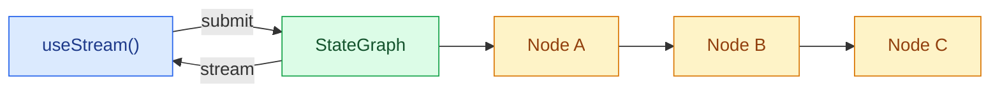

# Overview

> Render các agent LangGraph ra frontend

Xây dựng frontend trực quan hoá pipeline LangGraph theo thời gian thực. Các pattern này cho thấy cách render việc thực thi graph nhiều bước với trạng thái theo từng node và nội dung streaming từ các workflow `StateGraph` tuỳ chỉnh.

Lợi thế frontend của LangGraph là UI có thể theo cùng cấu trúc với graph. Node, state key, checkpoint, interrupt, subgraph và message được stream đều là các khái niệm runtime hiển thị được, nên bạn có thể xây dựng giao diện giải thích hệ thống đang làm gì thay vì giấu việc thực thi đằng sau một tin nhắn assistant duy nhất.

!!! note
    Các pattern này dùng các package frontend SDK v1. Nếu bạn đang dùng phiên bản cũ hơn, xem hướng dẫn migrate cho [React](https://github.com/langchain-ai/langgraphjs/blob/main/libs/sdk-react/docs/v1-migration.md), [Vue](https://github.com/langchain-ai/langgraphjs/blob/main/libs/sdk-vue/docs/v1-migration.md), [Svelte](https://github.com/langchain-ai/langgraphjs/blob/main/libs/sdk-svelte/docs/v1-migration.md), và [Angular](https://github.com/langchain-ai/langgraphjs/blob/main/libs/sdk-angular/docs/v1-migration.md).

## Kiến trúc

Graph LangGraph được cấu thành từ các node có tên, kết nối bằng edge. Mỗi node thực thi một bước (phân loại, nghiên cứu, phân tích, tổng hợp) và ghi output vào một state key cụ thể. Ở phía frontend, stream handle của SDK cung cấp quyền truy cập phản ứng (reactive) tới output của node, token đang stream, và các subgraph được phát hiện, để bạn có thể ánh xạ mỗi node vào một UI card.



```python
from langgraph.graph import StateGraph, MessagesState, START, END

class State(MessagesState):
    classification: str
    research: str
    analysis: str
    synthesis: str

graph = StateGraph(State)
graph.add_node("classify", classify_node)
graph.add_node("do_research", research_node)
graph.add_node("analyze", analyze_node)
graph.add_node("synthesize", synthesize_node)
graph.add_edge(START, "classify")
graph.add_edge("classify", "do_research")
graph.add_edge("do_research", "analyze")
graph.add_edge("analyze", "synthesize")
graph.add_edge("synthesize", END)

app = graph.compile()
```

Ở phía frontend, [`useStream`](https://reference.langchain.com/javascript/langchain-react/index/useStream) expose `stream.subgraphs` để phát hiện graph-node, và các hàm hỗ trợ selector như `useMessages(stream, node)` cho nội dung streaming theo từng node. `stream.values` vẫn giữ toàn bộ state của graph khi bạn cần các trường như `synthesis` cuối cùng. Angular dùng cùng dạng stream API thông qua [`injectStream`](https://reference.langchain.com/javascript/langchain-angular/injectStream).

```ts
import { useStream } from "@langchain/react";

function Pipeline() {
  const stream = useStream<typeof graph>({
    apiUrl: "http://localhost:2024",
    assistantId: "pipeline",
  });

  const classification = stream.values?.classification;
  const research = stream.values?.research;
  const analysis = stream.values?.analysis;
  const graphNodes = [...stream.subgraphs.values()];
}
```

## Điều gì khác biệt so với một chat stream

Các graph tuỳ chỉnh thường vận hành workflow sản phẩm: pipeline nghiên cứu, luồng phê duyệt, pipeline dữ liệu, làm giàu dữ liệu (data enrichment), review code, lập kế hoạch, và phân tích nhiều bước. Frontend SDK cho phép bạn render các workflow này bằng các tín hiệu graph-native:

| Khái niệm runtime | UX phía frontend |
| ------------------ | ----------------- |
| **Node có tên** | Một card, bước timeline, hoặc status badge cho mỗi node của graph. |
| **State key** | Các vùng UI riêng cho các output đã định kiểu như classification, sources, analysis, và synthesis cuối cùng. |
| **Metadata streaming** | Định tuyến các message một phần tới node đã tạo ra chúng. |
| **Checkpoint** | Kiểm tra hoặc tiếp tục từ các trạng thái graph trước đó để debug và kiểm toán (auditability). |
| **Interrupt** | Tạm dừng một node để chờ input, phê duyệt, hoặc sửa lỗi từ con người, sau đó tiếp tục. |
| **Subgraph** | Chỉ hiển thị việc thực thi lồng nhau khi người dùng cần thêm chi tiết. |

Vì SDK expose trực tiếp các khái niệm này, bạn có thể mở rộng quy mô từ một panel chat đơn giản tới một trình debug workflow đầy đủ mà không cần thay đổi giao thức backend.

## Các pattern

- [**Graph execution**](graph-execution.md): Trực quan hoá pipeline graph nhiều bước với trạng thái theo từng node và nội dung streaming.
- [**Custom stream channels**](custom-stream-channels.md): Stream dữ liệu tuỳ chỉnh phía server tới frontend và đọc nó bằng `useExtension` và `useChannel`.

## Các pattern liên quan

Các [pattern frontend của LangChain](../../langchain/frontend/overview.md), gồm markdown message, tool calling, human-in-the-loop, resumable stream, và time travel, đều hoạt động với mọi graph LangGraph. Stream API cung cấp cùng một mô hình dữ liệu cốt lõi cho dù bạn dùng `createAgent`, `createDeepAgent`, hay một `StateGraph` tuỳ chỉnh.
