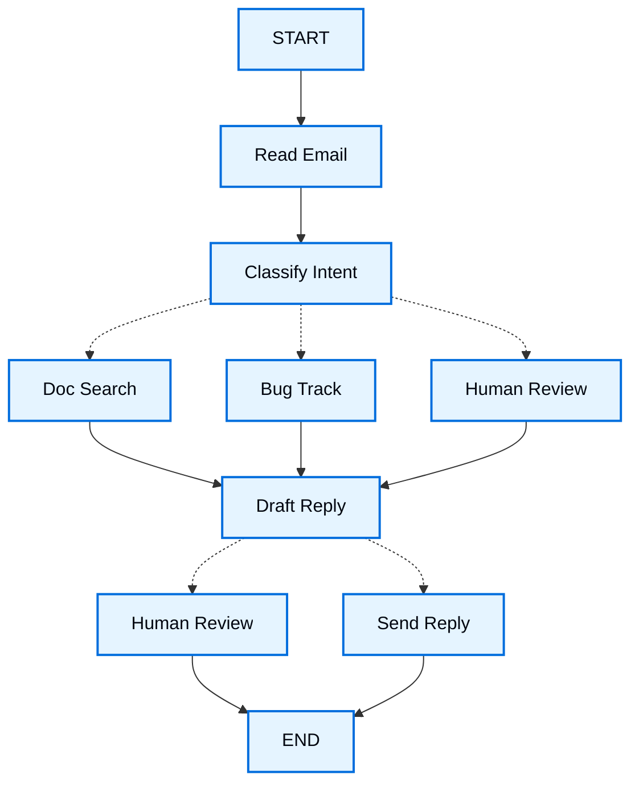

# Thinking in LangGraph

> Học cách tư duy khi xây dựng agent với LangGraph

Khi bạn xây dựng một agent với LangGraph, trước tiên bạn sẽ chia nó thành các bước rời rạc gọi là **node**. Sau đó, bạn sẽ mô tả các quyết định và chuyển tiếp khác nhau từ mỗi node. Cuối cùng, bạn kết nối các node lại với nhau thông qua một **state** dùng chung mà mỗi node có thể đọc và ghi.

Trong bài hướng dẫn này, ta sẽ đi qua quá trình tư duy khi xây dựng một agent email hỗ trợ khách hàng với LangGraph.

## Bắt đầu với quy trình bạn muốn tự động hoá

Hãy tưởng tượng bạn cần xây dựng một AI agent xử lý email hỗ trợ khách hàng. Đội sản phẩm đã đưa ra các yêu cầu sau:

```txt
The agent should:

- Read incoming customer emails
- Classify them by urgency and topic
- Search relevant documentation to answer questions
- Draft appropriate responses
- Escalate complex issues to human agents
- Schedule follow-ups when needed

Example scenarios to handle:

1. Simple product question: "How do I reset my password?"
2. Bug report: "The export feature crashes when I select PDF format"
3. Urgent billing issue: "I was charged twice for my subscription!"
4. Feature request: "Can you add dark mode to the mobile app?"
5. Complex technical issue: "Our API integration fails intermittently with 504 errors"
```

Để triển khai một agent trong LangGraph, bạn thường sẽ theo cùng năm bước sau.

## Bước 1: Vạch ra workflow của bạn thành các bước rời rạc {: #step-1-map-out-your-workflow-as-discrete-steps }

Bắt đầu bằng cách xác định các bước riêng biệt trong quy trình của bạn. Mỗi bước sẽ trở thành một **node** (một hàm làm đúng một việc cụ thể). Sau đó, phác thảo cách các bước này kết nối với nhau.



Các mũi tên trong sơ đồ này chỉ ra các đường đi có thể, nhưng quyết định thực tế về đường nào sẽ được chọn diễn ra bên trong mỗi node.

Giờ khi đã xác định các thành phần trong workflow, hãy hiểu xem mỗi node cần làm gì:

* `Read Email`: Trích xuất và phân tích nội dung email
* `Classify Intent`: Dùng một LLM để phân loại mức độ khẩn cấp và chủ đề, sau đó định tuyến tới hành động phù hợp
* `Doc Search`: Truy vấn knowledge base để tìm thông tin liên quan
* `Bug Track`: Tạo hoặc cập nhật issue trong hệ thống theo dõi
* `Draft Reply`: Tạo một phản hồi phù hợp
* `Human Review`: Chuyển lên cho nhân viên hỗ trợ để phê duyệt hoặc xử lý
* `Send Reply`: Gửi email phản hồi

!!! tip ""
    Chú ý rằng một số node đưa ra quyết định về nơi cần đi tiếp theo (`Classify Intent`, `Draft Reply`, `Human Review`), trong khi các node khác luôn tiến tới cùng một bước tiếp theo (`Read Email` luôn đi tới `Classify Intent`, `Doc Search` luôn đi tới `Draft Reply`).

## Bước 2: Xác định mỗi bước cần làm gì

Với mỗi node trong graph, hãy xác định loại thao tác mà nó đại diện và ngữ cảnh nó cần để hoạt động đúng.

<div class="grid cards" markdown>

- **:material-brain: LLM steps**

    Dùng khi bạn cần hiểu, phân tích, tạo văn bản, hoặc đưa ra quyết định suy luận

- **:material-database: Data steps**

    Dùng khi bạn cần lấy thông tin từ nguồn bên ngoài

- **:material-lightning-bolt: Action steps**

    Dùng khi bạn cần thực hiện các hành động bên ngoài

- **:material-account: User input steps**

    Dùng khi bạn cần sự can thiệp của con người

</div>

### LLM steps

Khi một bước cần hiểu, phân tích, tạo văn bản, hoặc đưa ra quyết định suy luận:

??? note "Classify intent"
    * Ngữ cảnh tĩnh (prompt): Các danh mục phân loại, định nghĩa mức độ khẩn cấp, định dạng phản hồi
    * Ngữ cảnh động (từ state): Nội dung email, thông tin người gửi
    * Kết quả mong muốn: Phân loại có cấu trúc để xác định định tuyến

??? note "Draft reply"
    * Ngữ cảnh tĩnh (prompt): Hướng dẫn về giọng văn, chính sách công ty, mẫu phản hồi
    * Ngữ cảnh động (từ state): Kết quả phân loại, kết quả tìm kiếm, lịch sử khách hàng
    * Kết quả mong muốn: Email phản hồi chuyên nghiệp, sẵn sàng để xem xét

### Data steps

Khi một bước cần lấy thông tin từ nguồn bên ngoài:

??? note "Document search"
    * Tham số: Query được xây dựng từ intent và topic
    * Chiến lược retry: Có, với exponential backoff cho các lỗi tạm thời
    * Caching: Có thể cache các query phổ biến để giảm số lời gọi API

??? note "Customer history lookup"
    * Tham số: Email hoặc ID khách hàng từ state
    * Chiến lược retry: Có, nhưng với fallback về thông tin cơ bản nếu không có sẵn
    * Caching: Có, với time-to-live để cân bằng giữa độ mới và hiệu năng

### Action steps

Khi một bước cần thực hiện một hành động bên ngoài:

??? note "Send reply"
    * Khi nào thực thi node: Sau khi được phê duyệt (bởi con người hoặc tự động)
    * Chiến lược retry: Có, với exponential backoff cho các vấn đề mạng
    * Không nên cache: Mỗi lần gửi là một hành động duy nhất

??? note "Bug track"
    * Khi nào thực thi node: Luôn luôn khi intent là "bug"
    * Chiến lược retry: Có, quan trọng để không mất báo cáo lỗi
    * Trả về: Ticket ID để đưa vào phản hồi

### User input steps

Khi một bước cần sự can thiệp của con người:

??? note "Human review node"
    * Ngữ cảnh cho quyết định: Email gốc, phản hồi nháp, mức độ khẩn cấp, phân loại
    * Định dạng input mong đợi: Boolean phê duyệt cùng phản hồi đã chỉnh sửa (tuỳ chọn)
    * Khi nào được kích hoạt: Mức độ khẩn cấp cao, vấn đề phức tạp, hoặc lo ngại về chất lượng

## Bước 3: Thiết kế state của bạn {: #step-3-design-your-state }

State là bộ nhớ dùng chung mà tất cả node trong agent của bạn có thể truy cập. Hãy nghĩ về nó như cuốn sổ tay mà agent dùng để theo dõi mọi thứ nó học được và quyết định trong suốt quá trình.

### Cái gì thuộc về state?

Hãy tự hỏi những câu hỏi sau về mỗi mẩu dữ liệu:

<div class="grid cards" markdown>

- **:material-check: Đưa vào state**

    Nó có cần tồn tại xuyên suốt các bước không? Nếu có, nó thuộc về state.

- **:material-code-tags: Đừng lưu trữ**

    Bạn có thể suy ra nó từ dữ liệu khác không? Nếu có, hãy tính toán nó khi cần thay vì lưu vào state.

</div>

Với agent email của ta, ta cần theo dõi:

* Email gốc và thông tin người gửi (không thể tái tạo lại sau này)
* Kết quả phân loại (cần cho nhiều node phía sau/downstream)
* Kết quả tìm kiếm và dữ liệu khách hàng (tốn kém để lấy lại)
* Phản hồi nháp (cần tồn tại xuyên suốt quá trình xem xét)
* Metadata thực thi (để debug và khôi phục)

### Giữ state ở dạng thô, format prompt theo yêu cầu

!!! tip ""
    Một nguyên tắc chính: state của bạn nên lưu dữ liệu thô, không phải văn bản đã được format. Hãy format prompt bên trong node khi bạn cần chúng.

Sự tách biệt này có nghĩa là:

* Các node khác nhau có thể format cùng một dữ liệu theo cách khác nhau tuỳ nhu cầu
* Bạn có thể thay đổi prompt template mà không cần sửa state schema
* Việc debug rõ ràng hơn, bạn thấy chính xác dữ liệu nào mỗi node nhận được
* Agent của bạn có thể phát triển mà không phá vỡ state hiện có

Hãy định nghĩa state của ta:

```python
from typing import TypedDict, Literal

# Define the structure for email classification
class EmailClassification(TypedDict):
    intent: Literal["question", "bug", "billing", "feature", "complex"]
    urgency: Literal["low", "medium", "high", "critical"]
    topic: str
    summary: str

class EmailAgentState(TypedDict):
    # Raw email data
    email_content: str
    sender_email: str
    email_id: str

    # Classification result
    classification: EmailClassification | None

    # Raw search/API results
    search_results: list[str] | None  # List of raw document chunks
    customer_history: dict | None  # Raw customer data from CRM

    # Generated content
    draft_response: str | None
    messages: list[str] | None
```

Chú ý rằng state chỉ chứa dữ liệu thô, không có prompt template, không có chuỗi đã format, không có hướng dẫn. Output phân loại được lưu dưới dạng một dictionary duy nhất, lấy trực tiếp từ LLM.

## Bước 4: Xây dựng các node của bạn {: #step-4-build-your-nodes }

Giờ ta triển khai mỗi bước dưới dạng một hàm. Một node trong LangGraph chỉ đơn giản là một hàm Python nhận state hiện tại và trả về các cập nhật cho nó.

### Xử lý lỗi phù hợp {: #handle-errors-appropriately }

Các loại lỗi khác nhau cần chiến lược xử lý khác nhau:

| Loại lỗi | Ai khắc phục | Chiến lược | Khi nào dùng |
| --------------------------------------------------------------- | ----------------------- | ----------------------------------- | --------------------------------------------------------- |
| Lỗi tạm thời (vấn đề mạng, rate limit) | Hệ thống (tự động) | Retry policy | Lỗi tạm thời thường tự khỏi khi retry |
| Lỗi LLM có thể khắc phục (tool thất bại, vấn đề parsing) | LLM | Lưu lỗi vào state và loop lại | LLM có thể thấy lỗi và điều chỉnh cách tiếp cận |
| Lỗi người dùng có thể khắc phục (thiếu thông tin, hướng dẫn không rõ) | Con người | Tạm dừng với `interrupt()` | Cần input người dùng để tiếp tục |
| Lỗi có thể khắc phục sau khi retry | Developer (khai báo) | `error_handler` | Chạy một nhánh bù trừ/khôi phục sau khi hết lượt retry |
| Lỗi bất ngờ | Developer | Để nó nổi lên | Vấn đề chưa biết cần debug |

=== "Lỗi tạm thời"
    Thêm một retry policy để tự động retry các vấn đề mạng và rate limit.

    Kết hợp với `timeout=` để giới hạn mỗi lần thử. Xem [Fault tolerance](./fault-tolerance.md) để biết toàn bộ vòng đời.

    ```python
    from langgraph.types import RetryPolicy

    workflow.add_node(
        "search_documentation",
        search_documentation,
        retry_policy=RetryPolicy(max_attempts=3, initial_interval=1.0)
    )
    ```

=== "LLM có thể khắc phục"
    Lưu lỗi vào state và loop lại để LLM có thể thấy điều gì sai và thử lại:

    ```python
    from langgraph.types import Command


    def execute_tool(state: State) -> Command[Literal["agent", "execute_tool"]]:
        try:
            result = run_tool(state['tool_call'])
            return Command(update={"tool_result": result}, goto="agent")
        except ToolError as e:
            # Let the LLM see what went wrong and try again
            return Command(
                update={"tool_result": f"Tool error: {str(e)}"},
                goto="agent"
            )
    ```

=== "Người dùng có thể khắc phục"
    Tạm dừng và thu thập thông tin từ người dùng khi cần (như account ID, số order, hoặc làm rõ):

    ```python
    from langgraph.types import Command


    def lookup_customer_history(
        state: State
    ) -> Command[Literal["lookup_customer_history", "draft_response"]]:
        if not state.get('customer_id'):
            user_input = interrupt({
                "message": "Customer ID needed",
                "request": "Please provide the customer's account ID to look up their subscription history"
            })
            return Command(
                update={"customer_id": user_input['customer_id']},
                goto="lookup_customer_history"
            )
        # Now proceed with the lookup
        customer_data = fetch_customer_history(state['customer_id'])
        return Command(update={"customer_history": customer_data}, goto="draft_response")
    ```

=== "Bất ngờ"
    Để chúng nổi lên để debug. Đừng bắt những gì bạn không thể xử lý:

    ```python
    def send_reply(state: EmailAgentState):
        try:
            email_service.send(state["draft_response"])
        except Exception:
            raise  # Surface unexpected errors
    ```

=== "Saga / bù trừ"
    Sau khi hết lượt retry, chạy một hàm khôi phục để cập nhật state và định tuyến tới một nhánh bù trừ.

    Xem [Fault tolerance](./fault-tolerance.md#error-handling) để biết toàn bộ pattern.

    !!! note ""
        `error_handler` yêu cầu `langgraph>=1.2`.

    ```python
    from langgraph.errors import NodeError
    from langgraph.types import Command, RetryPolicy

    def payment_error_handler(state: State, error: NodeError) -> Command:
        return Command(
            update={"status": f"compensated: {error.error}"},
            goto="finalize",
        )

    workflow.add_node(
        "charge_payment",
        charge_payment,
        retry_policy=RetryPolicy(max_attempts=3, retry_on=ConnectionError),
        error_handler=payment_error_handler,
    )
    ```

    Để áp dụng cùng `retry_policy`, `timeout`, hoặc `error_handler` cho mọi node trong một graph mà không cần lặp lại chúng trên mỗi `add_node`, hãy dùng `StateGraph.set_node_defaults(...)`. Giá trị theo từng node vẫn được ưu tiên hơn. Xem [Fault tolerance](./fault-tolerance.md#graph-defaults).

### Triển khai các node cho agent email của ta

Ta sẽ triển khai mỗi node dưới dạng một hàm đơn giản. Ghi nhớ: node nhận state, làm việc, và trả về cập nhật.

??? note "Read and classify nodes"
    ```python
    from typing import Literal
    from langgraph.graph import StateGraph, START, END
    from langgraph.types import interrupt, Command, RetryPolicy
    from langchain_openai import ChatOpenAI
    from langchain.messages import HumanMessage

    llm = ChatOpenAI(model="gpt-5-nano")

    def read_email(state: EmailAgentState) -> dict:
        """Extract and parse email content"""
        # In production, this would connect to your email service
        return {
            "messages": [HumanMessage(content=f"Processing email: {state['email_content']}")]
        }

    def classify_intent(state: EmailAgentState) -> Command[Literal["search_documentation", "human_review", "draft_response", "bug_tracking"]]:
        """Use LLM to classify email intent and urgency, then route accordingly"""

        # Create structured LLM that returns EmailClassification dict
        structured_llm = llm.with_structured_output(EmailClassification)

        # Format the prompt on-demand, not stored in state
        classification_prompt = f"""
        Analyze this customer email and classify it:

        Email: {state['email_content']}
        From: {state['sender_email']}

        Provide classification including intent, urgency, topic, and summary.
        """

        # Get structured response directly as dict
        classification = structured_llm.invoke(classification_prompt)

        # Determine next node based on classification
        if classification['intent'] == 'billing' or classification['urgency'] == 'critical':
            goto = "human_review"
        elif classification['intent'] in ['question', 'feature']:
            goto = "search_documentation"
        elif classification['intent'] == 'bug':
            goto = "bug_tracking"
        else:
            goto = "draft_response"

        # Store classification as a single dict in state
        return Command(
            update={"classification": classification},
            goto=goto
        )
    ```

??? note "Search and tracking nodes"
    ```python
    def search_documentation(state: EmailAgentState) -> Command[Literal["draft_response"]]:
        """Search knowledge base for relevant information"""

        # Build search query from classification
        classification = state.get('classification', {})
        query = f"{classification.get('intent', '')} {classification.get('topic', '')}"

        try:
            # Implement your search logic here
            # Store raw search results, not formatted text
            search_results = [
                "Reset password via Settings > Security > Change Password",
                "Password must be at least 12 characters",
                "Include uppercase, lowercase, numbers, and symbols"
            ]
        except SearchAPIError as e:
            # For recoverable search errors, store error and continue
            search_results = [f"Search temporarily unavailable: {str(e)}"]

        return Command(
            update={"search_results": search_results},  # Store raw results or error
            goto="draft_response"
        )

    def bug_tracking(state: EmailAgentState) -> Command[Literal["draft_response"]]:
        """Create or update bug tracking ticket"""

        # Create ticket in your bug tracking system
        ticket_id = "BUG-12345"  # Would be created via API

        return Command(
            update={
                "search_results": [f"Bug ticket {ticket_id} created"],
                "current_step": "bug_tracked"
            },
            goto="draft_response"
        )
    ```

??? note "Response nodes"
    ```python
    def draft_response(state: EmailAgentState) -> Command[Literal["human_review", "send_reply"]]:
        """Generate response using context and route based on quality"""

        classification = state.get('classification', {})

        # Format context from raw state data on-demand
        context_sections = []

        if state.get('search_results'):
            # Format search results for the prompt
            formatted_docs = "\n".join([f"- {doc}" for doc in state['search_results']])
            context_sections.append(f"Relevant documentation:\n{formatted_docs}")

        if state.get('customer_history'):
            # Format customer data for the prompt
            context_sections.append(f"Customer tier: {state['customer_history'].get('tier', 'standard')}")

        # Build the prompt with formatted context
        draft_prompt = f"""
        Draft a response to this customer email:
        {state['email_content']}

        Email intent: {classification.get('intent', 'unknown')}
        Urgency level: {classification.get('urgency', 'medium')}

        {chr(10).join(context_sections)}

        Guidelines:
        - Be professional and helpful
        - Address their specific concern
        - Use the provided documentation when relevant
        """

        response = llm.invoke(draft_prompt)

        # Determine if human review needed based on urgency and intent
        needs_review = (
            classification.get('urgency') in ['high', 'critical'] or
            classification.get('intent') == 'complex'
        )

        # Route to appropriate next node
        goto = "human_review" if needs_review else "send_reply"

        return Command(
            update={"draft_response": response.content},  # Store only the raw response
            goto=goto
        )

    def human_review(state: EmailAgentState) -> Command[Literal["send_reply", END]]:
        """Pause for human review using interrupt and route based on decision"""

        classification = state.get('classification', {})

        # interrupt() must come first - any code before it will re-run on resume
        human_decision = interrupt({
            "email_id": state.get('email_id',''),
            "original_email": state.get('email_content',''),
            "draft_response": state.get('draft_response',''),
            "urgency": classification.get('urgency'),
            "intent": classification.get('intent'),
            "action": "Please review and approve/edit this response"
        })

        # Now process the human's decision
        if human_decision.get("approved"):
            return Command(
                update={"draft_response": human_decision.get("edited_response", state.get('draft_response',''))},
                goto="send_reply"
            )
        else:
            # Rejection means human will handle directly
            return Command(update={}, goto=END)

    def send_reply(state: EmailAgentState) -> dict:
        """Send the email response"""
        # Integrate with email service
        print(f"Sending reply: {state['draft_response'][:100]}...")
        return {}
    ```

## Bước 5: Nối tất cả lại {: #step-5-wire-it-together }

Giờ ta kết nối các node của mình thành một graph hoạt động. Vì các node của ta tự xử lý quyết định định tuyến của mình, ta chỉ cần một vài cạnh (edge) thiết yếu.

Để bật [human-in-the-loop](./interrupts.md) với `interrupt()`, ta cần compile với một [checkpointer](./persistence.md) để lưu state giữa các lần chạy:

??? note "Graph compilation code"
    ```python
    from langgraph.checkpoint.memory import MemorySaver
    from langgraph.types import RetryPolicy

    # Create the graph
    workflow = StateGraph(EmailAgentState)

    # Add nodes with appropriate error handling
    workflow.add_node("read_email", read_email)
    workflow.add_node("classify_intent", classify_intent)

    # Add retry policy for nodes that might have transient failures
    workflow.add_node(
        "search_documentation",
        search_documentation,
        retry_policy=RetryPolicy(max_attempts=3)
    )
    workflow.add_node("bug_tracking", bug_tracking)
    workflow.add_node("draft_response", draft_response)
    workflow.add_node("human_review", human_review)
    workflow.add_node("send_reply", send_reply)

    # Add only the essential edges
    workflow.add_edge(START, "read_email")
    workflow.add_edge("read_email", "classify_intent")
    workflow.add_edge("send_reply", END)

    # Compile with checkpointer for persistence, in case run graph with Local_Server --> Please compile without checkpointer
    memory = MemorySaver()
    app = workflow.compile(checkpointer=memory)
    ```

Cấu trúc graph này tối giản vì việc định tuyến diễn ra bên trong các node thông qua đối tượng [`Command`](https://reference.langchain.com/python/langgraph/types/Command). Mỗi node khai báo nơi nó có thể đi tới bằng type hint như `Command[Literal["node1", "node2"]]`, giúp luồng thực thi rõ ràng và có thể truy vết.

### Thử nghiệm agent của bạn

Hãy chạy agent với một vấn đề thanh toán khẩn cấp cần con người xem xét:

??? note "Testing the agent"
    ```python
    from typing import TypedDict

    from langgraph.checkpoint.memory import InMemorySaver
    from langgraph.graph import END, START, StateGraph
    from langgraph.types import Command, interrupt


    class EmailState(TypedDict):
        email_content: str
        response_text: str | None


    def human_review_node(state: EmailState):
        interrupt(
            {
                "approved": False,
                "edited_response": state.get("response_text") or "",
            }
        )
        return {"response_text": "placeholder"}


    app = (
        StateGraph(EmailState)
        .add_node("human_review", human_review_node)
        .add_edge(START, "human_review")
        .add_edge("human_review", END)
        .compile(checkpointer=InMemorySaver())
    )

    initial_state = {
        "email_content": "I was charged twice for my subscription! This is urgent!",
        "response_text": "Draft response",
    }

    # Run with a thread_id for persistence
    config = {"configurable": {"thread_id": "customer_123"}}
    stream = app.stream_events(initial_state, config, version="v3")
    _ = stream.output  # drive the stream to completion
    # The graph will pause at human_review
    print(f"human review interrupt:{stream.interrupts}")

    human_response = Command(
        resume={
            "approved": True,
            "edited_response": "We sincerely apologize for the double charge. I've initiated an immediate refund...",
        }
    )

    # Resume execution
    resumed = app.stream_events(human_response, config, version="v3")
    final_state = resumed.output
    print("Email sent successfully!")
    ```

Graph tạm dừng khi gặp `interrupt()`, lưu mọi thứ vào checkpointer, và chờ. Nó có thể resume nhiều ngày sau, tiếp tục chính xác từ nơi nó dừng lại. `thread_id` đảm bảo toàn bộ state cho cuộc hội thoại này được lưu giữ cùng nhau.

## Tóm tắt và bước tiếp theo

### Những điều then chốt

Xây dựng agent email này đã cho ta thấy cách tư duy của LangGraph:

<div class="grid cards" markdown>

- **:material-sitemap: Chia thành các bước rời rạc**

    Mỗi node làm tốt một việc. Sự phân rã này cho phép streaming tiến trình, thực thi bền vững (durable) có thể tạm dừng và resume, và debug rõ ràng vì bạn có thể kiểm tra state giữa các bước.

- **:material-database: State là bộ nhớ dùng chung**

    Lưu dữ liệu thô, không phải văn bản đã format. Điều này cho phép các node khác nhau dùng cùng thông tin theo những cách khác nhau.

- **:material-code-tags: Node là các hàm**

    Chúng nhận state, làm việc, và trả về cập nhật. Khi cần đưa ra quyết định định tuyến, chúng chỉ định cả cập nhật state lẫn đích tiếp theo.

- **:material-alert: Lỗi là một phần của luồng**

    Lỗi tạm thời được retry, lỗi LLM có thể khắc phục sẽ loop lại kèm ngữ cảnh, vấn đề người dùng có thể khắc phục tạm dừng để chờ input, và lỗi bất ngờ nổi lên để debug.

- **:material-account: Input của con người là hạng nhất**

    Hàm `interrupt()` tạm dừng thực thi vô thời hạn, lưu toàn bộ state, và resume chính xác từ nơi dừng lại khi bạn cung cấp input. Khi kết hợp với các thao tác khác trong một node, nó phải đứng đầu tiên. Xem [Interrupts](./interrupts.md).

- **:material-sitemap: Cấu trúc graph hình thành tự nhiên**

    Bạn định nghĩa các kết nối thiết yếu, và các node của bạn tự xử lý logic định tuyến. Điều này giữ control flow rõ ràng và có thể truy vết, bạn luôn có thể hiểu agent sẽ làm gì tiếp theo bằng cách nhìn vào node hiện tại.

</div>

### Cân nhắc nâng cao

??? note "Đánh đổi về độ chi tiết (granularity) của node"
    !!! info ""
        Phần này khám phá sự đánh đổi trong thiết kế độ chi tiết của node. Hầu hết ứng dụng có thể bỏ qua phần này và dùng các pattern đã trình bày ở trên.

    Bạn có thể tự hỏi: tại sao không gộp `Read Email` và `Classify Intent` thành một node?

    Hay tại sao tách Doc Search khỏi Draft Reply?

    Câu trả lời liên quan tới sự đánh đổi giữa khả năng phục hồi (resilience) và khả năng quan sát (observability).

    **Cân nhắc về khả năng phục hồi:** [Tầng persistence](./persistence.md) của LangGraph tạo checkpoint tại ranh giới node. Khi một workflow resume sau một gián đoạn hoặc lỗi, nó bắt đầu từ đầu node nơi thực thi dừng lại. Node nhỏ hơn nghĩa là checkpoint thường xuyên hơn, nghĩa là ít công việc phải lặp lại hơn nếu có gì đó sai. Nếu bạn gộp nhiều thao tác vào một node lớn, một lỗi gần cuối nghĩa là phải thực thi lại mọi thứ từ đầu node đó.

    Tại sao ta chọn cách phân chia này cho agent email:

    * **Cô lập các dịch vụ bên ngoài:** Doc Search và Bug Track là các node riêng biệt vì chúng gọi API bên ngoài. Nếu dịch vụ tìm kiếm chậm hoặc lỗi, ta muốn cô lập điều đó khỏi các lời gọi LLM. Ta có thể thêm retry policy cho các node cụ thể này mà không ảnh hưởng tới node khác.

    * **Khả năng quan sát trung gian:** Có `Classify Intent` là node riêng cho phép ta kiểm tra LLM đã quyết định gì trước khi hành động. Điều này có giá trị cho việc debug và giám sát, bạn có thể thấy chính xác khi nào và tại sao agent định tuyến tới human review.

    * **Các chế độ lỗi khác nhau:** Lời gọi LLM, tra cứu database, và gửi email có chiến lược retry khác nhau. Các node riêng cho phép bạn cấu hình chúng độc lập.

    * **Khả năng tái sử dụng và kiểm thử:** Node nhỏ hơn dễ kiểm thử độc lập hơn và tái sử dụng trong workflow khác.

    Một cách tiếp cận hợp lệ khác: Bạn có thể gộp `Read Email` và `Classify Intent` thành một node duy nhất. Bạn sẽ mất khả năng kiểm tra email thô trước khi phân loại và sẽ phải lặp lại cả hai thao tác nếu có lỗi trong node đó. Với hầu hết ứng dụng, lợi ích về khả năng quan sát và debug của các node riêng biệt đáng để đánh đổi.

    Các vấn đề ở tầng ứng dụng: Việc bàn về caching ở Bước 2 (có nên cache kết quả tìm kiếm hay không) là một quyết định ở tầng ứng dụng, không phải một tính năng của framework LangGraph. Bạn triển khai caching bên trong hàm node của mình dựa trên yêu cầu cụ thể, LangGraph không quy định điều này.

    Cân nhắc về hiệu năng: Nhiều node hơn không có nghĩa là thực thi chậm hơn. Theo mặc định, LangGraph ghi checkpoint ở nền ([async durability mode](./checkpointers.md#durability-modes)), nên graph của bạn tiếp tục chạy mà không cần chờ checkpoint hoàn tất. Điều này nghĩa là bạn có checkpoint thường xuyên với tác động hiệu năng tối thiểu. Bạn có thể điều chỉnh hành vi này nếu cần, dùng chế độ `"exit"` để chỉ checkpoint khi hoàn tất, hoặc chế độ `"sync"` để chặn thực thi cho tới khi mỗi checkpoint được ghi xong.

### Bước tiếp theo từ đây

Đây là phần giới thiệu về cách tư duy khi xây dựng agent với LangGraph. Bạn có thể mở rộng nền tảng này với:

<div class="grid cards" markdown>

- **:material-account-check: [Pattern human-in-the-loop](./interrupts.md)**

    Học cách thêm phê duyệt tool trước khi thực thi, phê duyệt hàng loạt, và các pattern khác

- **:material-hierarchy: [Subgraph](./use-subgraphs.md)**

    Tạo subgraph cho các thao tác nhiều bước phức tạp

- **:material-broadcast: [Streaming](./streaming.md)**

    Thêm streaming để hiển thị tiến trình theo thời gian thực cho người dùng

- **:material-chart-line: [Observability](./observability.md)**

    Thêm observability với LangSmith để debug và giám sát

- **:material-tools: [Tích hợp Tool](../langchain/tools.md)**

    Tích hợp thêm tool cho tìm kiếm web, truy vấn database, và lời gọi API

- **:material-rotate-3d: [Retry Logic](./use-graph-api.md#add-retry-policies)**

    Triển khai retry logic với exponential backoff cho các thao tác thất bại

</div>

---

!!! info "Kết nối tài liệu này"
    [Kết nối tài liệu này](https://docs.langchain.com/use-these-docs) với Claude, VSCode, và nhiều công cụ khác qua MCP để có câu trả lời theo thời gian thực.

!!! info "Đóng góp"
    [Chỉnh sửa trang này trên GitHub](https://github.com/langchain-ai/docs/edit/main/src/oss/langgraph/thinking-in-langgraph.mdx) hoặc [báo lỗi](https://github.com/langchain-ai/docs/issues/new/choose).
