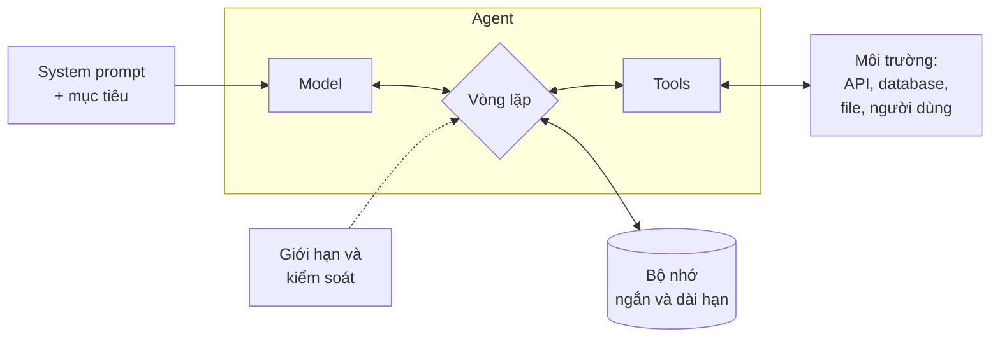

# Bài 1: Tư duy agent

!!! abstract "Tóm tắt bài học"
    - **Mục tiêu:** phân biệt workflow và agent, nắm các mẫu thiết kế phổ biến, hiểu giải phẫu của một agent, thiết kế tool tốt cho agent, và nhận diện các kiểu thất bại điển hình.
    - **Thời lượng:** 4 đến 5 ngày.
    - **Yêu cầu trước:** [Hiểu LLM, Bài 4](../hieu-llm/04-tool-use.md).

## 1. Workflow hay agent?

| | Workflow | Agent |
|---|---|---|
| Ai quyết định luồng xử lý? | **Code của bạn** | **LLM** |
| Số bước | Biết trước | Không biết trước |
| Tính dự đoán | Cao | Thấp hơn |
| Chi phí, độ trễ | Thấp, ổn định | Cao hơn, biến động |
| Debug, kiểm thử | Dễ | Khó hơn |
| Phù hợp | Tác vụ có quy trình rõ ràng | Tác vụ mở, cần khám phá, không thể định trước các bước |

Ví dụ: "Phân loại email rồi soạn trả lời theo mẫu" là **workflow**. "Điều tra vì sao doanh thu tuần này giảm, dùng database, log và dashboard" là **agent**: bạn không biết trước cần tra những gì.

!!! tip "Bắt đầu đơn giản nhất có thể"
    Thứ tự nên thử: **một lệnh gọi LLM** với prompt tốt → **workflow** (chuỗi, định tuyến, song song) → **agent**. Chỉ tiến lên bước sau khi eval chứng minh bước trước không đủ. Rất nhiều "agent" trong thực tế nên là workflow.

### Bốn câu hỏi trước khi xây agent

1. **Độ phức tạp:** tác vụ có nhiều bước và khó mô tả trước không?
2. **Giá trị:** kết quả có đáng với chi phí và độ trễ cao hơn không?
3. **Khả năng:** model có làm tốt loại tác vụ này không? (thử nghiệm nhanh trước khi xây)
4. **Chi phí của sai lầm:** nếu agent sai, có phát hiện và khắc phục được không (test, review, hoàn tác)?

Nếu một câu trả lời là "không", hãy dùng cách đơn giản hơn.

## 2. Các mẫu thiết kế

| Mẫu | Mô tả | Ví dụ |
|---|---|---|
| **Chuỗi prompt** | Các bước cố định nối tiếp | Trích xuất → viết → kiểm tra ([Prompt, Bài 2](../prompt-context/02-ky-thuat-nang-cao.md#1-chuoi-prompt-prompt-chaining)) |
| **Định tuyến** | Phân loại rồi chuyển tới xử lý chuyên biệt | Router chăm sóc khách hàng |
| **Song song** | Nhiều lệnh gọi đồng thời, gộp kết quả | Đánh giá theo nhiều tiêu chí, bỏ phiếu |
| **Orchestrator và worker** | Một LLM chia việc động, các worker thực hiện, orchestrator tổng hợp | Nghiên cứu nhiều nguồn, sửa code ở nhiều file |
| **Tự đánh giá và sửa** | Một LLM tạo, một LLM đánh giá, lặp lại | Viết nội dung theo tiêu chí |
| **Agent tự chủ** | LLM dùng tool trong vòng lặp tới khi hoàn thành | Trợ lý lập trình, agent hỗ trợ khách hàng |

Bốn mẫu đầu là workflow, chỉ mẫu cuối là agent thực thụ. Xem cách cài đặt từng mẫu bằng LangGraph ở trang [Workflows và Agents](../../oss/python/langgraph/workflows-agents.md).

## 3. Giải phẫu một agent

| Thành phần | Vai trò | Bài học liên quan |
|---|---|---|
| **Model** | Suy luận, ra quyết định | [Hiểu LLM](../hieu-llm/index.md) |
| **System prompt** | Mục tiêu, bối cảnh, nguyên tắc | [Prompt & Context](../prompt-context/index.md) |
| **Tools** | Cách agent quan sát và tác động lên môi trường | Mục 4 bên dưới |
| **Vòng lặp** | Gọi model, chạy tool, gửi kết quả lại, lặp tới khi xong | [Hiểu LLM, Bài 4](../hieu-llm/04-tool-use.md) |
| **Bộ nhớ** | Lịch sử hội thoại, ghi chú, kiến thức lâu dài | [Context engineering](../prompt-context/03-context-engineering.md) |
| **Giới hạn và kiểm soát** | Số lượt tối đa, ngân sách, phê duyệt của con người | Mục 6 bên dưới |

Một agent tốt làm việc theo chu trình: **thu thập thông tin → hành động → kiểm tra kết quả → lặp lại**. Bước "kiểm tra kết quả" thường bị bỏ qua nhưng rất quan trọng: agent sửa code nên chạy test, agent tạo đơn nên đọc lại đơn đã tạo.

## 4. Thiết kế tool cho agent

Với con người, chúng ta đầu tư nhiều vào giao diện người dùng. Với agent, **tool chính là giao diện**. Tool tốt quyết định phần lớn chất lượng agent.

| Nguyên tắc | Tool kém | Tool tốt |
|---|---|---|
| **Theo tác vụ, không theo API** | `list_all_orders()` trả về 5.000 đơn | `search_orders(phone, status, date_from)` |
| **Gộp thao tác hay đi cùng nhau** | Agent phải gọi `get_customer`, rồi `get_orders`, rồi `get_shipments` | `get_customer_overview(phone)` trả tất cả thông tin cần cho chăm sóc khách hàng |
| **Tên và mô tả rõ, không chồng chéo** | `search`, `find`, `lookup` cùng tồn tại | Mỗi tool một mục đích rõ ràng |
| **Output gọn, có ngữ nghĩa** | Trả ID nội bộ khó hiểu (`cus_8f3a...`) | Trả tên, mô tả dễ hiểu; ID chỉ khi cần cho bước sau |
| **Lỗi có hướng dẫn** | `Error 404` | "Không tìm thấy đơn. Mã đơn có dạng DH + 4 chữ số, hãy hỏi lại khách" |
| **Tham số khó dùng sai** | `date: str` (định dạng nào?) | `date: str` mô tả rõ "YYYY-MM-DD", hoặc enum cho các giá trị cố định |

**Phép thử:** đọc mô tả tool như một lập trình viên mới vào nghề. Bạn có biết khi nào dùng, truyền gì, nhận lại gì không?

## 5. Các kiểu thất bại điển hình

| Kiểu thất bại | Biểu hiện | Cách phòng |
|---|---|---|
| **Lặp vô tận** | Gọi đi gọi lại cùng một tool với tham số gần giống nhau | Giới hạn số lượt, số lần gọi mỗi tool; phát hiện lặp |
| **Dừng quá sớm** | Tuyên bố "đã xong" khi chưa xong | Yêu cầu tự kiểm tra; định nghĩa rõ tiêu chí hoàn thành |
| **Bịa kết quả tool** | Trả lời như thể đã tra cứu dù tool lỗi | Trả lỗi rõ ràng bằng `is_error`; eval kiểm tra câu trả lời có căn cứ |
| **Chọn sai tool** | Dùng `search_products` để tra đơn hàng | Viết lại mô tả tool, giảm số tool, bỏ tool chồng chéo |
| **Tham số sai** | Truyền tên khách vào trường số điện thoại | Mô tả tham số rõ, `strict`, validate và trả lỗi có hướng dẫn |
| **Hành động vượt quyền** | Hoàn tiền không qua duyệt, xóa dữ liệu | Không cấp tool nguy hiểm; bắt buộc phê duyệt của con người |
| **Bị thao túng** | Làm theo chỉ dẫn độc hại nằm trong email, trang web mà agent đọc | Coi mọi nội dung bên ngoài là dữ liệu; giới hạn quyền; xem [LLMOps, Bài 4](../llmops/04-bao-mat.md) |
| **Context phình to** | Chậm, đắt, "quên" mục tiêu ở các bước cuối | Các chiến lược ở [Context engineering](../prompt-context/03-context-engineering.md) |

## 6. Giới hạn và kiểm soát

Mọi agent production cần các "lan can":

- **Số lượt tối đa** và **số lần gọi tool tối đa** cho mỗi lần chạy.
- **Ngân sách token hoặc chi phí** cho mỗi lần chạy, mỗi người dùng mỗi ngày.
- **Timeout** tổng cho mỗi tác vụ.
- **Phân loại tool theo rủi ro:**

| Mức rủi ro | Ví dụ | Kiểm soát |
|---|---|---|
| Chỉ đọc | Tra đơn, tìm sản phẩm | Tự động |
| Ghi, hoàn tác được | Tạo ghi chú, gắn nhãn đơn | Tự động, có log |
| Ghi, khó hoàn tác hoặc tốn tiền | Hoàn tiền, hủy đơn, gửi email cho khách | **Con người phê duyệt** |
| Nguy hiểm | Xóa dữ liệu, chạy lệnh tùy ý | Không cấp cho agent, hoặc chạy trong sandbox |

- **Quyền tối thiểu:** agent chăm sóc khách hàng chỉ truy cập được dữ liệu của khách đang chat, không phải toàn bộ database.

## Bài tập

**Bài 1.1.** Với mỗi bài toán sau, quyết định dùng một lệnh gọi LLM, workflow (mẫu nào), hay agent. Giải thích lý do.

1. Dịch 5.000 mô tả sản phẩm sang tiếng Anh.
2. Trả lời câu hỏi của khách về chính sách đổi trả.
3. Trả lời câu hỏi của khách về đơn hàng của họ, có thể cần tra đơn, tra vận chuyển, tạo yêu cầu đổi hàng.
4. Viết báo cáo phân tích đối thủ từ 20 trang web.
5. Tự động sửa bug từ issue trên GitHub.

??? tip "Gợi ý"
    1: một lệnh gọi mỗi sản phẩm, qua Batch API. 2: một lệnh gọi (chính sách trong system prompt, có cache) hoặc RAG nếu chính sách dài. 3: agent với vài tool, phê duyệt khi đổi hàng. 4: orchestrator và worker (mỗi worker đọc một nhóm trang). 5: agent tự chủ trong sandbox, kiểm chứng bằng test, con người review trước khi merge.

**Bài 1.2.** Thiết kế (chưa cần code) bộ tool cho trợ lý cửa hàng: tên, mô tả, tham số, output mẫu, mức rủi ro của từng tool. Tối đa 6 tool. Nhờ một người khác đọc và thử trả lời: "Để hủy đơn DH1024 của khách có SĐT 0901234567, agent sẽ gọi những tool nào?"

**Bài 1.3.** Lấy agent đã viết ở [Hiểu LLM, Bài 4](../hieu-llm/04-tool-use.md). Cố tình gây ra 3 kiểu thất bại trong bảng mục 5 (ví dụ làm tool luôn lỗi, viết mô tả tool mơ hồ). Quan sát hành vi và áp dụng cách phòng.

## Checklist

- [ ] Phân biệt được workflow và agent, và trả lời được bốn câu hỏi trước khi xây agent.
- [ ] Kể được các mẫu thiết kế và ví dụ cho từng mẫu.
- [ ] Thiết kế tool theo tác vụ, output gọn, lỗi có hướng dẫn.
- [ ] Nhận diện được các kiểu thất bại và cách phòng.
- [ ] Mọi agent đều có giới hạn và phân loại tool theo rủi ro.

## Đọc thêm

- [Building effective agents](https://www.anthropic.com/engineering/building-effective-agents) (Anthropic).
- [Workflows và Agents](../../oss/python/langgraph/workflows-agents.md), [Tư duy LangGraph](../../oss/python/langgraph/thinking-in-langgraph.md).
- [Agents](../../oss/python/langchain/agents.md), [Tools](../../oss/python/langchain/tools.md).

---

[Tổng quan track](index.md) · **Bài tiếp theo:** [Bài 2: Agent với LangChain](02-langchain-agents.md)
