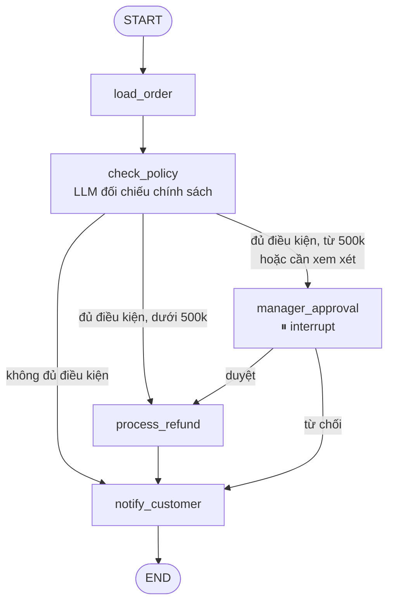

# Bài 3: Workflow với LangGraph

!!! abstract "Tóm tắt bài học"
    - **Mục tiêu:** xây quy trình nhiều bước có kiểm soát bằng LangGraph: state, node, edge điều kiện, persistence, tạm dừng chờ con người (interrupt), xem lại và chạy lại lịch sử (time travel).
    - **Thời lượng:** khoảng 1 tuần.
    - **Yêu cầu trước:** [Bài 2](02-langchain-agents.md).

## 1. Khi nào cần LangGraph?

`create_agent` là một graph dựng sẵn: vòng lặp "model → tool → model". Khi bạn cần **tự thiết kế luồng**, hãy xuống tầng LangGraph.

| Dùng `create_agent` khi | Dùng LangGraph trực tiếp khi |
|---|---|
| Để model tự quyết định dùng tool nào, khi nào | Quy trình có các bước **bắt buộc** theo thứ tự (kiểm tra, duyệt, ghi log) |
| Tùy biến vừa phải được bằng middleware | Có nhánh rẽ theo **quy tắc nghiệp vụ** (số tiền lớn thì cần quản lý duyệt) |
| Một agent, vài tool | Kết hợp bước LLM với bước code thuần, bước chờ con người |
| | Cần chạy song song các nhánh, graph con, vòng lặp có điều kiện tùy chỉnh |

Thường gặp nhất là **kết hợp**: một graph LangGraph điều phối quy trình, trong đó một vài node là agent tạo bằng `create_agent`.

## 2. Khái niệm cốt lõi

| Khái niệm | Ý nghĩa |
|---|---|
| **State** | Dữ liệu dùng chung của cả quy trình, thường là `TypedDict`. Mỗi node đọc state và trả về phần cần cập nhật |
| **Node** | Một hàm Python: gọi LLM, gọi API, tính toán, hay bất cứ việc gì |
| **Edge** | Nối các node. **Edge điều kiện** chọn node tiếp theo dựa trên state |
| **Checkpointer** | Lưu state sau mỗi bước. Nhờ đó tạm dừng, tiếp tục, xem lại lịch sử, chịu lỗi được |
| **Interrupt** | Tạm dừng graph giữa chừng để chờ input từ bên ngoài (thường là con người) |

Đọc [Tư duy LangGraph](../../oss/python/langgraph/thinking-in-langgraph.md) và [Graph API](../../oss/python/langgraph/graph-api.md) để nắm chi tiết.

## 3. Ví dụ: quy trình xử lý hoàn tiền



Quy trình này **không nên** là một agent tự do: thứ tự các bước là bắt buộc, ngưỡng 500.000đ là quy tắc nghiệp vụ, và không được phép để LLM "quên" bước quản lý duyệt. LLM chỉ đảm nhận đúng một việc cần tới nó: **đối chiếu lý do của khách với chính sách**.

### 3.1 State và các node

```python title="refund/graph.py"
from typing import Literal, TypedDict

from langchain.chat_models import init_chat_model
from langgraph.checkpoint.memory import InMemorySaver
from langgraph.graph import END, START, StateGraph
from langgraph.types import interrupt
from pydantic import BaseModel, Field

POLICY = """Chính sách hoàn tiền:
- Chấp nhận trong vòng 7 ngày kể từ khi nhận hàng.
- Sản phẩm lỗi do nhà sản xuất: hoàn 100%.
- Không vừa size, không thích: chỉ đổi, không hoàn tiền.
- Sản phẩm đã qua sử dụng, giặt: không hoàn."""

AUTO_APPROVE_LIMIT = 500_000
ORDERS = {"DH1025": {"total": 450_000, "delivered_days_ago": 3},
          "DH1030": {"total": 1_500_000, "delivered_days_ago": 2}}

llm = init_chat_model("anthropic:claude-opus-5")


class RefundState(TypedDict, total=False):
    order_id: str
    reason: str
    order: dict
    eligible: Literal["yes", "no", "review"]
    explanation: str
    manager_decision: Literal["approve", "reject"]
    outcome: str


class PolicyCheck(BaseModel):
    eligible: Literal["yes", "no", "review"] = Field(
        description="yes: rõ ràng đủ điều kiện; no: rõ ràng không đủ; review: chưa đủ thông tin để kết luận"
    )
    explanation: str = Field(description="Giải thích ngắn, trích điều khoản chính sách liên quan")


def load_order(state: RefundState) -> RefundState:
    return {"order": ORDERS[state["order_id"]]}


def check_policy(state: RefundState) -> RefundState:
    result = llm.with_structured_output(PolicyCheck).invoke(
        f"<policy>\n{POLICY}\n</policy>\n\n"
        f"Đơn hàng đã nhận {state['order']['delivered_days_ago']} ngày trước.\n"
        f"Lý do khách đưa ra: {state['reason']}\n\n"
        "Yêu cầu hoàn tiền này có đủ điều kiện theo chính sách không?"
    )
    return {"eligible": result.eligible, "explanation": result.explanation}


def manager_approval(state: RefundState) -> RefundState:
    # Graph dừng tại đây; giá trị truyền vào interrupt() được gửi cho người duyệt
    decision = interrupt({
        "order_id": state["order_id"],
        "amount": state["order"]["total"],
        "reason": state["reason"],
        "ai_assessment": f"{state['eligible']}: {state['explanation']}",
    })
    # Khi resume, giá trị resume trở thành kết quả của interrupt()
    return {"manager_decision": decision}


def process_refund(state: RefundState) -> RefundState:
    # Gọi cổng thanh toán thật ở đây. Nên có idempotency key = order_id
    return {"outcome": f"Đã hoàn {state['order']['total']:,}đ cho đơn {state['order_id']}."}


def notify_customer(state: RefundState) -> RefundState:
    if state.get("outcome"):
        message = state["outcome"]
    elif state.get("manager_decision") == "reject":
        message = "Yêu cầu hoàn tiền chưa được chấp thuận. Nhân viên sẽ liên hệ để hỗ trợ đổi hàng."
    else:
        message = f"Yêu cầu chưa đủ điều kiện hoàn tiền: {state['explanation']}"
    return {"outcome": message}
```

### 3.2 Edge điều kiện và dựng graph

```python title="refund/graph.py (tiếp)"
def route_after_check(state: RefundState) -> Literal["notify_customer", "process_refund", "manager_approval"]:
    if state["eligible"] == "no":
        return "notify_customer"
    if state["eligible"] == "yes" and state["order"]["total"] < AUTO_APPROVE_LIMIT:
        return "process_refund"
    return "manager_approval"  # số tiền lớn, hoặc AI chưa chắc chắn


def route_after_manager(state: RefundState) -> Literal["process_refund", "notify_customer"]:
    return "process_refund" if state["manager_decision"] == "approve" else "notify_customer"


builder = StateGraph(RefundState)
for node in (load_order, check_policy, manager_approval, process_refund, notify_customer):
    builder.add_node(node.__name__, node)

builder.add_edge(START, "load_order")
builder.add_edge("load_order", "check_policy")
builder.add_conditional_edges("check_policy", route_after_check)
builder.add_conditional_edges("manager_approval", route_after_manager)
builder.add_edge("process_refund", "notify_customer")
builder.add_edge("notify_customer", END)

graph = builder.compile(checkpointer=InMemorySaver())
```

Quy tắc nghiệp vụ (ngưỡng 500.000đ, bắt buộc duyệt khi AI không chắc) nằm trong **code**, không nằm trong prompt. Code thì luôn được thực thi đúng; prompt thì chỉ "thường được làm theo".

### 3.3 Chạy, tạm dừng và tiếp tục

```python title="refund/run.py"
from langgraph.types import Command

from refund.graph import graph

config = {"configurable": {"thread_id": "refund-DH1030"}}
graph.invoke({"order_id": "DH1030", "reason": "Áo bị bung chỉ ở vai ngay lần đầu mặc"}, config)

snapshot = graph.get_state(config)
if snapshot.interrupts:  # graph đang dừng chờ duyệt
    print("Chờ quản lý duyệt:", snapshot.interrupts[0].value)
    # ... vài giờ sau, quản lý bấm "Duyệt" trên trang quản trị:
    graph.invoke(Command(resume="approve"), config)

print(graph.get_state(config).values["outcome"])
```

Nhờ checkpointer, state được lưu lại khi graph dừng. Với checkpointer bền vững (PostgreSQL), quản lý có thể duyệt **sau nhiều ngày**, kể cả khi server đã khởi động lại nhiều lần. Xem [Interrupts](../../oss/python/langgraph/interrupts.md) và [Persistence](../../oss/python/langgraph/persistence.md).

!!! warning "Code trước `interrupt()` sẽ chạy lại khi resume"
    Khi resume, node chứa `interrupt()` được **chạy lại từ đầu**. Vì vậy đừng đặt thao tác có tác dụng phụ (gửi email, gọi API thanh toán) **trước** lệnh `interrupt()` trong cùng một node. Tách chúng sang node khác, như `process_refund` ở trên.

## 4. Time travel: xem lại và chạy lại

Checkpointer lưu state sau **mỗi** bước, nên bạn có thể xem toàn bộ lịch sử thực thi, rất hữu ích khi debug "vì sao đơn này bị từ chối":

```python
for snapshot in graph.get_state_history(config):
    print(snapshot.next, {k: v for k, v in snapshot.values.items() if k != "order"})
```

Bạn cũng có thể **chạy lại từ một checkpoint cũ** (ví dụ sau khi sửa prompt của `check_policy`), hoặc sửa state rồi chạy tiếp. Xem [Time Travel](../../oss/python/langgraph/use-time-travel.md).

## 5. Những khả năng khác của LangGraph

- **Streaming** tiến trình từng node cho giao diện: [Streaming](../../oss/python/langgraph/streaming.md).
- **Subgraph:** đóng gói một quy trình con thành một node: [Subgraphs](../../oss/python/langgraph/use-subgraphs.md).
- **Chạy song song** các nhánh độc lập và gộp kết quả bằng reducer: [Graph API](../../oss/python/langgraph/graph-api.md).
- **Chịu lỗi:** tự retry node lỗi, tiếp tục từ checkpoint cuối cùng: [Fault Tolerance](../../oss/python/langgraph/fault-tolerance.md).
- **Functional API:** viết quy trình bằng hàm Python thông thường thay vì khai báo node và edge: [So sánh Graph API và Functional API](../../oss/python/langgraph/choosing-apis.md).

## Bài tập

**Bài 3.1.** Dựng graph ở mục 3, chạy với ba trường hợp: đơn nhỏ lý do hợp lệ (tự động hoàn), đơn lớn (chờ duyệt), lý do "không vừa size" (từ chối). Vẽ graph bằng `graph.get_graph().draw_mermaid()` và so với sơ đồ ở trên.

**Bài 3.2.** Thêm một node `ask_for_photo` dùng `interrupt()` để yêu cầu **khách hàng** gửi ảnh sản phẩm lỗi khi `eligible == "review"`, trước khi chuyển quản lý duyệt.

**Bài 3.3.** Dùng `get_state_history` để in toàn bộ các bước của một lần chạy. Sau đó sửa `POLICY` (ví dụ nâng thời hạn lên 14 ngày) và chạy lại từ checkpoint trước `check_policy`.

**Bài 3.4.** Thay `InMemorySaver` bằng `PostgresSaver`. Chạy tới bước chờ duyệt, tắt chương trình, bật lại và resume. Xác nhận quy trình tiếp tục đúng.

**Bài 3.5 (mở rộng).** Kết hợp với Bài 2: khi agent chăm sóc khách hàng gọi tool `request_refund`, tool này khởi chạy graph hoàn tiền với một `thread_id` riêng, và trả về cho khách thông báo "đang chờ duyệt" nếu graph dừng ở `manager_approval`.

## Checklist

- [ ] Biết khi nào dùng `create_agent`, khi nào tự thiết kế graph.
- [ ] Quy tắc nghiệp vụ bắt buộc nằm trong code (edge điều kiện), LLM chỉ làm phần cần tới LLM.
- [ ] Dùng được `interrupt()` và resume bằng `Command`, hiểu node được chạy lại khi resume.
- [ ] Dùng checkpointer bền vững cho quy trình chờ con người.
- [ ] Xem được lịch sử thực thi để debug.

## Đọc thêm

- [Tổng quan LangGraph](../../oss/python/langgraph/overview.md), [Tư duy LangGraph](../../oss/python/langgraph/thinking-in-langgraph.md)
- [Sử dụng Graph API](../../oss/python/langgraph/use-graph-api.md), [Interrupts](../../oss/python/langgraph/interrupts.md), [Persistence](../../oss/python/langgraph/persistence.md)
- [Custom RAG Agent](../../oss/python/langgraph/agentic-rag.md), [Custom SQL Agent](../../oss/python/langgraph/sql-agent.md)

---

**Bài trước:** [Bài 2: Agent với LangChain](02-langchain-agents.md) · [Tổng quan track](index.md) · **Bài tiếp theo:** [Bài 4: MCP](04-mcp.md)
