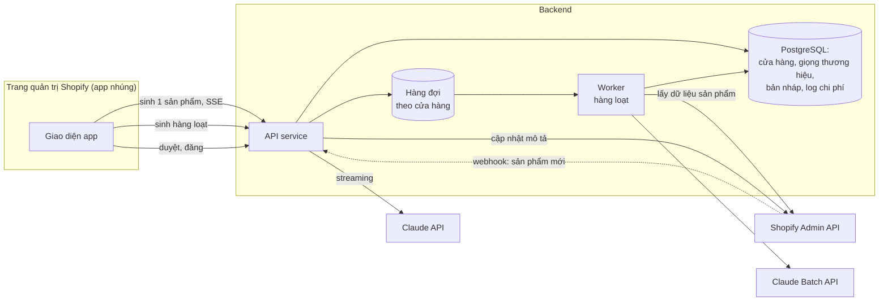

# Case 1: Shopify app sinh mô tả sản phẩm

!!! abstract "Tóm tắt"
    Thiết kế một Shopify app giúp hàng nghìn cửa hàng sinh mô tả sản phẩm bằng AI, cả từng sản phẩm (tương tác) lẫn hàng loạt (nền). Trọng tâm: đa tenant, tách đường realtime và batch, ước tính chi phí để định giá gói dịch vụ, hàng đợi công bằng giữa các cửa hàng, giới hạn API của nền tảng.

## 1. Yêu cầu

**Chức năng**

- Merchant bấm "Viết mô tả bằng AI" trên một sản phẩm, xem bản nháp (streaming), sửa, bấm đăng lên cửa hàng.
- Merchant chọn nhiều sản phẩm (hoặc "tất cả sản phẩm chưa có mô tả"), hệ thống sinh hàng loạt, merchant duyệt theo lô.
- Mỗi cửa hàng cấu hình **giọng thương hiệu**: văn phong, xưng hô, từ nên và không nên dùng, ngôn ngữ (tiếng Việt, tiếng Anh).
- Mức tự động: **bản nháp** (merchant luôn duyệt trước khi đăng).

**Quy mô và ràng buộc**

| Hạng mục | Giả định |
|---|---|
| Số cửa hàng cài app | 10.000 (20% trả phí) |
| Sản phẩm trung bình mỗi cửa hàng | 300 |
| Mô tả sinh mới mỗi tháng | Trung bình 50 mỗi cửa hàng đang hoạt động |
| Độ trễ (tương tác) | Chữ đầu tiên dưới 2 giây |
| Độ trễ (hàng loạt) | Trong vài giờ là chấp nhận được |
| Giá gói trả phí | Khoảng 9 đến 19 USD mỗi tháng |
| Ràng buộc nền tảng | API của Shopify có giới hạn tốc độ **theo từng cửa hàng** |

**Không chấp nhận:** bịa thông tin sản phẩm (chất liệu, xuất xứ, chứng nhận), tuyên bố y tế, mô tả của cửa hàng này bị lẫn dữ liệu cửa hàng khác.

## 2. Ước lượng quy mô và chi phí

### Token cho một mô tả

| Phần | Token (ước lượng) | Cache được? |
|---|---|---|
| System prompt, quy tắc, ví dụ | 1.000 | Có (giống nhau cho mọi cửa hàng) |
| Giọng thương hiệu của cửa hàng | 300 | Có (theo cửa hàng) |
| Dữ liệu sản phẩm (tên, thuộc tính, ghi chú) | 300 | Không |
| Output: mô tả khoảng 150 chữ tiếng Việt | 300 | |
| Token suy nghĩ (effort thấp) | khoảng 200 | |

### Chi phí mỗi mô tả với Claude Sonnet 5, effort thấp

```text
Input không cache:   300 token × 2 USD / 1M          = 0,0006 USD
Input đọc từ cache:  1.300 token × 0,2 USD / 1M      = 0,00026 USD
Output + suy nghĩ:   500 token × 10 USD / 1M         = 0,005 USD
                                                      ≈ 0,006 USD mỗi mô tả
Qua Batch API (giảm 50%)                              ≈ 0,003 USD mỗi mô tả
```

Output chiếm phần lớn chi phí. Giới hạn độ dài mô tả và dùng effort thấp là đòn bẩy chính. Kể cả khi phần 1.300 token không đạt ngưỡng tối thiểu để được cache, chi phí mỗi mô tả chỉ tăng thêm khoảng 0,002 USD: kết luận định giá bên dưới không đổi.

### Chi phí mỗi tháng

| Hạng mục | Tính toán | Chi phí |
|---|---|---|
| Sinh mới hằng tháng (tương tác) | 10.000 × 50% hoạt động × 50 mô tả × 0,006 USD | khoảng 1.500 USD |
| Sinh lại toàn bộ catalog lần đầu (batch, một lần) | 2.000 cửa hàng trả phí × 300 × 0,003 USD | khoảng 1.800 USD |
| **Chi phí AI mỗi cửa hàng trả phí dùng nhiều** | 200 mô tả × 0,006 USD | khoảng **1,2 USD mỗi tháng** |

**Kết luận cho định giá:** với giá gói 9 đến 19 USD, chi phí AI chỉ chiếm phần nhỏ, biên lợi nhuận tốt. Nhưng **gói miễn phí phải có hạn mức** (ví dụ 20 mô tả mỗi tháng), nếu không 8.000 cửa hàng miễn phí sinh lại toàn bộ catalog sẽ tốn vài nghìn USD mà không có doanh thu.

!!! tip "Có nên dùng Opus 5 cho chất lượng cao hơn?"
    Với Opus 5, chi phí mỗi mô tả tăng khoảng 2,5 lần, vẫn chỉ vài xu, hoàn toàn chịu được với gói trả phí. Hãy để **eval quyết định**: nếu Opus 5 tăng rõ tỉ lệ "đăng mà không sửa", có thể dùng Opus 5 cho đường tương tác (nơi merchant đang nhìn) và Sonnet 5 qua batch cho hàng loạt.

## 3. Kiến trúc



### Hai đường xử lý

| | Đường tương tác | Đường hàng loạt |
|---|---|---|
| Kích hoạt | Merchant bấm trên một sản phẩm | Merchant chọn nhiều sản phẩm |
| Xử lý | API gọi Claude **streaming** trực tiếp | Worker gom yêu cầu, gửi qua **Batch API** |
| Độ trễ | Chữ đầu tiên khoảng 1 giây | Vài phút tới vài giờ, có thông báo khi xong |
| Chi phí | Giá thường | Giảm 50% |

### Luồng hàng loạt chi tiết

1. Merchant chọn sản phẩm, API tạo một **job** (trạng thái, số sản phẩm) và đưa vào hàng đợi.
2. Worker lấy dữ liệu sản phẩm từ Shopify Admin API. Với catalog lớn, dùng cơ chế truy vấn hàng loạt (bulk) của Shopify thay vì gọi từng sản phẩm, để không chạm giới hạn tốc độ của cửa hàng.
3. Worker tạo một batch request gửi Claude, `custom_id` gồm mã cửa hàng và mã sản phẩm. Giọng thương hiệu đặt ở phần đầu prompt có đánh dấu cache.
4. Khi batch xong, worker lưu bản nháp vào database, cập nhật tiến độ job, thông báo cho merchant.
5. Merchant duyệt theo lô trên giao diện (xem trước, sửa, chọn đăng). Chỉ khi merchant bấm đăng, API mới **ghi mô tả lên Shopify**.

## 4. Dữ liệu và đa tenant

```sql
CREATE TABLE shops (
  shop_domain   text PRIMARY KEY,
  plan          text NOT NULL,             -- free, pro
  brand_voice   jsonb NOT NULL,            -- văn phong, xưng hô, từ cấm, ngôn ngữ
  monthly_quota int NOT NULL
);

CREATE TABLE description_drafts (
  id           bigserial PRIMARY KEY,
  shop_domain  text NOT NULL REFERENCES shops,
  product_id   text NOT NULL,
  draft        text NOT NULL,
  status       text NOT NULL,              -- draft, published, discarded
  edited       boolean,                    -- merchant có sửa trước khi đăng không
  regenerations int DEFAULT 0,
  prompt_version text NOT NULL,
  model        text NOT NULL,
  trace_id     text,
  created_at   timestamptz DEFAULT now()
);
```

- **Mọi truy vấn** lọc theo `shop_domain` lấy từ phiên xác thực của Shopify, không từ tham số client gửi lên.
- Prompt chỉ chứa dữ liệu của **một** cửa hàng. Không có bước nào trộn dữ liệu nhiều cửa hàng trong một lệnh gọi LLM.
- Khi cửa hàng gỡ app, xóa dữ liệu theo chính sách (và theo yêu cầu dữ liệu của nền tảng).

### Hàng đợi công bằng

Một cửa hàng lớn yêu cầu sinh 20.000 mô tả không được làm các cửa hàng khác phải chờ hàng giờ. Worker lấy việc **luân phiên theo cửa hàng** (round robin), hoặc giới hạn số sản phẩm mỗi cửa hàng trong một đợt batch.

## 5. Chất lượng và eval

Đặc tả hành vi theo [Thiết kế sản phẩm, Bài 1](../thiet-ke-san-pham/01-tu-duy-san-pham.md#4-ac-ta-tinh-nang-ai-bang-vi-du) chuyển thành eval:

| Tiêu chí | Cách chấm |
|---|---|
| Độ dài, định dạng, ngôn ngữ, xưng hô | Code |
| Không bịa thông tin ngoài dữ liệu sản phẩm | Giám khảo LLM đã kiểm định |
| Không tuyên bố nhạy cảm (theo ngành hàng) | Danh sách từ khóa và giám khảo LLM |
| Đúng giọng thương hiệu | Giám khảo LLM so với cấu hình và ví dụ của cửa hàng |

Dataset eval: 200 sản phẩm thật từ nhiều ngành hàng (thời trang, mỹ phẩm, đồ gia dụng, thực phẩm), nhiều mức đầy đủ thông tin, cả tiếng Việt và tiếng Anh.

**Chỉ số online** (quan trọng nhất): tỉ lệ bản nháp được đăng, tỉ lệ đăng mà **không sửa**, số lần tạo lại trung bình. Phân tích theo ngành hàng và theo ngôn ngữ để tìm chỗ yếu.

## 6. Các quyết định và đánh đổi

| Quyết định | Lựa chọn | Lý do | Phương án khác |
|---|---|---|---|
| Mức tự động | Bản nháp, merchant duyệt | Nội dung công khai, merchant chịu trách nhiệm | Tự đăng cho merchant đã tin tưởng, sau khi có số liệu |
| Dùng ảnh sản phẩm? | Tùy chọn, mặc định tắt ở batch | Ảnh giúp mô tả màu sắc, kiểu dáng chính xác hơn nhưng tăng token đáng kể | Bật cho gói cao cấp |
| Model | Sonnet 5 effort thấp; thử Opus 5 cho đường tương tác | Chi phí thấp, chất lượng đủ; để eval quyết định nâng cấp | Model nhỏ hơn cho catalog rất lớn |
| Batch hay gọi song song | Batch | Rẻ hơn 50%, không chiếm rate limit của đường tương tác | Gọi song song có giới hạn nếu cần nhanh |
| Ghi lên Shopify khi nào | Chỉ khi merchant bấm đăng | Tránh ghi đè mô tả merchant đã viết tay | |

## 7. Rủi ro và vận hành

| Rủi ro | Giảm thiểu |
|---|---|
| Bịa thông tin, tuyên bố nhạy cảm | Prompt chỉ dùng dữ liệu có sẵn; giám khảo tự động trên mẫu; merchant duyệt; cảnh báo cho ngành hàng nhạy cảm |
| Gói miễn phí bị lạm dụng | Hạn mức theo tháng; giới hạn kích thước job hàng loạt |
| Chạm giới hạn API của Shopify | Truy vấn hàng loạt, tôn trọng giới hạn theo cửa hàng, retry có backoff |
| Nhà cung cấp LLM gặp sự cố | Đường tương tác: báo lỗi thân thiện, cho thử lại; đường batch: tự retry, không ảnh hưởng merchant |
| Ghi đè nhầm mô tả | Lưu mô tả cũ trước khi ghi, cho phép hoàn tác |

**Lộ trình ra mắt:** tuần 1 đến 2 thăm dò chất lượng với 50 sản phẩm thật; ra mắt đường tương tác cho 5% cửa hàng; thêm hàng loạt sau khi có số liệu tỉ lệ đăng; cân nhắc tự động sinh khi có sản phẩm mới (qua webhook) khi tỉ lệ đăng mà không sửa đủ cao.

## Bài tập

**Bài 1.** Tính lại chi phí nếu mỗi mô tả kèm 2 ảnh sản phẩm. Đo số token ảnh bằng `count_tokens` với ảnh thật. Gói dịch vụ nào nên có tính năng này?

**Bài 2.** Thiết kế cơ chế hàng đợi công bằng cụ thể: cấu trúc dữ liệu trong Redis, thuật toán chọn việc tiếp theo.

**Bài 3.** Merchant phàn nàn "AI viết giống nhau cho mọi sản phẩm". Liệt kê các nguyên nhân có thể và cách kiểm tra từng nguyên nhân bằng dữ liệu.

**Bài 4.** Mở rộng hệ thống để sinh cả tiêu đề SEO và mô tả meta. Thay đổi những gì trong kiến trúc, chi phí, eval?

---

[Tổng quan track](index.md) · **Case tiếp theo:** [Case 2: Chatbot chăm sóc khách hàng](02-chatbot-cua-hang.md)
