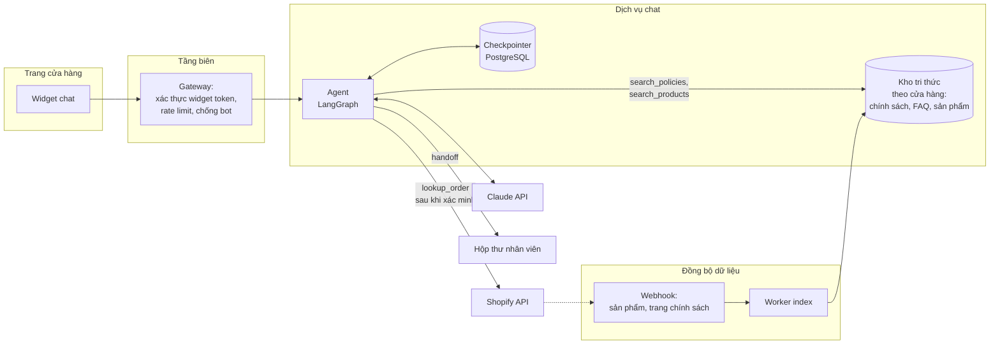

# Case 2: Chatbot chăm sóc khách hàng cho nhiều cửa hàng

!!! abstract "Tóm tắt"
    Thiết kế một widget chat đặt trên cửa hàng online, trả lời khách mua hàng về sản phẩm, chính sách, đơn hàng, cho hàng nghìn cửa hàng khác nhau. Trọng tâm: RAG và tool theo từng tenant, xác minh khách vãng lai trước khi tra đơn, chống lạm dụng endpoint công khai, chuyển cho người, mô hình chi phí theo hội thoại.

## 1. Yêu cầu

**Chức năng**

- Khách (thường chưa đăng nhập) mở widget, hỏi về sản phẩm (size, chất liệu, còn hàng), chính sách (đổi trả, vận chuyển, thanh toán), đơn hàng của họ.
- Không trả lời được, khách bức xúc, hoặc yêu cầu nằm ngoài phạm vi thì **chuyển cho nhân viên** của cửa hàng (email hoặc hộp thư trong app), kèm tóm tắt hội thoại.
- Merchant cấu hình: văn phong, chủ đề được phép, thông tin liên hệ, giờ làm việc.
- Mức tự động: **tự động có giám sát** (bot trả lời trực tiếp, merchant xem lại log).

**Quy mô và ràng buộc**

| Hạng mục | Giả định |
|---|---|
| Số cửa hàng dùng chatbot | 2.000 |
| Hội thoại mỗi cửa hàng mỗi tháng | Trung bình 500, cửa hàng lớn tới 20.000 |
| Lượt mỗi hội thoại | Trung bình 4 |
| Cao điểm | Gấp 10 lần trung bình (flash sale, ngày lễ) |
| Độ trễ | Chữ đầu tiên dưới 1,5 giây |
| Endpoint | **Công khai**, ai cũng gọi được từ trình duyệt |

**Không chấp nhận:** lộ thông tin đơn hàng cho người không phải chủ đơn; cam kết ngoài chính sách (hoàn tiền, quà tặng); trả lời bằng dữ liệu của cửa hàng khác.

## 2. Ước lượng chi phí

Token mỗi lượt (ước lượng, hội thoại càng dài lịch sử càng lớn):

| Phần | Token | Cache |
|---|---|---|
| System prompt, định nghĩa tool | 2.000 | Có |
| Cấu hình và chính sách cốt lõi của cửa hàng | 1.500 | Có |
| Lịch sử hội thoại | 0 đến 2.000 | Phần lớn có (cache theo tiền tố hội thoại) |
| Kết quả tool (RAG, tra đơn) | 1.000 | Không |
| Output + suy nghĩ | 400 | |

Với Claude Sonnet 5, mỗi lượt khoảng:

```text
Input không cache:  ~1.500 token × 2 USD / 1M    = 0,003 USD
Input từ cache:     ~4.000 token × 0,2 USD / 1M  = 0,0008 USD
Output + suy nghĩ:     400 token × 10 USD / 1M   = 0,004 USD
                                                  ≈ 0,008 USD mỗi lượt
                                                  ≈ 0,03 USD mỗi hội thoại (4 lượt)
```

| | Tính toán | Chi phí mỗi tháng |
|---|---|---|
| Toàn hệ thống | 2.000 × 500 × 0,03 USD | khoảng 30.000 USD |
| Cửa hàng trung bình | 500 × 0,03 USD | khoảng 15 USD |
| Cửa hàng lớn | 20.000 × 0,03 USD | khoảng 600 USD |

**Kết luận cho định giá:** chi phí **tỉ lệ thuận với số hội thoại**, không thể dùng một mức giá cố định cho mọi cửa hàng. Mô hình phù hợp: gói có hạn mức hội thoại, vượt thì tính thêm theo hội thoại. Nếu không có prompt caching, chi phí input tăng vài lần: caching ở đây là **bắt buộc**.

Tối ưu thêm: câu hỏi FAQ lặp lại (phí ship, thời gian giao) chiếm tỉ lệ lớn, có thể định tuyến sang model nhỏ hơn hoặc trả lời từ cache kết quả theo cửa hàng; chỉ làm khi eval xác nhận chất lượng.

## 3. Kiến trúc



### Các tool của agent

| Tool | Chức năng | Kiểm soát |
|---|---|---|
| `search_policies(query)` | RAG trên chính sách, FAQ, trang thông tin của cửa hàng | Lọc theo `shop_id` từ context |
| `search_products(query)` | Tìm sản phẩm, tồn kho, giá | Dữ liệu thật từ catalog, không để model tự viết giá |
| `verify_customer(order_number, email)` | Xác minh khách là chủ đơn | Đúng cả hai thông tin mới trả về token phiên |
| `lookup_order()` | Trạng thái đơn đã xác minh | Chỉ chạy khi phiên có token xác minh; chỉ trả đúng đơn đó |
| `handoff(summary, reason)` | Chuyển nhân viên | Tạo phiếu kèm tóm tắt và lịch sử |

## 4. Đa tenant và bảo mật

### Xác định cửa hàng

Widget nhận một **token có chữ ký** do backend cấp khi trang cửa hàng tải widget, chứa `shop_id`. Gateway kiểm tra chữ ký và đưa `shop_id` vào **runtime context** của agent. Agent và tool **không bao giờ** lấy `shop_id` từ nội dung tin nhắn.

### Xác minh khách vãng lai

Khách chưa đăng nhập nên không có danh tính sẵn. Tra đơn hàng yêu cầu **hai thông tin khớp nhau** (mã đơn và email hoặc số điện thoại đặt hàng). Sau khi xác minh, phiên chat được gắn quyền xem **đúng một đơn** đó. Giới hạn số lần thử xác minh để chống dò đoán.

### Chống lạm dụng

Endpoint công khai sẽ bị lạm dụng: bot dò dữ liệu, người dùng biến chatbot thành dịch vụ AI miễn phí, cố tình làm cửa hàng tốn tiền.

- Rate limit theo phiên, IP, và **ngân sách theo cửa hàng** (hết hạn mức thì chuyển sang chế độ "để lại lời nhắn").
- Giới hạn độ dài tin nhắn, số lượt mỗi hội thoại.
- System prompt giới hạn phạm vi (chỉ về cửa hàng); **giám sát tỉ lệ câu hỏi ngoài phạm vi** theo cửa hàng.
- Prompt injection gián tiếp: nội dung đánh giá sản phẩm, mô tả do bên thứ ba nhập có thể chứa chỉ dẫn độc hại. Kết quả tool được đặt trong thẻ dữ liệu; agent không có tool nguy hiểm nên thiệt hại tối đa là trả lời sai ([LLMOps, Bài 4](../llmops/04-bao-mat.md)).

## 5. Đồng bộ tri thức

- Khi cài app: lấy chính sách, trang thông tin, FAQ, sản phẩm; chunk, embed, index theo `shop_id` ([RAG, Bài 8](../rag/08-production.md#2-ingestion-lien-tuc)).
- Khi sản phẩm hoặc trang thay đổi: webhook kích hoạt đồng bộ tăng dần.
- Chính sách cốt lõi ngắn (đổi trả, vận chuyển) nạp thẳng vào system prompt có cache; tri thức dài (catalog, FAQ chi tiết) qua RAG.

## 6. Chất lượng và eval

| Nhóm kịch bản | Tiêu chí |
|---|---|
| Hỏi chính sách | Đúng theo chính sách của **đúng** cửa hàng; có trích nguồn nội bộ |
| Hỏi sản phẩm | Giá, tồn kho khớp dữ liệu thật |
| Tra đơn | Có xác minh trước; không lộ đơn khi xác minh sai |
| Ngoài phạm vi, tấn công | Từ chối lịch sự; không bị lừa cam kết, không lộ system prompt |
| Bức xúc, phức tạp | Chuyển nhân viên đúng lúc, tóm tắt đầy đủ |

Dùng người dùng giả lập nhiều lượt với nhiều tính cách ([Evaluation, Bài 3](../evaluation/03-eval-agent.md#6-nguoi-dung-gia-lap-cho-hoi-thoai-nhieu-luot)), chạy trên **dữ liệu của nhiều cửa hàng khác nhau** để bắt lỗi lẫn dữ liệu.

**Chỉ số online:** tỉ lệ hội thoại được giải quyết không cần chuyển người; lý do chuyển người (phân loại tự động); feedback của khách; tỉ lệ trượt giám khảo "cam kết không có căn cứ" trên mẫu traffic.

## 7. Các quyết định và đánh đổi

| Quyết định | Lựa chọn | Phương án khác |
|---|---|---|
| Kiến trúc agent | Một agent, 5 tool, giới hạn lượt | Router nhiều agent chuyên biệt: chỉ khi số tool, lĩnh vực tăng mạnh |
| Chính sách cốt lõi | Nạp thẳng, cache | Tất cả qua RAG: rẻ hơn khi chính sách rất dài, nhưng thêm độ trễ và rủi ro retrieve sai |
| Model | Sonnet 5 cho mọi lượt | Định tuyến FAQ đơn giản sang model nhỏ khi có số liệu |
| Mức tự động | Trả lời trực tiếp, merchant xem log | Chế độ "nhân viên duyệt trước khi gửi" cho cửa hàng muốn kiểm soát chặt |

## 8. Rủi ro và vận hành

- **Sự cố LLM lúc flash sale:** fallback sang model dự phòng; nếu vẫn lỗi, widget chuyển sang form "để lại lời nhắn".
- **Chi phí một cửa hàng tăng vọt:** ngân sách theo cửa hàng, cảnh báo cho merchant khi gần hết hạn mức.
- **Bot trả lời sai chính sách bị khách chụp màn hình lan truyền:** merchant có công tắc tắt bot; mọi câu trả lời truy vết được; bổ sung ngay vào bộ eval.

## Bài tập

**Bài 1.** Thiết kế chi tiết luồng xác minh khách vãng lai: các trạng thái của phiên, số lần thử, thông báo cho khách, cách lưu token xác minh.

**Bài 2.** Tính lại chi phí nếu **không** dùng prompt caching. Chênh lệch bao nhiêu lần? Liệt kê những thứ có thể vô tình phá cache trong thiết kế này.

**Bài 3.** Một cửa hàng lớn có 30.000 sản phẩm và 200 trang FAQ. Thay đổi gì trong thiết kế đồng bộ tri thức và retrieval?

**Bài 4.** Viết 20 kịch bản tấn công riêng cho hệ thống này (dò đơn người khác, lấy dữ liệu cửa hàng khác, dùng bot làm việc ngoài phạm vi) và tiêu chí chấm tự động cho từng kịch bản.

---

**Case trước:** [Case 1: Sinh mô tả sản phẩm](01-sinh-mo-ta-san-pham.md) · [Tổng quan track](index.md) · **Case tiếp theo:** [Case 3: Trợ lý cho merchant](03-tro-ly-merchant.md)
