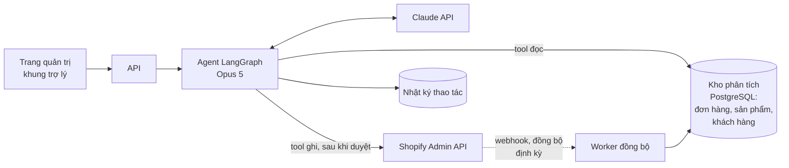

# Case 3: Trợ lý cho merchant (admin copilot)

!!! abstract "Tóm tắt"
    Thiết kế một trợ lý trong trang quản trị giúp chủ cửa hàng hỏi về tình hình kinh doanh bằng ngôn ngữ tự nhiên và thực hiện thao tác (tạo mã giảm giá, cập nhật tồn kho, gắn tag). Trọng tâm: số liệu phải chính xác tuyệt đối, tool có kiểu thay vì truy vấn tùy ý, phân quyền theo phạm vi của app, phê duyệt trước mọi thao tác ghi.

## 1. Yêu cầu

**Ví dụ câu hỏi và yêu cầu**

- "Doanh thu tuần này so với tuần trước thế nào? Sản phẩm nào tăng mạnh nhất?"
- "Những sản phẩm nào sắp hết hàng trong 7 ngày tới theo tốc độ bán hiện tại?"
- "Khách hàng nào mua nhiều nhất trong quý nhưng 60 ngày nay chưa quay lại?"
- "Tạo mã giảm 15% cho bộ sưu tập mùa hè, hết hạn cuối tháng."
- "Gắn tag 'best-seller' cho 10 sản phẩm bán chạy nhất tháng."

**Yêu cầu chất lượng**

- **Số liệu phải chính xác tuyệt đối.** Merchant ra quyết định kinh doanh dựa trên con số; sai một con số làm mất niềm tin vào cả sản phẩm.
- Mọi thao tác **ghi** phải được merchant xác nhận, hiển thị rõ điều sắp xảy ra.
- Trả lời trong vài giây đến chục giây; hiển thị tiến trình.

**Quy mô:** vài nghìn merchant, mỗi người vài chục câu hỏi mỗi tuần. Lưu lượng thấp hơn nhiều so với chatbot cho khách mua hàng, nhưng **giá trị mỗi câu hỏi cao hơn**. Chấp nhận chi phí mỗi câu hỏi cao hơn để có chất lượng tốt nhất.

## 2. Quyết định cốt lõi: LLM không tự tính số liệu

LLM rất giỏi hiểu câu hỏi và diễn giải kết quả, nhưng **không đáng tin** khi tự cộng, trừ, so sánh hàng trăm con số. Nguyên tắc:

> **LLM chọn phép tính, hệ thống thực hiện phép tính, LLM diễn giải kết quả.**

Có ba cách để LLM truy cập dữ liệu:

| Cách | Mô tả | Ưu | Nhược |
|---|---|---|---|
| **A. Tool có kiểu** | Bộ tool nghiệp vụ: `get_sales_summary(period, compare_to, group_by)`, `get_low_stock(days_of_cover)`... | Chính xác, an toàn, dễ kiểm thử, dễ phân quyền | Chỉ trả lời được những gì tool hỗ trợ |
| **B. Sinh truy vấn (text-to-SQL)** | LLM viết SQL trên kho dữ liệu phân tích | Linh hoạt, trả lời câu hỏi bất kỳ | Có thể sai logic âm thầm (sai điều kiện lọc, sai cách tính), khó kiểm soát |
| **C. Kết hợp** | Tool có kiểu cho câu hỏi phổ biến; text-to-SQL cho câu hỏi hiếm, trên dữ liệu chỉ đọc, hiển thị kèm câu truy vấn để kiểm tra | Cân bằng | Phức tạp hơn |

**Lựa chọn: bắt đầu với A**, phủ khoảng 20 câu hỏi phổ biến nhất (lấy từ phỏng vấn merchant). Ghi lại câu hỏi không trả lời được để quyết định thêm tool nào, hoặc khi nào cần tới C.

## 3. Kiến trúc



### Kho dữ liệu phân tích riêng

Gọi Shopify API cho mỗi câu hỏi phân tích vừa chậm vừa dễ chạm giới hạn tốc độ. Thay vào đó, **đồng bộ** đơn hàng, sản phẩm, khách hàng về một kho riêng (lần đầu bằng truy vấn hàng loạt, sau đó qua webhook và đồng bộ định kỳ). Các tool đọc truy vấn kho này bằng SQL **do bạn viết sẵn**, được kiểm thử.

### Tool có kiểu

```python title="copilot/tools.py"
from datetime import date
from typing import Literal

from langchain.tools import ToolRuntime, tool
from pydantic import BaseModel


class SalesSummary(BaseModel):
    period: str
    revenue: int
    orders: int
    avg_order_value: int
    compare_period: str | None
    revenue_change_pct: float | None
    top_items: list[dict]  # [{"name": ..., "revenue": ..., "change_pct": ...}]


@tool
def get_sales_summary(
    period: Literal["today", "this_week", "last_week", "this_month", "last_month", "last_30_days"],
    compare_to_previous: bool,
    group_by: Literal["product", "collection", "channel"] | None,
    runtime: ToolRuntime,
) -> str:
    """Tổng hợp doanh thu, số đơn, giá trị đơn trung bình trong một khoảng thời gian,
    có thể so với kỳ trước và nhóm theo sản phẩm, bộ sưu tập hoặc kênh bán.
    Mọi con số đã được tính sẵn chính xác; hãy dùng nguyên văn, không tự tính lại."""
    shop_id = runtime.context.shop_id
    summary: SalesSummary = analytics.sales_summary(shop_id, period, compare_to_previous, group_by)
    return summary.model_dump_json()
```

Chú ý dòng cuối của docstring: dặn model **dùng nguyên văn** số liệu. Kết hợp với eval kiểm tra con số trong câu trả lời khớp với output của tool.

### Thao tác ghi có phê duyệt

```python
@tool
def create_discount(code: str, percent: int, collection: str, ends_at: date, runtime: ToolRuntime) -> str:
    """Tạo mã giảm giá theo phần trăm cho một bộ sưu tập. Cần merchant phê duyệt."""
    if not 1 <= percent <= 90:
        return "Phần trăm giảm phải từ 1 đến 90."
    ...  # gọi Shopify Admin API, ghi nhật ký thao tác
```

`HumanInTheLoopMiddleware` chặn mọi tool ghi (`create_discount`, `update_inventory`, `add_tags`) để hiện **thẻ phê duyệt** trên giao diện ([Thiết kế sản phẩm, Bài 3](../thiet-ke-san-pham/03-generative-ui.md#6-the-phe-duyet-human-in-the-loop-tren-giao-dien)). Mọi thao tác được ghi vào nhật ký, kèm trace của hội thoại.

## 4. Phân quyền

- App chỉ xin **phạm vi quyền tối thiểu** từ Shopify cho các tool có thật; thêm tool ghi mới thì cần merchant đồng ý phạm vi mới.
- Với cửa hàng có nhiều nhân viên, tôn trọng quyền của **người đang dùng** (nhân viên kho không tạo được mã giảm giá).
- `shop_id` và quyền của người dùng lấy từ phiên xác thực, đưa vào runtime context.

## 5. Trình bày kết quả

Câu trả lời dạng văn bản cho câu hỏi số liệu nên kèm **bảng hoặc biểu đồ** do hệ thống vẽ từ dữ liệu của tool (generative UI, [Thiết kế sản phẩm, Bài 3](../thiet-ke-san-pham/03-generative-ui.md)), không phải bảng do LLM tự viết. Hiện rõ **khoảng thời gian và phạm vi dữ liệu** ("Dữ liệu đến 14:00 hôm nay, không gồm đơn đã hủy") để merchant hiểu con số.

## 6. Chất lượng và eval

| Nhóm | Cách chấm |
|---|---|
| **Chọn tool và tham số** | So khớp với tool call kỳ vọng ("tuần này so với tuần trước" phải là `period="this_week", compare_to_previous=True`) |
| **Chính xác số liệu** | Code: mọi con số trong câu trả lời phải xuất hiện trong output của tool (hoặc là phép làm tròn của nó) |
| **Diễn giải** | Giám khảo LLM: kết luận có đúng với số liệu không ("tăng" hay "giảm", "mạnh nhất" có đúng sản phẩm) |
| **An toàn** | Không có thao tác ghi nào chạy mà không qua phê duyệt; không truy cập dữ liệu cửa hàng khác |
| **Câu hỏi ngoài khả năng** | Nói rõ không trả lời được, không đoán số |

Dataset eval dùng **cửa hàng giả lập với dữ liệu biết trước đáp án** (tạo sẵn đơn hàng với doanh thu xác định), để chấm số liệu bằng code.

```python
import re


def numbers_grounded(answer: str, tool_outputs: list[str]) -> bool:
    """Mọi số có từ 3 chữ số trở lên trong câu trả lời phải có trong output của tool."""
    source = " ".join(tool_outputs).replace(".", "").replace(",", "")
    for raw in re.findall(r"\d[\d.,]{2,}", answer):
        if raw.replace(".", "").replace(",", "") not in source:
            return False
    return True
```

## 7. Các quyết định và đánh đổi

| Quyết định | Lựa chọn | Lý do |
|---|---|---|
| Model | Opus 5 | Lưu lượng thấp, giá trị cao, cần hiểu câu hỏi mơ hồ và chọn đúng tool |
| Truy cập dữ liệu | Tool có kiểu trên kho phân tích riêng | Chính xác, nhanh, không chạm giới hạn API |
| Thao tác ghi | Luôn phê duyệt | Hậu quả tài chính, khó hoàn tác |
| Câu hỏi chưa hỗ trợ | Nói rõ, ghi lại để ưu tiên phát triển | Tốt hơn đoán sai |

## Bài tập

**Bài 1.** Phỏng vấn (hoặc tự đóng vai) 3 chủ cửa hàng, liệt kê 20 câu hỏi họ muốn hỏi. Gom thành một bộ tool có kiểu tối thiểu (bao nhiêu tool phủ được 80% câu hỏi?).

**Bài 2.** Thiết kế schema kho phân tích và các truy vấn SQL cho `get_sales_summary` và `get_low_stock`. Viết test với dữ liệu biết trước đáp án.

**Bài 3.** Merchant hỏi "Vì sao doanh thu tuần này giảm?". Thiết kế cách agent trả lời: cần những tool nào, trình bày giả thuyết thế nào để không khẳng định điều chưa chắc chắn?

**Bài 4.** So sánh phương án A và B (mục 2) trên 30 câu hỏi: dựng thử text-to-SQL trên kho dữ liệu chỉ đọc, đo tỉ lệ đúng số liệu của cả hai phương án.

---

**Case trước:** [Case 2: Chatbot chăm sóc khách hàng](02-chatbot-cua-hang.md) · [Tổng quan track](index.md) · **Case tiếp theo:** [Case 4: Phân tích đánh giá hàng loạt](04-phan-tich-danh-gia.md)
