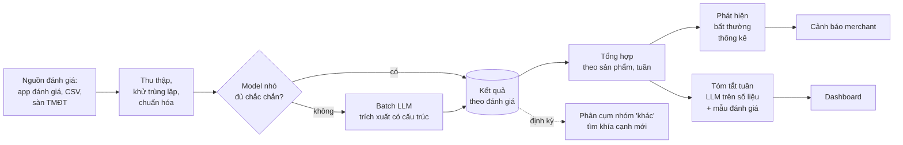

# Case 4: Phân tích đánh giá hàng loạt

!!! abstract "Tóm tắt"
    Thiết kế pipeline xử lý hàng triệu đánh giá sản phẩm mỗi tháng: phân loại cảm xúc và khía cạnh, tóm tắt theo sản phẩm, cảnh báo khi xuất hiện vấn đề mới. Trọng tâm: xử lý batch, thiết kế taxonomy, dùng LLM cho đúng chỗ, chưng cất sang model nhỏ khi khối lượng lớn, phát hiện bất thường bằng thống kê.

## 1. Yêu cầu

**Chức năng**

- Với mỗi đánh giá: cảm xúc tổng thể, **các khía cạnh** được nhắc tới (size, chất liệu, màu sắc, giao hàng, đóng gói, giá, chăm sóc khách hàng) và cảm xúc theo từng khía cạnh.
- Mỗi tuần, mỗi sản phẩm: bản tóm tắt ngắn "khách khen gì, chê gì", kèm trích dẫn tiêu biểu.
- **Cảnh báo** khi một vấn đề tăng đột biến ("size nhỏ" ở sản phẩm X tăng từ 5% lên 30% đánh giá trong tuần).
- Dashboard cho merchant: xu hướng theo khía cạnh, theo sản phẩm.

**Quy mô và ràng buộc**

| Hạng mục | Giả định |
|---|---|
| Đánh giá mới mỗi tháng | 5 triệu (toàn bộ cửa hàng) |
| Độ dài trung bình | 30 đến 50 chữ, nhiều viết tắt, không dấu, emoji |
| Độ trễ | Trong vòng 24 giờ là chấp nhận được |
| Ngôn ngữ | Chủ yếu tiếng Việt, một phần tiếng Anh |

## 2. Thiết kế taxonomy

Đây là quyết định **sản phẩm**, không chỉ kỹ thuật. Taxonomy quyết định merchant nhìn thấy gì.

- **Danh sách khía cạnh cố định**, định nghĩa rõ từng khía cạnh kèm ví dụ ("size: vừa, chật, rộng, nên lên size..."). Cố định để số liệu so sánh được theo thời gian.
- Luôn có nhóm **"khác"** kèm mô tả tự do ngắn. Định kỳ (hằng tháng) phân cụm các mô tả trong nhóm "khác" để **phát hiện khía cạnh mới** đáng thêm vào taxonomy.
- Có thể có khía cạnh riêng theo ngành hàng (mỹ phẩm: kích ứng da, mùi hương; điện tử: pin, bảo hành).

## 3. Ước lượng chi phí

Trích xuất bằng LLM cho mỗi đánh giá:

| Phần | Token |
|---|---|
| Chỉ dẫn, taxonomy, ví dụ (cache được) | 800 |
| Nội dung đánh giá | 100 |
| Output có cấu trúc (JSON ngắn) | 80 |

Với **Claude Haiku 4.5 qua Batch API** (tác vụ đơn giản, không cần kết quả ngay):

```text
Input:   900 × 1 USD / 1M     = 0,0009 USD
Output:   80 × 5 USD / 1M     = 0,0004 USD
                                ≈ 0,0013 USD mỗi đánh giá
Batch (giảm 50%)                ≈ 0,00065 USD mỗi đánh giá

5 triệu đánh giá mỗi tháng      ≈ 3.250 USD mỗi tháng
```

Phép tính trên **không** tính prompt caching, vì phần chỉ dẫn 800 token có thể ngắn hơn ngưỡng tối thiểu để được cache của model. Nếu mở rộng phần chỉ dẫn (thêm ví dụ) vượt ngưỡng đó, phần này chỉ còn khoảng 10% giá: hãy kiểm chứng bằng `cache_read_input_tokens`. Một cách khác là gộp nhiều đánh giá (ví dụ 20) vào một request để chia sẻ phần chỉ dẫn, đổi lại phải xử lý kỹ việc ghép kết quả với từng đánh giá.

Chấp nhận được, nhưng có thể giảm mạnh hơn nữa (mục 5). Tóm tắt hằng tuần theo sản phẩm là phần nhỏ về chi phí vì chỉ chạy trên **số liệu tổng hợp và một mẫu đánh giá**, không trên mọi đánh giá.

## 4. Pipeline



### 4.1 Trích xuất có cấu trúc

```python title="reviews/schema.py"
from typing import Literal

from pydantic import BaseModel, Field

Aspect = Literal["size", "chat_lieu", "mau_sac", "giao_hang", "dong_goi", "gia", "cham_soc_khach", "khac"]


class AspectMention(BaseModel):
    aspect: Aspect
    sentiment: Literal["positive", "neutral", "negative"]
    note: str | None = Field(default=None, description="Chỉ dùng khi aspect là 'khac': mô tả ngắn vấn đề")


class ReviewAnalysis(BaseModel):
    overall: Literal["positive", "neutral", "negative"]
    aspects: list[AspectMention]
    is_spam_or_irrelevant: bool
```

Gửi qua Batch API với `custom_id` là mã đánh giá ([Hiểu LLM, Bài 3](../hieu-llm/03-claude-api.md#10-message-batches-xu-ly-hang-loat-re-hon-50)); phần chỉ dẫn và taxonomy đặt ở đầu, có cache.

### 4.2 Phát hiện bất thường bằng thống kê, không bằng LLM

"Vấn đề size tăng đột biến" là câu hỏi **thống kê**: so tỉ lệ đánh giá tiêu cực về size tuần này với mức nền của các tuần trước.

```python
import math


def is_spike(neg_this_week: int, total_this_week: int, baseline_rate: float, min_reviews: int = 20) -> bool:
    """Cảnh báo khi tỉ lệ tuần này cao hơn mức nền một cách có ý nghĩa thống kê."""
    if total_this_week < min_reviews:
        return False  # quá ít đánh giá, dễ báo động giả
    rate = neg_this_week / total_this_week
    se = math.sqrt(baseline_rate * (1 - baseline_rate) / total_this_week) or 1e-9
    z = (rate - baseline_rate) / se
    return z > 3 and rate - baseline_rate > 0.10  # vừa có ý nghĩa thống kê, vừa đủ lớn để quan tâm
```

LLM chỉ được dùng **sau đó**, để viết lời cảnh báo dễ hiểu kèm vài trích dẫn tiêu biểu.

### 4.3 Tóm tắt tuần

Đầu vào cho LLM: số liệu tổng hợp theo khía cạnh (đã tính bằng SQL) cộng một **mẫu** khoảng 30 đánh giá tiêu biểu (chọn theo khía cạnh nổi bật). Không đưa toàn bộ hàng nghìn đánh giá vào prompt: vừa đắt, vừa làm model bỏ sót thông tin.

## 5. Chưng cất sang model nhỏ

Khi pipeline đã chạy vài tháng, bạn có **hàng triệu đánh giá đã được LLM gán nhãn**. Đó là dữ liệu huấn luyện cho một model nhỏ ([ML nền tảng, Bài 2](../ml-nen-tang/02-ml-co-dien.md#6-ml-co-ien-hay-llm) và [Bài 4](../ml-nen-tang/04-transformers-hf.md#33-fine-tune-mot-encoder-e-phan-loai)):

1. Lấy mẫu 50.000 đánh giá đã gán nhãn, **kiểm tra chất lượng nhãn** trên một mẫu nhỏ bằng người.
2. Fine-tune một encoder đa ngôn ngữ cho phân loại cảm xúc và khía cạnh.
3. Chạy model nhỏ trước; chỉ những đánh giá model nhỏ **không chắc chắn** (xác suất thấp) mới gửi cho LLM.
4. Theo dõi: tỉ lệ gửi sang LLM, và định kỳ so model nhỏ với LLM trên mẫu mới để phát hiện suy giảm.

Nếu model nhỏ xử lý được 80% đánh giá, chi phí LLM giảm khoảng 5 lần, và độ trễ xử lý giảm mạnh.

## 6. Chất lượng và eval

- **Bộ nhãn vàng:** 1.000 đánh giá do người gán nhãn (đa dạng ngành hàng, có viết tắt, mỉa mai, không dấu). Đo precision, recall theo **từng khía cạnh**, không chỉ độ chính xác tổng.
- **Kiểm tra tóm tắt:** giám khảo LLM kiểm tra mọi nhận định trong tóm tắt có được số liệu và trích dẫn hỗ trợ.
- **Kiểm tra cảnh báo:** tỉ lệ cảnh báo giả (merchant đánh dấu "không hữu ích"), tỉ lệ bỏ sót (vấn đề merchant tự phát hiện mà hệ thống không báo).
- **Theo dõi trôi dạt (drift):** phân phối khía cạnh thay đổi đột ngột trên toàn hệ thống có thể là lỗi pipeline chứ không phải vấn đề thật.

## 7. Các quyết định và đánh đổi

| Quyết định | Lựa chọn | Lý do |
|---|---|---|
| Model trích xuất | Haiku 4.5 qua batch, sau đó chưng cất | Tác vụ đơn giản, khối lượng lớn, không gấp |
| Taxonomy | Cố định cộng nhóm "khác", xem lại hằng tháng | Số liệu so sánh được theo thời gian, vẫn phát hiện được vấn đề mới |
| Phát hiện bất thường | Thống kê | Chính xác, rẻ, giải thích được; LLM chỉ viết lời cảnh báo |
| Tóm tắt | LLM trên số liệu tổng hợp và mẫu | Rẻ, không bỏ sót, có căn cứ |

## Bài tập

**Bài 1.** Viết định nghĩa đầy đủ cho 8 khía cạnh, mỗi khía cạnh 3 ví dụ và 1 ví dụ dễ nhầm. Chạy trích xuất trên 200 đánh giá thật, đo độ chính xác theo khía cạnh.

**Bài 2.** Mô phỏng dữ liệu 8 tuần của một sản phẩm, tuần thứ 8 có vấn đề size tăng đột biến. Kiểm tra `is_spike` phát hiện đúng và không báo động giả ở các tuần trước.

**Bài 3.** Tính chi phí mỗi tháng nếu dùng Sonnet 5 thay Haiku 4.5, và nếu chưng cất xử lý 80% đánh giá. Lập bảng so sánh ba phương án.

**Bài 4.** Thiết kế luồng "phân cụm nhóm khác": từ các `note`, dùng embedding và thuật toán phân cụm, rồi dùng LLM đặt tên cho mỗi cụm. Ai quyết định thêm cụm vào taxonomy chính thức?

---

**Case trước:** [Case 3: Trợ lý cho merchant](03-tro-ly-merchant.md) · [Tổng quan track](index.md) · **Case tiếp theo:** [Case 5: Tìm kiếm sản phẩm tiếng Việt](05-tim-kiem-san-pham.md)
