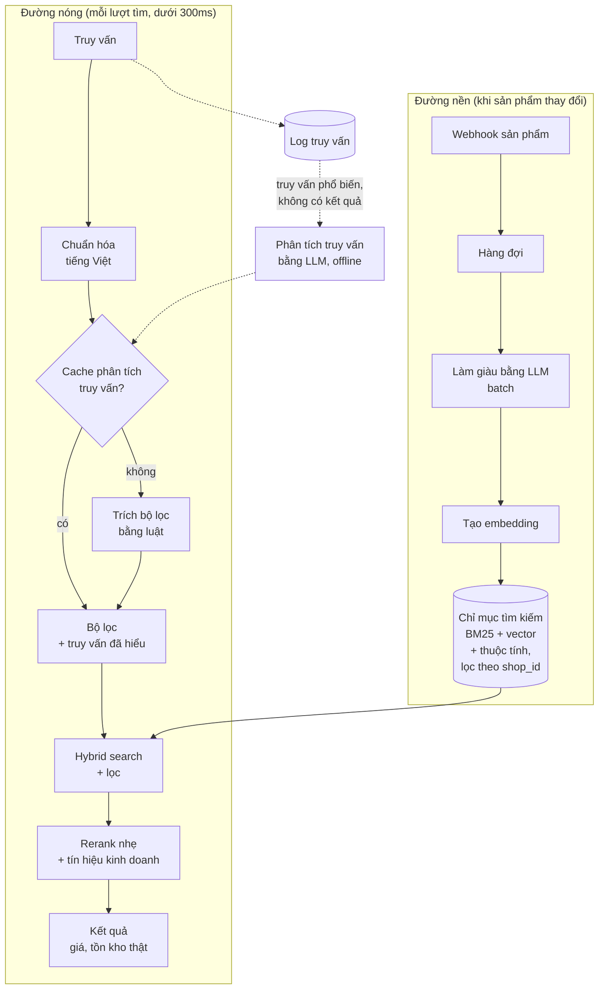

# Case 5: Tìm kiếm sản phẩm tiếng Việt

!!! abstract "Tóm tắt"
    Thiết kế ô tìm kiếm cho cửa hàng online hiểu được truy vấn tự nhiên tiếng Việt ("váy đi tiệc màu đỏ dưới 500k", "ao so mi nam di lam"), trả kết quả trong dưới 300ms. Trọng tâm: **không đặt LLM trên đường nóng**, dùng LLM để làm giàu dữ liệu offline, hybrid search có xử lý tiếng Việt không dấu, trích bộ lọc từ truy vấn, đo relevance.

## 1. Yêu cầu

**Chức năng**

- Hiểu truy vấn tự nhiên: loại sản phẩm, màu, dịp dùng, khoảng giá, giới tính, chất liệu.
- Chịu được **không dấu, viết tắt, sai chính tả**: "dam", "đầm", "váy" cùng một nghĩa; "500k", "500 nghìn", "nửa triệu".
- Kết quả đúng với **dữ liệu thật** (giá, tồn kho hiện tại).
- Sản phẩm mới hoặc vừa sửa xuất hiện trong kết quả trong vòng 5 phút.

**Quy mô và ràng buộc**

| Hạng mục | Giả định |
|---|---|
| Số cửa hàng | 2.000, mỗi cửa hàng từ 100 đến 50.000 sản phẩm |
| Lượt tìm kiếm | Tổng cộng khoảng 50 lượt mỗi giây lúc cao điểm |
| Độ trễ | **p95 dưới 300ms** (tìm kiếm phải cảm giác tức thì) |
| Chi phí | Rất thấp mỗi lượt tìm (lượt tìm không trực tiếp tạo doanh thu) |

## 2. Vì sao không gọi LLM cho mỗi lượt tìm?

| | Gọi LLM mỗi lượt tìm |
|---|---|
| Độ trễ | Một lệnh gọi LLM thường mất từ vài trăm mili giây tới vài giây: **vượt ngân sách 300ms** |
| Chi phí | 50 lượt/giây × 2,6 triệu giây mỗi tháng ≈ 130 triệu lượt; dù mỗi lượt chỉ 0,0005 USD cũng là 65.000 USD mỗi tháng |
| Độ ổn định | Phụ thuộc hoàn toàn vào API bên ngoài cho một tính năng cốt lõi |

**Nguyên tắc: dùng LLM ở nơi có thời gian và ở nơi kết quả dùng lại được nhiều lần.**

- **Offline, khi sản phẩm thay đổi:** LLM làm giàu dữ liệu sản phẩm (một lần cho mỗi sản phẩm, dùng cho hàng triệu lượt tìm).
- **Cho truy vấn phổ biến:** LLM phân tích truy vấn, **cache kết quả phân tích** (một số ít truy vấn chiếm phần lớn lượt tìm).
- **Đường nóng:** chỉ dùng tìm kiếm, embedding, và luật đã tính sẵn.

## 3. Kiến trúc



## 4. Làm giàu dữ liệu sản phẩm (offline)

Mô tả sản phẩm của merchant thường nghèo nàn ("Đầm dự tiệc cao cấp"). LLM đọc tên, mô tả, thuộc tính, **ảnh** và sinh thêm các trường có cấu trúc giúp tìm kiếm:

```python title="search/enrich.py"
from typing import Literal

from pydantic import BaseModel, Field


class SearchEnrichment(BaseModel):
    category: str = Field(description="Loại sản phẩm chuẩn hóa, ví dụ: đầm, áo sơ mi, quần jeans")
    gender: Literal["nam", "nu", "unisex", "tre_em"] | None
    colors: list[str] = Field(description="Màu sắc thấy được, tên tiếng Việt chuẩn")
    occasions: list[str] = Field(description="Dịp sử dụng phù hợp: đi làm, dự tiệc, đi biển, ở nhà...")
    styles: list[str] = Field(description="Phong cách: công sở, dạo phố, thể thao...")
    synonyms: list[str] = Field(description="Các cách người Việt hay gọi sản phẩm này, kể cả không dấu, tiếng lóng phổ biến")
```

- Chạy qua **Batch API** khi sản phẩm được tạo hoặc sửa: độ trễ vài phút tới vài giờ là chấp nhận được, chi phí giảm 50%.
- Chi phí mỗi sản phẩm (kèm một ảnh) chỉ vài phần mười xu, **một lần**, trong khi được dùng cho hàng nghìn lượt tìm.
- Trường giá, tồn kho **không** do LLM sinh: luôn lấy trực tiếp từ dữ liệu sản phẩm, cập nhật qua webhook.
- Eval: độ chính xác của `colors`, `category` trên mẫu có nhãn; kiểm tra `synonyms` không chứa từ sai lệch (gây kết quả không liên quan).

## 5. Đường nóng

### 5.1 Chuẩn hóa tiếng Việt

Khách gõ không dấu rất phổ biến. Chỉ mục lưu **cả hai dạng**: có dấu và không dấu. Truy vấn cũng được chuẩn hóa tương tự.

```python title="search/normalize.py"
import re
import unicodedata


def strip_accents(text: str) -> str:
    """'Đầm dự tiệc' -> 'dam du tiec'"""
    text = unicodedata.normalize("NFD", text)
    text = "".join(c for c in text if unicodedata.category(c) != "Mn")
    return text.replace("đ", "d").replace("Đ", "D")


PRICE = re.compile(r"(?:duoi|<)\s*(\d+)\s*(k|nghin|tr|trieu)?", re.IGNORECASE)


def parse_max_price(query: str) -> int | None:
    """'vay duoi 500k' -> 500000 ; 'duoi 1 trieu' -> 1000000"""
    m = PRICE.search(strip_accents(query).lower())
    if not m:
        return None
    value, unit = int(m.group(1)), (m.group(2) or "").lower()
    return value * (1_000_000 if unit in ("tr", "trieu") else 1_000 if unit in ("k", "nghin") else 1)
```

Luật đơn giản như trên xử lý được phần lớn truy vấn chứa giá, màu, giới tính, **trong vài mili giây**. Truy vấn phức tạp hơn được xử lý bởi phân tích offline bằng LLM (mục 5.3).

### 5.2 Hybrid search và xếp hạng

- **BM25** trên tên, mô tả, trường làm giàu (cả dạng có dấu và không dấu): bắt đúng từ khóa, mã sản phẩm.
- **Vector search** trên embedding của sản phẩm (đã làm giàu): hiểu ngữ nghĩa ("đồ đi biển" khớp "váy maxi voan").
- Gộp bằng RRF ([RAG, Bài 4](../rag/04-retrieval-nang-cao.md#23-reciprocal-rank-fusion-rrf)), áp dụng **bộ lọc** (giá, giới tính, còn hàng) và **luôn lọc theo `shop_id`**.
- Rerank nhẹ trên khoảng 50 kết quả đầu: kết hợp điểm liên quan với tín hiệu kinh doanh (còn hàng, bán chạy, tỉ lệ nhấp). Reranker cross-encoder chỉ dùng nếu nằm trong ngân sách độ trễ (chạy trên GPU hoặc model rất nhỏ).
- Embedding của truy vấn: model embedding nhỏ tự host hoặc API có độ trễ thấp, và **cache embedding** cho truy vấn phổ biến.

### 5.3 Phân tích truy vấn bằng LLM, offline

Log truy vấn cho thấy vài nghìn truy vấn chiếm phần lớn lượt tìm. Định kỳ:

1. Lấy các truy vấn phổ biến, và các truy vấn **không có kết quả** hoặc **tỉ lệ nhấp thấp**.
2. LLM phân tích mỗi truy vấn thành bộ lọc và truy vấn đã viết lại ("đồ đi đám cưới cho nam" → loại: vest, áo sơ mi; dịp: dự tiệc; giới tính: nam).
3. Lưu vào cache theo truy vấn đã chuẩn hóa. Đường nóng tra cache trong vài mili giây.

Truy vấn không có kết quả còn là **tín hiệu kinh doanh** cho merchant: khách đang tìm thứ cửa hàng chưa bán.

## 6. Chất lượng và eval

| Loại | Chỉ số |
|---|---|
| **Offline** | NDCG@10, Recall@20 trên bộ 500 truy vấn có nhãn mức liên quan (người gán, hoặc LLM gán rồi người kiểm tra) |
| **Online** | Tỉ lệ nhấp vào kết quả, tỉ lệ thêm vào giỏ từ tìm kiếm, tỉ lệ truy vấn không có kết quả, tỉ lệ tìm lại ngay (dấu hiệu kết quả không tốt) |
| **Hiệu năng** | p50, p95, p99 độ trễ; tỉ lệ trúng cache phân tích truy vấn |
| **A/B test** | So sánh tìm kiếm mới với tìm kiếm cũ theo tỉ lệ chuyển đổi ([Evaluation, Bài 4](../evaluation/04-online-eval.md#6-ab-test)) |

Bộ truy vấn eval phải có đủ: có dấu, không dấu, viết tắt, có giá, có màu, truy vấn mơ hồ, mã sản phẩm, truy vấn tiếng Anh.

## 7. Các quyết định và đánh đổi

| Quyết định | Lựa chọn | Phương án khác |
|---|---|---|
| LLM ở đâu | Offline: làm giàu sản phẩm, phân tích truy vấn phổ biến | LLM trên đường nóng: chỉ cân nhắc cho tính năng "trợ lý mua sắm" dạng chat, nơi người dùng chấp nhận chờ |
| Trích bộ lọc | Luật + cache phân tích từ LLM | Model phân loại nhỏ chạy trên đường nóng, huấn luyện từ dữ liệu LLM đã gán |
| Chỉ mục | Một hệ thống hỗ trợ cả BM25 và vector (ví dụ PostgreSQL với pgvector và full-text search, hoặc công cụ tìm kiếm chuyên dụng) | Hai hệ thống riêng: linh hoạt hơn, vận hành phức tạp hơn |
| Đa tenant | Một chỉ mục, bắt buộc lọc `shop_id` | Chỉ mục riêng cho cửa hàng rất lớn |

## Bài tập

**Bài 1.** Viết bộ luật trích bộ lọc cho giá, màu, giới tính. Đo tỉ lệ đúng trên 100 truy vấn thật hoặc tự viết (có dấu và không dấu).

**Bài 2.** Làm giàu 200 sản phẩm bằng `SearchEnrichment` (kèm ảnh). So sánh NDCG@10 của tìm kiếm có và không có trường làm giàu trên 50 truy vấn.

**Bài 3.** Đo độ trễ từng bước của đường nóng trong một prototype. Bước nào chiếm nhiều nhất? Có nằm trong ngân sách 300ms không?

**Bài 4.** Thiết kế tính năng "trợ lý mua sắm" dạng chat bổ sung cho ô tìm kiếm: khi nào chuyển người dùng từ ô tìm kiếm sang trợ lý, trợ lý dùng lại những thành phần nào của hệ thống tìm kiếm?

---

**Case trước:** [Case 4: Phân tích đánh giá hàng loạt](04-phan-tich-danh-gia.md) · [Tổng quan track](index.md)

!!! success "Hoàn thành track Case study"
    Bạn đã thực hành thiết kế 5 hệ thống với các ràng buộc rất khác nhau. Điểm chung của cả 5: **làm rõ yêu cầu, ước lượng bằng số, đặt LLM đúng chỗ, để code làm những việc cần chính xác, và đo mọi thứ**. Hãy áp dụng khung 7 bước cho dự án thật của bạn, bắt đầu bằng một tài liệu thiết kế ([Thiết kế sản phẩm, Bài 4](../thiet-ke-san-pham/04-trach-nhiem-giao-tiep.md#5-tai-lieu-thiet-ke-cho-tinh-nang-ai)).
