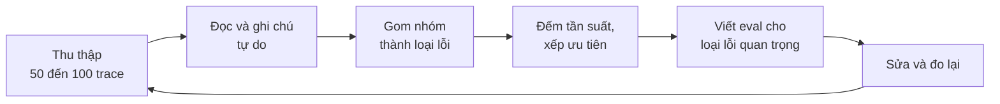

# Bài 1: Tư duy eval và phân tích lỗi

!!! abstract "Tóm tắt bài học"
    - **Mục tiêu:** hiểu eval khác test ở đâu, thực hiện được quy trình phân tích lỗi từ dữ liệu thật để tìm ra điều cần đo, và xây bộ dataset eval đầu tiên.
    - **Thời lượng:** 4 đến 5 ngày.
    - **Yêu cầu trước:** đã có một ứng dụng LLM chạy được (bất kỳ dự án nào ở các track trước).

## 1. Eval khác test thế nào?

| | Test phần mềm | Eval ứng dụng LLM |
|---|---|---|
| Output | Xác định: `add(2, 2) == 4` | Không xác định, nhiều đáp án đúng |
| Kết quả | Đạt hoặc không đạt | Tỉ lệ, điểm số, phân phối |
| Mục tiêu | Bắt lỗi logic | Đo **chất lượng** và phát hiện **loại lỗi** |
| Khi nào viết | Cùng lúc với code | **Sau khi** quan sát hệ thống sai ở đâu |

Sai lầm phổ biến là bắt đầu eval bằng một danh sách metric "chuẩn" (độ liên quan, độ trôi chảy, độ hữu ích...) lấy từ thư viện nào đó. Những metric chung chung này thường **không đo đúng thứ làm hỏng sản phẩm của bạn**. Eval tốt bắt đầu từ việc hiểu hệ thống **thực sự sai ở đâu**.

## 2. Quy trình phân tích lỗi



### Bước 1: Thu thập trace

Một **trace** là toàn bộ những gì xảy ra trong một lần xử lý: input của người dùng, prompt thực tế gửi đi, các lệnh gọi tool và kết quả, output cuối. Lấy từ:

- Log production (tốt nhất: đây là dữ liệu thật).
- Nếu chưa có người dùng: tự tạo 50 đến 100 input **đa dạng** (xem mục 4) và chạy qua hệ thống.

### Bước 2: Đọc và ghi chú tự do

Đọc từng trace, ghi một dòng nhận xét về **lỗi đầu tiên** bạn thấy. Chưa cần phân loại, cứ viết tự nhiên:

| Trace | Ghi chú |
|---|---|
| #12 | Khách hỏi phí ship ra Đà Nẵng, bot báo phí Hà Nội |
| #17 | Bot xưng "tôi" thay vì "Mộc" |
| #23 | Khách hỏi đổi size, bot trả lời chính sách hoàn tiền |
| #31 | Bot hứa "giao trong 24h" dù không có thông tin đó |
| #38 | Tool tra đơn trả lỗi, bot vẫn nói "đơn đang được giao" |

Tại sao chỉ ghi lỗi **đầu tiên**? Vì lỗi phía trước thường gây ra lỗi phía sau (tra sai đơn thì trả lời sai là đương nhiên). Sửa lỗi gốc trước.

**Ai nên đọc?** Tốt nhất là người **hiểu nghiệp vụ** (chuyên viên chăm sóc khách hàng, chuyên gia lĩnh vực), cùng với kỹ sư. Kỹ sư thấy lỗi kỹ thuật; chuyên gia nghiệp vụ thấy những câu trả lời "nghe có vẻ đúng" nhưng sai chính sách.

### Bước 3: Gom nhóm thành loại lỗi

Sau khoảng 50 ghi chú, các mẫu lỗi sẽ lộ ra. Gom chúng thành 5 đến 10 **loại lỗi**:

| Loại lỗi | Ghi chú thuộc loại này | Số lượng |
|---|---|---|
| Bịa cam kết (thời gian giao, khuyến mãi) | #31, #44, #52... | 9 |
| Hiểu sai ý định khách | #23, #29... | 7 |
| Bỏ qua lỗi của tool | #38, #41... | 5 |
| Sai thông tin tỉnh thành, vận chuyển | #12, #19... | 4 |
| Sai xưng hô, giọng văn | #17, #25... | 3 |

### Bước 4: Xếp ưu tiên

Ưu tiên theo **tần suất × mức độ nghiêm trọng**. "Bịa cam kết" vừa phổ biến vừa nguy hiểm (khách khiếu nại khi không được giao trong 24h), nên xử lý đầu tiên. "Sai xưng hô" ít nghiêm trọng hơn.

Nhiều lỗi có thể **sửa ngay** không cần eval phức tạp (thêm một dòng vào prompt về xưng hô). Eval tự động dành cho các lỗi **dai dẳng, quan trọng**, cần theo dõi lâu dài.

### Bước 5: Viết eval cho từng loại lỗi quan trọng

Mỗi loại lỗi ưu tiên trở thành một **eval cụ thể**, đo đúng loại lỗi đó:

| Loại lỗi | Eval | Cách chấm |
|---|---|---|
| Bịa cam kết | "Câu trả lời có cam kết nào không có trong kết quả tool và chính sách không?" | Giám khảo LLM (Bài 2) |
| Bỏ qua lỗi của tool | "Khi có tool lỗi, câu trả lời có thừa nhận không tra được không?" | Code kiểm tra trace + giám khảo LLM |
| Sai xưng hô | "Câu trả lời có chứa 'tôi' không?" | Code (regex) |

Eval cụ thể như vậy **dễ chấm hơn, đáng tin hơn, và chỉ ra cách sửa rõ ràng hơn** nhiều so với một điểm "chất lượng tổng thể" từ 1 đến 10.

## 3. Công cụ đọc trace

Đọc trace trong file JSON thô rất mệt. Có hai lựa chọn:

- **LangSmith** (hoặc Langfuse): tự động ghi trace từ ứng dụng LangChain, có giao diện xem từng bước, thêm ghi chú, gắn nhãn, đưa vào dataset. Bật bằng biến môi trường `LANGSMITH_TRACING=true`. Xem [Observability](../../oss/python/langchain/observability.md).
- **Tự làm một trang xem trace đơn giản:** hiển thị input, output, các lệnh gọi tool trên một màn hình, có ô ghi chú và nút chuyển trace tiếp theo. Vài chục dòng code (Streamlit, hoặc một trang HTML) giúp tăng tốc độ đọc lên nhiều lần. Đây là một trong những khoản đầu tư có lợi nhất.

```python title="trace_viewer.py (Streamlit)"
import json

import streamlit as st

traces = [json.loads(l) for l in open("traces.jsonl", encoding="utf-8")]
i = st.number_input("Trace số", 0, len(traces) - 1, 0)
t = traces[i]

st.subheader("Khách hàng")
st.write(t["input"])
st.subheader("Các lệnh gọi tool")
for call in t.get("tool_calls", []):
    st.code(f"{call['name']}({call['args']}) -> {call['result']}")
st.subheader("Trả lời")
st.write(t["output"])

note = st.text_input("Ghi chú lỗi đầu tiên", key=f"note-{i}")
if st.button("Lưu"):
    with open("notes.jsonl", "a", encoding="utf-8") as f:
        f.write(json.dumps({"trace": i, "note": note}, ensure_ascii=False) + "\n")
```

## 4. Xây dataset eval

### 4.1 Đa dạng theo các chiều

Khi phải tự tạo input (chưa có người dùng thật), đừng viết ngẫu nhiên. Xác định **các chiều** tạo nên sự đa dạng, rồi tổ hợp chúng:

| Chiều | Giá trị |
|---|---|
| Ý định | Hỏi đơn hàng, đổi trả, tư vấn size, khiếu nại, hỏi khuyến mãi |
| Kiểu khách | Lịch sự, vội vàng, bức xúc, mơ hồ |
| Cách viết | Chuẩn, viết tắt không dấu ("sp nay con size L ko"), lẫn tiếng Anh |
| Độ khó | Một bước, nhiều bước, ngoài phạm vi, cố tình lừa |

Có thể nhờ LLM sinh input theo từng tổ hợp, rồi **đọc lại và loại bỏ** các input không tự nhiên.

```python
import itertools

from pydantic import BaseModel

INTENTS = ["hỏi đơn hàng", "đổi size", "khiếu nại giao trễ", "hỏi khuyến mãi"]
PERSONAS = ["lịch sự", "bức xúc", "vội, viết tắt không dấu"]


class Message(BaseModel):
    text: str


for intent, persona in itertools.product(INTENTS, PERSONAS):
    msg = ask_structured(  # hàm ở Prompt & Context, Bài 2
        f"Viết MỘT tin nhắn chat thật tự nhiên mà một khách hàng Việt Nam ({persona}) "
        f"gửi cho shop thời trang online với ý định: {intent}. Chỉ viết tin nhắn.",
        Message,
    )
    print(intent, "|", persona, "|", msg.text)
```

### 4.2 Kích thước và chia tập

- **Bắt đầu với 50 đến 100 ví dụ** là đủ để phát hiện phần lớn vấn đề. Tăng dần khi hệ thống trưởng thành.
- Mỗi lỗi phát hiện trên production được **thêm vào dataset** (như viết test tái hiện bug).
- Nếu bạn tối ưu prompt liên tục trên cùng một dataset, prompt sẽ "học thuộc" dataset đó. Giữ riêng một phần (**tập kiểm tra**) chỉ dùng để xác nhận kết quả cuối cùng, không dùng khi tinh chỉnh.

### 4.3 Nhãn

Mỗi ví dụ nên có những gì cần cho việc chấm:

- **Đáp án tham chiếu** (khi có đáp án xác định, ví dụ phân loại, trích xuất).
- **Tiêu chí riêng** cho ví dụ đó ("phải đề nghị chuyển nhân viên", "không được hứa thời gian giao").
- **Nhóm và độ khó**, để xem kết quả theo từng nhóm.

## 5. Vòng lặp cải tiến

Khi đã có eval:

1. Chạy eval, ghi lại **baseline**.
2. Chọn loại lỗi ưu tiên nhất, đưa ra giả thuyết sửa (sửa prompt, sửa tool, thêm bước kiểm tra...).
3. **Thay đổi một thứ**, chạy lại eval.
4. So sánh theo từng nhóm, **đọc các ví dụ thay đổi kết quả** (được sửa và bị hỏng).
5. Giữ thay đổi nếu tốt hơn, ghi lại vào nhật ký thử nghiệm.
6. Định kỳ quay lại phân tích lỗi trên trace mới: loại lỗi mới sẽ xuất hiện khi lỗi cũ được sửa.

## Bài tập

**Bài 1.1.** Chọn một ứng dụng bạn đã làm ở các track trước. Tạo 50 input đa dạng theo phương pháp ở mục 4.1, chạy qua hệ thống, lưu trace.

**Bài 1.2.** Đọc cả 50 trace, ghi chú lỗi đầu tiên cho mỗi trace (kể cả ghi "không lỗi"). Làm việc này **không dùng LLM hỗ trợ**: mục đích là để chính bạn hiểu hệ thống.

**Bài 1.3.** Gom ghi chú thành 5 đến 8 loại lỗi, đếm tần suất, xếp ưu tiên. Với 3 loại ưu tiên nhất, viết mô tả eval cụ thể và cách chấm (code hay LLM).

**Bài 1.4.** Viết trang xem trace đơn giản (Streamlit hoặc HTML). Đo thời gian đọc 20 trace trước và sau khi có trang này.

## Checklist

- [ ] Giải thích được vì sao nên phân tích lỗi trước khi chọn metric.
- [ ] Đã tự đọc và ghi chú ít nhất 50 trace của hệ thống.
- [ ] Có bảng loại lỗi với tần suất và mức độ ưu tiên.
- [ ] Dataset eval đa dạng theo các chiều có chủ đích, có tập kiểm tra riêng.
- [ ] Mỗi eval đo một loại lỗi cụ thể.

## Đọc thêm

- [RAG Bài 6: Evaluation](../rag/06-evaluation.md): áp dụng cụ thể cho RAG.
- [Evals](../../oss/python/langchain/test/evals.md), [Observability](../../oss/python/langchain/observability.md).

---

[Tổng quan track](index.md) · **Bài tiếp theo:** [Bài 2: Chấm điểm và LLM-as-a-judge](02-llm-judge.md)
