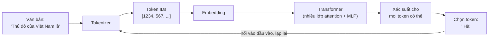

# Bài 1: LLM hoạt động thế nào

!!! abstract "Tóm tắt bài học"
    - **Mục tiêu:** hiểu đường đi từ văn bản đầu vào tới token đầu ra, hiểu các giai đoạn huấn luyện tạo nên một trợ lý AI, và rút ra các hệ quả thực tế cho người làm sản phẩm.
    - **Thời lượng:** khoảng 1 tuần.
    - **Yêu cầu trước:** Python cơ bản. Không cần toán nâng cao.

## 1. Bức tranh tổng thể

Về bản chất, một LLM làm **đúng một việc**: nhìn vào một đoạn văn bản và dự đoán **token tiếp theo**. Mọi khả năng "thông minh" (trả lời câu hỏi, viết code, gọi tool) đều nảy sinh từ việc lặp đi lặp lại thao tác đơn giản đó hàng nghìn lần.



Quá trình sinh từng token một, nối vào đầu vào rồi dự đoán tiếp, gọi là **autoregressive generation** (sinh tự hồi quy).

## 2. Token

### 2.1 Token là gì?

Model không đọc chữ cái hay từ, mà đọc **token**: các mảnh văn bản được chọn sao cho những chuỗi hay gặp chỉ tốn ít token. Thuật toán phổ biến là **BPE (Byte Pair Encoding)**: bắt đầu từ từng byte, lặp lại việc gộp cặp xuất hiện nhiều nhất thành một token mới.

Hệ quả:

- Từ tiếng Anh phổ biến thường là **một token**. Từ hiếm bị tách thành nhiều mảnh.
- Tiếng Việt có dấu, xuất hiện ít hơn trong dữ liệu huấn luyện, nên thường tốn **nhiều token hơn** cho cùng một nội dung.
- Số, mã sản phẩm, URL bị tách vụn. Đây là một lý do LLM hay sai khi đếm ký tự hoặc làm phép tính dài.

### 2.2 Nhìn tận mắt các token

Dùng tokenizer mã nguồn mở để xem văn bản bị tách ra sao:

```bash
uv add transformers torch
```

```python
from transformers import AutoTokenizer

tokenizer = AutoTokenizer.from_pretrained("Qwen/Qwen2.5-0.5B")

for text in [
    "The capital of Vietnam is Hanoi.",
    "Thủ đô của Việt Nam là Hà Nội.",
    "Mã đơn hàng: SHP-2025-00817",
]:
    ids = tokenizer.encode(text)
    pieces = [tokenizer.decode([i]) for i in ids]
    print(f"{len(ids):3d} token | {pieces}")
```

Mỗi model có tokenizer riêng. Để đếm chính xác số token **với model bạn đang dùng**, hãy dùng API của nhà cung cấp. Với Claude:

```python
import anthropic

client = anthropic.Anthropic()
count = client.messages.count_tokens(
    model="claude-opus-5",
    messages=[{"role": "user", "content": "Thủ đô của Việt Nam là Hà Nội."}],
)
print(count.input_tokens)
```

!!! tip "Token quyết định ba thứ"
    **Chi phí** (tính tiền theo token), **độ trễ** (sinh càng nhiều token càng lâu), và **giới hạn** (context window tính bằng token). Khi ước lượng cho sản phẩm tiếng Việt, luôn đo bằng văn bản tiếng Việt thật.

## 3. Embedding: biến token thành ý nghĩa

Mỗi token ID được ánh xạ thành một **vector** hàng nghìn chiều. Ban đầu các vector này ngẫu nhiên; qua huấn luyện, token có nghĩa gần nhau sẽ có vector gần nhau. Đây cũng là ý tưởng đằng sau embedding model dùng trong RAG (xem [RAG Bài 0](../rag/00-nen-tang.md#4-embedding-va-o-tuong-ong)).

## 4. Attention: mỗi token nhìn các token khác

Xét câu: *"Con mèo không ăn cá vì **nó** đã no."* Để hiểu "nó" là con mèo chứ không phải con cá, model cần **liên kết** "nó" với "con mèo".

**Self-attention** làm điều đó: với mỗi token, model tính xem nên "chú ý" bao nhiêu tới từng token đứng trước, rồi trộn thông tin của chúng lại. Mỗi token tạo ra ba vector:

- **Query**: "tôi đang tìm thông tin gì?"
- **Key**: "tôi chứa thông tin gì?"
- **Value**: "nếu được chú ý, tôi đóng góp thông tin này"

Độ chú ý giữa hai token là độ khớp giữa Query của token này với Key của token kia. Một Transformer có hàng chục **lớp** (layer) chồng lên nhau, mỗi lớp có nhiều **head** attention song song, xen kẽ với các mạng MLP. Lớp đầu học quan hệ ngữ pháp đơn giản, lớp sau học các khái niệm trừu tượng hơn.

Bạn sẽ tự cài đặt attention bằng PyTorch ở [track ML nền tảng](../ml-nen-tang/04-transformers-hf.md).

### Hệ quả thực tế: vì sao input rẻ hơn output

- **Input** được xử lý **song song** trong một lần chạy: mọi token của prompt đi qua mạng cùng lúc.
- **Output** phải sinh **tuần tự**: token thứ 100 chỉ có sau khi đã sinh xong token thứ 99.

Vì vậy output đắt hơn input nhiều lần (thường gấp 4 đến 5 lần), và độ trễ chủ yếu phụ thuộc số token **output**. Muốn nhanh và rẻ, hãy yêu cầu câu trả lời ngắn gọn.

Kết quả tính toán cho phần prompt (gọi là **KV cache**) có thể được lưu lại và tái sử dụng khi nhiều request có chung phần đầu. Đó là cơ chế đằng sau **prompt caching**, giúp phần prompt lặp lại rẻ hơn khoảng 10 lần (Bài 3).

## 5. Dự đoán token tiếp theo: xem tận mắt

Đoạn code sau chạy một model nhỏ trên máy của bạn và in ra 5 token có xác suất cao nhất:

```python title="next_token.py"
import torch
from transformers import AutoModelForCausalLM, AutoTokenizer

name = "Qwen/Qwen2.5-0.5B"
tokenizer = AutoTokenizer.from_pretrained(name)
model = AutoModelForCausalLM.from_pretrained(name)

prompt = "Thủ đô của Việt Nam là"
inputs = tokenizer(prompt, return_tensors="pt")

with torch.no_grad():
    logits = model(**inputs).logits[0, -1]  # điểm thô cho token tiếp theo

probs = torch.softmax(logits, dim=-1)
top = torch.topk(probs, 5)
for p, token_id in zip(top.values, top.indices):
    print(f"{p.item():6.1%}  {tokenizer.decode(token_id)!r}")
```

Model không "biết" đáp án theo nghĩa con người. Nó gán **xác suất** cho mọi token có thể có (hàng trăm nghìn token), và " Hà" có xác suất cao nhất vì chuỗi này xuất hiện rất nhiều trong dữ liệu huấn luyện. Bài 2 sẽ bàn cách chọn token từ phân phối xác suất này.

## 6. Từ "máy đoán chữ" thành trợ lý

Một model chỉ được huấn luyện dự đoán token tiếp theo trên văn bản internet sẽ **tiếp tục văn bản**, chứ không **trả lời câu hỏi**. Hỏi nó "Thủ đô của Pháp là gì?", nó có thể viết tiếp "Thủ đô của Đức là gì? Thủ đô của Ý là gì?" như một danh sách câu đố.

Trợ lý AI ngày nay là kết quả của nhiều giai đoạn:

| Giai đoạn | Dữ liệu | Model học được |
|---|---|---|
| **Pretraining** | Hàng nghìn tỉ token văn bản, code | Ngôn ngữ, kiến thức thế giới, khả năng suy luận thô |
| **Instruction tuning** (SFT) | Các cặp (yêu cầu, câu trả lời mẫu) chất lượng cao | Định dạng hội thoại, làm theo chỉ dẫn |
| **Học từ phản hồi** (RLHF, RLAIF, Constitutional AI) | Đánh giá, so sánh các câu trả lời | Hữu ích hơn, trung thực hơn, an toàn hơn, từ chối yêu cầu có hại |
| **Huấn luyện reasoning và agent** | Bài toán có đáp án kiểm chứng được, môi trường có tool | Suy nghĩ nhiều bước, dùng tool, tự sửa lỗi |

## 7. Hệ quả cho người làm sản phẩm

**Vì sao model "bịa" (hallucination)?** Model được huấn luyện để sinh văn bản **hợp lý**, và văn bản hợp lý không phải lúc nào cũng **đúng**. Khi không có thông tin, việc sinh ra một câu trả lời trôi chảy vẫn có xác suất cao hơn việc nói "tôi không biết", trừ khi model được huấn luyện và được hướng dẫn cụ thể. Các biện pháp: đưa thông tin vào context (RAG), cho phép và khuyến khích nói "không biết", yêu cầu trích dẫn, kiểm tra output.

**Knowledge cutoff.** Kiến thức của model dừng ở thời điểm thu thập dữ liệu huấn luyện. Model không biết giá sản phẩm hôm nay, chính sách công ty tuần trước, hay phiên bản thư viện mới nhất. Dữ liệu cần cập nhật phải được đưa vào qua context (RAG, tool).

**Model không nhớ gì giữa các request.** API là **stateless**: mọi "trí nhớ" trong một cuộc hội thoại là do bạn gửi lại toàn bộ lịch sử mỗi lần. Hội thoại càng dài, mỗi request càng đắt.

**Model giỏi những gì phổ biến trong dữ liệu.** Tiếng Việt, thuật ngữ nội bộ, quy trình riêng của công ty là những thứ model biết ít. Bù lại bằng ví dụ trong prompt (few-shot), tài liệu trong context, hoặc fine-tuning khi thực sự cần.

**Model yếu với những việc không tự nhiên cho token.** Đếm ký tự, đảo ngược chuỗi, phép nhân số lớn. Hãy giao những việc này cho code (qua tool) thay vì bắt model tự làm.

## Bài tập

**Bài 1.1.** Dùng tokenizer Qwen và API `count_tokens` của Claude, đo số token của cùng một đoạn văn 300 chữ bằng tiếng Việt và bản dịch tiếng Anh. Tính tỉ lệ chênh lệch cho từng tokenizer.

**Bài 1.2.** Chạy `next_token.py` với các prompt: "1 + 1 =", "Con mèo đang", "def fibonacci(n):". Quan sát phân phối xác suất: prompt nào model "chắc chắn", prompt nào "phân vân"?

**Bài 1.3.** Viết vòng lặp dùng `next_token.py` để sinh 20 token bằng cách **luôn chọn token xác suất cao nhất** (greedy decoding). So sánh kết quả với `model.generate(**inputs, max_new_tokens=20, do_sample=False)`.

??? tip "Gợi ý lời giải"
    ```python
    ids = inputs["input_ids"]
    for _ in range(20):
        with torch.no_grad():
            next_id = model(input_ids=ids).logits[0, -1].argmax()
        ids = torch.cat([ids, next_id.view(1, 1)], dim=1)
    print(tokenizer.decode(ids[0]))
    ```
    Kết quả phải giống hệt `generate(..., do_sample=False)`. Cách tự viết này chậm vì tính lại toàn bộ chuỗi mỗi bước; `generate` dùng KV cache để tránh việc đó.

**Bài 1.4.** Hỏi Claude 5 câu về sự kiện rất gần đây hoặc thông tin nội bộ không công khai. Ghi lại cách model phản hồi: từ chối, nói không chắc chắn, hay trả lời tự tin nhưng sai?

## Checklist

- [ ] Giải thích được autoregressive generation và vì sao output đắt hơn input.
- [ ] Đo được số token của văn bản tiếng Việt bằng API của nhà cung cấp.
- [ ] Giải thích được bằng lời thường: attention làm gì.
- [ ] Nêu được 4 giai đoạn huấn luyện và vai trò của từng giai đoạn.
- [ ] Giải thích được cho người không chuyên vì sao LLM "bịa" và cách giảm thiểu.

## Đọc thêm

- [The Illustrated Transformer](https://jalammar.github.io/illustrated-transformer/) (Jay Alammar): minh họa trực quan về Transformer.
- [Attention Is All You Need](https://arxiv.org/abs/1706.03762): bài báo gốc về Transformer.
- 3Blue1Brown: loạt video "Neural networks" giải thích Transformer và attention bằng hình ảnh.

---

[Tổng quan track](index.md) · **Bài tiếp theo:** [Bài 2: Sampling, reasoning và context](02-sampling-reasoning.md)
