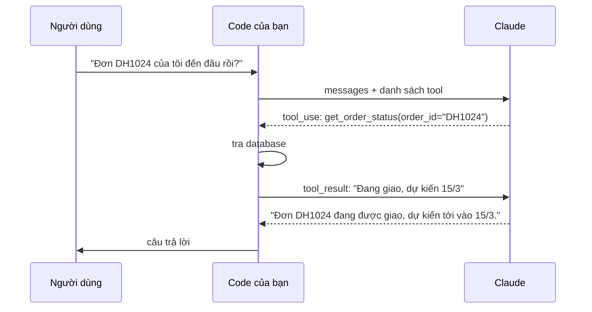

# Bài 4: Tool use từ con số 0

!!! abstract "Tóm tắt bài học"
    - **Mục tiêu:** hiểu tường tận cơ chế tool use (function calling) bằng cách tự viết vòng lặp agent với SDK gốc, xử lý đúng các tình huống: gọi nhiều tool song song, tool lỗi, đầu vào không hợp lệ, vòng lặp vô tận.
    - **Thời lượng:** 4 đến 5 ngày.
    - **Yêu cầu trước:** [Bài 3](03-claude-api.md).

## 1. Tool use là gì?

LLM chỉ sinh được văn bản. Nó không tự tra được database, gọi API, hay tính toán chính xác. **Tool use** cho phép model **yêu cầu** code của bạn làm những việc đó:



Điểm mấu chốt: **model không tự chạy tool**. Model chỉ trả về một khối `tool_use` ghi tên tool và tham số; **code của bạn** quyết định có chạy hay không, chạy ra sao, rồi gửi kết quả lại. Mọi agent (kể cả `create_agent` của LangChain) đều là vòng lặp này.

## 2. Định nghĩa tool

Mỗi tool gồm tên, mô tả, và JSON Schema của tham số:

```python title="tools.py"
TOOLS = [
    {
        "name": "get_order_status",
        "description": (
            "Tra trạng thái giao hàng của một đơn hàng. Dùng khi khách hỏi đơn hàng "
            "của họ đang ở đâu, bao giờ tới, đã giao chưa. Mã đơn có dạng DH theo sau là số."
        ),
        "input_schema": {
            "type": "object",
            "properties": {
                "order_id": {"type": "string", "description": "Mã đơn hàng, ví dụ DH1024"},
            },
            "required": ["order_id"],
        },
    },
    {
        "name": "calculate_shipping",
        "description": "Tính phí vận chuyển tới một tỉnh/thành phố theo cân nặng gói hàng.",
        "input_schema": {
            "type": "object",
            "properties": {
                "province": {"type": "string", "description": "Tên tỉnh/thành phố, ví dụ: Đà Nẵng"},
                "weight_kg": {"type": "number", "description": "Cân nặng gói hàng tính bằng kg"},
            },
            "required": ["province", "weight_kg"],
        },
    },
]
```

!!! tip "Mô tả tool quan trọng hơn bạn nghĩ"
    Model quyết định **gọi tool nào, khi nào, với tham số gì** chỉ dựa vào tên và mô tả. Mô tả tốt nói rõ: tool làm gì, **khi nào nên dùng**, định dạng tham số, và (nếu cần) khi nào **không** nên dùng. Phần lớn lỗi "agent gọi sai tool" được sửa bằng cách viết lại mô tả.

Phần cài đặt thật của tool (ở đây là dữ liệu giả lập):

```python title="tools.py (tiếp)"
ORDERS = {
    "DH1024": {"status": "Đang giao", "eta": "15/03/2026"},
    "DH1025": {"status": "Đã giao", "delivered_at": "10/03/2026"},
}
SHIPPING_ZONES = {"hà nội": 20_000, "hồ chí minh": 20_000, "đà nẵng": 30_000}


def get_order_status(order_id: str) -> str:
    order = ORDERS.get(order_id.upper())
    if order is None:
        raise ValueError(f"Không tìm thấy đơn hàng {order_id}")
    return str(order)


def calculate_shipping(province: str, weight_kg: float) -> str:
    if weight_kg <= 0 or weight_kg > 50:
        raise ValueError("Cân nặng phải trong khoảng 0 đến 50 kg")
    base = SHIPPING_ZONES.get(province.strip().lower(), 40_000)
    fee = base + max(0, weight_kg - 1) * 5_000
    return f"{fee:,.0f} VND"


REGISTRY = {"get_order_status": get_order_status, "calculate_shipping": calculate_shipping}
```

## 3. Tự viết vòng lặp agent

```python title="agent_loop.py"
import json

import anthropic

from tools import REGISTRY, TOOLS

client = anthropic.Anthropic()
SYSTEM = "Bạn là trợ lý chăm sóc khách hàng của cửa hàng. Dùng tool để tra cứu, không đoán."
MAX_TURNS = 8


def run_tool(name: str, args: dict) -> dict:
    """Chạy một tool, luôn trả về một khối tool_result (kể cả khi lỗi)."""
    func = REGISTRY.get(name)
    if func is None:
        return {"content": f"Tool {name} không tồn tại", "is_error": True}
    try:
        return {"content": func(**args)}
    except (TypeError, ValueError) as e:
        # Trả lỗi cho model: nó thường tự sửa tham số hoặc giải thích cho người dùng
        return {"content": f"Lỗi: {e}", "is_error": True}


def ask(question: str) -> str:
    messages = [{"role": "user", "content": question}]

    for _ in range(MAX_TURNS):
        response = client.messages.create(
            model="claude-opus-5",
            max_tokens=16000,
            system=SYSTEM,
            tools=TOOLS,
            messages=messages,
        )
        messages.append({"role": "assistant", "content": response.content})

        if response.stop_reason == "refusal":
            return "Xin lỗi, tôi không thể hỗ trợ yêu cầu này."
        if response.stop_reason == "max_tokens":
            raise RuntimeError("Câu trả lời bị cắt, không chạy tool với tham số có thể dở dang")

        tool_uses = [b for b in response.content if b.type == "tool_use"]
        if not tool_uses:  # model đã trả lời xong
            return next((b.text for b in response.content if b.type == "text"), "")

        # Chạy MỌI tool được yêu cầu, gửi TẤT CẢ kết quả trong MỘT tin nhắn user
        results = []
        for block in tool_uses:
            print(f"  [tool] {block.name}({json.dumps(block.input, ensure_ascii=False)})")
            results.append({"type": "tool_result", "tool_use_id": block.id, **run_tool(block.name, block.input)})
        messages.append({"role": "user", "content": results})

    raise RuntimeError(f"Agent vượt quá {MAX_TURNS} lượt")


print(ask("Đơn DH1024 của tôi tới đâu rồi? Nếu gửi thêm 1 gói 3kg ra Đà Nẵng thì phí bao nhiêu?"))
```

Với câu hỏi trên, model thường gọi **hai tool trong cùng một lượt** (song song), vì hai việc không phụ thuộc nhau.

### Các quy tắc bắt buộc

| Quy tắc | Nếu vi phạm |
|---|---|
| Mỗi `tool_use` phải có đúng một `tool_result` với `tool_use_id` khớp | API báo lỗi 400 |
| Mọi `tool_result` của một lượt gửi trong **một** tin nhắn `user` | Model dần "học" cách không gọi song song nữa, chậm hơn |
| Gửi lại toàn bộ `response.content` của assistant (gồm cả `tool_use`) | API báo lỗi vì `tool_result` không có `tool_use` tương ứng |
| Tool lỗi thì trả `is_error: True` kèm thông báo, **không bỏ qua** | Model không biết chuyện gì xảy ra, có thể bịa kết quả |
| Giới hạn số lượt | Agent có thể lặp vô tận, đốt tiền |
| Kiểm tra `stop_reason` trước khi chạy tool | Chạy tool với tham số bị cắt cụt khi gặp `max_tokens` |

## 4. Coi tham số của tool là đầu vào không tin cậy

Tham số trong `tool_use` do **model sinh ra**, và model có thể bị thao túng bởi nội dung người dùng hoặc tài liệu (prompt injection). Luôn kiểm tra như với input từ người dùng:

- **Validate kiểu và phạm vi** (ví dụ `weight_kg` trong khoảng hợp lệ). Có thể dùng Pydantic để parse `block.input`.
- **Kiểm tra quyền:** tool `get_order_status` phải kiểm tra đơn hàng **thuộc về người dùng đang đăng nhập**, không chỉ tin vào `order_id` model đưa ra.
- **Không bao giờ** đưa thẳng tham số vào câu lệnh SQL, lệnh shell, hay đường dẫn file mà không kiểm tra.
- Tool có tác động không thể hoàn tác (hoàn tiền, xóa dữ liệu, gửi email) cần **con người xác nhận** trước khi chạy.

Để API tự đảm bảo tham số khớp schema, thêm `"strict": True` vào định nghĩa tool (schema cần có `"additionalProperties": False` và liệt kê đủ `required`):

```python
{
    "name": "calculate_shipping",
    "description": "...",
    "strict": True,
    "input_schema": {
        "type": "object",
        "properties": {"province": {"type": "string"}, "weight_kg": {"type": "number"}},
        "required": ["province", "weight_kg"],
        "additionalProperties": False,
    },
}
```

`strict` đảm bảo **định dạng**, không đảm bảo **giá trị hợp lý** hay **quyền truy cập**. Vẫn phải tự kiểm tra hai điều đó.

## 5. Điều khiển việc gọi tool

Tham số `tool_choice`:

| Giá trị | Hành vi |
|---|---|
| `{"type": "auto"}` (mặc định) | Model tự quyết có gọi tool hay không |
| `{"type": "none"}` | Không gọi tool (vẫn gửi định nghĩa, hữu ích để giữ cache) |
| `{"type": "any"}` | Bắt buộc gọi ít nhất một tool |
| `{"type": "tool", "name": "..."}` | Bắt buộc gọi đúng tool này |

!!! note "Một số model mới không hỗ trợ ép gọi tool"
    Trên một số model mới nhất (ví dụ Claude Fable 5.1, Claude Opus 5.5), `any` và `tool` bị từ chối. Thay vào đó, dùng `auto` kèm chỉ dẫn rõ trong prompt, hoặc dùng structured output nếu mục đích chỉ là lấy JSON.

## 6. Tool runner: để SDK lo vòng lặp

Sau khi đã tự viết vòng lặp để hiểu cơ chế, trong code thật bạn có thể dùng **tool runner** của SDK (đang ở dạng beta). Schema được sinh tự động từ chữ ký hàm và docstring:

```python title="tool_runner_demo.py"
import anthropic
from anthropic import beta_tool

client = anthropic.Anthropic()


@beta_tool
def get_order_status(order_id: str) -> str:
    """Tra trạng thái giao hàng của một đơn hàng.

    Args:
        order_id: Mã đơn hàng, ví dụ DH1024.
    """
    return str({"status": "Đang giao", "eta": "15/03/2026"})


@beta_tool
def calculate_shipping(province: str, weight_kg: float) -> str:
    """Tính phí vận chuyển tới một tỉnh/thành phố theo cân nặng gói hàng.

    Args:
        province: Tên tỉnh/thành phố.
        weight_kg: Cân nặng gói hàng tính bằng kg.
    """
    return "40,000 VND"


runner = client.beta.messages.tool_runner(
    model="claude-opus-5",
    max_tokens=16000,
    tools=[get_order_status, calculate_shipping],
    messages=[{"role": "user", "content": "Đơn DH1024 tới đâu rồi?"}],
)

for message in runner:  # mỗi vòng là một lượt của model; dừng khi không còn tool cần gọi
    for block in message.content:
        if block.type == "text":
            print(block.text)
```

| Cách làm | Khi nào dùng |
|---|---|
| **Tự viết vòng lặp** | Học cơ chế; cần kiểm soát hoàn toàn (phê duyệt từng tool, luồng đặc biệt) |
| **Tool runner của SDK** | Agent tùy chỉnh gọn nhẹ chỉ dùng Claude |
| **LangChain `create_agent`** | Cần middleware, memory, human-in-the-loop, đổi nhà cung cấp dễ dàng (xem [track Agents](../agents/02-langchain-agents.md)) |

## 7. Tool phía server

Ngoài tool do bạn tự cài đặt, Anthropic cung cấp một số tool **chạy trên máy chủ của họ**: tìm kiếm web, đọc trang web, chạy code. Bạn chỉ cần khai báo, không cần viết vòng lặp:

```python
response = client.messages.create(
    model="claude-opus-5",
    max_tokens=16000,
    tools=[{"type": "web_search_20260209", "name": "web_search", "max_uses": 3}],
    messages=[{"role": "user", "content": "Tóm tắt các thay đổi mới nhất trong LangChain v1"}],
)
```

Kết quả tìm kiếm và câu trả lời nằm trong cùng response. Với tác vụ dài, response có thể dừng với `stop_reason == "pause_turn"`: gửi lại hội thoại (kèm `response.content`) để model tiếp tục.

## Bài tập

**Bài 4.1.** Chạy `agent_loop.py` với 5 câu hỏi: một câu không cần tool ("Shop mở cửa mấy giờ?"), một câu cần một tool, một câu cần hai tool song song, một câu với mã đơn không tồn tại, một câu cân nặng 100kg. Quan sát cách model xử lý lỗi từ tool.

**Bài 4.2.** Thêm tool `cancel_order(order_id, reason)`. Trước khi thực thi, chương trình phải hỏi người dùng xác nhận trên dòng lệnh (`input("Xác nhận hủy? y/n")`). Nếu người dùng từ chối, trả về `tool_result` báo "Người dùng đã từ chối".

??? tip "Gợi ý lời giải"
    ```python
    def run_tool(name, args):
        if name == "cancel_order":
            if input(f"Hủy đơn {args.get('order_id')}? (y/n) ").strip().lower() != "y":
                return {"content": "Người dùng đã từ chối hủy đơn."}
        ...
    ```
    Trả về kết quả bình thường (không phải lỗi) để model hiểu đây là quyết định của người dùng, không phải sự cố kỹ thuật.

**Bài 4.3.** Dùng Pydantic để validate `block.input` cho từng tool trước khi chạy. Nếu validate thất bại, trả `is_error` kèm thông báo lỗi của Pydantic.

**Bài 4.4.** Thêm kiểm tra quyền: hàm `ask(question, user_id)`, và `get_order_status` chỉ trả về đơn thuộc `user_id`. Thử "lừa" agent tra đơn của người khác.

**Bài 4.5.** Viết lại `agent_loop.py` bằng tool runner. So sánh số dòng code và những gì bạn mất đi về khả năng kiểm soát.

## Checklist

- [ ] Giải thích được vì sao model không tự chạy tool.
- [ ] Tự viết được vòng lặp agent đúng quy tắc: khớp `tool_use_id`, gộp kết quả, trả lỗi bằng `is_error`.
- [ ] Vòng lặp có giới hạn số lượt và kiểm tra `stop_reason`.
- [ ] Tham số tool được validate và kiểm tra quyền như input người dùng.
- [ ] Hành động không thể hoàn tác có bước xác nhận của con người.

## Đọc thêm

- [Tools](../../oss/python/langchain/tools.md) và [Agents](../../oss/python/langchain/agents.md): cách LangChain bọc vòng lặp này.
- [Human-in-the-loop](../../oss/python/langchain/human-in-the-loop.md).
- [Track Agents](../agents/index.md): từ vòng lặp đơn giản tới hệ thống nhiều agent.

---

**Bài trước:** [Bài 3: Claude API chuyên sâu](03-claude-api.md) · [Tổng quan track](index.md) · **Bài tiếp theo:** [Bài 5: Chọn model](05-chon-model.md)
