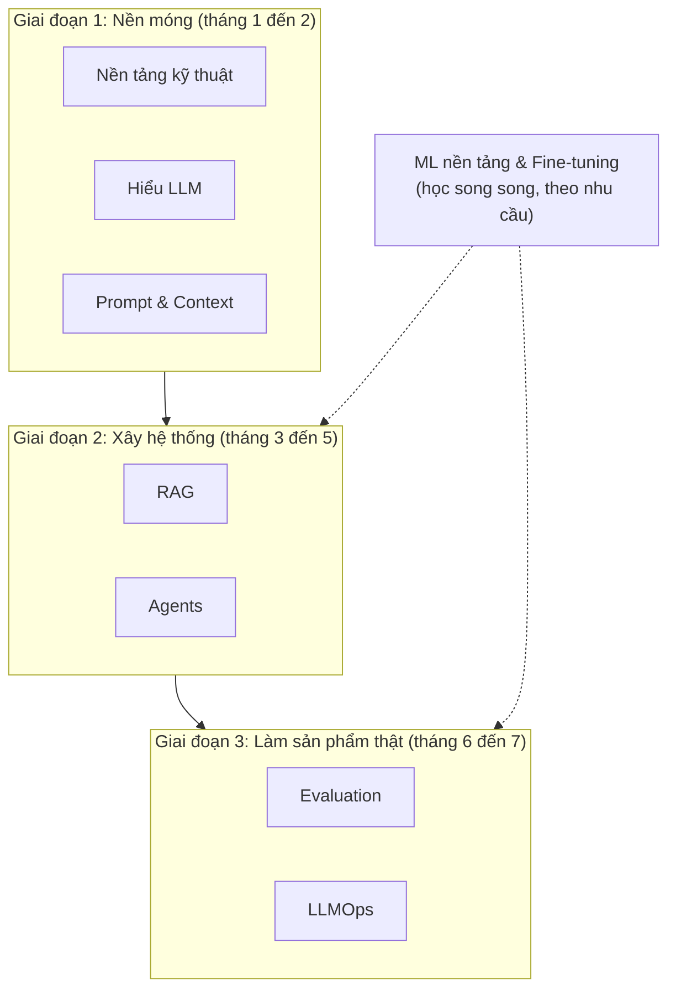

# Lộ trình trở thành AI Engineer

Trang này là bản đồ tổng thể để trở thành **AI Engineer**: người xây dựng sản phẩm thật dựa trên các model AI có sẵn (LLM, embedding, model nhận dạng giọng nói, hình ảnh...), đưa chúng vào production và chịu trách nhiệm về chất lượng, chi phí, độ an toàn của hệ thống.

!!! note "Đây không phải bản dịch"
    Mục Lộ trình học là nội dung biên soạn thêm để định hướng việc học, không thuộc tài liệu gốc của LangChain. Code mẫu dùng Python, Anthropic SDK, LangChain v1 và LangGraph. Hãy đối chiếu với tài liệu chính thức khi API thay đổi.

## AI Engineer làm gì?

| | ML Engineer / Data Scientist | **AI Engineer** | Software Engineer |
|---|---|---|---|
| Trọng tâm | Huấn luyện model từ dữ liệu | **Xây sản phẩm từ model có sẵn** | Xây phần mềm nói chung |
| Công cụ chính | PyTorch, dữ liệu huấn luyện, GPU | API LLM, prompt, RAG, agent, eval | Framework web, database |
| Câu hỏi thường gặp | "Model này có độ chính xác bao nhiêu?" | "Sản phẩm có trả lời đúng, nhanh, rẻ, an toàn không?" | "Hệ thống có chạy ổn định không?" |
| Đo lường | Metric trên tập test | Eval trên dữ liệu thật, feedback người dùng, chi phí mỗi tác vụ | Test, uptime |

AI Engineer đứng giữa hai thế giới: cần **kỹ năng phần mềm vững** như một Software Engineer, cộng với **hiểu biết đủ sâu về model** để biết khi nào nó sai, vì sao sai, và sửa bằng cách nào.

## Bản đồ các track

| Track | Nội dung | Số bài | Thời lượng |
|---|---|---|---|
| [Nền tảng kỹ thuật](nen-tang-ky-thuat/index.md) | Python hiện đại, async, FastAPI và streaming, database, cache, hàng đợi, Docker, CI, test | 4 | 3 đến 4 tuần |
| [Hiểu LLM](hieu-llm/index.md) | Transformer và token, sampling và reasoning, Claude API chuyên sâu, tool use thủ công, chọn model | 5 | 3 đến 4 tuần |
| [Prompt & Context Engineering](prompt-context/index.md) | Nguyên tắc viết prompt, kỹ thuật nâng cao, context engineering cho agent, quản lý prompt | 4 | 2 đến 3 tuần |
| [RAG](rag/index.md) | Ingestion, chunking, vector DB, hybrid search, rerank, eval, agentic RAG, production | 10 | 10 đến 12 tuần |
| [Agents](agents/index.md) | Agent loop từ đầu, LangChain agents, LangGraph, MCP, multi-agent | 5 | 4 đến 5 tuần |
| [Evaluation](evaluation/index.md) | Phân tích lỗi, LLM-as-a-judge, eval agent, đánh giá online, red teaming | 4 | 2 đến 3 tuần |
| [LLMOps](llmops/index.md) | Observability, độ tin cậy, chi phí và độ trễ, bảo mật, triển khai | 5 | 3 đến 4 tuần |
| [ML nền tảng & Fine-tuning](ml-nen-tang/index.md) | Toán cần thiết, ML cổ điển, PyTorch, Transformers, fine-tune LoRA, chạy model local | 6 | 6 đến 8 tuần |

Tổng cộng khoảng **6 đến 8 tháng** nếu học 10 đến 15 giờ mỗi tuần. Track RAG dài nhất vì nó là "bài toán kinh điển" chứa gần như mọi kỹ năng của AI Engineer.

## Nên học theo thứ tự nào?

=== "Đã là lập trình viên"

    Bạn đã vững Python, web, database:

    1. Lướt nhanh [Nền tảng kỹ thuật](nen-tang-ky-thuat/index.md), chỉ đọc kỹ phần async và streaming.
    2. [Hiểu LLM](hieu-llm/index.md) và [Prompt & Context](prompt-context/index.md).
    3. [RAG](rag/index.md), đặc biệt Bài 4 đến Bài 6.
    4. [Agents](agents/index.md).
    5. [Evaluation](evaluation/index.md) và [LLMOps](llmops/index.md).
    6. [ML nền tảng](ml-nen-tang/index.md) khi cần fine-tune hoặc tự host model.

=== "Mới bắt đầu lập trình"

    1. Học Python cơ bản trước (biến, hàm, class, module, xử lý file) ở bất kỳ khóa nhập môn nào.
    2. [Nền tảng kỹ thuật](nen-tang-ky-thuat/index.md): làm đủ mọi bài tập, đừng bỏ qua.
    3. [Hiểu LLM](hieu-llm/index.md), rồi [Prompt & Context](prompt-context/index.md).
    4. [RAG](rag/index.md) Bài 0 đến Bài 5, sau đó [Evaluation](evaluation/index.md) Bài 1, rồi quay lại RAG Bài 6 đến Bài 8.
    5. [Agents](agents/index.md), [LLMOps](llmops/index.md).
    6. [ML nền tảng](ml-nen-tang/index.md) học rải rác song song, mỗi tuần vài giờ.

=== "Đến từ Data Science / ML"

    Bạn đã vững toán, PyTorch, huấn luyện model:

    1. [Nền tảng kỹ thuật](nen-tang-ky-thuat/index.md): đây thường là điểm yếu, hãy làm kỹ FastAPI, Docker, test.
    2. [Hiểu LLM](hieu-llm/index.md) Bài 3 đến Bài 5 (API, tool use, chọn model).
    3. [Prompt & Context](prompt-context/index.md), [RAG](rag/index.md), [Agents](agents/index.md).
    4. [Evaluation](evaluation/index.md) sẽ quen thuộc, nhưng chú ý sự khác biệt khi đánh giá output dạng văn bản tự do.
    5. [LLMOps](llmops/index.md).

## Ma trận kỹ năng theo cấp độ

Dùng bảng này để tự đánh giá và định hướng.

| Kỹ năng | Junior | Mid | Senior |
|---|---|---|---|
| Gọi API LLM | Gọi được API, xử lý streaming | Tool use, structured output, prompt caching, xử lý lỗi và retry đúng cách | Tối ưu chi phí và độ trễ ở quy mô lớn, chọn model theo từng tác vụ |
| Prompt | Viết prompt rõ ràng, có ví dụ | Thiết kế prompt cho agent, quản lý phiên bản prompt | Context engineering cho hệ thống nhiều agent |
| RAG | Dựng pipeline cơ bản | Hybrid search, rerank, xử lý tài liệu phức tạp, phân quyền | Thiết kế kiến trúc tri thức cho cả tổ chức |
| Agents | Dùng `create_agent` với vài tool | Workflow LangGraph, human-in-the-loop, MCP | Hệ thống multi-agent, đánh giá quỹ đạo, kiểm soát rủi ro |
| Evaluation | Chạy bộ test có sẵn | Xây dataset, giám khảo LLM đã kiểm định, eval trong CI | Chiến lược đánh giá cho cả sản phẩm, A/B test, đo tác động kinh doanh |
| Production | Deploy được một API | Observability, bảo mật, giới hạn chi phí | Độ tin cậy, khả năng mở rộng, quy trình phát hành an toàn |
| ML | Hiểu khái niệm embedding, token | Fine-tune model nhỏ bằng LoRA, chạy model local | Quyết định build hay buy, tối ưu serving |

## Dự án portfolio

Nhà tuyển dụng quan tâm **sản phẩm bạn đã làm** hơn chứng chỉ. Mỗi giai đoạn nên kết thúc bằng một dự án công khai (GitHub, có README, có demo, **có kết quả eval**).

| Giai đoạn | Dự án gợi ý | Chứng minh được |
|---|---|---|
| 1 | CLI hoặc API tóm tắt, phân loại email/đánh giá sản phẩm, có structured output và xử lý lỗi | Gọi API đúng cách, prompt, kỹ năng backend |
| 2 | Chatbot hỏi đáp tài liệu có trích dẫn nguồn (xem [dự án tổng kết RAG](rag/index.md#du-an-tong-ket)) | RAG hoàn chỉnh |
| 2 | Agent hỗ trợ khách hàng cho cửa hàng Shopify: tra đơn hàng, chính sách đổi trả, tạo yêu cầu hoàn tiền có người duyệt | Agent, tool, human-in-the-loop, MCP |
| 3 | Đưa một trong các dự án trên lên production: tracing, dashboard chi phí, eval trong CI, bảo vệ trước prompt injection | Tư duy sản phẩm và vận hành |
| Tùy chọn | Fine-tune một model nhỏ cho tác vụ tiếng Việt cụ thể, so sánh với prompt trên model lớn | Hiểu ML, biết khi nào nên fine-tune |

!!! tip "README của dự án quan trọng như code"
    Ghi rõ: bài toán, kiến trúc (có sơ đồ), **bảng kết quả eval**, các thử nghiệm đã làm và vì sao chọn giải pháp cuối cùng, chi phí ước tính mỗi yêu cầu, hạn chế còn tồn tại. Một README như vậy cho thấy bạn làm việc như một kỹ sư, không chỉ làm demo.

## Thói quen của AI Engineer giỏi

1. **Nhìn vào dữ liệu.** Đọc hàng chục output thật của hệ thống mỗi tuần. Không metric nào thay được việc này.
2. **Đo trước, tối ưu sau.** Mọi thay đổi (prompt, model, kỹ thuật retrieval) đều phải có số liệu trước và sau.
3. **Bắt đầu đơn giản.** Một lệnh gọi LLM có prompt tốt thường đánh bại một hệ thống multi-agent phức tạp. Chỉ thêm độ phức tạp khi eval chứng minh cần thiết.
4. **Tính chi phí trên mỗi tác vụ hoàn thành**, không phải trên mỗi request.
5. **Coi output của LLM là dữ liệu không tin cậy.** Kiểm tra, giới hạn quyền, không để nó tự quyết những việc không thể hoàn tác.
6. **Theo kịp thay đổi nhưng không chạy theo mọi thứ.** Model và API thay đổi hằng tháng. Đọc changelog của công cụ mình dùng, thử model mới trên bộ eval của mình, bỏ qua những thứ chưa giải quyết vấn đề thật của bạn.

## Tài liệu trong site này

Các track liên kết chặt với phần tài liệu LangChain và LangGraph đã dịch. Nếu muốn đọc theo framework thay vì theo lộ trình:

- **LangChain:** [Tổng quan](../oss/python/langchain/overview.md), [Agents](../oss/python/langchain/agents.md), [Tools](../oss/python/langchain/tools.md), [Middleware](../oss/python/langchain/middleware/overview.md), [Retrieval](../oss/python/langchain/retrieval.md), [Multi-agent](../oss/python/langchain/multi-agent/index.md).
- **LangGraph:** [Tổng quan](../oss/python/langgraph/overview.md), [Tư duy LangGraph](../oss/python/langgraph/thinking-in-langgraph.md), [Graph API](../oss/python/langgraph/graph-api.md), [Persistence](../oss/python/langgraph/persistence.md).
