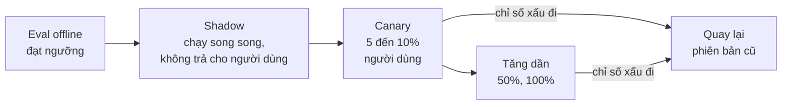

# Bài 5: Triển khai và vận hành

!!! abstract "Tóm tắt bài học"
    - **Mục tiêu:** chọn nơi triển khai phù hợp với ứng dụng LLM, quản lý môi trường và cấu hình, phát hành thay đổi an toàn (code, prompt, model, dữ liệu), mở rộng hệ thống, và xử lý sự cố có quy trình.
    - **Thời lượng:** 4 đến 5 ngày.
    - **Yêu cầu trước:** [Bài 1 đến Bài 4](index.md), [Nền tảng kỹ thuật, Bài 4](../nen-tang-ky-thuat/04-test-docker-ci.md).

## 1. Nơi triển khai

| Lựa chọn | Ưu | Lưu ý với ứng dụng LLM |
|---|---|---|
| **Container trên PaaS** (Cloud Run, Render, Fly.io, Railway...) | Đơn giản, tự mở rộng, trả theo sử dụng | Kiểm tra giới hạn thời gian request và hỗ trợ streaming |
| **Kubernetes** | Linh hoạt, kiểm soát cao | Tốn công vận hành; phù hợp khi công ty đã có sẵn |
| **Serverless function** | Rẻ khi ít traffic | Giới hạn thời gian chạy ngắn, khó streaming, cold start; **không hợp** với agent chạy lâu |
| **Máy ảo** | Đơn giản, dễ hiểu | Tự lo mở rộng, cập nhật, bảo mật |
| **LangSmith Deployment** | Hạ tầng dành riêng cho agent LangGraph: chạy nền, lưu state, streaming, human-in-the-loop, giao diện Studio | Phù hợp khi agent LangGraph là trung tâm hệ thống. Xem [Deploy](../../oss/python/langgraph/deploy.md) |

Ứng dụng LLM có một vài đặc điểm ảnh hưởng tới lựa chọn:

- **Request dài:** câu trả lời 20 giây, agent chạy vài phút. Cần nền tảng cho phép kết nối lâu và streaming.
- **Chủ yếu chờ I/O:** CPU nhàn rỗi trong lúc chờ API LLM. Một instance async phục vụ được nhiều request đồng thời.
- **Tác vụ nền:** worker cho ingestion, batch, agent chạy lâu (xem [Nền tảng kỹ thuật, Bài 3](../nen-tang-ky-thuat/03-du-lieu-hang-doi.md#5-hang-oi-cho-tac-vu-chay-lau)).

## 2. Môi trường và cấu hình

| Môi trường | Mục đích | API key LLM |
|---|---|---|
| Development | Máy cá nhân | Key riêng, giới hạn chi tiêu thấp |
| CI | Test tự động, eval | Key riêng, giới hạn chi tiêu |
| Staging | Thử nghiệm giống production | Key riêng |
| Production | Người dùng thật | Key riêng, giới hạn và cảnh báo chặt |

- **Bí mật** (API key, mật khẩu database) lưu trong hệ thống quản lý bí mật của nền tảng, không trong code, không trong image.
- **Cấu hình** (model, phiên bản prompt, ngưỡng, tỉ lệ rollout) tách khỏi code; những gì cần thay đổi nhanh (tắt tính năng, quay lại prompt cũ) nên đổi được **không cần deploy lại**.
- Mỗi key một môi trường giúp: biết chính xác chi phí đến từ đâu, thu hồi một key mà không ảnh hưởng nơi khác.

## 3. Bốn thứ cần phiên bản hóa

Hành vi của ứng dụng LLM được quyết định bởi bốn thứ, và **bất kỳ thứ nào thay đổi** cũng có thể làm thay đổi chất lượng:

| Thành phần | Ví dụ thay đổi | Cách quản lý |
|---|---|---|
| **Code** | Logic retrieval, tool mới | Git, CI, review |
| **Prompt** | Thêm chỉ dẫn, đổi ví dụ | File có phiên bản ([Prompt & Context, Bài 4](../prompt-context/04-quan-ly-prompt.md)) |
| **Model** | Đổi model, đổi effort | Cấu hình, đi kèm prompt |
| **Dữ liệu** | Index RAG mới, đổi model embedding, tài liệu cập nhật | Phiên bản index, blue/green ([RAG, Bài 8](../rag/08-production.md#23-oi-model-embedding-hoac-chunking-bluegreen)) |

Ghi **phiên bản của cả bốn** vào trace mỗi request. Khi chất lượng thay đổi, bạn biết ngay thay đổi nào gây ra.

## 4. Phát hành an toàn

| Chiến lược | Cách làm | Khi nào dùng |
|---|---|---|
| **Eval gate** | CI chạy eval, chặn merge nếu dưới ngưỡng | Mọi thay đổi prompt, model |
| **Shadow** | Phiên bản mới chạy song song trên traffic thật, kết quả chỉ được ghi lại để so sánh | Thay đổi lớn (đổi model, đổi kiến trúc), muốn so sánh trên dữ liệu thật mà không rủi ro. Tốn gấp đôi chi phí trong thời gian chạy |
| **Canary** | Một phần nhỏ người dùng nhận phiên bản mới | Hầu hết thay đổi |
| **Feature flag** | Bật tắt tính năng theo cấu hình | Tính năng mới, và làm "công tắc khẩn cấp" |

**Công tắc khẩn cấp (kill switch)** cho mỗi tính năng AI: khi có sự cố (bot nói điều không phù hợp, chi phí tăng vọt, bị tấn công), tắt ngay tính năng hoặc chuyển về chế độ an toàn (trả lời mẫu, chuyển nhân viên) mà không cần deploy.

## 5. Mở rộng

- **API không lưu trạng thái:** mọi trạng thái (hội thoại, checkpoint, cache) nằm ở database hoặc Redis, để thêm bớt instance tùy ý.
- **Tách worker khỏi API:** tác vụ nặng (ingestion, batch, agent chạy lâu) chạy ở worker riêng, mở rộng độc lập.
- **Connection pool** cho database và client HTTP (client LLM tạo một lần, dùng chung).
- **Rate limit của nhà cung cấp là giới hạn chung** của mọi instance cộng lại: thêm instance không làm tăng hạn mức. Quản lý đồng thời và hàng đợi ở tầng chung ([Bài 2](02-do-tin-cay.md#4-quan-ly-rate-limit)).
- **Dự trù cao điểm:** khuyến mãi, sự kiện làm traffic tăng nhiều lần. Kiểm tra tải trước, xin nâng hạn mức trước.

## 6. Xử lý sự cố

Chuẩn bị sẵn **runbook** (hướng dẫn xử lý từng bước) cho các sự cố thường gặp:

| Sự cố | Dấu hiệu | Xử lý nhanh |
|---|---|---|
| Nhà cung cấp LLM gặp sự cố | Tỉ lệ lỗi 5xx, 529 tăng vọt | Kiểm tra trang trạng thái của nhà cung cấp; circuit breaker chuyển sang fallback; thông báo người dùng |
| Chi phí tăng đột biến | Cảnh báo chi phí | Tìm tính năng, người dùng gây ra (dashboard); chặn người dùng lạm dụng; tắt tính năng nếu cần |
| Chất lượng giảm | Tỉ lệ 👎, tỉ lệ trượt giám khảo tăng | Xem phiên bản nào vừa thay đổi (code, prompt, model, dữ liệu); quay lại phiên bản trước |
| Bot nói điều không phù hợp, bị lan truyền | Báo cáo từ người dùng, mạng xã hội | Kill switch; lưu trace làm bằng chứng; phân tích và bổ sung vào bộ red teaming |
| Rò rỉ dữ liệu | Người dùng thấy dữ liệu không phải của mình | Tắt tính năng ngay; điều tra phạm vi; thực hiện nghĩa vụ thông báo theo quy định |

Sau mỗi sự cố: viết **bản phân tích sau sự cố** (không đổ lỗi cá nhân): chuyện gì đã xảy ra, vì sao, phát hiện sau bao lâu, và **những thay đổi để không lặp lại** (thêm cảnh báo, thêm eval, thêm lớp phòng thủ).

## 7. Checklist ra mắt production

**Chất lượng**

- [ ] Eval offline đạt ngưỡng trên dataset đại diện; có eval gate trong CI.
- [ ] Giám khảo online và feedback người dùng được thu thập và hiển thị.

**Độ tin cậy**

- [ ] Timeout, retry, fallback, circuit breaker đã được kiểm chứng bằng giả lập lỗi.
- [ ] Output được kiểm tra `stop_reason`, schema, quy tắc nghiệp vụ.

**Chi phí**

- [ ] Prompt caching hoạt động (đã kiểm chứng tỉ lệ cache hit).
- [ ] Giới hạn chi phí ở mọi tầng; cảnh báo chi phí bất thường.

**Bảo mật**

- [ ] Hoàn thành checklist bảo mật ở [Bài 4](04-bao-mat.md#9-checklist-bao-mat-truoc-khi-ra-mat).
- [ ] Đã chạy bộ red teaming.

**Vận hành**

- [ ] Tracing, dashboard, cảnh báo đầy đủ.
- [ ] Phiên bản của code, prompt, model, dữ liệu được ghi vào trace.
- [ ] Có kế hoạch phát hành từ từ và quay lại.
- [ ] Có kill switch và runbook cho các sự cố chính.

## Bài tập

**Bài 5.1.** Triển khai ứng dụng của bạn (ví dụ `llm-service` hoặc trợ lý cửa hàng) lên một nền tảng PaaS. Kiểm tra streaming hoạt động qua proxy của nền tảng.

**Bài 5.2.** Thêm feature flag và kill switch cho tính năng chat: khi tắt, bot trả lời mẫu và đưa số hotline.

**Bài 5.3.** Cài đặt chế độ shadow: một phần trăm nhỏ request được chạy thêm với prompt mới ở tác vụ nền, kết quả ghi lại. So sánh bằng giám khảo LLM.

**Bài 5.4.** Viết runbook cho sự cố "nhà cung cấp LLM gặp sự cố diện rộng" và "chi phí tăng gấp 5 lần trong 1 giờ". Diễn tập một trong hai.

**Bài 5.5.** Đi qua checklist ra mắt ở mục 7 cho dự án của bạn, liệt kê các mục chưa đạt và kế hoạch hoàn thành.

## Đọc thêm

- [Deploy (LangChain)](../../oss/python/langchain/deploy.md), [Deploy (LangGraph)](../../oss/python/langgraph/deploy.md), [Chạy local server](../../oss/python/langgraph/local-server.md)
- [Cấu trúc ứng dụng LangGraph](../../oss/python/langgraph/application-structure.md)
- [Agent Chat UI](../../oss/python/langgraph/ui.md)

---

**Bài trước:** [Bài 4: Bảo mật](04-bao-mat.md) · [Tổng quan track](index.md) · **Track tiếp theo:** [ML nền tảng & Fine-tuning](../ml-nen-tang/index.md)
