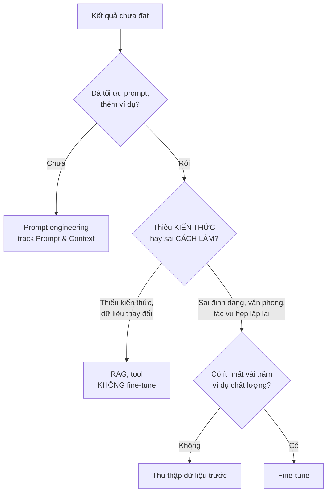

# Bài 5: Fine-tuning với LoRA

!!! abstract "Tóm tắt bài học"
    - **Mục tiêu:** quyết định đúng khi nào nên fine-tune; chuẩn bị dữ liệu chất lượng; hiểu LoRA và QLoRA; fine-tune một LLM nhỏ bằng TRL; đánh giá công bằng so với model gốc và với prompt trên model lớn.
    - **Thời lượng:** 1 đến 2 tuần.
    - **Yêu cầu trước:** [Bài 4](04-transformers-hf.md), có GPU (Colab hoặc Kaggle là đủ cho model 0,5B đến 1,5B tham số).

## 1. Có nên fine-tune không?

Fine-tuning **tốn công và dễ làm sai**. Trước khi làm, hãy chắc chắn các cách rẻ hơn không đủ:



| Nên fine-tune khi | Không nên fine-tune khi |
|---|---|
| Cần **văn phong, định dạng** rất cụ thể mà prompt không ép được ổn định | Cần model **biết thêm kiến thức** (dùng RAG: cập nhật dễ, trích dẫn được) |
| Tác vụ hẹp, khối lượng lớn: muốn model **nhỏ, rẻ, nhanh** làm tốt như model lớn | Chưa thử prompt tốt với model mạnh |
| Dữ liệu **không được rời** hạ tầng, phải dùng model tự host | Dữ liệu ít, chất lượng kém |
| Có dữ liệu chất lượng và **bộ eval** để chứng minh cải thiện | Yêu cầu thay đổi thường xuyên |

**Hiểu lầm phổ biến:** fine-tune để model "học" tài liệu công ty. Fine-tune dạy **cách làm** (hành vi, định dạng) tốt hơn nhiều so với dạy **sự thật** (kiến thức). Model fine-tune trên tài liệu vẫn bịa, và không cập nhật được khi tài liệu thay đổi.

## 2. Chuẩn bị dữ liệu

### 2.1 Định dạng

Dữ liệu cho fine-tune model chat là các **hội thoại mẫu** theo định dạng messages, mỗi dòng một ví dụ:

```json title="train.jsonl"
{"messages": [{"role": "system", "content": "Bạn viết mô tả sản phẩm cho thương hiệu Mộc: điềm đạm, xưng 'bạn', 80 đến 120 chữ."}, {"role": "user", "content": "Áo sơ mi linen cổ tàu; 100% linen; màu be, trắng ngà; regular fit"}, {"role": "assistant", "content": "Có những chiếc áo mặc vào là thấy dễ chịu ngay..."}]}
{"messages": [{"role": "system", "content": "..."}, {"role": "user", "content": "..."}, {"role": "assistant", "content": "..."}]}
```

### 2.2 Chất lượng hơn số lượng

- **Vài trăm đến vài nghìn ví dụ chất lượng cao** thường tốt hơn hàng chục nghìn ví dụ tầm thường. Model học **mọi thứ** trong dữ liệu, kể cả lỗi.
- **Đa dạng:** bao phủ các loại đầu vào thực tế (sản phẩm khác nhau, thông tin đầy đủ và thiếu).
- **Nhất quán:** cùng một kiểu đầu vào, câu trả lời mẫu phải theo cùng tiêu chuẩn.
- **Nguồn dữ liệu:** output thật đã được con người duyệt; chuyên gia viết; hoặc dùng **model lớn sinh** rồi người duyệt (kỹ thuật "chưng cất": dạy model nhỏ bắt chước model lớn trên một tác vụ hẹp). Kiểm tra điều khoản sử dụng của nhà cung cấp model khi dùng output để huấn luyện model khác.
- **Tách tập đánh giá** ngay từ đầu, không bao giờ dùng để huấn luyện.

## 3. LoRA và QLoRA

### 3.1 Vấn đề của fine-tune toàn bộ

Fine-tune toàn bộ một model 7B tham số cần lưu trọng số, gradient và trạng thái optimizer cho **7 tỉ** tham số: cần nhiều GPU lớn. Kết quả là một bản sao đầy đủ của model cho mỗi tác vụ.

### 3.2 LoRA: chỉ học phần điều chỉnh nhỏ

**LoRA** (Low-Rank Adaptation) **đóng băng** trọng số gốc `W`, và học một phần điều chỉnh có dạng tích của hai ma trận nhỏ:

```text
W_mới = W + B × A        với W: d × d,  B: d × r,  A: r × d,  r rất nhỏ (8, 16, 32)
```

Với `d = 4096` và `r = 16`: ma trận gốc có khoảng 16,8 triệu tham số, còn `A` và `B` chỉ có khoảng 131 nghìn, **ít hơn khoảng 128 lần**. Toàn bộ adapter LoRA thường chỉ vài chục MB, có thể lưu nhiều adapter cho nhiều tác vụ và gắn vào cùng một model gốc.

### 3.3 QLoRA: thêm lượng tử hóa

**QLoRA** nạp model gốc (đã đóng băng) ở độ chính xác **4 bit** thay vì 16 bit, giảm khoảng 4 lần bộ nhớ, trong khi adapter LoRA vẫn học ở độ chính xác cao. Nhờ vậy có thể fine-tune model 7B đến 8B trên **một GPU tiêu dùng**.

| Phương pháp | Bộ nhớ GPU (model 7B, ước lượng thô) | Chất lượng |
|---|---|---|
| Fine-tune toàn bộ | Rất lớn, nhiều GPU | Tốt nhất về lý thuyết |
| LoRA (16 bit) | Khoảng 16 đến 24 GB | Gần bằng fine-tune toàn bộ với phần lớn tác vụ |
| QLoRA (4 bit) | Khoảng 8 đến 12 GB | Hơi thấp hơn LoRA một chút |

## 4. Thực hành: fine-tune với TRL

Tác vụ: dạy một model nhỏ viết mô tả sản phẩm theo đúng văn phong thương hiệu.

```bash
uv add torch transformers datasets peft trl accelerate
```

```python title="sft_lora.py"
from datasets import load_dataset
from peft import LoraConfig
from trl import SFTConfig, SFTTrainer

train = load_dataset("json", data_files="train.jsonl", split="train")
val = load_dataset("json", data_files="val.jsonl", split="train")

peft_config = LoraConfig(
    r=16,                         # hạng của ma trận điều chỉnh
    lora_alpha=32,                # hệ số tỉ lệ, thường bằng 2 × r
    lora_dropout=0.05,
    target_modules="all-linear",  # gắn LoRA vào mọi lớp tuyến tính
    task_type="CAUSAL_LM",
)

trainer = SFTTrainer(
    model="Qwen/Qwen2.5-0.5B-Instruct",   # model nhỏ, chạy được trên GPU miễn phí
    train_dataset=train,
    eval_dataset=val,
    peft_config=peft_config,
    args=SFTConfig(
        output_dir="out-mo-ta-san-pham",
        num_train_epochs=3,
        per_device_train_batch_size=4,
        gradient_accumulation_steps=4,    # batch hiệu dụng = 16
        learning_rate=2e-4,               # LoRA dùng learning rate cao hơn fine-tune toàn bộ
        logging_steps=10,
        eval_strategy="epoch",
    ),
)
trainer.train()
trainer.save_model()  # chỉ lưu adapter LoRA (vài MB đến vài chục MB)
```

`SFTTrainer` tự áp dụng chat template của model cho dữ liệu dạng `messages`, và mặc định chỉ tính loss trên phần trả lời của assistant.

### Dùng model đã fine-tune

```python title="generate.py"
from peft import AutoPeftModelForCausalLM
from transformers import AutoTokenizer

model = AutoPeftModelForCausalLM.from_pretrained("out-mo-ta-san-pham")  # model gốc + adapter
tokenizer = AutoTokenizer.from_pretrained("Qwen/Qwen2.5-0.5B-Instruct")

messages = [
    {"role": "system", "content": "Bạn viết mô tả sản phẩm cho thương hiệu Mộc: điềm đạm, xưng 'bạn', 80 đến 120 chữ."},
    {"role": "user", "content": "Quần kaki ống đứng; cotton pha spandex; màu be, đen; co giãn nhẹ"},
]
inputs = tokenizer.apply_chat_template(messages, add_generation_prompt=True, return_tensors="pt")
output = model.generate(inputs.to(model.device), max_new_tokens=300)
print(tokenizer.decode(output[0][inputs.shape[1]:], skip_special_tokens=True))
```

## 5. Đánh giá: phần quan trọng nhất

Fine-tune xong **chưa có nghĩa là tốt hơn**. So sánh công bằng trên tập đánh giá riêng:

| Ứng viên | Vì sao cần so |
|---|---|
| Model gốc (chưa fine-tune) + cùng prompt | Fine-tune có thực sự cải thiện? |
| Model lớn qua API + prompt tốt + ví dụ | Có đáng công fine-tune không, hay chỉ cần prompt tốt với model mạnh? |
| Model đã fine-tune | Ứng viên |

Dùng các phương pháp ở [track Evaluation](../evaluation/index.md): tiêu chí cụ thể (độ dài, xưng hô bằng code; văn phong, không bịa thông tin bằng giám khảo LLM đã kiểm định), cộng với người đọc so sánh cặp.

Các lỗi hay gặp sau fine-tune:

| Lỗi | Biểu hiện | Nguyên nhân thường gặp |
|---|---|---|
| **Overfitting** | Tốt trên dữ liệu train, kém trên ví dụ mới; lặp lại câu chữ trong dữ liệu | Quá nhiều epoch, dữ liệu ít và đơn điệu |
| **Quên kiến thức cũ** | Kém ở những việc trước đây làm được | Learning rate quá cao, dữ liệu hẹp |
| **Học cả lỗi** | Bắt chước lỗi chính tả, thông tin sai trong dữ liệu | Dữ liệu không được duyệt kỹ |
| **Điểm eval đẹp giả tạo** | Ra thực tế kém hẳn | Ví dụ eval lọt vào dữ liệu train |

## 6. Vượt ra ngoài SFT

- **DPO** (Direct Preference Optimization): thay vì câu trả lời mẫu, dữ liệu là các **cặp** (câu tốt, câu kém) cho cùng một đầu vào. Model học ưu tiên câu tốt. Hữu ích khi dễ đánh giá "câu nào tốt hơn" hơn là viết câu hoàn hảo. TRL có `DPOTrainer`.
- **Fine-tune embedding và reranker** cho tìm kiếm chuyên ngành: xem [RAG, Bài 9](../rag/09-nang-cao.md#5-fine-tune-embedding-va-reranker).
- **Fine-tune qua dịch vụ:** một số nền tảng đám mây cung cấp fine-tune có quản lý cho model mở hoặc model thương mại, không cần tự lo GPU.

## Bài tập

**Bài 5.1.** Với 3 bài toán sau, quyết định có nên fine-tune không và giải thích: (a) chatbot trả lời theo chính sách công ty thay đổi hằng tháng; (b) phân loại 2 triệu phản hồi mỗi tháng với chi phí thấp nhất; (c) viết mô tả sản phẩm theo văn phong thương hiệu rất riêng.

**Bài 5.2.** Chuẩn bị 300 ví dụ huấn luyện và 50 ví dụ đánh giá cho tác vụ viết mô tả sản phẩm (có thể dùng model lớn sinh nháp rồi tự sửa). Chạy `sft_lora.py`.

**Bài 5.3.** So sánh ba ứng viên ở mục 5 trên 50 ví dụ đánh giá. Lập bảng: điểm từng tiêu chí, độ trễ, chi phí ước tính cho 100.000 mô tả.

**Bài 5.4.** Thử `num_train_epochs` bằng 1, 3, 10. Quan sát eval loss và chất lượng output. Ở mức nào bắt đầu overfit?

## Checklist

- [ ] Quyết định được khi nào fine-tune, khi nào dùng prompt hoặc RAG.
- [ ] Chuẩn bị được dữ liệu định dạng messages, chất lượng, có tập đánh giá riêng.
- [ ] Giải thích được LoRA, QLoRA và vì sao chúng tiết kiệm bộ nhớ.
- [ ] Fine-tune được model nhỏ bằng TRL và chạy suy luận với adapter.
- [ ] Đánh giá công bằng với model gốc và model lớn qua API.

## Đọc thêm

- [LoRA: Low-Rank Adaptation of Large Language Models](https://arxiv.org/abs/2106.09685), [QLoRA](https://arxiv.org/abs/2305.14314)
- [TRL documentation](https://huggingface.co/docs/trl), [PEFT documentation](https://huggingface.co/docs/peft)

---

**Bài trước:** [Bài 4: Transformer và Hugging Face](04-transformers-hf.md) · [Tổng quan track](index.md) · **Bài tiếp theo:** [Bài 6: Chạy model local](06-chay-model-local.md)
