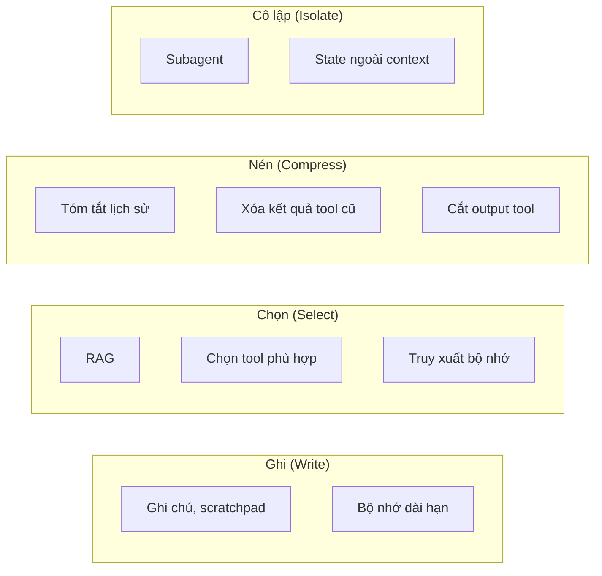

# Bài 3: Context engineering

!!! abstract "Tóm tắt bài học"
    - **Mục tiêu:** hiểu context là tài nguyên khan hiếm; thiết kế từng thành phần của context (system prompt, tool, lịch sử, tài liệu, bộ nhớ); áp dụng bốn chiến lược ghi, chọn, nén, cô lập để agent hoạt động tốt qua nhiều bước.
    - **Thời lượng:** khoảng 1 tuần.
    - **Yêu cầu trước:** [Bài 2](02-ky-thuat-nang-cao.md), [Hiểu LLM, Bài 4](../hieu-llm/04-tool-use.md).

## 1. Từ prompt engineering tới context engineering

Với một lệnh gọi đơn lẻ, "prompt" là tất cả những gì model nhìn thấy. Với một **agent** chạy 30 bước, những gì model nhìn thấy ở bước 30 gồm: system prompt, định nghĩa tool, câu hỏi ban đầu, 29 lượt suy nghĩ và gọi tool trước đó, kết quả của từng tool (có thể là cả trang web, cả file log), tài liệu được retrieve...

**Context engineering** là việc chủ động quyết định **cái gì được đưa vào context, ở dạng nào, vào lúc nào**, để ở mỗi bước model có đúng thông tin cần thiết, không thiếu, không thừa.

!!! quote "Nguyên nhân phổ biến nhất khiến agent thất bại"
    Phần lớn trường hợp agent làm sai không phải vì model không đủ thông minh, mà vì **model không được cung cấp đúng context**: thiếu thông tin quan trọng, hoặc thông tin quan trọng bị chìm giữa hàng nghìn token không liên quan.

## 2. Context là tài nguyên khan hiếm

Dù context window có thể tới 1 triệu token, mỗi token thêm vào đều có giá:

- **Chi phí và độ trễ** tăng theo số token input của **mỗi** lượt. Agent 30 bước gửi lại lịch sử 30 lần.
- **Chất lượng giảm dần** khi context dài ra: model khó tập trung vào thông tin quan trọng, dễ bị phân tâm bởi thông tin cũ.

Các dạng "hỏng context" thường gặp:

| Hiện tượng | Ví dụ |
|---|---|
| **Nhiễm độc** (poisoning) | Một kết quả sai ở bước 5 (tool trả lỗi, model hiểu nhầm) được lặp lại và dựa vào ở mọi bước sau |
| **Phân tâm** (distraction) | Kết quả tool dài 20.000 token từ bước đầu khiến model bám vào chi tiết không còn liên quan |
| **Nhầm lẫn** (confusion) | 40 tool có mô tả chồng chéo, model chọn sai tool |
| **Mâu thuẫn** (clash) | Tài liệu cũ và mới cùng nằm trong context, nói hai điều khác nhau |

## 3. Thiết kế từng thành phần

### 3.1 System prompt: đúng "độ cao"

Tránh hai thái cực:

- **Quá cứng nhắc:** hàng trăm quy tắc if/else cố gắng lường trước mọi tình huống. Dễ vỡ khi gặp tình huống mới, khó bảo trì.
- **Quá mơ hồ:** "Hãy là một trợ lý hữu ích". Model không biết bối cảnh, mục tiêu, giới hạn.

Đúng độ cao là nêu **mục tiêu, bối cảnh, nguyên tắc ra quyết định và lý do**, để model tự suy ra cách xử lý tình huống cụ thể. Chia thành các phần rõ ràng (thẻ XML hoặc heading).

### 3.2 Tool: ít, rõ, tiết kiệm token

- **Ít và không chồng chéo.** Nếu chính bạn không chắc nên dùng tool nào cho một tình huống, model cũng vậy.
- **Output gọn.** Tool trả về đúng thông tin cần thiết, không trả cả bản ghi database 50 trường. Hỗ trợ phân trang, lọc, cắt bớt với thông báo rõ ràng.
- **Thông báo lỗi có hướng dẫn.** "Không tìm thấy khách hàng. Hãy thử tìm bằng số điện thoại thay vì tên" giúp model tự sửa.

```python
MAX_CHARS = 4_000


def search_orders(customer_phone: str, status: str | None = None, limit: int = 10) -> str:
    """Tìm đơn hàng của khách theo số điện thoại, có thể lọc theo trạng thái."""
    rows = db_search(customer_phone, status)[:limit]
    if not rows:
        return "Không có đơn hàng nào. Kiểm tra lại số điện thoại hoặc bỏ bộ lọc trạng thái."
    # Chỉ trả các trường cần cho việc trả lời khách, không trả nguyên bản ghi
    lines = [f"{r.id} | {r.created:%d/%m} | {r.status} | {r.total:,}đ" for r in rows]
    text = "\n".join(lines)
    if len(text) > MAX_CHARS:
        text = text[:MAX_CHARS] + "\n... (đã cắt bớt, hãy lọc theo trạng thái để thu hẹp)"
    return text
```

### 3.3 Ví dụ: ít mà tiêu biểu

Vài ví dụ đa dạng, tiêu biểu tốt hơn một danh sách dài mọi trường hợp biên. Ví dụ là "bức tranh" về hành vi mong muốn, không phải bộ luật.

### 3.4 Tri thức: nạp trước hay tìm khi cần?

| Cách | Khi nào dùng |
|---|---|
| **Nạp trước** (đưa vào system prompt) | Tri thức nhỏ, luôn cần, ít thay đổi: chính sách cốt lõi, quy ước. Kết hợp prompt caching |
| **Tìm khi cần** (just-in-time) | Tri thức lớn, chỉ một phần liên quan tới mỗi yêu cầu: dùng RAG hoặc tool tìm kiếm, để agent tự lấy khi cần |

Cách "tìm khi cần" giống cách con người làm việc: không ai học thuộc cả thư viện, nhưng biết tra cứu ở đâu. Agent chỉ cần giữ **tham chiếu** (tên file, ID tài liệu, URL) và tải nội dung khi thực sự cần.

## 4. Bốn chiến lược



### 4.1 Ghi: lưu thông tin ra ngoài context

Thay vì giữ mọi thứ trong lịch sử hội thoại, agent **ghi chú** ra file hoặc database, và đọc lại khi cần.

- **Scratchpad / file tiến độ:** agent làm tác vụ dài ghi lại kế hoạch, những gì đã xong, những gì còn lại vào một file như `progress.md`. Khi context bị nén hoặc agent bắt đầu phiên mới, nó đọc file để tiếp tục.
- **Bộ nhớ dài hạn:** thông tin về người dùng, sở thích, quyết định trước đó được lưu qua nhiều phiên. Xem [Long-term Memory](../../oss/python/langchain/long-term-memory.md).

### 4.2 Chọn: chỉ đưa vào cái liên quan

- **RAG** cho tri thức lớn (xem [track RAG](../rag/index.md)).
- **Chọn tool động:** với hàng chục tool, chỉ đưa vào những tool liên quan tới yêu cầu hiện tại. LangChain có middleware [LLM tool selector](../../oss/python/langchain/middleware/built-in.md#llm-tool-selector) làm việc này.
- **Truy xuất bộ nhớ có chọn lọc:** chỉ nạp những ký ức liên quan, không nạp toàn bộ.

### 4.3 Nén: giảm kích thước nhưng giữ ý chính

Với LangChain, hai middleware có sẵn xử lý phần lớn nhu cầu:

```python title="compress_agent.py"
from langchain.agents import create_agent
from langchain.agents.middleware import (
    ClearToolUsesEdit,
    ContextEditingMiddleware,
    SummarizationMiddleware,
)

agent = create_agent(
    model="anthropic:claude-opus-5",
    tools=[search_orders, get_product, search_docs],
    middleware=[
        # Xóa kết quả tool cũ khi context vượt 50.000 token, giữ 3 kết quả gần nhất
        ContextEditingMiddleware(edits=[ClearToolUsesEdit(trigger=50_000, keep=3)]),
        # Tóm tắt lịch sử cũ khi vượt 80.000 token, giữ nguyên 20 tin nhắn gần nhất
        SummarizationMiddleware(
            model="anthropic:claude-haiku-4-5",
            trigger=("tokens", 80_000),
            keep=("messages", 20),
        ),
    ],
)
```

- **Xóa kết quả tool cũ** là cách nén an toàn và rẻ nhất: một khi agent đã dùng kết quả tìm kiếm ở bước 3 để ra quyết định, nội dung thô của nó hiếm khi cần lại.
- **Tóm tắt** mất thông tin, nên cần prompt tóm tắt giữ lại: mục tiêu, quyết định đã đưa ra, vấn đề chưa giải quyết, thông tin quan trọng về người dùng.

Khi gọi Claude API trực tiếp, API cũng hỗ trợ xóa kết quả tool cũ và tóm tắt lịch sử **phía server** (context editing và compaction, đang ở dạng beta):

```python
response = client.beta.messages.create(
    model="claude-opus-5",
    max_tokens=16000,
    betas=["compact-2026-01-12"],
    context_management={"edits": [{"type": "compact_20260112"}]},
    tools=tools,
    messages=messages,
)
# Bắt buộc: gửi lại NGUYÊN VẸN response.content ở lượt sau, vì nó chứa khối
# compaction mà API dùng để thay thế phần lịch sử đã được tóm tắt
messages.append({"role": "assistant", "content": response.content})
```

### 4.4 Cô lập: tách context cho từng phần việc

**Subagent** nhận một nhiệm vụ con, làm việc trong **context riêng** (có thể đọc hàng chục nghìn token tài liệu), và chỉ trả về một **bản tóm tắt ngắn** cho agent chính. Agent chính giữ context gọn, tập trung vào điều phối.

```text
Agent chính: "Tìm hiểu chính sách đổi trả của 3 đối thủ"
  ├─ Subagent A: đọc 15 trang web của đối thủ A → trả về 200 chữ tóm tắt
  ├─ Subagent B: ... → 200 chữ
  └─ Subagent C: ... → 200 chữ
Agent chính: tổng hợp 600 chữ thay vì đọc 45 trang
```

Đổi lại, hệ thống nhiều agent tốn nhiều token hơn tổng thể và khó debug hơn. Xem [track Agents, Bài 5](../agents/05-multi-agent.md).

**State ngoài context** là một dạng cô lập khác: dữ liệu lớn (file, bảng dữ liệu) được lưu trong state của ứng dụng hoặc filesystem; model chỉ thấy tham chiếu và tóm tắt, tool mới là thứ đọc dữ liệu thật.

## 5. Đo lường context

Không đo thì không biết context có đang phình to. Ghi lại **số token input của từng lượt** trong agent:

```python
for i, step in enumerate(steps):
    print(f"lượt {i}: input={step.usage.input_tokens:>7,} "
          f"cache_read={step.usage.cache_read_input_tokens or 0:>7,}")
```

Dấu hiệu cần can thiệp: token input tăng tuyến tính và nhanh theo số lượt; một kết quả tool chiếm phần lớn context; chất lượng quyết định của agent giảm ở các bước cuối.

!!! tip "Context engineering và prompt caching"
    Nén và xóa context làm **thay đổi phần đầu** của prompt, khiến prompt cache bị vô hiệu. Hãy nén **theo đợt** (khi vượt ngưỡng) thay vì mỗi lượt, để phần lớn các lượt vẫn đọc được từ cache. Giữ system prompt và danh sách tool ổn định.

## Bài tập

**Bài 3.1.** Lấy agent đã viết ở [Hiểu LLM, Bài 4](../hieu-llm/04-tool-use.md), thêm một tool trả về kết quả rất dài (ví dụ 10.000 token dữ liệu giả). Chạy một tác vụ 10 lượt, vẽ biểu đồ token input theo lượt. Sau đó giới hạn output của tool và vẽ lại.

**Bài 3.2.** Dựng một agent bằng `create_agent` với `ContextEditingMiddleware` và `SummarizationMiddleware`. Tạo một hội thoại dài 40 lượt, kiểm tra agent vẫn nhớ thông tin quan trọng từ lượt đầu (ví dụ tên và yêu cầu của khách).

??? tip "Gợi ý"
    Nếu agent quên thông tin quan trọng sau khi tóm tắt, hãy tùy chỉnh prompt tóm tắt của `SummarizationMiddleware` để yêu cầu giữ lại "thông tin định danh khách hàng, yêu cầu ban đầu, các quyết định đã chốt". Xem tùy chọn cấu hình trong trang [Middleware có sẵn](../../oss/python/langchain/middleware/built-in.md#summarization).

**Bài 3.3.** Viết system prompt cho một agent nghiên cứu, trong đó hướng dẫn agent duy trì file `notes.md`: ghi mục tiêu, các phát hiện chính kèm nguồn, câu hỏi còn mở. Cho agent tool `read_notes` và `write_notes`. Chạy một tác vụ nghiên cứu dài và đọc file ghi chú cuối cùng.

**Bài 3.4.** Với một agent có 20 tool, đo độ chính xác chọn tool trên 30 câu hỏi. Gộp hoặc bỏ bớt các tool chồng chéo xuống còn 8, đo lại.

## Checklist

- [ ] Giải thích được vì sao context dài làm giảm chất lượng, không chỉ tăng chi phí.
- [ ] System prompt nêu mục tiêu, nguyên tắc và lý do, không phải danh sách luật dài.
- [ ] Tool trả output gọn, có phân trang hoặc cắt bớt, thông báo lỗi có hướng dẫn.
- [ ] Biết áp dụng bốn chiến lược: ghi, chọn, nén, cô lập.
- [ ] Theo dõi được số token input qua từng lượt của agent.

## Đọc thêm

- [Context engineering trong agent](../../oss/python/langchain/context-engineering.md): hướng dẫn chi tiết của LangChain.
- [Short-term Memory](../../oss/python/langchain/short-term-memory.md), [Long-term Memory](../../oss/python/langchain/long-term-memory.md).
- [Effective context engineering for AI agents](https://www.anthropic.com/engineering/effective-context-engineering-for-ai-agents) (Anthropic).

---

**Bài trước:** [Bài 2: Kỹ thuật nâng cao](02-ky-thuat-nang-cao.md) · [Tổng quan track](index.md) · **Bài tiếp theo:** [Bài 4: Quản lý prompt như code](04-quan-ly-prompt.md)
