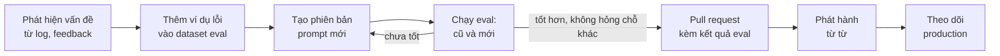

# Bài 4: Quản lý prompt như code

!!! abstract "Tóm tắt bài học"
    - **Mục tiêu:** đối xử với prompt như mã nguồn: lưu tách riêng, có phiên bản, được review, được kiểm thử bằng eval trước khi phát hành, và phát hành từ từ có theo dõi.
    - **Thời lượng:** 3 đến 4 ngày.
    - **Yêu cầu trước:** [Bài 3](03-context-engineering.md).

## 1. Vấn đề

Trong nhiều dự án, prompt là những chuỗi dài rải rác khắp code, được sửa trực tiếp "cho nhanh", không ai biết phiên bản đang chạy trên production là phiên bản nào, cũng không ai biết lần sửa gần nhất làm chất lượng tốt lên hay tệ đi.

Prompt **là logic nghiệp vụ**. Một câu thay đổi trong prompt có thể thay đổi hành vi của sản phẩm nhiều hơn 500 dòng code. Nó xứng đáng được quản lý nghiêm túc như code.

## 2. Lưu prompt tách khỏi code

```text
prompts/
├── analyze_feedback/
│   ├── v3.md
│   └── v4.md
└── support_agent/
    └── v7.md
```

```markdown title="prompts/analyze_feedback/v4.md"
---
model: claude-opus-5
effort: low
description: Phân tích cảm xúc và chủ đề phản hồi khách hàng
changelog: Thêm hướng dẫn xử lý phản hồi mỉa mai (v3 hay nhầm thành positive)
---
Bạn phân tích phản hồi của khách hàng cho một cửa hàng thương mại điện tử.

Lưu ý: khách hàng Việt Nam hay dùng lối nói mỉa mai, ví dụ "Giao nhanh thật,
có 2 tuần thôi". Hãy xét ý thực sự của khách, không chỉ từ ngữ bề mặt.

<feedback>
$feedback
</feedback>
```

```python title="app/prompts.py"
from dataclasses import dataclass
from functools import cache
from pathlib import Path
from string import Template

import yaml  # uv add pyyaml

PROMPT_DIR = Path("prompts")


@dataclass(frozen=True)
class Prompt:
    name: str
    version: str
    model: str
    effort: str
    template: Template

    def render(self, **variables: str) -> str:
        # substitute (không phải safe_substitute): thiếu biến thì báo lỗi ngay
        return self.template.substitute(**variables)


@cache
def load_prompt(name: str, version: str) -> Prompt:
    raw = (PROMPT_DIR / name / f"{version}.md").read_text(encoding="utf-8")
    _, front, body = raw.split("---", 2)
    meta = yaml.safe_load(front)
    return Prompt(name, version, meta["model"], meta.get("effort", "high"), Template(body.strip()))
```

!!! tip "Vì sao dùng `string.Template` thay vì `str.format`?"
    Prompt thường chứa dấu ngoặc nhọn (ví dụ JSON mẫu `{"sentiment": "..."}`), khiến `str.format` báo lỗi hoặc thay nhầm. `Template` dùng cú pháp `$bien`, ít xung đột hơn. Với prompt phức tạp có vòng lặp và điều kiện, có thể dùng Jinja2.

Lợi ích:

- **Diff rõ ràng** trong Git và trong pull request.
- **Người không lập trình** (chuyên viên nội dung, chăm sóc khách hàng) có thể đọc và đề xuất sửa prompt.
- **Model và tham số đi cùng prompt**, vì prompt được tinh chỉnh cho một model cụ thể.
- **Nhiều phiên bản cùng tồn tại**, phục vụ so sánh và phát hành từ từ.

## 3. Quy trình thay đổi prompt



Hai điểm quan trọng nhất:

1. **Thêm trường hợp lỗi vào dataset trước khi sửa.** Như viết test tái hiện bug trước khi sửa bug. Đảm bảo lỗi đó không quay lại trong tương lai.
2. **So sánh trên toàn bộ dataset**, không chỉ trên các trường hợp đang sửa. Sửa được 3 câu nhưng làm hỏng 5 câu khác là thụt lùi.

## 4. So sánh hai phiên bản prompt

```python title="compare_prompts.py"
import json
import sys

import anthropic
from pydantic import BaseModel
from typing import Literal

from app.prompts import load_prompt

client = anthropic.Anthropic()
dataset = [json.loads(l) for l in open("eval/feedback_labeled.jsonl", encoding="utf-8")]


class Result(BaseModel):
    sentiment: Literal["positive", "neutral", "negative"]


def run(version: str) -> list[str]:
    prompt = load_prompt("analyze_feedback", version)
    outputs = []
    for item in dataset:
        r = client.messages.parse(
            model=prompt.model,
            max_tokens=16000,
            output_config={"effort": prompt.effort},
            messages=[{"role": "user", "content": prompt.render(feedback=item["text"])}],
            output_format=Result,
        )
        outputs.append(r.parsed_output.sentiment)
    return outputs


old_v, new_v = sys.argv[1], sys.argv[2]
old, new = run(old_v), run(new_v)
labels = [item["label"] for item in dataset]

acc = lambda preds: sum(p == l for p, l in zip(preds, labels)) / len(labels)
print(f"{old_v}: {acc(old):.1%}   {new_v}: {acc(new):.1%}")

print("\nCâu thay đổi kết quả:")
for item, o, n, label in zip(dataset, old, new, labels):
    if o != n:
        mark = "✅ sửa đúng" if n == label else "❌ làm hỏng"
        print(f"{mark} | {o} -> {n} (nhãn: {label}) | {item['text'][:70]}")
```

```bash
uv run python compare_prompts.py v3 v4
```

Phần "câu thay đổi kết quả" quan trọng hơn con số tổng: nó cho bạn thấy chính xác prompt mới **sửa được gì** và **làm hỏng gì**.

!!! note "Độ nhiễu"
    Output của LLM không hoàn toàn ổn định giữa các lần chạy. Với dataset nhỏ, chênh lệch 1 đến 2% có thể chỉ là nhiễu. Chạy mỗi phiên bản vài lần, hoặc tăng kích thước dataset, trước khi kết luận. Xem thêm ở [track Evaluation](../evaluation/index.md).

## 5. Phát hành từ từ và theo dõi

Eval offline tốt chưa đảm bảo production tốt, vì dữ liệu thật luôn đa dạng hơn dataset. Phát hành an toàn:

```python title="app/rollout.py"
import hashlib

ROLLOUT = {"analyze_feedback": {"stable": "v3", "candidate": "v4", "candidate_percent": 10}}


def pick_version(prompt_name: str, user_id: str) -> str:
    cfg = ROLLOUT[prompt_name]
    # Băm user_id để cùng một người dùng luôn nhận cùng một phiên bản
    bucket = int(hashlib.sha256(f"{prompt_name}:{user_id}".encode()).hexdigest(), 16) % 100
    return cfg["candidate"] if bucket < cfg["candidate_percent"] else cfg["stable"]
```

- **Ghi `prompt_version` vào log** của mỗi lệnh gọi LLM (bảng `llm_calls` ở [Nền tảng kỹ thuật, Bài 3](../nen-tang-ky-thuat/03-du-lieu-hang-doi.md)), để so sánh được chỉ số giữa hai phiên bản: tỉ lệ feedback tốt, tỉ lệ chuyển cho nhân viên, chi phí, độ trễ.
- Tăng dần tỉ lệ: 10%, 50%, 100%. Có vấn đề thì **quay lại phiên bản cũ ngay** bằng cách đổi cấu hình, không cần deploy lại code.
- Đặt cấu hình rollout ở nơi thay đổi được không cần deploy (database, dịch vụ feature flag).

## 6. Khi đổi model, prompt cũng cần xem lại

Prompt được tinh chỉnh cho một model. Khi chuyển sang model mới:

- Một số chỉ dẫn trở nên **thừa** (model mới tự làm tốt), một số trở nên **phản tác dụng** (nhấn mạnh quá mức khiến model mới làm quá tay).
- Cú pháp API có thể khác (tham số bị bỏ, cách cấu hình thinking thay đổi).
- Vì vậy: coi việc đổi model như một **thay đổi prompt**, chạy lại toàn bộ eval, đọc hướng dẫn chuyển đổi của nhà cung cấp, và thường nên **đơn giản hóa** prompt trước khi thêm chỉ dẫn mới.

## 7. Công cụ

Cách tự quản lý bằng file và Git ở trên là đủ cho đa số đội nhỏ. Khi đội lớn hơn, các nền tảng như LangSmith hay Langfuse cung cấp: kho prompt có phiên bản, playground để thử, liên kết prompt với trace và kết quả eval. Dù dùng công cụ nào, nguyên tắc không đổi: **phiên bản rõ ràng, thay đổi có eval, phát hành có theo dõi**.

## Bài tập

**Bài 4.1.** Chuyển các prompt trong dự án của bạn (ví dụ `llm-service` ở track Nền tảng kỹ thuật) ra thư mục `prompts/` có front matter, viết `load_prompt`.

**Bài 4.2.** Tạo dataset 50 phản hồi có nhãn, trong đó ít nhất 10 câu mỉa mai. Viết prompt v3 (không có hướng dẫn về mỉa mai) và v4 (có). Chạy `compare_prompts.py` và phân tích các câu thay đổi kết quả.

**Bài 4.3.** Thêm `prompt_version` vào log mỗi lệnh gọi LLM, cài `pick_version` với 20% cho phiên bản mới. Viết truy vấn SQL so sánh chi phí trung bình và độ trễ p95 giữa hai phiên bản.

**Bài 4.4.** Lấy một prompt dài bạn đã viết, thử **bỏ bớt 30%** nội dung (những câu nhấn mạnh, quy tắc có vẻ thừa). Chạy eval. Chất lượng có giảm không?

## Checklist

- [ ] Prompt nằm trong file riêng, có phiên bản, đi kèm model và tham số.
- [ ] Mọi thay đổi prompt được so sánh với phiên bản cũ trên toàn bộ dataset, xem cả câu được sửa và câu bị hỏng.
- [ ] Log ghi `prompt_version` cho mỗi lệnh gọi LLM.
- [ ] Phát hành prompt mới theo tỉ lệ tăng dần, quay lại được ngay khi có sự cố.
- [ ] Đổi model được coi như một thay đổi cần eval lại.

## Đọc thêm

- [Track Evaluation](../evaluation/index.md): xây dataset và đo chất lượng bài bản.
- [Evals](../../oss/python/langchain/test/evals.md), [Observability](../../oss/python/langchain/observability.md).

---

**Bài trước:** [Bài 3: Context engineering](03-context-engineering.md) · [Tổng quan track](index.md) · **Track tiếp theo:** [RAG](../rag/index.md) hoặc [Agents](../agents/index.md)
