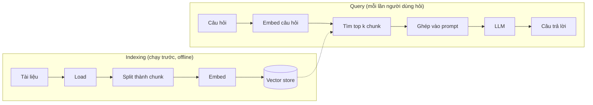

# Bài 1: Naive RAG

!!! abstract "Tóm tắt bài học"
    - **Mục tiêu:** tự tay dựng một pipeline RAG hoàn chỉnh, chạy được trên tài liệu thật, và hiểu vai trò của từng bước.
    - **Thời lượng:** khoảng 1 tuần.
    - **Yêu cầu trước:** [Bài 0](00-nen-tang.md), dự án `rag-lab` đã cài đặt xong.

"Naive RAG" là phiên bản đơn giản nhất: không hybrid search, không reranker, không agent. Nó đủ tốt để làm demo, và quan trọng hơn là cho bạn một **baseline** để so sánh khi cải tiến ở các bài sau.

## 1. Kiến trúc tổng thể

RAG gồm hai pha chạy ở hai thời điểm khác nhau:



| Bước | Thành phần LangChain | Vai trò |
|---|---|---|
| Load | Document loader (`PyPDFLoader`...) | Đọc file thành danh sách `Document` (nội dung + metadata) |
| Split | Text splitter | Cắt tài liệu dài thành chunk vừa đủ nhỏ |
| Embed | Embedding model | Biến mỗi chunk thành vector |
| Store | Vector store | Lưu vector, hỗ trợ tìm vector gần nhất |
| Retrieve | `similarity_search` | Tìm k chunk gần câu hỏi nhất |
| Generate | Chat model | Trả lời dựa trên các chunk tìm được |

## 2. Cấu trúc dự án

Từ bài này, code được tổ chức thành module để các bài sau chỉ cần nâng cấp từng phần:

```text
rag-lab/
├── data/                 # đặt tài liệu nguồn ở đây (PDF, Markdown)
├── rag/
│   ├── __init__.py
│   ├── config.py         # cấu hình model, embedding, vector store
│   ├── ingest.py         # load, split, index
│   ├── retrieve.py       # tìm kiếm
│   └── generate.py       # sinh câu trả lời
├── main.py               # chạy thử từ dòng lệnh
└── .env
```

Để có dữ liệu thử, bạn có thể dùng bất kỳ PDF tiếng Việt nào: sổ tay nhân viên, quy chế nội bộ, tài liệu hướng dẫn sản phẩm, hoặc một văn bản luật tải từ trang chính phủ. Các ví dụ trong lộ trình giả định bạn có file `data/so-tay-nhan-vien.pdf`.

## 3. Cấu hình dùng chung

```python title="rag/config.py"
from dotenv import load_dotenv
from langchain.chat_models import init_chat_model
from langchain.embeddings import init_embeddings
from langchain_core.vectorstores import InMemoryVectorStore

load_dotenv()

CHAT_MODEL = "anthropic:claude-sonnet-5"
EMBEDDING_MODEL = "openai:text-embedding-3-small"

chat_model = init_chat_model(CHAT_MODEL)
embeddings = init_embeddings(EMBEDDING_MODEL)

# InMemoryVectorStore mất dữ liệu khi tắt chương trình.
# Bài 3 sẽ thay bằng vector database thật.
vector_store = InMemoryVectorStore(embeddings)
```

## 4. Indexing

```python title="rag/ingest.py"
from pathlib import Path

from langchain_community.document_loaders import PyPDFLoader
from langchain_core.documents import Document
from langchain_text_splitters import RecursiveCharacterTextSplitter

from rag.config import vector_store

DATA_DIR = Path("data")


def load_documents() -> list[Document]:
    docs: list[Document] = []
    for pdf in sorted(DATA_DIR.glob("*.pdf")):
        # Mỗi trang PDF là một Document, metadata có "source" và "page"
        docs.extend(PyPDFLoader(str(pdf)).load())
    return docs


def split_documents(docs: list[Document]) -> list[Document]:
    splitter = RecursiveCharacterTextSplitter(
        chunk_size=1000,      # số ký tự tối đa mỗi chunk
        chunk_overlap=200,    # phần gối đầu giữa hai chunk liền kề
        add_start_index=True, # lưu vị trí bắt đầu của chunk trong trang
    )
    return splitter.split_documents(docs)


def build_index() -> int:
    docs = load_documents()
    chunks = split_documents(docs)
    vector_store.add_documents(chunks)
    print(f"Đã index {len(docs)} trang thành {len(chunks)} chunk")
    return len(chunks)
```

**Vì sao cần `chunk_overlap`?** Nếu một ý bị cắt đúng giữa hai chunk, phần gối đầu giúp ý đó vẫn nằm trọn trong ít nhất một chunk. Overlap khoảng 10% đến 20% kích thước chunk là điểm khởi đầu hợp lý.

**Vì sao `RecursiveCharacterTextSplitter`?** Nó thử cắt theo thứ tự ưu tiên: đoạn văn (`\n\n`), dòng (`\n`), khoảng trắng, rồi mới đến ký tự. Nhờ vậy chunk hiếm khi bị cắt giữa câu. Bài 2 sẽ đi sâu vào các chiến lược chunking khác.

## 5. Retrieval

```python title="rag/retrieve.py"
from langchain_core.documents import Document

from rag.config import vector_store


def retrieve(query: str, k: int = 4) -> list[Document]:
    return vector_store.similarity_search(query, k=k)


def retrieve_with_scores(query: str, k: int = 4) -> list[tuple[Document, float]]:
    """Dùng để debug: xem điểm tương đồng của từng chunk."""
    return vector_store.similarity_search_with_score(query, k=k)
```

## 6. Generation

```python title="rag/generate.py"
from langchain_core.documents import Document

from rag.config import chat_model
from rag.retrieve import retrieve

PROMPT = """Bạn là trợ lý trả lời câu hỏi dựa trên tài liệu nội bộ.

Quy tắc:
- Chỉ dùng thông tin trong <context>. Không dùng kiến thức bên ngoài.
- Nếu <context> không chứa câu trả lời, trả lời đúng một câu:
  "Tôi không tìm thấy thông tin này trong tài liệu."
- Cuối câu trả lời, ghi số thứ tự nguồn đã dùng, ví dụ [1], [3].

<context>
{context}
</context>

Câu hỏi: {question}"""


def format_context(docs: list[Document]) -> str:
    return "\n\n".join(
        f"[{i}] (nguồn: {d.metadata.get('source')}, trang {d.metadata.get('page', 0) + 1})\n"
        f"{d.page_content}"
        for i, d in enumerate(docs, start=1)
    )


def answer(question: str, k: int = 4) -> dict:
    docs = retrieve(question, k=k)
    prompt = PROMPT.format(context=format_context(docs), question=question)
    response = chat_model.invoke(prompt)
    return {"answer": response.text, "sources": docs}
```

!!! note "Số trang"
    `PyPDFLoader` đánh số trang từ 0, nên code cộng thêm 1 khi hiển thị cho người dùng.

## 7. Chạy thử

```python title="main.py"
from rag.generate import answer
from rag.ingest import build_index

build_index()

while True:
    question = input("\nHỏi (Enter để thoát): ").strip()
    if not question:
        break
    result = answer(question)
    print("\n" + result["answer"])
    print("\nNguồn đã retrieve:")
    for i, doc in enumerate(result["sources"], start=1):
        preview = doc.page_content[:80].replace("\n", " ")
        print(f"  [{i}] trang {doc.metadata.get('page', 0) + 1}: {preview}...")
```

```bash
uv run main.py
```

## 8. Debug: đọc kết quả retrieval trước khi đọc câu trả lời

Thói quen quan trọng nhất khi làm RAG: **khi câu trả lời sai, hãy nhìn các chunk được retrieve trước**. Có ba khả năng:

| Tình huống | Nguyên nhân | Hướng xử lý |
|---|---|---|
| Chunk đúng **không có** trong top k | Lỗi retrieval | Bài 2 (chunking), Bài 3 (embedding), Bài 4 (hybrid, rerank) |
| Chunk đúng **có** nhưng LLM trả lời sai | Lỗi generation | Bài 5 (prompt, thứ tự context) |
| Tài liệu **không hề chứa** câu trả lời | Thiếu dữ liệu | Bổ sung tài liệu, hoặc đảm bảo hệ thống nói "không tìm thấy" |

Trong thực tế, phần lớn lỗi thuộc tình huống đầu tiên. Đoạn code sau giúp soi nhanh:

```python
from rag.retrieve import retrieve_with_scores

for doc, score in retrieve_with_scores("Nhân viên thử việc có được nghỉ phép không?", k=6):
    print(f"{score:.3f} | trang {doc.metadata['page'] + 1} | {doc.page_content[:100]!r}")
```

## Bài tập

**Bài 1.1.** Chạy pipeline với tài liệu của bạn. Viết 10 câu hỏi mà bạn **biết chắc** câu trả lời nằm ở trang nào. Với mỗi câu, ghi lại: chunk đúng có nằm trong top 4 không? Câu trả lời có đúng không? Lưu kết quả vào một file bảng tính, vì đây là **baseline** để so sánh ở các bài sau.

**Bài 1.2.** Thử `k=1`, `k=4`, `k=10` với 10 câu hỏi trên. Ghi nhận thay đổi về độ chính xác, số token input (`usage_metadata`) và thời gian phản hồi.

??? tip "Gợi ý lời giải"
    Thường thì `k` nhỏ dễ bỏ sót thông tin, `k` lớn tăng khả năng có chunk đúng nhưng tốn token hơn và có thể làm LLM bị nhiễu bởi chunk không liên quan. Bài 4 sẽ giải quyết mâu thuẫn này bằng cách **retrieve nhiều rồi rerank giữ lại ít**.

    ```python
    import time
    from rag.config import chat_model
    from rag.generate import PROMPT, format_context
    from rag.retrieve import retrieve

    for k in (1, 4, 10):
        start = time.perf_counter()
        docs = retrieve(question, k=k)
        response = chat_model.invoke(
            PROMPT.format(context=format_context(docs), question=question)
        )
        elapsed = time.perf_counter() - start
        print(k, response.usage_metadata["input_tokens"], f"{elapsed:.1f}s")
    ```

**Bài 1.3.** Hỏi 3 câu mà tài liệu **không có** câu trả lời (ví dụ "Giá cổ phiếu công ty hôm nay?"). Hệ thống có trả lời "Tôi không tìm thấy..." không? Nếu không, thử sửa prompt.

**Bài 1.4 (mở rộng).** Viết lại pipeline mà **không dùng** LangChain: dùng trực tiếp SDK `openai` để embed, NumPy để tìm top k bằng cosine similarity, SDK `anthropic` để sinh câu trả lời. Việc này giúp bạn hiểu LangChain đang làm gì bên dưới.

??? tip "Gợi ý lời giải"
    ```python
    import numpy as np
    from anthropic import Anthropic
    from openai import OpenAI

    oai, claude = OpenAI(), Anthropic()

    def embed(texts: list[str]) -> np.ndarray:
        result = oai.embeddings.create(model="text-embedding-3-small", input=texts)
        vectors = np.array([item.embedding for item in result.data])
        return vectors / np.linalg.norm(vectors, axis=1, keepdims=True)

    chunk_texts = [c.page_content for c in chunks]  # tái dùng chunk từ ingest.py
    chunk_vectors = embed(chunk_texts)

    def search(query: str, k: int = 4) -> list[str]:
        scores = chunk_vectors @ embed([query])[0]
        return [chunk_texts[i] for i in np.argsort(scores)[::-1][:k]]

    message = claude.messages.create(
        model="claude-sonnet-5",
        max_tokens=16000,
        messages=[{
            "role": "user",
            "content": PROMPT.format(
                context="\n\n".join(search(question)), question=question
            ),
        }],
    )
    # Model mới có thể trả về khối "thinking" trước khối "text"
    print(next(b.text for b in message.content if b.type == "text"))
    ```

## Checklist

- [ ] Vẽ lại được hai pha indexing và query trên giấy.
- [ ] Pipeline chạy được trên tài liệu thật của bạn, câu trả lời có kèm nguồn.
- [ ] Có file baseline ghi kết quả 10 câu hỏi.
- [ ] Khi câu trả lời sai, biết cách xác định lỗi nằm ở retrieval hay generation.

## Đọc thêm

- [Retrieval](../../oss/python/langchain/retrieval.md): khái niệm và các kiến trúc RAG.
- [Xây dựng semantic search](../../oss/python/langchain/knowledge-base.md): hướng dẫn chi tiết về document loader, embedding, vector store.

---

**Bài trước:** [Bài 0: Nền tảng](00-nen-tang.md) · [Tổng quan](index.md) · **Bài tiếp theo:** [Bài 2: Ingestion và Chunking](02-ingestion-chunking.md)
