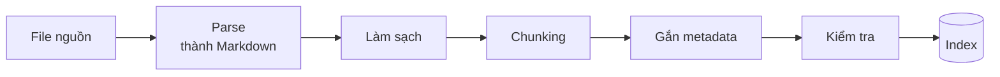

# Bài 2: Ingestion và Chunking

!!! abstract "Tóm tắt bài học"
    - **Mục tiêu:** biến tài liệu ngoài đời (PDF nhiều cột, bảng biểu, bản scan, trang web) thành các chunk sạch, trọn nghĩa và giàu metadata.
    - **Thời lượng:** 1 đến 2 tuần.
    - **Yêu cầu trước:** [Bài 1](01-naive-rag.md), đã có file baseline 10 câu hỏi.

!!! quote "Rác vào, rác ra"
    Chất lượng của hệ thống RAG không thể vượt qua chất lượng dữ liệu đầu vào. Một bảng giá bị parse thành chuỗi số lộn xộn thì không embedding, reranker hay LLM nào cứu được.

## 1. Pipeline ingestion đầy đủ



Ở Bài 1, ta gộp tất cả vào một lệnh `PyPDFLoader(...).load()`. Bài này tách từng bước ra để kiểm soát chất lượng.

## 2. Parse tài liệu

### 2.1 Vì sao PDF khó?

PDF là định dạng để **in**, không phải để **đọc bằng máy**. Nó chỉ lưu "vẽ ký tự X tại tọa độ (x, y)", không lưu đâu là đoạn văn, đâu là bảng. Các lỗi hay gặp:

| Lỗi | Biểu hiện | Hậu quả |
|---|---|---|
| Bố cục nhiều cột | Dòng của cột trái và cột phải bị trộn vào nhau | Câu vô nghĩa |
| Bảng biểu | Mất cấu trúc hàng cột, chỉ còn dãy số | Không trả lời được câu hỏi về số liệu |
| Header, footer | "Công ty ABC, Trang 3/50" lặp lại mọi trang | Nhiễu, chen giữa câu |
| PDF scan | Không có lớp văn bản, trả về chuỗi rỗng | Mất trắng nội dung |
| Font nhúng lỗi | Ký tự tiếng Việt thành ký tự lạ | Không tìm kiếm được |

### 2.2 Chọn công cụ

| Công cụ | Điểm mạnh | Khi nào dùng |
|---|---|---|
| `pypdf` | Nhẹ, thuần Python | PDF đơn giản, một cột |
| `pymupdf4llm` | Nhanh, xuất thẳng Markdown, giữ heading | Mặc định tốt cho đa số PDF văn bản |
| Docling (IBM) | Nhận diện bảng, bố cục, OCR tích hợp; đọc cả DOCX, PPTX, HTML | Tài liệu có nhiều bảng, bố cục phức tạp |
| Unstructured | Hỗ trợ rất nhiều định dạng | Kho tài liệu hỗn hợp |
| Vision LLM | Đọc ảnh trang tài liệu như người | Bản scan chất lượng kém, biểu đồ, form |
| Trafilatura | Trích nội dung chính của trang web, bỏ menu và quảng cáo | Crawl website |

**Nguyên tắc chung: chuyển mọi thứ về Markdown.** Markdown giữ được heading (`#`, `##`) và bảng (`| a | b |`), đồng thời LLM đọc Markdown rất tốt.

### 2.3 Code parse đa định dạng

```bash
uv add pymupdf4llm docling trafilatura
```

```python title="rag/parsers.py"
from pathlib import Path

import pymupdf
import pymupdf4llm
import trafilatura


def is_scanned_pdf(path: Path, min_chars_per_page: int = 50) -> bool:
    """PDF scan gần như không có lớp văn bản."""
    with pymupdf.open(path) as doc:
        chars = sum(len(page.get_text().strip()) for page in doc)
        return chars / max(len(doc), 1) < min_chars_per_page


def parse_pdf(path: Path) -> list[dict]:
    """Trả về danh sách trang, mỗi trang gồm Markdown và số trang."""
    if is_scanned_pdf(path):
        return parse_with_docling(path)
    pages = pymupdf4llm.to_markdown(str(path), page_chunks=True)
    # Đánh số trang từ 1 để hiển thị trực tiếp cho người dùng
    return [
        {"text": page["text"], "page": number}
        for number, page in enumerate(pages, start=1)
    ]


def parse_with_docling(path: Path) -> list[dict]:
    """Docling chậm hơn nhưng xử lý tốt bảng biểu và có OCR."""
    from docling.document_converter import DocumentConverter

    result = DocumentConverter().convert(str(path))
    return [{"text": result.document.export_to_markdown(), "page": None}]


def parse_url(url: str) -> list[dict]:
    html = trafilatura.fetch_url(url)
    text = trafilatura.extract(html, output_format="markdown", include_tables=True)
    return [{"text": text or "", "page": None}]
```

!!! tip "Kiểm tra OCR tiếng Việt"
    OCR thường nhầm dấu ("ngày" thành "ngay", "được" thành "đuợc"). Sau khi OCR, hãy tìm thử vài từ khóa quen thuộc trong kết quả. Nếu tỉ lệ lỗi cao, cân nhắc dùng vision LLM để đọc trực tiếp ảnh trang.

## 3. Làm sạch văn bản

### 3.1 Chuẩn hóa Unicode: lỗi âm thầm với tiếng Việt

Chữ "ệ" có thể được mã hóa theo **hai cách**: một ký tự dựng sẵn (NFC), hoặc chữ "e" cộng hai dấu kết hợp (NFD). Mắt người thấy giống hệt, nhưng máy coi là hai chuỗi khác nhau. File từ macOS, Word hoặc một số PDF thường dùng NFD.

```python
import unicodedata

a = "Nghệ An"
b = unicodedata.normalize("NFD", a)
print(a == b, len(a), len(b))  # False 7 9
```

Hậu quả: BM25 không khớp từ khóa, lọc metadata thất bại, embedding bị lệch nhẹ. **Luôn chuẩn hóa về NFC** cả khi ingest lẫn khi nhận câu hỏi.

### 3.2 Hàm làm sạch

```python title="rag/cleaning.py"
import re
import unicodedata
from collections import Counter


def normalize(text: str) -> str:
    text = unicodedata.normalize("NFC", text)
    text = text.replace(chr(0xA0), " ")        # khoảng trắng không ngắt dòng
    text = re.sub(r"[ \t]+", " ", text)         # gộp khoảng trắng thừa
    text = re.sub(r"\n{3,}", "\n\n", text)      # tối đa một dòng trống
    return text.strip()


def remove_repeated_lines(pages: list[str], min_ratio: float = 0.5) -> list[str]:
    """Xóa các dòng xuất hiện ở hơn 50% số trang (thường là header, footer)."""
    counter = Counter(
        line.strip()
        for page in pages
        for line in set(page.splitlines())
        if line.strip()
    )
    threshold = max(2, int(len(pages) * min_ratio))
    repeated = {line for line, count in counter.items() if count >= threshold}
    # Số trang thay đổi theo từng trang nên không bị bắt ở trên, xử lý riêng
    page_number = re.compile(r"^(trang|page)?\s*\d+(\s*/\s*\d+)?$", re.IGNORECASE)
    return [
        "\n".join(
            line for line in page.splitlines()
            if line.strip() not in repeated and not page_number.match(line.strip())
        )
        for page in pages
    ]
```

## 4. Chiến lược chunking

### 4.1 Vì sao phải chunk?

- Embedding của một đoạn văn quá dài là "trung bình" của nhiều ý, nên không khớp tốt với câu hỏi cụ thể nào.
- Đưa cả tài liệu vào context thì tốn token và làm nhiễu.
- Nhưng chunk quá ngắn thì mất ngữ cảnh: "Được nghỉ 12 ngày" mà không biết ai được nghỉ.

Chunking là cân bằng giữa **độ chính xác khi tìm** (chunk nhỏ) và **đủ ngữ cảnh khi trả lời** (chunk lớn).

### 4.2 Fixed size và Recursive

```python
from langchain_text_splitters import RecursiveCharacterTextSplitter

# Đo độ dài theo token thay vì ký tự, sát với giới hạn thật của model
splitter = RecursiveCharacterTextSplitter.from_tiktoken_encoder(
    encoding_name="cl100k_base",
    chunk_size=300,       # token
    chunk_overlap=50,
)
chunks = splitter.split_documents(docs)
```

`RecursiveCharacterTextSplitter` là **mặc định an toàn** cho văn bản thường. Có thể truyền `separators` riêng, ví dụ thêm `". "` để ưu tiên cắt ở cuối câu.

### 4.3 Theo cấu trúc tài liệu

Tài liệu có mục lục rõ ràng (quy chế, hợp đồng, tài liệu kỹ thuật) nên cắt theo heading. Mỗi chunk khi đó trùng với một mục có nghĩa, và heading trở thành metadata quý giá.

```python
from langchain_text_splitters import (
    MarkdownHeaderTextSplitter,
    RecursiveCharacterTextSplitter,
)

header_splitter = MarkdownHeaderTextSplitter(
    headers_to_split_on=[("#", "h1"), ("##", "h2"), ("###", "h3")],
    strip_headers=False,  # giữ heading trong nội dung chunk
)
sections = header_splitter.split_text(markdown_text)

# Mục nào quá dài thì cắt tiếp, metadata heading được giữ nguyên
size_splitter = RecursiveCharacterTextSplitter(chunk_size=1200, chunk_overlap=150)
chunks = size_splitter.split_documents(sections)

print(chunks[0].metadata)
# {'h1': 'Quy chế nhân sự', 'h2': 'Chương III. Thời giờ nghỉ ngơi', 'h3': 'Điều 12. Nghỉ phép năm'}
```

!!! tip "Văn bản pháp lý Việt Nam"
    Văn bản luật, nghị định, quy chế thường có cấu trúc "Chương, Mục, Điều, Khoản". Nếu parser không sinh heading Markdown, bạn có thể tự chèn bằng regex, ví dụ biến mọi dòng khớp `^Điều \d+\.` thành `### Điều ...` trước khi chunk. Mỗi "Điều" là một đơn vị chunk rất tự nhiên.

### 4.4 Semantic chunking

Thay vì cắt theo độ dài, semantic chunking embed từng câu và cắt tại vị trí mà **ý nghĩa thay đổi đột ngột** (khoảng cách embedding giữa hai câu liền kề lớn bất thường).

```python
# uv add langchain-experimental
from langchain_experimental.text_splitter import SemanticChunker

from rag.config import embeddings

semantic_splitter = SemanticChunker(
    embeddings,
    breakpoint_threshold_type="percentile",  # cắt tại 5% khoảng cách lớn nhất
    breakpoint_threshold_amount=95,
)
chunks = semantic_splitter.create_documents([long_text])
```

Ưu: phù hợp văn bản dài không có heading (biên bản họp, bài báo). Nhược: tốn chi phí embed từng câu, độ dài chunk không đều. Và nhiều thử nghiệm cho thấy nó **không phải lúc nào cũng tốt hơn** recursive, nên hãy đo trước khi dùng.

### 4.5 Small-to-big (parent document)

Ý tưởng: **tìm bằng chunk nhỏ** (chính xác), nhưng **trả về chunk cha lớn** cho LLM (đủ ngữ cảnh).

```python
import uuid

from langchain_core.documents import Document
from langchain_text_splitters import RecursiveCharacterTextSplitter

parent_splitter = RecursiveCharacterTextSplitter(chunk_size=2000, chunk_overlap=0)
child_splitter = RecursiveCharacterTextSplitter(chunk_size=300, chunk_overlap=50)

parent_store: dict[str, Document] = {}  # production: dùng Redis hoặc bảng SQL


def index_small_to_big(docs: list[Document]) -> list[Document]:
    children: list[Document] = []
    for parent in parent_splitter.split_documents(docs):
        parent_id = str(uuid.uuid4())
        parent_store[parent_id] = parent
        for child in child_splitter.split_documents([parent]):
            child.metadata["parent_id"] = parent_id
            children.append(child)
    return children  # chỉ embed và index các chunk con


def retrieve_parents(query: str, k: int = 8) -> list[Document]:
    children = vector_store.similarity_search(query, k=k)
    seen: list[str] = []
    for child in children:
        if child.metadata["parent_id"] not in seen:
            seen.append(child.metadata["parent_id"])
    return [parent_store[pid] for pid in seen]
```

### 4.6 Chọn kích thước chunk

| Loại tài liệu | Gợi ý khởi đầu |
|---|---|
| FAQ, câu hỏi đáp ngắn | Mỗi cặp hỏi đáp là một chunk |
| Quy chế, văn bản pháp lý | Theo "Điều", tối đa khoảng 500 token |
| Tài liệu kỹ thuật, hướng dẫn | Theo heading, 300 đến 800 token |
| Văn bản dài liền mạch | Recursive 300 đến 500 token, overlap 10% đến 20% |
| Bảng biểu | Giữ nguyên cả bảng trong một chunk, lặp lại dòng tiêu đề nếu phải tách |

Đây chỉ là điểm xuất phát. Kích thước tối ưu phụ thuộc dữ liệu và **phải được đo** (Bài 6).

## 5. Thiết kế metadata

Metadata phục vụ ba mục đích: **trích dẫn nguồn**, **lọc khi tìm kiếm**, và **phân quyền**. Thiết kế ngay từ đầu sẽ đỡ phải index lại sau này.

```python
{
    "doc_id": "quy-che-nhan-su-2025",      # ID ổn định của tài liệu gốc
    "chunk_id": "quy-che-nhan-su-2025#17", # ID ổn định của chunk
    "source": "data/quy-che-nhan-su-2025.pdf",
    "title": "Quy chế nhân sự 2025",
    "section": "Chương III > Điều 12. Nghỉ phép năm",
    "page": 14,
    "doc_type": "policy",                  # policy | faq | guide | contract
    "updated_at": "2025-06-01",
    "content_hash": "9f2c...",             # dùng để phát hiện thay đổi (Bài 8)
    "access_group": "all",                 # nhóm được xem, dùng để phân quyền (Bài 8)
}
```

### Contextual header

Một chunk đứng một mình thường thiếu ngữ cảnh. Cách rẻ nhất để khắc phục: **ghép tiêu đề tài liệu và đường dẫn heading vào đầu nội dung trước khi embed**.

```text
Trước:  "Được nghỉ 12 ngày, cộng thêm 1 ngày cho mỗi 5 năm làm việc."

Sau:    "Quy chế nhân sự 2025 > Chương III > Điều 12. Nghỉ phép năm
         Được nghỉ 12 ngày, cộng thêm 1 ngày cho mỗi 5 năm làm việc."
```

Bài 4 sẽ nâng cấp ý tưởng này thành **contextual retrieval**, dùng LLM viết đoạn ngữ cảnh cho từng chunk.

## 6. Cập nhật `ingest.py`

```python title="rag/ingest.py"
import hashlib
from pathlib import Path

from langchain_core.documents import Document
from langchain_text_splitters import (
    MarkdownHeaderTextSplitter,
    RecursiveCharacterTextSplitter,
)

from rag.cleaning import normalize, remove_repeated_lines
from rag.config import vector_store
from rag.parsers import parse_pdf

DATA_DIR = Path("data")

header_splitter = MarkdownHeaderTextSplitter(
    headers_to_split_on=[("#", "h1"), ("##", "h2"), ("###", "h3")],
    strip_headers=False,
)
size_splitter = RecursiveCharacterTextSplitter.from_tiktoken_encoder(
    encoding_name="cl100k_base", chunk_size=400, chunk_overlap=60
)


def section_path(metadata: dict) -> str:
    return " > ".join(metadata[h] for h in ("h1", "h2", "h3") if metadata.get(h))


def chunk_file(path: Path) -> list[Document]:
    pages = parse_pdf(path)
    texts = remove_repeated_lines([normalize(p["text"]) for p in pages])
    doc_id = path.stem
    title = doc_id.replace("-", " ").capitalize()

    chunks: list[Document] = []
    for page, text in zip(pages, texts):
        for section in header_splitter.split_text(text):
            for piece in size_splitter.split_documents([section]):
                section_name = section_path(piece.metadata)
                piece.metadata = {
                    "doc_id": doc_id,
                    "source": str(path),
                    "title": title,
                    "section": section_name,
                    "page": page["page"],
                    "doc_type": "policy",
                }
                # Contextual header: ghép tiêu đề và mục vào nội dung được embed
                header = f"{title} > {section_name}" if section_name else title
                piece.page_content = f"{header}\n{piece.page_content}"
                chunks.append(piece)

    for i, chunk in enumerate(chunks):
        chunk.metadata["chunk_id"] = f"{doc_id}#{i}"
        chunk.metadata["content_hash"] = hashlib.sha256(
            chunk.page_content.encode()
        ).hexdigest()[:16]
    return chunks


def build_index() -> int:
    chunks = [c for path in sorted(DATA_DIR.glob("*.pdf")) for c in chunk_file(path)]
    vector_store.add_documents(chunks, ids=[c.metadata["chunk_id"] for c in chunks])
    print(f"Đã index {len(chunks)} chunk")
    return len(chunks)
```

Metadata mới đánh số trang từ 1 (hoặc `None` với tài liệu parse bằng Docling) và có thêm `section`. Cập nhật hàm `format_context` trong `rag/generate.py` cho khớp:

```python title="rag/generate.py (cập nhật)"
def format_context(docs: list[Document]) -> str:
    def locate(d: Document) -> str:
        parts = [d.metadata.get("title", d.metadata.get("source", ""))]
        if d.metadata.get("section"):
            parts.append(d.metadata["section"])
        if d.metadata.get("page"):
            parts.append(f"trang {d.metadata['page']}")
        return ", ".join(parts)

    return "\n\n".join(
        f"[{i}] ({locate(d)})\n{d.page_content}" for i, d in enumerate(docs, start=1)
    )
```

## 7. Kiểm tra chunk trước khi index

**Đừng bao giờ index mà chưa nhìn tận mắt các chunk.** Script sau in thống kê và vài chunk ngẫu nhiên:

```python title="inspect_chunks.py"
import random
import statistics
from pathlib import Path

from rag.ingest import chunk_file

chunks = [c for p in Path("data").glob("*.pdf") for c in chunk_file(p)]
lengths = [len(c.page_content) for c in chunks]

print(f"Tổng: {len(chunks)} chunk")
print(f"Độ dài (ký tự): min={min(lengths)}, median={statistics.median(lengths)}, max={max(lengths)}")
print(f"Chunk quá ngắn (< 100 ký tự): {sum(l < 100 for l in lengths)}")

for chunk in random.sample(chunks, 5):
    print("\n" + "=" * 60)
    print(chunk.metadata)
    print(chunk.page_content)
```

Những dấu hiệu cần xử lý:

- Nhiều chunk rất ngắn: thường là tiêu đề đứng một mình hoặc rác từ header, footer.
- Chunk chứa ký tự lạ hoặc mất dấu: lỗi font hoặc OCR.
- Bảng bị cắt đôi: tăng `chunk_size` hoặc xử lý bảng riêng.
- `section` rỗng ở hầu hết chunk: parser không nhận ra heading.

## Bài tập

**Bài 2.1.** Chọn một PDF có bảng biểu. Parse bằng `pypdf`, `pymupdf4llm` và Docling, rồi so sánh phần bảng trong output. Công cụ nào giữ được cấu trúc tốt nhất?

**Bài 2.2.** Tạo một chuỗi tiếng Việt ở dạng NFD, index nó, rồi tìm bằng BM25 với câu hỏi dạng NFC. Chứng minh lỗi xảy ra, sau đó sửa bằng `normalize()`.

??? tip "Gợi ý lời giải"
    ```python
    import unicodedata
    from rank_bm25 import BM25Okapi

    doc = unicodedata.normalize("NFD", "Chế độ nghỉ phép năm")
    bm25 = BM25Okapi([doc.lower().split()])
    print(bm25.get_scores("nghỉ phép".split()))  # điểm bằng 0 vì không khớp

    bm25 = BM25Okapi([unicodedata.normalize("NFC", doc).lower().split()])
    print(bm25.get_scores("nghỉ phép".split()))  # điểm lớn hơn 0
    ```

**Bài 2.3.** Với 10 câu hỏi baseline từ Bài 1, thử ba chiến lược: recursive 1000 ký tự (baseline), recursive 400 token có contextual header, theo heading. Ghi lại số câu có chunk đúng trong top 4 cho mỗi chiến lược.

**Bài 2.4.** Cài đặt small-to-big và so sánh với chiến lược tốt nhất ở bài 2.3. Với loại câu hỏi nào small-to-big tốt hơn?

??? tip "Gợi ý"
    Small-to-big thường thắng ở các câu hỏi cần nhiều ngữ cảnh xung quanh (ví dụ "Quy trình xin nghỉ phép gồm những bước nào?"), vì chunk con khớp chính xác một bước, còn chunk cha chứa cả quy trình.

## Checklist

- [ ] Biết chọn công cụ parse phù hợp với từng loại tài liệu.
- [ ] Đã chuẩn hóa Unicode NFC trong pipeline.
- [ ] Mỗi chunk có đủ metadata: nguồn, trang hoặc mục, `chunk_id` ổn định.
- [ ] Đã đọc tận mắt ít nhất vài chục chunk ngẫu nhiên.
- [ ] Có số liệu so sánh ít nhất hai chiến lược chunking trên bộ câu hỏi baseline.

## Đọc thêm

- [Xây dựng semantic search](../../oss/python/langchain/knowledge-base.md): phần tải và chia nhỏ file PDF.
- [Docling](https://github.com/docling-project/docling), [PyMuPDF4LLM](https://pymupdf.readthedocs.io/en/latest/pymupdf4llm/).

---

**Bài trước:** [Bài 1: Naive RAG](01-naive-rag.md) · [Tổng quan](index.md) · **Bài tiếp theo:** [Bài 3: Embeddings và Vector Database](03-embeddings-vector-db.md)
