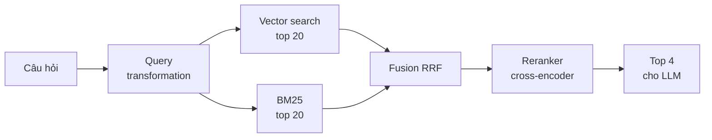

# Bài 4: Retrieval nâng cao

!!! abstract "Tóm tắt bài học"
    - **Mục tiêu:** tăng tỉ lệ tìm đúng chunk (recall) và đẩy chunk tốt nhất lên đầu (precision) bằng hybrid search, reranking, query transformation và contextual retrieval.
    - **Thời lượng:** khoảng 2 tuần.
    - **Yêu cầu trước:** [Bài 3](03-embeddings-vector-db.md), đã có `eval/questions.jsonl` và hàm `hit_rate`.

Đây là bài mang lại **cải thiện chất lượng lớn nhất** trong cả lộ trình. Nhưng cũng là nơi dễ "thêm cho vui" nhất. Nguyên tắc của bài: **mỗi kỹ thuật thêm vào đều phải được đo** bằng `hit_rate` trước và sau.

## 1. Kiến trúc retrieval hai tầng



Ý tưởng cốt lõi: **tầng 1 tìm rộng và nhanh** (lấy nhiều ứng viên, chấp nhận lẫn chunk không liên quan), **tầng 2 chọn lọc chậm mà kỹ** (reranker đọc kỹ từng ứng viên, chỉ giữ vài chunk tốt nhất).

## 2. Hybrid search: BM25 kết hợp vector

Như đã thấy ở [Bài 0](00-nen-tang.md#5-tim-kiem-tu-khoa-voi-bm25), vector search giỏi hiểu ý nghĩa nhưng hay trượt với **từ khóa chính xác** (mã sản phẩm, số hiệu văn bản, tên riêng), còn BM25 thì ngược lại. Kết hợp cả hai gần như luôn tốt hơn từng cái riêng lẻ.

### 2.1 BM25 cho tiếng Việt

Tiếng Việt có từ ghép, nên cần **tách từ** trước khi đưa vào BM25:

```bash
uv add underthesea
```

```python title="rag/vi_text.py"
import re

from underthesea import word_tokenize

from rag.cleaning import normalize

TOKEN = re.compile(r"\w+", re.UNICODE)


def vi_tokenize(text: str) -> list[str]:
    """'Hợp đồng lao động' -> ['hợp_đồng', 'lao_động']"""
    segmented = word_tokenize(normalize(text).lower(), format="text")
    return TOKEN.findall(segmented)
```

`underthesea` nối các âm tiết của một từ bằng dấu gạch dưới, nên "hợp_đồng" trở thành một token duy nhất, không khớp nhầm với "đồng" trong "đồng nghiệp".

### 2.2 Tạo BM25 retriever

```python title="rag/keyword.py"
import pickle
from pathlib import Path

from langchain_community.retrievers import BM25Retriever
from langchain_core.documents import Document

from rag.vi_text import vi_tokenize

BM25_PATH = Path("bm25.pkl")


def build_bm25(chunks: list[Document]) -> BM25Retriever:
    retriever = BM25Retriever.from_documents(chunks, preprocess_func=vi_tokenize, k=20)
    BM25_PATH.write_bytes(pickle.dumps(retriever))
    return retriever


def load_bm25() -> BM25Retriever:
    return pickle.loads(BM25_PATH.read_bytes())
```

Thêm `build_bm25(chunks)` vào cuối hàm `build_index()` trong `rag/ingest.py` để BM25 được xây lại mỗi khi index.

!!! note "BM25 trong production"
    `BM25Retriever` giữ toàn bộ chỉ mục trong RAM, phù hợp với vài chục nghìn chunk. Ở quy mô lớn hơn, hãy dùng full-text search có sẵn trong database: PostgreSQL full-text search (hoặc extension như ParadeDB), sparse vector của Qdrant, hoặc Elasticsearch/OpenSearch.

### 2.3 Reciprocal Rank Fusion (RRF)

Điểm BM25 và điểm cosine có thang đo hoàn toàn khác nhau, không cộng trực tiếp được. **RRF** chỉ dùng **thứ hạng**: tài liệu đứng hạng `r` trong một danh sách được cộng `1 / (60 + r)` điểm. Tài liệu xuất hiện ở top của cả hai danh sách sẽ có tổng điểm cao nhất.

```python title="rag/fusion.py"
from collections import defaultdict

from langchain_core.documents import Document


def doc_key(doc: Document) -> str:
    return doc.metadata.get("chunk_id") or doc.page_content


def reciprocal_rank_fusion(
    result_lists: list[list[Document]], k: int = 60, top_n: int = 20
) -> list[Document]:
    scores: dict[str, float] = defaultdict(float)
    docs: dict[str, Document] = {}
    for results in result_lists:
        for rank, doc in enumerate(results, start=1):
            key = doc_key(doc)
            scores[key] += 1 / (k + rank)
            docs[key] = doc
    ranked = sorted(scores, key=scores.__getitem__, reverse=True)
    return [docs[key] for key in ranked[:top_n]]
```

Hằng số `k=60` là giá trị chuẩn từ bài báo gốc, hiếm khi cần chỉnh. Nếu muốn ưu tiên một nguồn hơn, có thể nhân trọng số cho từng danh sách.

## 3. Reranking

### 3.1 Bi-encoder và cross-encoder

| | Bi-encoder (embedding) | Cross-encoder (reranker) |
|---|---|---|
| Cách đọc | Câu hỏi và tài liệu **tách rời** | Câu hỏi và tài liệu **cùng lúc** |
| Tính trước được không | Có, embed tài liệu một lần | Không, phải chạy lại cho mỗi câu hỏi |
| Tốc độ | Rất nhanh, tìm trong hàng triệu | Chậm, chỉ nên chấm vài chục ứng viên |
| Độ chính xác | Khá | Cao hơn rõ rệt |

Vì vậy reranker luôn đứng **sau** bước tìm kiếm, chấm lại khoảng 20 đến 50 ứng viên.

### 3.2 Code reranker

=== "Mã nguồn mở (chạy local)"

    ```python title="rag/rerank.py"
    from functools import lru_cache

    from langchain_core.documents import Document
    from sentence_transformers import CrossEncoder


    @lru_cache(maxsize=1)
    def get_reranker() -> CrossEncoder:
        # Hỗ trợ đa ngôn ngữ, bao gồm tiếng Việt
        return CrossEncoder("BAAI/bge-reranker-v2-m3", max_length=512)


    def rerank(query: str, docs: list[Document], top_n: int = 4) -> list[Document]:
        if not docs:
            return []
        scores = get_reranker().predict([(query, d.page_content) for d in docs])
        ranked = sorted(zip(docs, scores), key=lambda pair: pair[1], reverse=True)
        for doc, score in ranked:
            doc.metadata["rerank_score"] = float(score)
        return [doc for doc, _ in ranked[:top_n]]
    ```

=== "Cohere Rerank (API)"

    ```bash
    uv add langchain-cohere   # cần COHERE_API_KEY trong .env
    ```

    ```python title="rag/rerank.py"
    from langchain_cohere import CohereRerank
    from langchain_core.documents import Document

    reranker = CohereRerank(model="rerank-v3.5", top_n=4)


    def rerank(query: str, docs: list[Document], top_n: int = 4) -> list[Document]:
        if not docs:
            return []
        reranker.top_n = top_n
        return list(reranker.compress_documents(docs, query))
    ```

!!! tip "Dùng điểm rerank làm ngưỡng"
    Điểm của reranker có ý nghĩa tuyệt đối hơn điểm cosine. Nếu **chunk tốt nhất** vẫn có điểm rất thấp, rất có thể tài liệu không chứa câu trả lời. Bạn có thể dùng ngưỡng này để trả lời "không tìm thấy" ngay mà không cần gọi LLM (Bài 5). Ngưỡng cụ thể cần hiệu chỉnh trên dữ liệu của bạn.

## 4. Query transformation

Người dùng hiếm khi hỏi bằng đúng từ ngữ trong tài liệu. Query transformation dùng một LLM nhỏ, rẻ để "dịch" câu hỏi sang dạng dễ tìm hơn.

```python title="rag/query.py"
from langchain.chat_models import init_chat_model
from pydantic import BaseModel, Field

# Model nhỏ và nhanh cho các bước phụ trợ
fast_model = init_chat_model("anthropic:claude-haiku-4-5", temperature=0)
```

### 4.1 Viết lại câu hỏi theo lịch sử hội thoại

Đây là kỹ thuật **gần như bắt buộc** với chatbot nhiều lượt. Câu "thế còn nhân viên thử việc?" không thể tìm được nếu thiếu ngữ cảnh.

```python title="rag/query.py (tiếp)"
REWRITE_PROMPT = """Dựa vào lịch sử hội thoại, viết lại câu hỏi cuối cùng thành
một câu hỏi độc lập, đầy đủ ý, có thể hiểu được mà không cần đọc lịch sử.
Chỉ trả về câu hỏi đã viết lại, không giải thích.

Lịch sử:
{history}

Câu hỏi cuối: {question}"""


def rewrite_with_history(question: str, history: list[tuple[str, str]]) -> str:
    if not history:
        return question
    history_text = "\n".join(f"{role}: {text}" for role, text in history[-6:])
    response = fast_model.invoke(
        REWRITE_PROMPT.format(history=history_text, question=question)
    )
    return response.text.strip()


# rewrite_with_history(
#     "Thế còn nhân viên thử việc?",
#     [("user", "Nhân viên được nghỉ phép mấy ngày?"), ("assistant", "12 ngày mỗi năm.")],
# )
# -> "Nhân viên thử việc được nghỉ phép bao nhiêu ngày?"
```

### 4.2 Multi-query

Sinh nhiều cách hỏi khác nhau, tìm với từng cách rồi gộp bằng RRF. Hữu ích khi người dùng diễn đạt khác hẳn tài liệu.

```python title="rag/query.py (tiếp)"
class QueryVariants(BaseModel):
    queries: list[str] = Field(description="3 cách diễn đạt khác nhau của câu hỏi")


def multi_query(question: str) -> list[str]:
    result = fast_model.with_structured_output(QueryVariants).invoke(
        "Viết 3 cách diễn đạt khác nhau cho câu hỏi sau, dùng từ ngữ mà một "
        f"văn bản quy chế công ty có thể sử dụng:\n{question}"
    )
    return [question, *result.queries]
```

### 4.3 HyDE (Hypothetical Document Embeddings)

Câu hỏi ("Nghỉ phép mấy ngày?") và tài liệu ("Người lao động được hưởng 12 ngày nghỉ hằng năm hưởng nguyên lương...") có **văn phong rất khác nhau**. HyDE yêu cầu LLM viết một đoạn trả lời **giả định** theo văn phong tài liệu, rồi dùng đoạn đó để tìm kiếm.

```python title="rag/query.py (tiếp)"
def hyde(question: str) -> str:
    response = fast_model.invoke(
        "Viết một đoạn văn ngắn (3 đến 4 câu) theo văn phong quy chế công ty, "
        f"trả lời câu hỏi sau. Nếu không biết số liệu cụ thể, hãy tự giả định.\n\n{question}"
    )
    return response.text
```

Đoạn giả định có thể chứa số liệu sai, nhưng không sao: ta chỉ dùng nó để **tìm**, không dùng để trả lời.

### 4.4 Khi nào dùng kỹ thuật nào

| Kỹ thuật | Hữu ích khi | Chi phí thêm |
|---|---|---|
| Rewrite theo lịch sử | Chatbot nhiều lượt | 1 lệnh gọi LLM nhỏ |
| Multi-query | Người dùng diễn đạt đa dạng, tài liệu dùng thuật ngữ riêng | 1 lệnh gọi LLM + nhiều lần search |
| HyDE | Câu hỏi rất ngắn, khác xa văn phong tài liệu | 1 lệnh gọi LLM |
| Decomposition | Câu hỏi so sánh, nhiều ý ("So sánh chính sách A và B") | 1 lệnh gọi LLM + nhiều lần search |

Mỗi kỹ thuật cộng thêm **độ trễ** (thường vài trăm mili giây). Chỉ giữ lại kỹ thuật nào thực sự tăng điểm trên dữ liệu của bạn.

## 5. Contextual retrieval

Ở Bài 2, ta đã ghép heading vào chunk. **Contextual retrieval** (do Anthropic đề xuất) làm tốt hơn: dùng LLM đọc **toàn bộ tài liệu** và viết 1 đến 2 câu mô tả chunk nằm ở đâu, nói về cái gì, rồi ghép vào đầu chunk trước khi embed **và** trước khi đưa vào BM25.

```text
Chunk gốc:       "Mức phạt là 5 triệu đồng cho mỗi lần vi phạm."

Sau khi thêm     "Đoạn này thuộc Điều 25 Quy chế nhân sự 2025, quy định mức xử lý
ngữ cảnh:         kỷ luật khi nhân viên tiết lộ thông tin mật của công ty.
                  Mức phạt là 5 triệu đồng cho mỗi lần vi phạm."
```

```python title="rag/contextual.py"
from langchain.chat_models import init_chat_model
from langchain_core.documents import Document

context_model = init_chat_model("anthropic:claude-haiku-4-5", temperature=0)

CHUNK_PROMPT = """Đây là một đoạn trích từ tài liệu trên:
<chunk>
{chunk}
</chunk>
Viết 1 đến 2 câu ngắn giúp định vị đoạn trích này trong toàn bộ tài liệu
(thuộc phần nào, nói về chủ đề gì), để cải thiện việc tìm kiếm.
Chỉ trả về đoạn ngữ cảnh, không giải thích thêm."""


def contextualize(full_document: str, chunks: list[Document]) -> list[Document]:
    for chunk in chunks:
        response = context_model.invoke([
            {
                "role": "user",
                "content": [
                    {
                        "type": "text",
                        "text": f"<document>\n{full_document}\n</document>",
                        # Cache phần tài liệu dài: các chunk sau chỉ trả phí cho phần mới
                        "cache_control": {"type": "ephemeral"},
                    },
                    {"type": "text", "text": CHUNK_PROMPT.format(chunk=chunk.page_content)},
                ],
            }
        ])
        chunk.metadata["context"] = response.text.strip()
        chunk.page_content = f"{chunk.metadata['context']}\n{chunk.page_content}"
    return chunks
```

!!! tip "Chi phí"
    Mỗi chunk tốn một lệnh gọi LLM với **toàn bộ tài liệu** trong prompt. Prompt caching giúp giảm mạnh chi phí vì phần tài liệu được đọc từ cache sau lần đầu. Việc này chỉ chạy **một lần khi index**, không ảnh hưởng độ trễ lúc truy vấn. Xem thêm bài viết [Contextual Retrieval](https://www.anthropic.com/news/contextual-retrieval).

## 6. Các kỹ thuật bổ sung

### 6.1 MMR: giảm kết quả trùng lặp

Khi tài liệu có nhiều đoạn gần giống nhau (ví dụ nhiều phiên bản quy chế), top k có thể toàn chunk nói cùng một ý. **MMR (Maximal Marginal Relevance)** chọn kết quả vừa liên quan tới câu hỏi vừa **khác** các kết quả đã chọn.

```python
docs = vector_store.max_marginal_relevance_search(
    query, k=5, fetch_k=20, lambda_mult=0.5  # 1.0 = chỉ xét liên quan, 0.0 = chỉ xét đa dạng
)
```

### 6.2 Trích điều kiện lọc từ câu hỏi (self-query)

Câu hỏi "Chính sách công tác phí **năm 2024**" chứa một điều kiện lọc. Dùng structured output để tách ra:

```python
from typing import Literal

class SearchPlan(BaseModel):
    query: str = Field(description="Nội dung cần tìm, đã bỏ điều kiện lọc")
    doc_type: Literal["policy", "faq", "guide"] | None = None
    year: int | None = None

plan = fast_model.with_structured_output(SearchPlan).invoke(question)
# Chuyển plan.doc_type, plan.year thành filter của vector store (xem Bài 3)
```

## 7. Ghép tất cả: `retrieve.py` mới

```python title="rag/retrieve.py"
from langchain_core.documents import Document

from rag.cleaning import normalize
from rag.config import vector_store
from rag.fusion import reciprocal_rank_fusion
from rag.keyword import load_bm25
from rag.query import rewrite_with_history
from rag.rerank import rerank

bm25 = load_bm25()


def retrieve(
    question: str,
    k: int = 4,
    history: list[tuple[str, str]] | None = None,
    candidates: int = 20,
    use_bm25: bool = True,
    use_rerank: bool = True,
) -> list[Document]:
    query = rewrite_with_history(normalize(question), history or [])

    result_lists = [vector_store.similarity_search(query, k=candidates)]
    if use_bm25:
        result_lists.append(bm25.invoke(query))

    fused = reciprocal_rank_fusion(result_lists, top_n=candidates)
    if use_rerank:
        return rerank(query, fused, top_n=k)
    return fused[:k]
```

Các cờ `use_bm25`, `use_rerank` giúp bạn bật tắt từng thành phần để **đo đóng góp của mỗi kỹ thuật** (ablation study):

```python title="ablation.py"
import json

from rag.retrieve import retrieve

questions = [json.loads(line) for line in open("eval/questions.jsonl", encoding="utf-8")]

configs = {
    "vector": dict(use_bm25=False, use_rerank=False),
    "hybrid": dict(use_bm25=True, use_rerank=False),
    "vector + rerank": dict(use_bm25=False, use_rerank=True),
    "hybrid + rerank": dict(use_bm25=True, use_rerank=True),
}

for name, flags in configs.items():
    hits = sum(
        any(q["keyword"].lower() in d.page_content.lower()
            for d in retrieve(q["question"], k=4, **flags))
        for q in questions
    )
    print(f"{name:18} hit@4 = {hits / len(questions):.2f}")
```

## Bài tập

**Bài 4.1.** Thêm vào `eval/questions.jsonl` ít nhất 5 câu hỏi chứa **từ khóa chính xác** (mã văn bản, số điều khoản, tên riêng). Chạy `ablation.py` và so sánh `vector` với `hybrid` trên nhóm câu hỏi này.

**Bài 4.2.** So sánh BM25 dùng `str.split()` với BM25 dùng `vi_tokenize`. Chênh lệch bao nhiêu?

**Bài 4.3.** Đo **độ trễ** của từng cấu hình trong `ablation.py`. Reranker tốn thêm bao nhiêu mili giây? Có đáng không?

??? tip "Gợi ý lời giải"
    ```python
    import statistics
    import time

    latencies = []
    for q in questions:
        start = time.perf_counter()
        retrieve(q["question"], **flags)
        latencies.append((time.perf_counter() - start) * 1000)
    print(f"p50={statistics.median(latencies):.0f}ms "
          f"max={max(latencies):.0f}ms")
    ```
    Reranker local chạy CPU có thể tốn vài trăm mili giây cho 20 ứng viên. Nếu quá chậm: giảm số ứng viên, dùng GPU, dùng model reranker nhỏ hơn, hoặc dùng API.

**Bài 4.4.** Viết 5 hội thoại hai lượt mà câu hỏi thứ hai phụ thuộc câu đầu. So sánh kết quả retrieval có và không có `rewrite_with_history`.

**Bài 4.5.** Cài đặt multi-query: tìm với cả 4 biến thể câu hỏi, gộp bằng `reciprocal_rank_fusion`, rồi rerank. So sánh với cấu hình tốt nhất ở bài 4.1.

??? tip "Gợi ý lời giải"
    ```python
    from rag.query import multi_query

    def retrieve_multi(question: str, k: int = 4) -> list[Document]:
        queries = multi_query(question)
        lists = []
        for q in queries:
            lists.append(vector_store.similarity_search(q, k=10))
            lists.append(bm25.invoke(q))
        fused = reciprocal_rank_fusion(lists, top_n=20)
        return rerank(question, fused, top_n=k)  # rerank theo câu hỏi GỐC
    ```

**Bài 4.6 (mở rộng).** Áp dụng contextual retrieval cho toàn bộ tài liệu, index lại, rồi chạy `ablation.py`. Ghi lại chi phí index (số token) và mức cải thiện hit@4.

## Checklist

- [ ] Giải thích được vì sao "tìm rộng, rerank hẹp" hiệu quả.
- [ ] BM25 đã dùng tách từ tiếng Việt.
- [ ] Có bảng ablation cho thấy đóng góp của từng kỹ thuật, kèm độ trễ.
- [ ] Chatbot xử lý đúng câu hỏi nối tiếp nhờ viết lại câu hỏi.
- [ ] Chỉ giữ lại kỹ thuật nào có số liệu chứng minh hiệu quả.

## Đọc thêm

- [Retrieval](../../oss/python/langchain/retrieval.md): phần retriever và các kiến trúc RAG.
- [Contextual Retrieval](https://www.anthropic.com/news/contextual-retrieval) (Anthropic).
- [HyDE: Precise Zero-Shot Dense Retrieval without Relevance Labels](https://arxiv.org/abs/2212.10496).
- [Reciprocal Rank Fusion](https://plg.uwaterloo.ca/~gvcormac/cormacksigir09-rrf.pdf) (Cormack và cộng sự, 2009).

---

**Bài trước:** [Bài 3: Embeddings và Vector Database](03-embeddings-vector-db.md) · [Tổng quan](index.md) · **Bài tiếp theo:** [Bài 5: Generation có căn cứ](05-generation.md)
