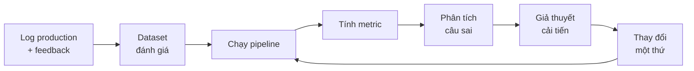

# Bài 6: Evaluation

!!! abstract "Tóm tắt bài học"
    - **Mục tiêu:** xây bộ dữ liệu đánh giá, đo chất lượng retrieval và generation bằng con số, chạy eval tự động mỗi khi thay đổi hệ thống.
    - **Thời lượng:** 1 đến 2 tuần.
    - **Yêu cầu trước:** [Bài 5](05-generation.md).

!!! quote "Không đo được thì không cải thiện được"
    Thay đổi prompt rồi thử 3 câu hỏi và thấy "có vẻ tốt hơn" là cách phổ biến nhất để làm hỏng một hệ thống RAG: câu này tốt lên, mười câu khác tệ đi mà không ai biết. Evaluation là kỹ năng phân biệt người làm demo với người làm sản phẩm.

## 1. Vòng lặp phát triển dựa trên eval



Nguyên tắc: **mỗi lần chỉ thay đổi một thứ**, và **luôn đọc các câu sai** chứ không chỉ nhìn con số tổng.

## 2. Xây golden dataset

### 2.1 Định dạng

Mở rộng file `eval/questions.jsonl` từ Bài 3 thành `eval/golden.jsonl`:

```json title="eval/golden.jsonl"
{"id": "q001", "category": "factoid", "question": "Nhân viên được nghỉ phép bao nhiêu ngày mỗi năm?", "reference": "12 ngày mỗi năm, cộng thêm 1 ngày cho mỗi 5 năm thâm niên.", "evidence": ["12 ngày"]}
{"id": "q002", "category": "keyword", "question": "Quyết định QĐ-2025-017 quy định về vấn đề gì?", "reference": "Quy định mức hỗ trợ gửi xe cho nhân viên.", "evidence": ["QĐ-2025-017"]}
{"id": "q003", "category": "multi_hop", "question": "Nhân viên làm 6 năm được nghỉ phép bao nhiêu ngày?", "reference": "13 ngày.", "evidence": ["12 ngày", "5 năm"]}
{"id": "q004", "category": "unanswerable", "question": "Giá cổ phiếu công ty hôm nay là bao nhiêu?", "reference": null, "evidence": []}
```

| Trường | Ý nghĩa |
|---|---|
| `category` | Loại câu hỏi, để phân tích điểm yếu theo nhóm |
| `reference` | Câu trả lời chuẩn (`null` nếu tài liệu không có đáp án) |
| `evidence` | Các đoạn văn bản **bắt buộc** phải có trong context để trả lời được |

!!! tip "Gán nhãn bằng `evidence`, không bằng `chunk_id`"
    Nếu gán nhãn bằng `chunk_id`, mỗi lần đổi chiến lược chunking bạn phải gán nhãn lại toàn bộ. Gán nhãn bằng **đoạn văn bản bằng chứng** thì nhãn vẫn đúng dù chunk được cắt thế nào.

### 2.2 Nên có bao nhiêu câu, loại nào?

- **50 câu** là đủ để bắt đầu, **100 đến 200 câu** cho hệ thống nghiêm túc.
- Bao phủ các nhóm:

| Nhóm | Tỉ lệ gợi ý | Kiểm tra điều gì |
|---|---|---|
| `factoid` | 40% | Câu hỏi thông tin đơn giản |
| `keyword` | 15% | Mã số, tên riêng (thử thách vector search) |
| `multi_hop` | 15% | Cần tổng hợp nhiều chunk |
| `conversational` | 10% | Câu nối tiếp, cần lịch sử |
| `unanswerable` | 20% | Tài liệu không có đáp án, hệ thống phải từ chối |

### 2.3 Nguồn câu hỏi

1. **Câu hỏi thật của người dùng** (tốt nhất): lấy từ log, email hỗ trợ, nhóm chat nội bộ.
2. **Chuyên gia nghiệp vụ viết**: chất lượng cao nhưng tốn thời gian.
3. **LLM sinh tự động, người duyệt lại**: nhanh để có số lượng lớn.

```python title="eval/synthesize.py"
import json
import random
from pathlib import Path

from langchain.chat_models import init_chat_model
from pydantic import BaseModel, Field

from rag.ingest import DATA_DIR, chunk_file

generator = init_chat_model("anthropic:claude-sonnet-5")


class QAItem(BaseModel):
    question: str = Field(description="Câu hỏi tự nhiên mà một nhân viên có thể hỏi")
    reference: str = Field(description="Câu trả lời đúng, chỉ dựa trên đoạn văn")
    evidence: str = Field(description="Cụm từ ngắn trích NGUYÊN VĂN từ đoạn văn chứa đáp án")


PROMPT = """Dựa trên đoạn văn dưới đây, viết MỘT cặp câu hỏi và câu trả lời.
Câu hỏi phải tự nhiên như người thật hỏi, KHÔNG sao chép nguyên văn từ đoạn văn,
và không nhắc tới "đoạn văn" hay "tài liệu".

<passage>
{passage}
</passage>"""

chunks = [c for p in sorted(DATA_DIR.glob("*.pdf")) for c in chunk_file(p)]
structured = generator.with_structured_output(QAItem)

with Path("eval/synthetic.jsonl").open("w", encoding="utf-8") as f:
    for i, chunk in enumerate(random.sample(chunks, min(40, len(chunks)))):
        item = structured.invoke(PROMPT.format(passage=chunk.page_content))
        row = {
            "id": f"s{i:03d}",
            "category": "factoid",
            "question": item.question,
            "reference": item.reference,
            "evidence": [item.evidence],
        }
        f.write(json.dumps(row, ensure_ascii=False) + "\n")
```

!!! warning "Câu hỏi tổng hợp dễ hơn câu hỏi thật"
    Câu hỏi do LLM sinh ra thường dùng lại từ ngữ của tài liệu, nên retrieval **dễ** tìm thấy hơn so với câu hỏi của người thật. Luôn đọc lại, sửa cho tự nhiên, và trộn với câu hỏi thật ngay khi có.

## 3. Metric cho retrieval

Đánh giá retrieval **tách riêng** khỏi generation. Nếu chunk đúng không được retrieve, tối ưu prompt là vô ích.

| Metric | Công thức (cho một câu hỏi) | Ý nghĩa |
|---|---|---|
| Hit@k | 1 nếu có ít nhất một bằng chứng trong top k | Có tìm thấy gì không |
| Recall@k | Số bằng chứng tìm thấy / tổng số bằng chứng | Tìm đủ chưa (quan trọng cho multi_hop) |
| MRR | 1 / vị trí của chunk đúng đầu tiên | Chunk đúng đứng cao đến đâu |

```python title="eval/retrieval_metrics.py"
from langchain_core.documents import Document

from rag.cleaning import normalize


def _contains(doc: Document, evidence: str) -> bool:
    return normalize(evidence).lower() in normalize(doc.page_content).lower()


def retrieval_metrics(docs: list[Document], evidence: list[str]) -> dict:
    if not evidence:  # câu unanswerable không tính metric retrieval
        return {}
    found = [e for e in evidence if any(_contains(d, e) for d in docs)]
    first_rank = next(
        (rank for rank, d in enumerate(docs, start=1) if any(_contains(d, e) for e in evidence)),
        None,
    )
    return {
        "hit": float(bool(found)),
        "recall": len(found) / len(evidence),
        "mrr": 1 / first_rank if first_rank else 0.0,
    }
```

## 4. Metric cho generation

| Metric | Câu hỏi đặt ra | Cần gì |
|---|---|---|
| **Faithfulness** (groundedness) | Mọi ý trong câu trả lời có được context hỗ trợ không? | Câu trả lời + context |
| **Correctness** | Câu trả lời có khớp với đáp án chuẩn không? | Câu trả lời + reference |
| **Relevance** | Có trả lời đúng trọng tâm câu hỏi không? | Câu trả lời + câu hỏi |
| **Refusal accuracy** | Câu `unanswerable` có bị từ chối đúng không? | Câu trả lời |

Faithfulness và correctness đo hai thứ khác nhau: một câu trả lời có thể **trung thành với context** nhưng **sai** (vì context retrieve sai), hoặc **đúng** nhưng **không trung thành** (LLM dùng kiến thức bên ngoài và may mắn đúng). Cả hai đều cần theo dõi.

### 4.1 LLM-as-a-judge

Dùng một LLM để chấm theo **rubric rõ ràng**. Structured output giúp kết quả dễ tổng hợp.

```python title="eval/judges.py"
from typing import Literal

from langchain.chat_models import init_chat_model
from pydantic import BaseModel, Field

# Nên dùng model mạnh, và khác với model sinh câu trả lời nếu có thể
judge_model = init_chat_model("anthropic:claude-opus-5")


class Verdict(BaseModel):
    reasoning: str = Field(description="Lập luận ngắn gọn TRƯỚC khi kết luận")
    score: Literal[0, 1]


FAITHFULNESS_PROMPT = """Bạn là giám khảo đánh giá hệ thống hỏi đáp.
Kiểm tra xem MỌI thông tin trong CÂU TRẢ LỜI có được TÀI LIỆU hỗ trợ không.

- score = 1: mọi khẳng định đều có căn cứ trong tài liệu (hoặc câu trả lời là
  lời từ chối vì không tìm thấy thông tin).
- score = 0: có ít nhất một khẳng định không có trong tài liệu hoặc mâu thuẫn với tài liệu.

<documents>
{context}
</documents>

<answer>
{answer}
</answer>"""

CORRECTNESS_PROMPT = """Bạn là giám khảo đánh giá hệ thống hỏi đáp.
So sánh CÂU TRẢ LỜI với ĐÁP ÁN CHUẨN cho câu hỏi.

- score = 1: câu trả lời chứa đầy đủ các ý chính của đáp án chuẩn, không mâu thuẫn.
  Cách diễn đạt khác nhau, hoặc có thêm chi tiết đúng, vẫn được tính là đúng.
- score = 0: thiếu ý chính, sai số liệu, hoặc mâu thuẫn với đáp án chuẩn.

<question>{question}</question>
<reference>{reference}</reference>
<answer>{answer}</answer>"""

_judge = judge_model.with_structured_output(Verdict)


def judge_faithfulness(answer: str, context: str) -> Verdict:
    return _judge.invoke(FAITHFULNESS_PROMPT.format(context=context, answer=answer))


def judge_correctness(question: str, answer: str, reference: str) -> Verdict:
    return _judge.invoke(
        CORRECTNESS_PROMPT.format(question=question, reference=reference, answer=answer)
    )
```

Vài nguyên tắc khi dùng LLM làm giám khảo:

- **Chấm nhị phân (0/1) hoặc thang ngắn** dễ nhất quán hơn thang 1 đến 10.
- **Yêu cầu lập luận trước khi cho điểm** (trường `reasoning` đứng trước `score`).
- **Kiểm định giám khảo:** tự chấm tay 30 câu, so với điểm của LLM. Nếu tỉ lệ đồng thuận dưới khoảng 85%, sửa rubric trước khi tin vào con số.

## 5. Eval runner

Script chạy toàn bộ dataset, tính mọi metric, lưu kết quả kèm cấu hình để so sánh giữa các lần chạy:

```python title="eval/run.py"
import json
import statistics
import sys
import time
from collections import defaultdict
from datetime import datetime
from pathlib import Path

from eval.judges import judge_correctness, judge_faithfulness
from eval.retrieval_metrics import retrieval_metrics
from rag.context import build_context
from rag.generate import NOT_FOUND, answer
from rag.retrieve import retrieve

RUN_NAME = sys.argv[1] if len(sys.argv) > 1 else "run"
dataset = [json.loads(l) for l in open("eval/golden.jsonl", encoding="utf-8")]
rows = []

for item in dataset:
    start = time.perf_counter()
    result = answer(item["question"])
    latency = time.perf_counter() - start

    docs = retrieve(item["question"], k=5)
    row = {"id": item["id"], "category": item["category"], "latency": latency,
           "answer": result["answer"], **retrieval_metrics(docs, item["evidence"])}

    if item["reference"] is None:
        row["refusal_ok"] = float(result["answer"].startswith(NOT_FOUND[:20]))
    else:
        context, _ = build_context(result["sources"])
        row["faithful"] = judge_faithfulness(result["answer"], context).score
        row["correct"] = judge_correctness(
            item["question"], result["answer"], item["reference"]
        ).score
    rows.append(row)

# Tổng hợp theo nhóm câu hỏi
by_category = defaultdict(list)
for row in rows:
    by_category[row["category"]].append(row)
by_category["TỔNG"] = rows

metrics = ["hit", "recall", "mrr", "faithful", "correct", "refusal_ok"]
print(f"{'nhóm':15}" + "".join(f"{m:>11}" for m in metrics))
for category, items in by_category.items():
    cells = []
    for m in metrics:
        values = [r[m] for r in items if m in r]
        cells.append(f"{statistics.mean(values):11.2f}" if values else f"{'':>11}")
    print(f"{category:15}" + "".join(cells))
print(f"latency p50: {statistics.median(r['latency'] for r in rows):.1f}s")

out = Path("eval/results") / f"{datetime.now():%Y%m%d-%H%M}-{RUN_NAME}.jsonl"
out.parent.mkdir(exist_ok=True)
out.write_text("\n".join(json.dumps(r, ensure_ascii=False) for r in rows), encoding="utf-8")
print(f"Đã lưu {out}")
```

```bash
uv run python -m eval.run hybrid-rerank
```

Kết quả dạng bảng cho thấy ngay **nhóm câu hỏi nào yếu**, ví dụ `keyword` có hit thấp (cần hybrid search), hoặc `unanswerable` có `refusal_ok` thấp (hệ thống hay bịa).

!!! note "Đọc câu sai"
    Sau mỗi lần chạy, lọc các dòng có `correct = 0` hoặc `faithful = 0` và **đọc từng câu**. Phân loại nguyên nhân (retrieval sai, chunk thiếu ngữ cảnh, prompt chưa rõ, đáp án chuẩn sai...). Đây là cách tìm ra cải tiến tiếp theo đáng làm nhất.

## 6. Dùng LangSmith

Script tự viết ở trên đủ cho việc học. Khi làm việc nhóm, [LangSmith](https://docs.langchain.com/langsmith/evaluation) giúp lưu dataset, chạy thí nghiệm, so sánh các lần chạy bằng giao diện và xem trace chi tiết của từng câu.

```python title="eval/langsmith_eval.py"
import json

from langsmith import Client

from eval.judges import judge_correctness
from rag.generate import answer

client = Client()
DATASET = "rag-lab-golden"

if not client.has_dataset(dataset_name=DATASET):
    dataset = client.create_dataset(DATASET)
    items = [json.loads(l) for l in open("eval/golden.jsonl", encoding="utf-8")]
    client.create_examples(
        dataset_id=dataset.id,
        examples=[
            {
                "inputs": {"question": it["question"]},
                "outputs": {"reference": it["reference"]},
                "metadata": {"category": it["category"]},
            }
            for it in items
        ],
    )


def target(inputs: dict) -> dict:
    return {"answer": answer(inputs["question"])["answer"]}


def correctness(inputs: dict, outputs: dict, reference_outputs: dict) -> bool:
    if reference_outputs["reference"] is None:
        return outputs["answer"].startswith("Tôi không tìm thấy")
    verdict = judge_correctness(
        inputs["question"], outputs["answer"], reference_outputs["reference"]
    )
    return bool(verdict.score)


client.evaluate(
    target,
    data=DATASET,
    evaluators=[correctness],
    experiment_prefix="hybrid-rerank",
    max_concurrency=4,
)
```

Các lựa chọn khác: [Ragas](https://docs.ragas.io) (bộ metric có sẵn cho RAG), DeepEval, Langfuse.

## 7. Eval trong CI

Biến eval thành "unit test" để không ai vô tình làm giảm chất lượng:

```python title="tests/test_quality.py"
import json
import statistics

import pytest

from eval.retrieval_metrics import retrieval_metrics
from rag.retrieve import retrieve

DATASET = [
    json.loads(l) for l in open("eval/golden.jsonl", encoding="utf-8")
]


@pytest.mark.slow
def test_retrieval_hit_rate_does_not_regress():
    hits = [
        retrieval_metrics(retrieve(it["question"], k=5), it["evidence"])["hit"]
        for it in DATASET
        if it["evidence"]
    ]
    assert statistics.mean(hits) >= 0.85
```

Metric retrieval không cần LLM giám khảo nên rẻ và ổn định, phù hợp chạy trong CI. Metric generation (tốn phí LLM) có thể chạy theo lịch, hoặc khi thay đổi prompt, model.

## 8. Đánh giá online

Sau khi ra production, dataset nên liên tục được bổ sung từ thực tế:

- Thu thập **feedback** (👍/👎) và bình luận của người dùng.
- Các câu bị 👎 hoặc bị từ chối được **đưa vào hàng đợi review**, rồi vào golden dataset sau khi gán nhãn.
- Chạy giám khảo faithfulness trên một **mẫu ngẫu nhiên** traffic thật để phát hiện suy giảm chất lượng sớm.

Xem thêm ở [Bài 8](08-production.md).

## Bài tập

**Bài 6.1.** Xây golden dataset 50 câu theo tỉ lệ ở mục 2.2, trong đó ít nhất 20 câu do bạn tự viết hoặc lấy từ người dùng thật.

**Bài 6.2.** Kiểm định giám khảo: tự chấm `correctness` cho 30 câu, so với điểm LLM. Tính tỉ lệ đồng thuận. Nếu chưa đạt, sửa rubric và chấm lại.

??? tip "Gợi ý lời giải"
    Ghi điểm tay vào một cột `human_correct` trong file kết quả, rồi:
    ```python
    agree = sum(r["human_correct"] == r["correct"] for r in labeled) / len(labeled)
    ```
    Đọc các câu bất đồng: thường giám khảo quá khắt khe với cách diễn đạt khác, hoặc quá dễ dãi khi câu trả lời dài dòng. Thêm ví dụ minh họa cho từng trường hợp vào rubric.

**Bài 6.3.** Chạy `eval/run.py` cho **toàn bộ** các cấu hình đã thử ở Bài 2 đến Bài 5 (chunking, embedding, hybrid, rerank, prompt). Lập bảng tổng kết: cấu hình nào tốt nhất cho từng nhóm câu hỏi?

**Bài 6.4.** Thêm test CI ở mục 7 vào dự án. Cố tình làm hỏng retrieval (ví dụ đặt `k=1`, tắt BM25) và xác nhận test thất bại.

**Bài 6.5 (mở rộng).** Đưa dataset lên LangSmith, chạy hai thí nghiệm với hai cấu hình khác nhau, và so sánh trên giao diện.

## Checklist

- [ ] Có golden dataset ít nhất 50 câu, đủ các nhóm, gán nhãn bằng `evidence`.
- [ ] Đo riêng được metric retrieval và generation.
- [ ] Giám khảo LLM đã được kiểm định với điểm chấm tay.
- [ ] Một lệnh duy nhất chạy toàn bộ eval và in bảng điểm theo nhóm.
- [ ] Biết cấu hình nào tốt nhất và vì sao, bằng số liệu.
- [ ] Có test chất lượng trong CI.

## Đọc thêm

- [Evals](../../oss/python/langchain/test/evals.md): đánh giá agent với LangSmith và `agentevals`.
- [Observability](../../oss/python/langchain/observability.md): trace từng bước để hiểu vì sao một câu bị sai.
- [LangSmith Evaluation](https://docs.langchain.com/langsmith/evaluation), [Ragas](https://docs.ragas.io).

---

**Bài trước:** [Bài 5: Generation có căn cứ](05-generation.md) · [Tổng quan](index.md) · **Bài tiếp theo:** [Bài 7: Agentic RAG](07-agentic-rag.md)
