# Lộ trình học RAG (Retrieval-Augmented Generation)

Đây là lộ trình tự học RAG từ con số 0 đến mức triển khai được hệ thống production. Lộ trình gồm **10 bài học** (Bài 0 đến Bài 9). Mỗi bài có lý thuyết, code chạy được, bài tập kèm gợi ý lời giải và checklist tự đánh giá. Các bài liên kết trực tiếp tới những trang tài liệu LangChain và LangGraph đã dịch trong site này.

!!! note "Đây không phải bản dịch"
    Khác với các trang còn lại của site, mục Lộ trình học là nội dung biên soạn thêm để định hướng việc học. Code mẫu dùng LangChain v1 (`create_agent`, `init_chat_model`) và LangGraph. Hãy đối chiếu với tài liệu chính thức nếu API thay đổi.

## Tổng quan lộ trình

```mermaid
flowchart LR
  P0["GĐ 0: Nền tảng"] --> P1["GĐ 1: Naive RAG"]
  P1 --> P2["GĐ 2: Ingestion & Chunking"]
  P2 --> P3["GĐ 3: Embeddings & Vector DB"]
  P3 --> P4["GĐ 4: Retrieval nâng cao"]
  P4 --> P5["GĐ 5: Generation có căn cứ"]
  P5 --> P6["GĐ 6: Evaluation"]
  P6 --> P7["GĐ 7: Agentic RAG"]
  P7 --> P8["GĐ 8: Production"]
  P8 --> P9["GĐ 9: Chủ đề nâng cao"]
```



| Bài | Nội dung chính | Thời lượng |
|---|---|---|
| [Bài 0: Nền tảng](00-nen-tang.md) | Vì sao cần RAG, token, embedding và cosine similarity, BM25, cài đặt môi trường | 1 tuần |
| [Bài 1: Naive RAG](01-naive-rag.md) | Pipeline RAG hoàn chỉnh đầu tiên, cấu trúc dự án `rag-lab`, cách debug | 1 tuần |
| [Bài 2: Ingestion và Chunking](02-ingestion-chunking.md) | Parse PDF, bảng, bản scan; chuẩn hóa Unicode tiếng Việt; các chiến lược chunking; metadata | 1 đến 2 tuần |
| [Bài 3: Embeddings và Vector Database](03-embeddings-vector-db.md) | Chọn model embedding bằng số liệu, HNSW, pgvector, Qdrant, Chroma, lọc metadata | 1 tuần |
| [Bài 4: Retrieval nâng cao](04-retrieval-nang-cao.md) | Hybrid search với BM25 tiếng Việt, RRF, reranker, query rewriting, HyDE, contextual retrieval | 2 tuần |
| [Bài 5: Generation có căn cứ](05-generation.md) | Prompt grounding, trích dẫn nguồn có kiểm chứng, nói "không biết", streaming | 1 tuần |
| [Bài 6: Evaluation](06-evaluation.md) | Golden dataset, metric retrieval và generation, LLM-as-a-judge, LangSmith, eval trong CI | 1 đến 2 tuần |
| [Bài 7: Agentic RAG](07-agentic-rag.md) | Retrieval dạng tool với `create_agent`, workflow Corrective RAG và Self-RAG bằng LangGraph | 2 tuần |
| [Bài 8: Production](08-production.md) | Đồng bộ tăng dần, phân quyền, prompt injection, API FastAPI streaming, chi phí, giám sát | 2 tuần |
| [Bài 9: Chủ đề nâng cao](09-nang-cao.md) | Long context và RAG, GraphRAG, multimodal RAG, Text-to-SQL, fine-tune embedding | Tùy chọn |

Tổng cộng khoảng **3 tháng** nếu học 10 đến 15 giờ mỗi tuần.

## Cách học theo lộ trình

Cả lộ trình xây dựng dần **một dự án duy nhất** tên `rag-lab`: một trợ lý hỏi đáp tài liệu nội bộ (quy chế nhân sự). Mỗi bài nâng cấp một phần của dự án:

```text
rag-lab/
├── data/                 # tài liệu nguồn
├── eval/                 # golden dataset, eval runner, giám khảo    (Bài 3, 6)
├── rag/
│   ├── config.py         # model, embedding, vector store             (Bài 1, 3)
│   ├── parsers.py        # parse PDF, web                             (Bài 2)
│   ├── cleaning.py       # chuẩn hóa văn bản                          (Bài 2)
│   ├── ingest.py         # chunking, metadata, index                  (Bài 1, 2)
│   ├── keyword.py        # BM25 tiếng Việt                            (Bài 4)
│   ├── rerank.py         # reranker                                   (Bài 4)
│   ├── retrieve.py       # hybrid search + rerank + phân quyền        (Bài 1, 4, 8)
│   ├── prompts.py        # system prompt                              (Bài 5)
│   ├── generate.py       # sinh câu trả lời có trích dẫn              (Bài 1, 5)
│   ├── tools.py          # tool cho agent                             (Bài 7, 8)
│   ├── agent.py          # agentic RAG                                (Bài 7)
│   ├── graph.py          # workflow LangGraph                         (Bài 7)
│   └── sync.py           # đồng bộ tăng dần                           (Bài 8)
├── tests/                # test chất lượng, test phân quyền           (Bài 6, 8)
└── app.py                # API FastAPI                                (Bài 8)
```

Hãy dùng **tài liệu thật** của bạn thay vì dữ liệu mẫu: sổ tay nhân viên, tài liệu sản phẩm, FAQ của cửa hàng. Bạn sẽ gặp đúng những vấn đề mà hệ thống thật gặp phải.

!!! tip "Nguyên tắc xuyên suốt: đo trước, tối ưu sau"
    Đừng thêm reranker, HyDE hay GraphRAG chỉ vì chúng nghe hay. Từ Bài 1, hãy ghi lại kết quả của một bộ câu hỏi cố định; từ Bài 6, dùng eval runner đầy đủ. Chỉ giữ lại kỹ thuật nào thực sự làm điểm số tăng.

## Dự án tổng kết

Sau khi học xong, chọn một dự án và làm đến cuối để đưa vào portfolio.

=== "Cơ bản"

    **Chatbot hỏi đáp tài liệu nội bộ**

    - Nguồn: 20 đến 50 file PDF hoặc Markdown.
    - Hybrid search, reranker, trích dẫn nguồn có kiểm chứng.
    - Golden dataset 50 câu, báo cáo Recall@5, faithfulness, correctness.
    - Giao diện đơn giản (Streamlit hoặc [Agent Chat UI](../../oss/python/langgraph/ui.md)).

=== "Trung cấp"

    **Trợ lý hỗ trợ khách hàng cho một cửa hàng Shopify**

    - Nguồn: FAQ, chính sách đổi trả, mô tả sản phẩm (tìm kiếm tài liệu) và đơn hàng (tool gọi API).
    - Agentic RAG chọn giữa tài liệu và API.
    - Memory hội thoại, streaming, human-in-the-loop khi cần hoàn tiền.
    - Đồng bộ tự động khi sản phẩm được cập nhật.

=== "Nâng cao"

    **Nền tảng RAG đa khách hàng (multi-tenant)**

    - Mỗi khách hàng tự upload tài liệu, dữ liệu tách biệt hoàn toàn.
    - Phân quyền theo nhóm người dùng ở bước retrieval, có test chống rò rỉ.
    - Eval tự động chạy trong CI mỗi khi thay đổi prompt hoặc model.
    - Dashboard độ trễ, chi phí, feedback; phòng chống prompt injection.

## Những lỗi thường gặp

??? failure "Tối ưu prompt khi vấn đề nằm ở retrieval"
    Luôn kiểm tra chunk được retrieve trước. Nếu chunk đúng không có trong context thì prompt hay đến đâu cũng vô ích. Xem [Bài 1, mục Debug](01-naive-rag.md#8-debug-oc-ket-qua-retrieval-truoc-khi-oc-cau-tra-loi).

??? failure "Không có bộ đánh giá"
    Thay đổi dựa trên cảm giác từ 3 đến 5 câu hỏi thử thường dẫn tới cải thiện câu này nhưng làm hỏng câu khác. Xem [Bài 6](06-evaluation.md).

??? failure "Bỏ qua bước parse và làm sạch tài liệu"
    Bảng biểu bị vỡ, header và footer lặp lại trên mọi trang, dấu tiếng Việt lỗi sau OCR, Unicode NFD làm tìm kiếm thất bại âm thầm. Xem [Bài 2](02-ingestion-chunking.md).

??? failure "Chunk mất ngữ cảnh"
    Chunk "Mức phạt là 5 triệu đồng" không nói phạt cái gì. Hãy gắn heading hoặc dùng contextual retrieval. Xem [Bài 2](02-ingestion-chunking.md) và [Bài 4](04-retrieval-nang-cao.md).

??? failure "Không xóa chunk cũ khi tài liệu thay đổi"
    Người dùng nhận được chính sách đã hết hiệu lực. Xem [Bài 8](08-production.md).

??? failure "Phân quyền bằng prompt"
    Dặn LLM "không tiết lộ thông tin mật" không phải là bảo mật. Hãy lọc ở tầng retrieval. Xem [Bài 8](08-production.md).

??? failure "Dùng agent cho mọi thứ"
    Agentic RAG chậm hơn và tốn hơn. Nếu 2-Step RAG đạt điểm eval đủ tốt, hãy giữ nó. Xem [Bài 7](07-agentic-rag.md).

## Tài liệu tham khảo

**Bài báo nền tảng**

- [Retrieval-Augmented Generation for Knowledge-Intensive NLP Tasks](https://arxiv.org/abs/2005.11401) (Lewis và cộng sự, 2020): bài báo đặt tên RAG.
- [Lost in the Middle](https://arxiv.org/abs/2307.03172): cách LLM sử dụng context dài.
- [HyDE: Precise Zero-Shot Dense Retrieval without Relevance Labels](https://arxiv.org/abs/2212.10496)
- [Self-RAG](https://arxiv.org/abs/2310.11511), [Corrective RAG](https://arxiv.org/abs/2401.15884)
- [ColPali](https://arxiv.org/abs/2407.01449)

**Bài viết và công cụ**

- [Contextual Retrieval](https://www.anthropic.com/news/contextual-retrieval) (Anthropic)
- [MTEB Leaderboard](https://huggingface.co/spaces/mteb/leaderboard): so sánh model embedding
- [Ragas](https://docs.ragas.io), [LangSmith Evaluation](https://docs.langchain.com/langsmith/evaluation)
- [Microsoft GraphRAG](https://github.com/microsoft/graphrag)

**Trong site này**

- [Retrieval](../../oss/python/langchain/retrieval.md) · [Knowledge Base](../../oss/python/langchain/knowledge-base.md) · [Custom RAG Agent](../../oss/python/langgraph/agentic-rag.md) · [Evals](../../oss/python/langchain/test/evals.md) · [Guardrails](../../oss/python/langchain/guardrails.md)
